---
<!-- pagina 1 -->

# ERTMS/ETCS [¶0]

# Specific Transmission Module FFFIS [¶1]

REF : [¶2]

SUBSET-035 [¶3]

ISSUE : [¶4]

3.2.0 [¶5]

DATE  : [¶6]

2015-12-16 [¶7]

[¶8]
| Company    | Technical Approval   | Management approval   |
|------------|----------------------|-----------------------|
| ALSTOM     |                      |                       |
| ANSALDO    |                      |                       |
| AZD        |                      |                       |
| BOMBARDIER |                      |                       |
| CAF        |                      |                       |
| SIEMENS    |                      |                       |
| THALES     |                      |                       |

---
<!-- pagina 2 -->

# 1. MODIFICATION HISTORY [¶9]

[¶10]
| Issue Number Date   | Section Number                                                                                                                   | Modification / Description                                                                                                                                                                                                                             | Author      |
|---------------------|----------------------------------------------------------------------------------------------------------------------------------|--------------------------------------------------------------------------------------------------------------------------------------------------------------------------------------------------------------------------------------------------------|-------------|
| 1.0.0 14-01-99      |                                                                                                                                  | Release version                                                                                                                                                                                                                                        | HE          |
| 1.0.1               |                                                                                                                                  | Updating                                                                                                                                                                                                                                               | J. Näsström |
| 1.0.2 21-02-00      | CENELEC textual review up to chapter 7. UNISIG input for bus chapter, Application layer outlined, Level Transitions not updated. | Updated according to CENELEC review 000208-09 and UNISIG meeting 16-02-00 to 17-02-00                                                                                                                                                                  | J. Näsström |
| 1.1.0 24-02-00      |                                                                                                                                  | Preliminary release for ECSAG.                                                                                                                                                                                                                         | J. Näsström |
| 1.1.1 25-02-00      |                                                                                                                                  | Editorial updates.                                                                                                                                                                                                                                     | J. Näsström |
| 1.1.1 20-03-00      | Editorial changes. Pictures in chapter 5 updated. Normative and non-normative parts better separated.                            | Updated according to ECSAG review 29- 02-00 and CENELEC WGA9E review 080300-090300. Removed 'ERTMS' in favour of 'ETCS'. Requirements reformulated into 'shall', and made more precise. Brake Interface separated from Train Interface in Bus chapter. | J. Näsström |
| 1.1.2               | Bus chapter updated with physical media. Level Transitions added, with two annexes. Added annex on diagnostic recorder.          | Updated according to decisions and review comments of UNISIG STM meeting 000222-000223.                                                                                                                                                                | J. Näsström |
| 2.0.0 30-03-2000    | Chapter 7.5.3.4: maximum of 10 indicators. Chapter 7.5.4.3: maximum of 5 buttons.                                                | Final Issue to ECSAG                                                                                                                                                                                                                                   | D. Degavre  |
| A.0.1 26-04-2002    | Header and Footer                                                                                                                | Agreed changes during WP Meeting in Charleroi                                                                                                                                                                                                          | U. Dräger   |
| A.0.3 24-05-2002    | All                                                                                                                              | Online changes during the WP meeting in Paris                                                                                                                                                                                                          | J-Y Riou    |

© This document has been developed and released by UNISIG [¶11]

---
<!-- pagina 3 -->

[¶12]
| Issue Number Date   | Section Number                                                                                     | Modification / Description                                                                                                                                                                                                                   | Author                   |
|---------------------|----------------------------------------------------------------------------------------------------|----------------------------------------------------------------------------------------------------------------------------------------------------------------------------------------------------------------------------------------------|--------------------------|
| A.0.4 19.06.2002    | Chapter 1-10 for text, 15 only picture                                                             | Including of eliminated Pictures within chapter 15 and some of the agreed changes according to the list of comments for Subset 035 issue C.0.2. The included changes are marked within C.0.2.M. No text changes at chapter 13 and following. | U. Dräger                |
| A.0.5 2002-07-11    | All                                                                                                | Online changes during the WP meeting in Brussels                                                                                                                                                                                             | Peter Lührs              |
| A.0.6 2002-07-30    | All                                                                                                | Online changes during the WP meeting in Stuttgart                                                                                                                                                                                            | U. Dräger                |
| A.0.7 2002-08-12    | Chapter 7.5.3                                                                                      | Home work according to the modifications for 7.4.2                                                                                                                                                                                           | U. Dräger                |
| A.0.8 2002-08-21    | Continue of chapter 7                                                                              | Online changes during the WP meeting in Brussels                                                                                                                                                                                             | U. Dräger                |
| A.0.9 2002-10-23    | Chapter 9, 12 and 13                                                                               | Online changes during the WP meeting in Brussels                                                                                                                                                                                             | U. Dräger                |
| A.0.10 2002-11-18   | Chapter 4.1.1, 5.1.1.2, 5.1.2, 5.1.3, 5.2.3, 5.2.5, 5.2.6, 7, 8, 10 16,17,18, 19, 20, 21           | Mainly insertion of direct access for odometer and brake, new issue of chapter 7, 8, and 10, and new chapters for data entry (16) and STM test procedure (17)                                                                                | U. Dräger                |
| A.0.11 2002-11-21   | Basis for this issue was the clean draft issue of A.0.10 Chapter 4.1.1, 5.2.3, 5.2.5, 5.2.6, 8, 10 | Online changes during the WP meeting in Stuttgart and the inclusion of the modifications made in the separately reviewed chapters 8 and 10                                                                                                   | U. Dräger                |
| A.0.12 2002-12-04   |                                                                                                    | Online changes during the WP meeting in Braunschweig                                                                                                                                                                                         | P. Lührs (Siemens)       |
| 2002-12-18          |                                                                                                    | Online changes during the WP meeting in Brussels                                                                                                                                                                                             | R. Ramos (Invensys)      |
| 2003-01-13          |                                                                                                    | Online changes during the WP meeting in Paris                                                                                                                                                                                                | R. Ramos (Invensys)      |
| 2003-01-28          |                                                                                                    | Online changes during the WP meeting in Brussels                                                                                                                                                                                             | R. Ramos (Invensys)      |
| A.0.16 2003-02-03   |                                                                                                    | Requirements of SUBSET-058 included here (agreed comments). Test Procedure updated.                                                                                                                                                          | P. Lührs (Siemens)       |
| A.0.17 2003-02-11   |                                                                                                    | Modified after STM review meeting in Stuttgart                                                                                                                                                                                               | R. Ramos (Invensys Rail) |
| A.0.18 2003-02-18   | Chapter 5,2.5; chapter 14 and 15; chapter 16; chapter 17; chapter 21; chapter 22                   | Modified as homework according to the agreements at the STM meeting in Stuttgart                                                                                                                                                             | U. Dräger (Alcatel)      |

© This document has been developed and released by UNISIG [¶13]

---
<!-- pagina 4 -->

[¶14]
| Issue Number Date   | Section Number                                                                                                                                                                                                                                         | Modification / Description                                                          | Author                                      |
|---------------------|--------------------------------------------------------------------------------------------------------------------------------------------------------------------------------------------------------------------------------------------------------|-------------------------------------------------------------------------------------|---------------------------------------------|
| A.0.19 2003-02-25   |                                                                                                                                                                                                                                                        | Online changes during the WP meeting in Madrid                                      | P. Lührs (Siemens) R. Ramos (Invensys Rail) |
| A.0.20 2003-03-11   |                                                                                                                                                                                                                                                        | Online changes during the WP meeting in Brussels                                    | P. Lührs (Siemens)                          |
| A.0.21 2003-03-26   |                                                                                                                                                                                                                                                        | Online changes during the WP meeting in Braunschweig                                | P. Lührs (Siemens)                          |
| A.0.22 2003-04-08   |                                                                                                                                                                                                                                                        | Online changes during the WP meeting in Stockholm                                   | P. Lührs (Siemens)                          |
| A.0.23 2003-04-16   | Chapter 12 deleted (part of Subset 058), chapter 13 Vigilance deleted; chapter 19 deleted and contend included in chapter 8; chapter 15 deleted; chapter 18 replaced by proposal 'B'; Including 'Level Transition Requirements' in chapter 5, 7 and 8, | Homework changes as agreed during the WPmeeting in Stockholm                        | U. Dräger (Alcatel)                         |
| A.0.24 2003-05-06   | Including 'Level Transition Requirements' version 007 in chapter 5, 7 and 8, including of 'Data Entry' according proposal version 1.6 in chapter 14                                                                                                    | Homework changes as agreed during the WPmeeting in Stuttgart                        | U. Dräger (Alcatel)                         |
| A.0.25 2003-05-09   | Chapter 8.5.1.3                                                                                                                                                                                                                                        |                                                                                     | U. Dräger Alcatel                           |
| A.0.26 2003-05-26   | Content of Odometry chapter removed, Transmission of national air gap information deleted                                                                                                                                                              | Version for internal WPreview                                                       | U. Dräger Alcatel                           |
| A.0.27 2003-06-11   | New 5.3.14 Others                                                                                                                                                                                                                                      | Online changes during the WP meeting in Brussels: Review process for version A.0.26 | U. Dräger Alcatel P. Lührs Siemens          |
| A.0.28 2003-06-19   |                                                                                                                                                                                                                                                        | Homework changes as agreed during the WPmeeting in Brussels (2003-06-11)            | P. Lührs (Siemens)                          |
| A.0.29 2003-06-23   |                                                                                                                                                                                                                                                        | Online changes as agreed during the WP meeting in Stockholm                         | R. Ramos (Invensys Rail)                    |
| A.0.30 2003-06-26   | 16.2, 16.3, 16.8 (Annex B)                                                                                                                                                                                                                             | Figures updated as agreed during the WP meeting in Stockholm (2003-06-25)           | P. Lührs (Siemens)                          |
| A.0.31 2003-07-02   |                                                                                                                                                                                                                                                        | Online changes as agreed during the WP meeting in Madrid                            | M. Deladrière (Alstom)                      |

© This document has been developed and released by UNISIG [¶15]

---
<!-- pagina 5 -->

[¶16]
| Issue Number Date   | Section Number                                                                                                                                                                                                                                                                          | Modification / Description                                                                                                                                                                                                                                                                    | Author                   |
|---------------------|-----------------------------------------------------------------------------------------------------------------------------------------------------------------------------------------------------------------------------------------------------------------------------------------|-----------------------------------------------------------------------------------------------------------------------------------------------------------------------------------------------------------------------------------------------------------------------------------------------|--------------------------|
| A.0.32 2003-07-14   |                                                                                                                                                                                                                                                                                         | Preparation for the final delivery issue Chapter 10 included: Updated after pending comments from Brussels meeting. Also includes solution on the different needs for non-statistical and statistical. ETCS shall send either non- stochastical only, or both statistical and non-statistical | U. Dräger Alcatel        |
| 2.1.0 2003-07-15    |                                                                                                                                                                                                                                                                                         | Updated during the WP meeting in Brussels (2003-07-15)                                                                                                                                                                                                                                        | P. Lührs (Siemens)       |
| 2.1.1 2003-07-24    | 3.1.1.9, 5.1.1.2, 5.1.2, 5.1.3, 5.2.8.2, 6.1.3, 7.3.1.4.2, 7.3.1.5.2, 7.3.1.6.4, 7.3.1.7.5, 7.4.1.1.5, 7.4.1.2.5, 7.4.1.3.5, 7.4.1.3.6, 10.3.1.12, 10.6.5.6, 10.6.5.15.4, 10.6.5.16, 12.1.2.1.1., 13.1.1.2, 15.2.1.3, 17.4.3.18, 17.4.3.19, 17.4.3.20, 17.7.2.16, 17.7.2.17, 17.7.2.18. | Updated according to the meeting between the FFFIS STM WP and the EEIG                                                                                                                                                                                                                        | R. Ramos (Invensys Rail) |
| 2.2.0 2010-12-17    | 15.2 several 7.3.1.6.2, 7.3.1.6.3, 7.4.2.2.1, 7.4.2.2.4, 16.1, 16.2, 16.3, 16.6, 16.7                                                                                                                                                                                                   | Compatibility Number changed to 3.1.Z, as the compatibility is not affected. Spelling and grammar failures corrected. WG-39: Abbreviations for STM max speed, STM system speed / distance harmonized with SUBSET-058                                                                          | P. Lührs (Siemens)       |

© This document has been developed and released by UNISIG [¶17]

---
<!-- pagina 6 -->

[¶18]
| Issue Number Date   | Section Number                                                                                                                                                                                                                                                                                                                                                                                                                                                                | Modification / Description                                                                                                                                                                                                                                                                                                                                                                                                                                                                                                                                                                                                                                                                                                                                                                                                                                            | Author                    |
|---------------------|-------------------------------------------------------------------------------------------------------------------------------------------------------------------------------------------------------------------------------------------------------------------------------------------------------------------------------------------------------------------------------------------------------------------------------------------------------------------------------|-----------------------------------------------------------------------------------------------------------------------------------------------------------------------------------------------------------------------------------------------------------------------------------------------------------------------------------------------------------------------------------------------------------------------------------------------------------------------------------------------------------------------------------------------------------------------------------------------------------------------------------------------------------------------------------------------------------------------------------------------------------------------------------------------------------------------------------------------------------------------|---------------------------|
|                     | 15.2.1.3 7.4.2.2.6, 7.4.2.3.4 5.2.4.3. 7.6.2.6. 7.3.1.2.4, 7.4.1.2.2, 7.4.1.2.3 7.3.1.2.9 7.4.2.4.1, 7.4.2.4.1.1 7.4.2.4.3 7.4.1.1.12 5.2.11.1, 5.2.11.2, 5.2.11.3, 5.2.11.4, 13.3.1.1.1, 13.3.2.1.3 10.6.3.4 7.4.1.2.3 7.4.1.1.4 7.4.1.2.3 7.4.2.2.1.1 7.4.2.2.1.2, 7.4.2.2.4.2 7.4.2.3.3 5.2.10.1 7.3.1.3.6.1 7.4.1.1.12.1 13.1.1.1.17 10.7.2.5 7.5.1.2 10.5.3.5.1, 10.5.3.5.2, 10.5.3.5.2.1 10.5.2.2.1, 10.5.2.2.2, 10.5.2.2.2.1 7.4.1.2.2 8.1.1.22 1.1.1.1.1 13.3.2.1.3.1 | Compatibility Number changed to 3.2.Z, as the compatibility is not affected. WG-6, requirements added. WG-7, comments added. WG-8, requirement updated. WG-10, requirement added. WG-11, requirement updated. WG-13, requirements updated. WG-14, requirement added. WG-15, requirement updated. WG-16, WG-35, requirements updated. WG-17, requirement updated. WG-19, requirement updated. WG-21, requirement updated. WG-25, requirement updated. WG-27, requirement updated. WG-30, requirement added. WG-32, requirement added. WG-37, requirement updated. WG-50, note added. WG-52, note added. WG-57, requirement deleted. WG-63, requirement updated. WG-66, requirement updated. WG-67, requirements added. WG-68, requirements added. WG-70, requirement updated. WG-71, requirement added. WG-74, WG-74bis requirement updated. WG-81, requirement added. | A. Fanea (Ansaldo Signal) |

© This document has been developed and released by UNISIG [¶19]

---
<!-- pagina 7 -->

[¶20]
| Issue Number Date   | Section Number                                                                                                                                                                                                                                               | Modification / Description                                                                                                                                                                                                                | Author                    |
|---------------------|--------------------------------------------------------------------------------------------------------------------------------------------------------------------------------------------------------------------------------------------------------------|-------------------------------------------------------------------------------------------------------------------------------------------------------------------------------------------------------------------------------------------|---------------------------|
|                     | 7.3.4.4 7.6.1.6 7.4.1.1.13 7.4.1.1.14, 7.4.1.1.15 13.1.1.2.1.1, 13.1.1.2.1.2 10.6.3.10, 10.6.3.11 7.4.2.2.1.3 7.5.1.3, 10.7.2.5, 10.7.3.5, 13.3, 13.3.1.1.1, 13.3.2.1.1, 13.3.2.1.1.1, 13.3.2.1.1.3, 13.3.2.1.3, 13.3.2.1.4, 13.3.2.1.5 7.4.1.2.2, 7.4.1.2.3 | WG-3, Requirement updated. WG-23, Requirement added. WG-25bis, Requirement updated. Requirements added. WG-26, Notes added. WG-28, Requirements added. WG-33, Requirement added. WG-34, Requirement updated. WG-49, Requirements updated. | A. Fanea (Ansaldo Signal) |

---
<!-- pagina 8 -->

[¶21]
| Issue Number Date   | Section Number                                                                                                                                                                                                                                                                                                                                                                                                                                                                                                                 | Modification / Description                                                                                                                                                                                                                                                                                                                                                                                                                                                                                                                                                                                                                                                                                                                                                                                          | Author                    |
|---------------------|--------------------------------------------------------------------------------------------------------------------------------------------------------------------------------------------------------------------------------------------------------------------------------------------------------------------------------------------------------------------------------------------------------------------------------------------------------------------------------------------------------------------------------|---------------------------------------------------------------------------------------------------------------------------------------------------------------------------------------------------------------------------------------------------------------------------------------------------------------------------------------------------------------------------------------------------------------------------------------------------------------------------------------------------------------------------------------------------------------------------------------------------------------------------------------------------------------------------------------------------------------------------------------------------------------------------------------------------------------------|---------------------------|
|                     | Figure 19, 13.1.1.2.7 13.1.1.2.8, 13.1.1.2.9 13.1.1.2.10, 13.1.1.2.10.1, 13.1.1.2.10.2 13.1.1.2.4 7.4.1.1.3, 7.4.1.1.4 7.4.1.1.16 7.4.2.1.1, 16.8 7.4.1.2.2, 7.4.1.2.3, 7.4.1.2.4.1.1 16.4 16.4.1 7.4.1.2.2, 7.4.1.2.3, 13.1.2.3.1 13.1.2.7, 13.1.2.7.1 13.2.2.1.4.1 1.1.1.1.1.1 7.6.1.4.1 7.6.1.4.3 10.5.3.7, 10.5.3.8 14.3.1.11.1 13.2.2.1.5 10.6.3.12, 10.6.7.4 7.4.2.2.1.1, 7.4.2.2.4.1, 1.1.1.1 7.4.1.2.4, 7.4.1.2.4.3 7.3.2.1, 7.4.1.2.2 13.1.1.2.11, 13.1.1.2.11.1 5.2.3.1, 8.1.1.3 7.6.4.1, 7.6.4.2 7.3.4.6, 7.4.1.3.7 | WG-29, WG-55, WG-56, WG-58 Requirements updated Requirements added WG-29bis, WG-45, Requirements added Requirement updated. WG-31bis, Requirements updated. Requirement added. WG-40, Requirement updated. WG-41, WG-85, Transition E4a added, transition B6 updated WG-43, System diagram updated System diagram added WG-56, Transition N16 added. Requirement added WG-59, Requirements updated. WG-60, Requirement added. WG-61, Note added. WG-72, Requirement updated, Requirement added. WG-73, Requirements added. WG-77, Note added. WG-78, Requirements updated. WG-82, Notes added. WG-88, Requirements added. WG-92, Requirement updated Exception added. WG-93, Requirements updated. WG-96, Requirements added. WG-101, Requirements updated. WG-75, Requirements updated. WG-91, Requirements added. | A. Fanea (Ansaldo Signal) |

© This document has been developed and released by UNISIG [¶22]

---
<!-- pagina 9 -->

[¶23]
| Issue Number Date   | Section Number                                                                                                                                                                                                                                                                                                                                                                                                                  | Modification / Description                                                                                                                                                                                                                                                                                                                                                                                                                                                                                                                                                                                                                                                                                                                                                                                                                                                                                                                                              | Author                    |
|---------------------|---------------------------------------------------------------------------------------------------------------------------------------------------------------------------------------------------------------------------------------------------------------------------------------------------------------------------------------------------------------------------------------------------------------------------------|-------------------------------------------------------------------------------------------------------------------------------------------------------------------------------------------------------------------------------------------------------------------------------------------------------------------------------------------------------------------------------------------------------------------------------------------------------------------------------------------------------------------------------------------------------------------------------------------------------------------------------------------------------------------------------------------------------------------------------------------------------------------------------------------------------------------------------------------------------------------------------------------------------------------------------------------------------------------------|---------------------------|
|                     | 15.2.1.3 4.1.1.1 4.1.1.6 4.1.1.5.1, 4.1.1.7.1 4.1.3.2 4.1.4 4.1.5.4 4.2.1.3 5.1.1.1 5.2.3.2.1 5.2.5.4 5.2.5.4.1 5.2.5.5, 5.2.5.7 5.2.6.1 5.2.9.2 5.2.10.1 5.2.12.1 5.2.12.2.1 4, 5, 6, 6.1.4, 10, 16 7.1.1.1 7.2.1.4 7.2.1.5 7.3.1.1.1.1 7.3.1.2.1 7.3.1.2.3, 7.3.1.2.3.1 7.3.1.3.2, 7.3.1.3.2.2, 7.3.1.3.5 7.3.1.3.2.2, 7.3.1.3.5 7.3.1.3.4 7.3.1.6.2.1 7.3.1.7.1.1, 7.3.1.7.2.1, 7.3.1.7.2.2 7.3.1.7.3, 7.3.1.7.4 7.3.1.8.1.1 | Version number updated. WG-102, Requirement updated. WG-103, Requirement deleted. WG-104, Requirements updated. WG-106, Requirement updated. WG-107, Chapter and subchapters deleted. WG-108, Requirement updated. WG-109, Requirement updated. WG-110, Requirement updated. WG-111, Requirement updated. WG-113, Requirement updated. WG-114, Note deleted. WG-116, Requirements updated. WG-117, Justification deleted. WG-118, Requirement updated. WG-119, Table updated. WG-120, Requirement updated. WG-121, Note updated. WG-122, Chapters updated. WG-123, Requirement updated. WG-124, Requirement updated. WG-125, Requirement updated. WG-126, Requirement updated. WG-127, Requirement updated. WG-128, Requirement updated, Note deleted. WG-129, Requirements updated, WG-130, Requirements updated. WG-131, Requirement updated. WG-132, Requirement updated. WG-133, Requirement and notes deleted. WG-134, Requirements deleted. WG-135, Note deleted. | A. Fanea (Ansaldo Signal) |

© This document has been developed and released by UNISIG [¶24]

---
<!-- pagina 10 -->

[¶25]
| Issue Number Date   | Section Number                                                                                                                                                                                                                                                                                                                                                                                           | Modification / Description                                                                                                                                                                                                                                                                                                                                                                                                                                                                                                                                                                                                                                                                                                                                                                                                                                                                                                                                                                                               | Author                    |
|---------------------|----------------------------------------------------------------------------------------------------------------------------------------------------------------------------------------------------------------------------------------------------------------------------------------------------------------------------------------------------------------------------------------------------------|--------------------------------------------------------------------------------------------------------------------------------------------------------------------------------------------------------------------------------------------------------------------------------------------------------------------------------------------------------------------------------------------------------------------------------------------------------------------------------------------------------------------------------------------------------------------------------------------------------------------------------------------------------------------------------------------------------------------------------------------------------------------------------------------------------------------------------------------------------------------------------------------------------------------------------------------------------------------------------------------------------------------------|---------------------------|
|                     | 7.3.3 7.3.3.2.1 7.3.3.3 7.3.4.5 7.4.1.1.10 7.3.1.2.9 7.4.1.1.13, 7.4.1.1.14, 7.4.1.1.15 7.4.1.1.14, 7.4.1.1.15 7.4.1.2.3 7.4.1.2.3 7.4.1.2.3.4 8.1.1.2 7.4.1.1.7 7.4.1.2.2.2 8.1.1.9 8.1.1.14 8.1.1.17, 8.1.1.17.1, 8.1.1.16.2 7.6.1.2.1 7.6.1.2.2 6.1.3.3 8.1.1.19, 8.1.1.20, 8.1.1.21 8.2.1.4 8.2.1.10, 8.2.1.11, 8.2.1.12 8.4.3 10.2.3.6, 10.2.3.6.1 10 10.4.2 10.4.3.1 10.4.4.6, 10.4.4.6.1 11.2.1.5 | WG-137, Chapter title changed. WG-138, Note updated, justification. WG-139, Figure moved to 7.3.2.3. WG-140, Requirement updated. WG-142, Requirement updated. WG-143, Requirement updated. 7.4.1.1.12.1 Note deleted, see WG-52. WG-144, Requirements updated. WG-145, Requirements updated. WG-148, Requirement updated. WG-149, Requirement updated. WG-150, Requirement became a note. WG-153, Requirement updated. WG-177, Requirement updated. WG-178, Requirement deleted. WG-154, Requirement deleted. WG-155, Requirement deleted. WG-156, Requirements deleted, justification moved to a note. WG-181, Note deleted. WG-182, Exception added. WG-41bis, Requirement deleted. WG-157, Requirements updated. WG-158, Requirement deleted. WG-159, Requirements deleted. WG-160, Title updated. WG-161, Requirements updated. WG-162, Chapter updated. WG-163, Chapter deleted. WG-164, Requirement deleted. WG-165, Requirement updated with the content of the note. Note deleted. WG-169, Requirement updated. | A. Fanea (Ansaldo Signal) |

© This document has been developed and released by UNISIG [¶26]

---
<!-- pagina 11 -->

[¶27]
| Issue Number Date   | Section Number                                                                                                                                                                                                                                                                                                                                                                                                                                                                                           | Modification / Description                                                                                                                                                                                                                                                                                                                                                                                                                                                                                                                                                                                                                                                                                                                                                                                                                                                         | Author                    |
|---------------------|----------------------------------------------------------------------------------------------------------------------------------------------------------------------------------------------------------------------------------------------------------------------------------------------------------------------------------------------------------------------------------------------------------------------------------------------------------------------------------------------------------|------------------------------------------------------------------------------------------------------------------------------------------------------------------------------------------------------------------------------------------------------------------------------------------------------------------------------------------------------------------------------------------------------------------------------------------------------------------------------------------------------------------------------------------------------------------------------------------------------------------------------------------------------------------------------------------------------------------------------------------------------------------------------------------------------------------------------------------------------------------------------------|---------------------------|
|                     | 11.2.1.6 13.1.1.1.5 16.2 13.1.2.2 7.6.1.7 4.2.1.3.2 8 5.2.13 10.6.6.1 5.2.4.3 5.2.4.6 5.2.5.1, 5.2.10.1 5.2.5.5.1, 5.2.5.6.1 5.2.5.8 7.3.1.8.2 7.4.1.2.3 7.4.1.2.3 7.4.1.2.3 13.1.1.1.10.1 7.6.2.2 7.4.2.2.1 8.7.1.2 8.7.1.5 to 8.7.1.9.3 Figure 8 7.4.2.1.2 16.8 8.1.1.6, 8.3.1.9, 8.3.3.2, 8.3.3.3, 8.3.3.4, 8.3.3.5, ch 8.4.4, 8.5.2, ch 8.5.3, ch 8.8 8.1.1.7, 8.3.1.8, 8.3.1.10, ch 8.3.3, 8.4.3, 8.5.2.1, 8.5.4.1, 8.5.4.2 7.4.1.2.2, 7.4.1.2.3 13.3.2.1.7 7.3.4.1.3, 7.4.1.1.7 10.7.3.4, 10.7.3.5 | WG-170, Requirement deleted. WG-171, Requirement deleted. WG-173, Drawing updated. WG-174, Requirement updated. WG-175, Requirement added. WG-180, Exception added. WG-179, Chapter updated. WG-65, Chapter deleted. WG-80, Requirement updated. WG-112, Requirement updated. WG-115, Requirement updated. WG-119bis, Requirements updated. WG-136, Exceptions added, Requirement updated, Requirement deleted WG-146, Requirement updated. WG-148, Requirement updated. WG-149, Requirement updated. WG-186, Note added. WG-187, Definition updated. WG-151, Requirement updated. WG-185, Requirement updated, requirements deleted Figure deleted. WG-40bis, Requirement added. Requirement updated. WG-188, Requirements deleted, Requirements updated. WG-5, WG-147bis, Requirements updated. WG-183, Requirement added. Editorial modification. WG-193, Requirements updated. | A. Fanea (Ansaldo Signal) |

© This document has been developed and released by UNISIG [¶28]

---
<!-- pagina 12 -->

[¶29]
| Issue Number Date   | Section Number                                                                                                                                                                                                                                                                                                                                                                                                                                                                                                                                       | Modification / Description                                                                                                                                                                                                                                                                                                           | Author                    |
|---------------------|------------------------------------------------------------------------------------------------------------------------------------------------------------------------------------------------------------------------------------------------------------------------------------------------------------------------------------------------------------------------------------------------------------------------------------------------------------------------------------------------------------------------------------------------------|--------------------------------------------------------------------------------------------------------------------------------------------------------------------------------------------------------------------------------------------------------------------------------------------------------------------------------------|---------------------------|
|                     | 13.3.1.1.1 13.3.1.1, 13.3.1.2, 13.3.1.3, 13.3.1.4, 13.3.1.5, 13.3.1 7.4.1.3.1.1                                                                                                                                                                                                                                                                                                                                                                                                                                                                      | WG-189, Requirement deleted, Requirements added. Requirement updated. WG-79 Note added                                                                                                                                                                                                                                               | A. Fanea (Ansaldo Signal) |
|                     | 10.7.2.4 10.7.2.5 7.4.1.2.2 7.4.1.1.14 7.4.2.2.2.2 4.1.1.10 16.8 5.2.10.1 7.3.1.2.8.1                                                                                                                                                                                                                                                                                                                                                                                                                                                                | WG-195 Requirement updated. WG-197 Requirement updated. WG-198 Requirement updated. WG-202: Note added WG-199: Definition added WG-200: Figure updated WG-201: Requirement updated WG-205: Note added                                                                                                                                | A. Schoevaerts (Alstom)   |
|                     | 7.4.1.3.6 7.4.1.2.2, 7.4.1.2.3 4.1.2, 4.1.5.6, 5.1.2, 5.2.14, 8.2.1.3, 8.2.1.3.1, 9, 10.3.1.9, 10.7.1.2 4.1.3.1, 4.1.3.2, 5.1.1.1, 5.2, 5.2.1.1, 5.2.5.3, 5.2.5.5, 7.2.1.4, 7.2.1.5, 7.3.1.2.4, 7.3.1.7.1, 7.4.1.1.2, 7.4.2.1.2, 10.7.1.3, 10.7.2.1, 10.7.3.1 5.2.10.1, 7.4.1.2.3, 10.7.2.5, 10.7.3.5, 14.5.1.9 16.1, 16.2, 16.4, 16.4.1, 16.6, 16.8 Figure 3 7.3.3, 7.3.3.1.1, 7.3.3.1.2, 7.3.3.2, 7.3.3.2.1, 7.4.1.2.3, 7.4.2.2, 7.4.2.2.7, 7.4.2.4.4, 7.4.2.5.1, 7.4.2.5.2, 7.4.2.5.3 16.4, 16.4.1, 16.6 7.4.2.4.4 13.1.1.1.24 4.2.1.3, 4.2.1.3.1 | WG-215: Requirement updated. WG-217: New state transition H4a WG-226 (CR 821): Requirements deleted Requirements updated Tables updated Figures updated WG-104: Figure updated WG-43 (CR 618): Requirements updated WG-43 (CR 618): Figures updated WG-190: Requirement added WG-225: Requirement added WG-234: Requirements updated | T. Mandry (Alstom)        |

© This document has been developed and released by UNISIG

---
<!-- pagina 13 -->

[¶30]
| Issue Number Date   | Section Number                                                                                                                                                                                                                                                                                                                                                                                                                                                                                                                                                      | Modification / Description                                                                                                                                                                                                                                                                                                                                                                                                                                                                                                                                                                                                                                                                                                                 | Author   |
|---------------------|---------------------------------------------------------------------------------------------------------------------------------------------------------------------------------------------------------------------------------------------------------------------------------------------------------------------------------------------------------------------------------------------------------------------------------------------------------------------------------------------------------------------------------------------------------------------|--------------------------------------------------------------------------------------------------------------------------------------------------------------------------------------------------------------------------------------------------------------------------------------------------------------------------------------------------------------------------------------------------------------------------------------------------------------------------------------------------------------------------------------------------------------------------------------------------------------------------------------------------------------------------------------------------------------------------------------------|----------|
|                     | 7.3.2.2 4.1.1.4, 7.4.1.1.7, 7.4.1.1.16, 14.4.1.3 5.2.10.2, 5.2.10.2.1, 5.2.10.3 7.4.1.2.2, 7.4.1.2.3 4.1.1.10, 7.4.1.4, 7.4.1.5, 10.5.2.2, 10.5.2.2.1, 10.5.2.2.2, 10.5.2.2.3 6.1.4, 6.1.4.1, 6.1.4.2, 6.1.4.3 7.4.1.2.2, 7.4.1.2.3 7.4.1.6.2.2, 7.4.1.6.2.3 7.3.1.7.1.1 10.7.3.5 15.2.1.3 7.4.1.5 5.2.10.4, 5.2.10.4.1 7.4.2.3.4 7.3.1.5.2, 7.3.1.6.4, 7.3.1.7.5 7.4.1.2.4.1.1 7.4.2.2.6, 7.4.2.2.7 10.7.2.5, 10.7.2.6 5.2.11.1, 5.2.11.1.1 5.2.11.2, 5.2.11.3, 5.2.11.4 13.3.2.1.1.2 7.4.1.3.8, 7.4.1.3.8.1 7.3.3.1 7.4.2.2.2, 7.4.2.2.2.2 7.3.1.3.1, 7.3.1.3.2.2 | WG-235: Transition 4b updated WG-236: Requirements updated WG-12: Requirements added WG-24: Tables updated WG-42 (CR 410): Requirements updated Requirments added Tables updated WG-84: Requirements added WG-100: Note added WG-168: Table updated WG-194: Table updated WG-196: Requirement updated WG-203: Requirement and note added WG-206: Requirement updated WG-209: Requirements updated WG-210: Requirement updated WG-213: Requirement updated, note added WG-216: Table and requirement updated WG-221: Requirement and note deleted Requirements updated WG-224: Requirement updated WG-227: Requirement and note added WG-228: Requirement updated WG-229: Requirement and note updated WG-230: Requirement updated and note |          |

© This document has been developed and released by UNISIG [¶31]

---
<!-- pagina 14 -->

[¶32]
| Issue Number Date   | Section Number                                                                                                                                                                                                                                                                                                 | Modification / Description                                                                                                                                                                                                                                                                                                                                                                                                           | Author   |
|---------------------|----------------------------------------------------------------------------------------------------------------------------------------------------------------------------------------------------------------------------------------------------------------------------------------------------------------|--------------------------------------------------------------------------------------------------------------------------------------------------------------------------------------------------------------------------------------------------------------------------------------------------------------------------------------------------------------------------------------------------------------------------------------|----------|
|                     | 5.2.11.3, 7.3.1.2.9, 7.4.1.1.12 10.7.1.3 7.4.1.2.3 10.5.2.9 5.2.11.2, 5.2.11.3 13.1.1.2.10.1, 13.1.1.2.10.3 5.2.11.2.2 3.1.1.20 5.2.11.2 5.2.11.2.2 5.2.11.4 5.2.13, 5.2.13.1, 5.2.13.2, 5.2.13.3 7.4.2.2.1, 7.4.2.2.1.2, 7.4.2.2.3, 7.4.2.3.1 7.4.2.2.1.1, 7.4.2.2.1.3, 7.4.2.3.2 13.1.1.1.16.1, 13.1.1.2.5.1 | WG-232: Requirements updated WG-233: Requirement updated WG-238: Transition G4a updated WG-239: Requirement added WG-242: Requirements updated WG-243: Requirement updated and note added WG-245: Footnotes added WG-246: Reference added Requirement updated Requirement added WG-247: Requirement updated WG-248 (CR 660): Requirements added WG-249 (CR 812): Requirements updated Requirement deleted WG-250: Requirements added |          |

© This document has been developed and released by UNISIG [¶33]

---
<!-- pagina 15 -->

[¶34]
| Issue Number Date   | Section Number                                                                                                                                                                                                                                                                                                                                                                                                                                                                                                                                                                                                                                                                                                                                                                                                                                                                                                                                                                | Modification / Description                                                                                                                                            | Author   |
|---------------------|-------------------------------------------------------------------------------------------------------------------------------------------------------------------------------------------------------------------------------------------------------------------------------------------------------------------------------------------------------------------------------------------------------------------------------------------------------------------------------------------------------------------------------------------------------------------------------------------------------------------------------------------------------------------------------------------------------------------------------------------------------------------------------------------------------------------------------------------------------------------------------------------------------------------------------------------------------------------------------|-----------------------------------------------------------------------------------------------------------------------------------------------------------------------|----------|
|                     | 5.2.8.2, 5.2.12, 5.2.12.1, 5.2.12.2, 5.2.12.3, 7.3.1.3.3, 7.3.1.3.5, 7.3.1.4.1, 7.3.1.4.1.1, 7.3.1.4.3, 7.4.1.2.3, 13.1.1.1.2, 13.1.1.1.8, 13.1.1.1.10.1, 13.1.1.1.12, 13.1.1.1.13, 13.1.1.1.14, 13.1.1.1.15, 13.1.1.1.16, 13.1.1.1.18, 13.1.1.1.19, 13.1.1.1.20, 13.1.1.1.22, Figure 19, 13.1.1.2.2, 13.1.1.2.3, 13.1.1.2.4, 13.1.1.2.5, 13.1.1.2.6, 13.1.1.2.7, 13.1.1.2.8, 13.1.1.2.9, 13.1.1.2.10, 13.1.1.2.10.1, 13.1.1.2.10.2, 13.1.2.1, 13.1.2.2, 13.1.2.3, 13.1.2.3.1, 13.1.2.4, 13.1.2.5, 13.1.2.6, 13.1.2.7, 13.2.3.1.3, 13.2.3.1.4.3, 13.2.3.1.5 7.3.3.1, 7.3.3.1.1, 7.3.3.2, 7.3.3.2.1, 7.4.2.5.1, 7.4.2.5.2, 7.4.2.5.3 7.4.1.2.3 16.4, 16.4.1, 16.6 5.2.12.5, 5.2.12.6, 5.2.12.7, 7.3.1.5.1.1, 7.3.1.6.5, 7.3.1.7.6 5.2.12.7.1, 7.3.1.4.3.1, 7.3.1.6.5.1, 7.3.1.6.5.2, 7.3.1.7.6.1, 7.3.1.7.6.2 7.3.1.3.3, 7.3.1.3.5, 7.3.1.4.3, 13.1.1.2.7 5.2.8.4, 13.3, 13.3.1.1, 13.3.1.2, 13.3.1.3, 13.3.1.4, 13.3.1.5, 13.3.2.1.1, 13.3.2.1.1.1, 13.3.2.1.1.3, 13.3.2.1.3, | Wording corrected WG-251: Requirements updated Table updated Figures updated WG-253: Requirements added Notes added Requirements updated WG-254: Requirements updated |          |

© This document has been developed and released by UNISIG

---
<!-- pagina 16 -->

[¶35]
| Issue Number Date   | Section Number                                                                                                                                                                                                                                                                                                                                                                                                                                                            | Modification / Description                                                                                                                                                                                                                                                                                                                                                                                                                                       | Author                             |
|---------------------|---------------------------------------------------------------------------------------------------------------------------------------------------------------------------------------------------------------------------------------------------------------------------------------------------------------------------------------------------------------------------------------------------------------------------------------------------------------------------|------------------------------------------------------------------------------------------------------------------------------------------------------------------------------------------------------------------------------------------------------------------------------------------------------------------------------------------------------------------------------------------------------------------------------------------------------------------|------------------------------------|
|                     | 5.2.12.3, 7.4.1.1.13, 13.1.1.1.8, 13.1.1.2.4, 13.1.1.2.11.1 5.2.12.4 7.4.1.1.13.1 7.4.1.2.3 7.5.1.3, 13.3.2.1.1, 13.3.2.1.1.1, 13.3.2.1.1.2, 13.3.2.1.1.3, 13.3.2.1.1.3.1, 13.3.2.1.3, 13.3.2.1.3.1, 13.3.2.1.4, 13.3.2.1.5, 13.3.2.1.6 ,13.3.2.1.7 5.2.4.3 7.4.1.2.4.3, 7.4.1.2.4.1.1 Figure 4 10.3.1.10 10.5.3.7, 10.5.3.8 5.2.5.5, 5.2.5.5.1, 5.2.5.6, 5.2.5.6.1, 7.3.3.2, 13.3.2.1.1.3.1, 13.3.2.1.5 5.2.9.2 7.4.1.1.3, 7.4.1.1.16 7.4.1.2.3 3.1 17 7.4.1.2.3 8.1.1.7 | WG-255: Requirements updated Requirement added Note added WG-260: Transition G4a updated Requirements updated WG-261: Table updated WG-265: Requirement moved WG-267: Figure deleted WG-268: Requirement updated WG-269: Requirements updated WG-270: Requirements updated WG-271: Requirement updated WG-272: Requirements deleted WG-273: Transitions B9 and C9 updated Update of the SRS version Addition of a footnote about the status of this part WG-275: |                                    |
|                     | 10.5.2.2 General                                                                                                                                                                                                                                                                                                                                                                                                                                                          | changed wording of 'type' in J16/k16 to 'NID_STMTYPE'. WG-275 Deleted WG-275 Added link to 4.1.1.10 (Definition of active STM) WG-275                                                                                                                                                                                                                                                                                                                            | Frank Simon (SIEMENS) 27. May 2010 |

© This document has been developed and released by UNISIG

---
<!-- pagina 17 -->

[¶36]
| Issue Number Date   | Section Number                                                                                                                                                                                                                                                       | Modification / Description                                                                                                                                                                                                                                                                                                                                                                                                                                                                                                                                                                                                                                                                     | Author   |
|---------------------|----------------------------------------------------------------------------------------------------------------------------------------------------------------------------------------------------------------------------------------------------------------------|------------------------------------------------------------------------------------------------------------------------------------------------------------------------------------------------------------------------------------------------------------------------------------------------------------------------------------------------------------------------------------------------------------------------------------------------------------------------------------------------------------------------------------------------------------------------------------------------------------------------------------------------------------------------------------------------|----------|
|                     | 4.1.3.1 5.1.1.2 7.4.2.2.6 7.4.2.2.7 7.4.2.3.4 7.4.1.1.10 7.4.1.2.3.3 13.2.2.1.3 13.2.2.1.4.1 7.4.1.2.4.1.1 7.4.1.3.7 7.4.1.6.2.2 7.4.1.6.2.3 7.4.1.3.5 10.6.3.10 10.6.3.11 5.2.12.6 13.1.1.2.11.1 7.3.1.6.5.2 5.2.8.5 5.2.8.6 5.2.8.7 7.4.1.2.3 5.2.11.2.2 7.4.1.2.3 | WG-275 Change technical mode WG-275 Changed 'if required due to performance reasons' to 'optional' WG-275 Modified wording WG-275 Deleted the 'comma' WG-275 Corrected first bullet: is  if WG-275 Deleted the comma after 'RV' WG-276 Exception 2: …need not send… WG-277 Added a new note as clarification WG-279 clarified JRU as recording device and added NID_STM as information WG-280 Allow more then 10 text messages WG-283 Added skip condition to invalidate STM data WG-286 Deleted unnecessay part WG-253 Replace 'null' be '0' WG-275 Added responsibilities of CONTROL WG-274 Modified I16 WG-246 Modified bullet 'Brake Position' WG-264 Consistent usage of STM X and STM Y |          |

© This document has been developed and released by UNISIG

---
<!-- pagina 18 -->

[¶37]
| Issue Number Date   | Section Number              | Modification / Description                                                                                                                                                                                                                                                                                                     | Author                           |
|---------------------|-----------------------------|--------------------------------------------------------------------------------------------------------------------------------------------------------------------------------------------------------------------------------------------------------------------------------------------------------------------------------|----------------------------------|
|                     | 5.2.10.1 7.3.2.3 1          | WG-262 Added PS (= SH) and LS (=OS) WG-263 Consistency with SUBSET-058 WG-287 Modified reference of WG-275 Template updated Added a 'The STM Control Function shall…' Corrected: 'Note:' Corrected I16: '(' Added B6: 'STM X' A16: modified wording 'state table' to 'state order transition table' Added reference to 7.3.2.2 |                                  |
|                     |                             | transition SRS version deleted in figures                                                                                                                                                                                                                                                                                      | Frank Simon (SIEMENS) 2010-06-29 |
|                     | 5.2.8 7.4.1.3.7.1 7.4.1.2.3 |                                                                                                                                                                                                                                                                                                                                |                                  |
|                     | 7.3.4.2 16                  |                                                                                                                                                                                                                                                                                                                                |                                  |

© This document has been developed and released by UNISIG [¶38]

---
<!-- pagina 19 -->

[¶39]
| Issue Number Date   | Section Number                                                                                                                                                                                                                          | Modification / Description                                                                                                                                                                                                                                                                                                                                                                                                                                                                                                                                                                                                                                                                                                                                                                                                                                                                                                                                                                                                                                           | Author   |
|---------------------|-----------------------------------------------------------------------------------------------------------------------------------------------------------------------------------------------------------------------------------------|----------------------------------------------------------------------------------------------------------------------------------------------------------------------------------------------------------------------------------------------------------------------------------------------------------------------------------------------------------------------------------------------------------------------------------------------------------------------------------------------------------------------------------------------------------------------------------------------------------------------------------------------------------------------------------------------------------------------------------------------------------------------------------------------------------------------------------------------------------------------------------------------------------------------------------------------------------------------------------------------------------------------------------------------------------------------|----------|
|                     | 8.3.1.8 10.6.7.2 10.7.2.1 10.7.3.1 10.7.2.5 8.8 5.1.1.2 5.2.4.6 5.2.5.6.1 5.2.9.1.3 5.2.10.1 5.2.11.2 7.3.1.3.1 7.3.1.3.2.1 7.3.4.1 7.4.1.5 7.6.2.2 11, 12 10.2.2.1 10.2.2.2 10.2.2.3 10.2.3.1 10.5.1.1 13.1.2.3.1 8.3.3.5 17 7.3.1.8.4 | WG-288 Editorial changes 8.3.1.8 useless 'bullet': deleted 10.6.7.2 deleted the "Refer to 'warning limit' within /4/ SRS…" and "Refer to 'indication limit' within /4/ SRS…" 10.7.2.1 modified "The following table gives all the driver inputs available in SN mode ." 10.7.3.1 modified "The following table gives all the On-board outputs to the Driver available in SN mode ." 10.7.2.5 Modified " Actions on STM buttons" Added three figure-markers for correct numbering of figures Wording: separate odometer Added reference to 14.5.1.9 Added sentence '.. while not in DA state' References to 10.7.2 and 10.7.3 instead of 10.7.2.5 and 10.7.3.5, Reference to 4.1.1.10 added Reference to 5.2.11.2.2 added Wording '… wait that …'  'wait until' Deleted link 5.2.10.2 Replaced '..and …' with '… or …' Added the 'x' to 'STMx state is DA' Added '-' in 'SUBSET-0XX' Modified chapter names (JRU and DRU) Modified 'hardware DMI'  'DMI hardware' Deleted reference 4.1 Added reference 7.4.1.2.3, N16 WG-289 Delete paragraph WG-69 Deleted WG-293 |          |

© This document has been developed and released by UNISIG [¶40]

---
<!-- pagina 20 -->

[¶41]
| Issue Number Date   | Section Number                                                                                                                                                                     | Modification / Description                                                                                                                                                                                                                                                                                               | Author                           |
|---------------------|------------------------------------------------------------------------------------------------------------------------------------------------------------------------------------|--------------------------------------------------------------------------------------------------------------------------------------------------------------------------------------------------------------------------------------------------------------------------------------------------------------------------|----------------------------------|
|                     | 7.4.1.1.15 16                                                                                                                                                                      | WG-294 Added 'Default' to 7.4.1.1.15 Added note WG-291 Modified the figures of chapter 16 16.1/2/4: add LS to 'Mode of the EVC' 16.1/2 : delete the 'supervision data' 16.2: delete the yellow boxes Add UN to 'Mode of the EVC' Add '0' to 'Level of the EVC' 16.4.1 Add 'UN' to 'mode of the EVC' in ETCS Supervision. |                                  |
|                     | 10.5.3.1 10.6.4.6 10.6.5.8 10.6.6.1 7.6.1.2 7.6.1.2.1 7.6.1.2.2 7.6.1.3 7.6.1.4.1 7.6.1.4.3 13.1.1.1.7 13.2.3.1.2 5.2.10.5 7.4.1.7 13.1.1.2.8.1 13.1.1.2.8.2 13.1.1.2.11.1 General | WG-223 Deleted Added 'optional' Ditto Ditto WG-266 Added requirements to allow reconnection every 10 seconds. WG-284 New requirements for 13.1.1.1.7 WG-285 Intentionally deleted WG-220 New Chapters added WG-295 New requirements added Added e.g. Minor formatting corrections                                        | Frank Simon (SIEMENS) 2010-07-01 |
|                     |                                                                                                                                                                                    |                                                                                                                                                                                                                                                                                                                          | T. Mandry (Alstom) 2010-07-06    |
|                     | General                                                                                                                                                                            | WG296: rename all variances of ERTMS/ETCS on-board                                                                                                                                                                                                                                                                       | F. Simon 2010-10-05              |

© This document has been developed and released by UNISIG [¶42]

---
<!-- pagina 21 -->

[¶43]
| Issue Number Date   | Section Number                                                                                                                                                        | Modification / Description                                                                                                                                                                                       | Author                                                    |
|---------------------|-----------------------------------------------------------------------------------------------------------------------------------------------------------------------|------------------------------------------------------------------------------------------------------------------------------------------------------------------------------------------------------------------|-----------------------------------------------------------|
|                     | 7.4.2.4.2 7.3.1.3.2.1 5.2.4.4.1 5.2.5.9 5.2.5.9.1 18 13.3.2.1.1.3 13.3.2.1.1.3.1 Header 7.4.2.4.1.1                                                                   | WG-292 WG-298 WG-299 WG-300 WG-240 WG-302: rename 'Level STM' to NTC', 'NID_STM' to 'NID_NTC'                                                                                                                    | F.Simon 2010-11-16                                        |
|                     |                                                                                                                                                                       | 'Level and 'STM National' mode to 'National System' mode according to CR802 WG-302: Replaced 'Take Safe action' with 'Apply Brake' (CR802)                                                                       | G.Pagliarulo (Mermec) 2010-11-23                          |
|                     | General 4.1.1.9, 4.2.1.2, 7.4.1.3.8, 7.4.1.3.8.1, 16.1, 16.2, 16.6, 16.8 4.2.1.1.1, 7.3.1.3.3, 7.4.1.1.13, 7.4.1.1.13.1, 13.1.1.2.10.3 18 5.2.11.2 15.2.1.3           | WG-301: Requirements and notes updated WG-301: Figure updated WG-303: part d) updated according to CR953 Document version changed                                                                                | G.Pagliarulo (Mermec) & Thomas Mandry (Alstom) 2010-12-17 |
| 2.9.1 2012-01-21    | New Structure of document. Modified all sections 10.3.3.5, 10.3.3.6 10.11.1.2 10.7 10.8 15.2 3 7.1.2 7.2 16 4.1.1.1, 10.1.1.3, 10.2, 10.3.2, 10.3.3.6, 10.11.1.1 10.9 | CR 1071 CR 908 CR 904 CR 1074  NTC Data Entry CR 1074  NTC Data View LIMITATIONS CR 1042  Scope CR 1043  version check CR 1043  multicast CR 1043  version management CR 1044 CR 1045  STM Test Procedure | F. Simon (Siemens) & Thomas Mandry (Alstom)               |

© This document has been developed and released by UNISIG [¶44]

---
<!-- pagina 22 -->

[¶45]
| Issue Number Date   | Section Number                                                                                                                                                                                      | Modification / Description                                                                                                                                                                                                                                                                                                                                                                                                                                  | Author                                      |
|---------------------|-----------------------------------------------------------------------------------------------------------------------------------------------------------------------------------------------------|-------------------------------------------------------------------------------------------------------------------------------------------------------------------------------------------------------------------------------------------------------------------------------------------------------------------------------------------------------------------------------------------------------------------------------------------------------------|---------------------------------------------|
|                     | 8.3.1.2, 8.3.1.2.2, 10.3.2, 10.7.4.9, 10.8.1.5, 12.4.1.1.1 (7.5) 10.13 5.2.8, 13, 10.10 13.2.1.5, 13.2.1.5.1, 13.2.1.6 10.1.1.1, 10.14 12 10.7.3.8 5, 6.4, 6.5, 10.1.1.5, 11, 13.3 10.3.2 17 13 All | CR 1046 CR 1047  deleted complete section engineering rules CR 1053 CR 1067  included in chapter DMI Deletion of inhibition CR 1069  included in chapter DMI CR 1070  Added configuration list CR 1071  new odometry chapter CR 1072  Specific NTC Data Entry layout configuration CR 1073 CR 1068  new Transition to DA  CS in case of ETCS mode TRIP CR 809 (balise arrows) CR 1066 Shorten reference to ref_nr (do not show the CENELEC version) |                                             |
| 2.9.2 2012-02-20    | 3.1 First page All                                                                                                                                                                                  | Deleted references to Subset-054 & Subset-059, corrected title of Subset-058 ERA review comment #1: Use 'ERTMS/ETCS' instead of 'ERTMS/ETCS - Baseline 3' C apital L etters, no document names in references, correct usage of 'ERTMS/ETCS on-board', grammar corrections                                                                                                                                                                                   | Thomas Mandry (Alstom) & F. Simon (Siemens) |

© This document has been developed and released by UNISIG [¶46]

---
<!-- pagina 23 -->

[¶47]
| Issue Number Date   | Section Number                                                                                                                                                                                                                                                                                               | Modification / Description                                                                                                                                                                                                                                                                                                                                                                                                                                    | Author   |
|---------------------|--------------------------------------------------------------------------------------------------------------------------------------------------------------------------------------------------------------------------------------------------------------------------------------------------------------|---------------------------------------------------------------------------------------------------------------------------------------------------------------------------------------------------------------------------------------------------------------------------------------------------------------------------------------------------------------------------------------------------------------------------------------------------------------|----------|
|                     | 6.2.1.1 8.3.1.1 8.3.1.5 8.4.1.3 8.4.1.4 8.5.1.1 8.6.1.1.1 8.6.1.2 8.6.1.3.1 9.2.1.2.1 10.3.3.2 10.7.3.3 10.8.1.3 10.12.2.1 10.12.2.2 10.14.1.2 12 12.1.1.7 13 13.2.1.3 13.2.1.4 13.2.1.5.1 14 14.1.1.3.1 16.3.1.2 18 5.2.4.4 10.3.2.4 H4a, B6 10.7.4.3.1 5.2.7.7 10.2.1.2 10.11.1.1 10.11.1.2 5.2.7.11 10.15 | STMWG & SG review comment: Formal changes, editorial changes Acceleration meeting 2012-02-14: Consistency to SUBSET-034:  Changed 'traction cut off' to 'traction status'  Changed wording of direction controller  Changed wording of active cab (from 'desk open/closed' to 'active cab') STM WGReview comment: Changed wording of 'air gap' to 'airgap' to be consistent within STM Subsets CR1049: New requirements about interface 'K' Antenna/BTM ID |          |

© This document has been developed and released by UNISIG [¶48]

---
<!-- pagina 24 -->

[¶49]
| Issue Number Date   | Section Number                                                                                                                  | Modification / Description                                                                                                                                                                                                                                                                                                                                                                                                                                                                                                                                                                                                                                                                                                                                                                                                                                                                                                               | Author   |
|---------------------|---------------------------------------------------------------------------------------------------------------------------------|------------------------------------------------------------------------------------------------------------------------------------------------------------------------------------------------------------------------------------------------------------------------------------------------------------------------------------------------------------------------------------------------------------------------------------------------------------------------------------------------------------------------------------------------------------------------------------------------------------------------------------------------------------------------------------------------------------------------------------------------------------------------------------------------------------------------------------------------------------------------------------------------------------------------------------------|----------|
|                     | 5.2.7.12 10.16 5.2.8.1 6.3.1.4 7.2.1.1 10.3.2.2 10.3.3.6 10.4.1.4 10.10.1.2 10.11.1.1.1 10.11.1.3 12.3.1.8 10.12.1.6.2 11.1.1.2 | CR1126: New requirements about BTM alarm STMWG review comment: Added reference to definition of 'default window' ERA review comment #2: Changed address relation from NID_NTC to NID_STM STMWG review comment: Added reference to 'legal backward…' STMWG review comment: Deleted transition C6 STMWG review comment: Clarified that the brake application is the 'emergency brake application' ERA/SG comment: The Brake position is always applicable for the train. STMWG review comment: The Override activation (by ETCS or STM) is reported to the STMs. SG review comment: Added note, that airgap from infill is not transmitted to STMs ERA review comment #3 / #5: 'Estimated' instead of 'nominal' odometer values. STMWG review comment: Added note for STM Max Speed and STM System Speed/Distance in case of level announcement. STMWG review comment: Added requirement for transmission of brake performance parameters. |          |

© This document has been developed and released by UNISIG [¶50]

---
<!-- pagina 25 -->

[¶51]
| Issue Number Date   | Section Number                                                                                                                                                                               | Modification / Description                                                                                                                                                                                                                                                                                                                       | Author                 |
|---------------------|----------------------------------------------------------------------------------------------------------------------------------------------------------------------------------------------|--------------------------------------------------------------------------------------------------------------------------------------------------------------------------------------------------------------------------------------------------------------------------------------------------------------------------------------------------|------------------------|
|                     | 11.1.1.3 13.2.1.3 13.2.1.6 13.1.1.1 13.4.3.1 13.4.4.1 13.5.1.1.7 13.5.1.1.8 13.5.1.1.10 13.5.1.2 First page                                                                                  | ERA review comment #4: Modified brake command status / availablility STMWG review comment: Clarification, that the preliminary requests are included in deletion ERA review comment #6 (updated CR1066 solution): Editorial corrections Deletion of clarifiaction about yellow frame and 'whole area'. Changed 'ANSALDO SIGNAL' to 'ANSALDO STS' |                        |
| 3.0.0 2012-02-29    | No change                                                                                                                                                                                    | Baseline 3 release version                                                                                                                                                                                                                                                                                                                       | Thomas Mandry (Alstom) |
| 3.0.1 2013-10-31    | CR 1173 - #1:10.3.2.2: CR 1173 - #2: 7.1.2.1, 7.1.2.3, 9.3.1.3, 9.3.1.4, 13.3.1.2 CR 1173 - #3: 10.3.2.2, 10.3.2.4, 10.3.2.7 CR 1173 - #7: 10.3.3.4, 10.3.3.8, 10.3.3.8.1 CR 1148 : 10.7.4.6 | Update according to CR 1173 and CR 1148                                                                                                                                                                                                                                                                                                          | Frank Simon (Siemens)  |
| 3.0.2 2014-04-24    | Front page                                                                                                                                                                                   | Baseline 3 1 st Maintenance pre-release version                                                                                                                                                                                                                                                                                                  | Thomas Mandry (Alstom) |
| 3.1.0 2014-05-09    | -                                                                                                                                                                                            | Baseline 3 1 st Maintenance release version                                                                                                                                                                                                                                                                                                      | Philippe Prieels       |

© This document has been developed and released by UNISIG [¶52]

---
<!-- pagina 26 -->

[¶53]
| Issue Number Date   | Section Number                                                                                                                                                                               | Modification / Description                                           | Author                 |
|---------------------|----------------------------------------------------------------------------------------------------------------------------------------------------------------------------------------------|----------------------------------------------------------------------|------------------------|
| 3.1.1 2015-11-12    | 9.2.1.3, 10.2.1.2c, 10.3.2.2, 10.3.2.3, 10.3.2.4, 10.3.2.7, 10.3.2.8 (new) 11.1.1.1, 11.1.1.1.1 (new) 13.3.1.3, 13.3.1.3.1 (new), 13.4.6.4, 13.5.1.1.3, 13.5.1.2 10.7.3.5 10.7.4.3, 10.7.4.5 | CR1242 CR1094 CR1265                                                 | Frank Simon (Siemens)  |
| 3.1.2 2015-12-11    | 10.3.2.7, 10.3.2.8, 11.1.1.1b, 11.1.1.1.1, 13.3.1.3, 13.3.1.3.1                                                                                                                              | Update as per review comments agreed in EECT meeting 16 (08/12/2015) | Thomas Mandry (Alstom) |
| 3.2.0 2015-12-16    | -                                                                                                                                                                                            | Baseline 3 2 nd release version                                      | Thomas Mandry (Alstom) |

---
<!-- pagina 27 -->

# 2. TABLE OF CONTENTS [¶54]

| 1. MODIFICATION HISTORY ...............................................................................................................                                                                                                              | 1. MODIFICATION HISTORY ...............................................................................................................                                                                                                              | 1. MODIFICATION HISTORY ...............................................................................................................                                                                                                              |   2 |
|------------------------------------------------------------------------------------------------------------------------------------------------------------------------------------------------------------------------------------------------------|------------------------------------------------------------------------------------------------------------------------------------------------------------------------------------------------------------------------------------------------------|------------------------------------------------------------------------------------------------------------------------------------------------------------------------------------------------------------------------------------------------------|-----|
| 2. TABLE OF CONTENTS..................................................................................................................                                                                                                               | 2. TABLE OF CONTENTS..................................................................................................................                                                                                                               | 2. TABLE OF CONTENTS..................................................................................................................                                                                                                               |  27 |
| 3. GENERAL ..................................................................................................................................                                                                                                        | 3. GENERAL ..................................................................................................................................                                                                                                        | 3. GENERAL ..................................................................................................................................                                                                                                        |  31 |
|                                                                                                                                                                                                                                                      | 3.1                                                                                                                                                                                                                                                  | References.....................................................................................................................                                                                                                                      |  31 |
|                                                                                                                                                                                                                                                      | 3.2                                                                                                                                                                                                                                                  | Scope and purpose.........................................................................................................                                                                                                                           |  31 |
| 4. I NTRODUCTION...........................................................................................................................                                                                                                          | 4. I NTRODUCTION...........................................................................................................................                                                                                                          | 4. I NTRODUCTION...........................................................................................................................                                                                                                          |  33 |
|                                                                                                                                                                                                                                                      | 4.1                                                                                                                                                                                                                                                  | General requirements.....................................................................................................                                                                                                                            |  33 |
| 4.2 STM Isolation..................................................................................................................                                                                                                                  | 4.2 STM Isolation..................................................................................................................                                                                                                                  | 4.2 STM Isolation..................................................................................................................                                                                                                                  |  33 |
| 5. ERTMS/ETCS ON-BOARD FUNCTIONS........................................................................................                                                                                                                             | 5. ERTMS/ETCS ON-BOARD FUNCTIONS........................................................................................                                                                                                                             | 5. ERTMS/ETCS ON-BOARD FUNCTIONS........................................................................................                                                                                                                             |  34 |
|                                                                                                                                                                                                                                                      | 5.1 Functional architecture ...................................................................................................                                                                                                                      | 5.1 Functional architecture ...................................................................................................                                                                                                                      |  34 |
|                                                                                                                                                                                                                                                      | 5.2 Data and ERTMS/ETCS on-board functions...................................................................                                                                                                                                        | 5.2 Data and ERTMS/ETCS on-board functions...................................................................                                                                                                                                        |  34 |
|                                                                                                                                                                                                                                                      | 5.2.2 Reference time ........................................................................................................                                                                                                                        | 5.2.2 Reference time ........................................................................................................                                                                                                                        |  34 |
|                                                                                                                                                                                                                                                      | 5.2.3 Odometer ................................................................................................................                                                                                                                      | 5.2.3 Odometer ................................................................................................................                                                                                                                      |  35 |
|                                                                                                                                                                                                                                                      | 5.2.4 Train Interface (TIU) ................................................................................................                                                                                                                         | 5.2.4 Train Interface (TIU) ................................................................................................                                                                                                                         |  35 |
|                                                                                                                                                                                                                                                      | 5.2.5 Brake Interface (BIU)...............................................................................................                                                                                                                           | 5.2.5 Brake Interface (BIU)...............................................................................................                                                                                                                           |  35 |
|                                                                                                                                                                                                                                                      | 5.2.6 Juridical data ...........................................................................................................                                                                                                                     | 5.2.6 Juridical data ...........................................................................................................                                                                                                                     |  36 |
|                                                                                                                                                                                                                                                      | 5.2.7 STM Control Function..............................................................................................                                                                                                                             | 5.2.7 STM Control Function..............................................................................................                                                                                                                             |  36 |
|                                                                                                                                                                                                                                                      | 5.2.8 DMI..........................................................................................................................                                                                                                                  | 5.2.8 DMI..........................................................................................................................                                                                                                                  |  36 |
|                                                                                                                                                                                                                                                      | 5.3 ERTMS/ETCS on-board functions and resources available for STMs ............................                                                                                                                                                      | 5.3 ERTMS/ETCS on-board functions and resources available for STMs ............................                                                                                                                                                      |  37 |
| 6.                                                                                                                                                                                                                                                   | BUS ..........................................................................................................................................                                                                                                       | BUS ..........................................................................................................................................                                                                                                       |  38 |
|                                                                                                                                                                                                                                                      | 6.1 The PROFIBUS..............................................................................................................                                                                                                                       | 6.1 The PROFIBUS..............................................................................................................                                                                                                                       |  38 |
|                                                                                                                                                                                                                                                      | 6.1.2 Physical connection.................................................................................................                                                                                                                           | 6.1.2 Physical connection.................................................................................................                                                                                                                           |  38 |
|                                                                                                                                                                                                                                                      | 6.1.3 Bus redundancy and retransmission........................................................................                                                                                                                                      | 6.1.3 Bus redundancy and retransmission........................................................................                                                                                                                                      |  38 |
|                                                                                                                                                                                                                                                      | 6.2 Safety .............................................................................................................................                                                                                                             | 6.2 Safety .............................................................................................................................                                                                                                             |  39 |
|                                                                                                                                                                                                                                                      | 6.4 Physical Addressing (Station/Nodes addresses).............................................................                                                                                                                                       | 6.4 Physical Addressing (Station/Nodes addresses).............................................................                                                                                                                                       |  39 |
|                                                                                                                                                                                                                                                      | 6.5 Function Addressing.......................................................................................................                                                                                                                       | 6.5 Function Addressing.......................................................................................................                                                                                                                       |  40 |
|                                                                                                                                                                                                                                                      | 6.6 Protocol Layers...............................................................................................................                                                                                                                   | 6.6 Protocol Layers...............................................................................................................                                                                                                                   |  41 |
|                                                                                                                                                                                                                                                      |                                                                                                                                                                                                                                                      |                                                                                                                                                                                                                                                      |  43 |
| 7. CONNECTION MANAGEMENT AND VERSION CHECK.......................................................................                                                                                                                                    | 7. CONNECTION MANAGEMENT AND VERSION CHECK.......................................................................                                                                                                                                    | 7. CONNECTION MANAGEMENT AND VERSION CHECK.......................................................................                                                                                                                                    |     |
| 7.1 General requirements linked to the opening of point-to-point connection between STM and                                                                                                                                                          | 7.1 General requirements linked to the opening of point-to-point connection between STM and                                                                                                                                                          | 7.1 General requirements linked to the opening of point-to-point connection between STM and                                                                                                                                                          |     |
| ERTMS/ETCS on-board...........................................................................................................                                                                                                                       | ERTMS/ETCS on-board...........................................................................................................                                                                                                                       | ERTMS/ETCS on-board...........................................................................................................                                                                                                                       |  43 |
| 7.1.1                                                                                                                                                                                                                                                | 7.1.1                                                                                                                                                                                                                                                | Opening of the connection.......................................................................................                                                                                                                                     |  43 |
| 7.1.2                                                                                                                                                                                                                                                | 7.1.2                                                                                                                                                                                                                                                | Check of version......................................................................................................                                                                                                                               |  43 |
| 7.1.3                                                                                                                                                                                                                                                | 7.1.3                                                                                                                                                                                                                                                | Closing of the connection ........................................................................................                                                                                                                                   |  44 |
| 7.1.4                                                                                                                                                                                                                                                | 7.1.4                                                                                                                                                                                                                                                | Connection Sequence Charts..................................................................................                                                                                                                                         |  44 |
| 7.2 General requirements linked to handling multicast connection ....................................... 8. STM STATES ............................................................................................................................. | 7.2 General requirements linked to handling multicast connection ....................................... 8. STM STATES ............................................................................................................................. | 7.2 General requirements linked to handling multicast connection ....................................... 8. STM STATES ............................................................................................................................. |  46 | [¶55]

---
<!-- pagina 28 -->

| 8.1                                                                                                                                                           | No Power (NP) ............................................................................................................... 46                                  |
|---------------------------------------------------------------------------------------------------------------------------------------------------------------|-------------------------------------------------------------------------------------------------------------------------------------------------------------------|
| 8.2 Power On (PO)...............................................................................................................                              | 46                                                                                                                                                                |
| 8.3 Configuration (CO) .........................................................................................................                              | 46                                                                                                                                                                |
| 8.4 Data Entry (DE)                                                                                                                                           | .............................................................................................................. 47                                                 |
| 8.5 Cold Standby (CS)..........................................................................................................                               | 47                                                                                                                                                                |
| 8.6 Hot Standby                                                                                                                                               | (HS)............................................................................................................ 47                                               |
| 8.7 Data Available (DA)                                                                                                                                       | ........................................................................................................ 48                                                       |
| 8.8 Failure                                                                                                                                                   | (FA)..................................................................................................................... 48                                      |
| 9. STMMANAGER SYSTEM - REQUIREMENTS ON STM....................................................................                                                | 49                                                                                                                                                                |
| 9.1 Scope                                                                                                                                                     | ............................................................................................................................. 49                                  |
| 9.2 STM States transitions table...........................................................................................                                   | 49                                                                                                                                                                |
| 9.3 General STM requirements.............................................................................................                                     | 50                                                                                                                                                                |
| 10. STMCONTROL FUNCTION ....................................................................................................                                  | 52                                                                                                                                                                |
| 10.1 General requirements                                                                                                                                     | ................................................................................................. 52                                                              |
| 10.2 Association of STM X to Level NTC                                                                                                                        | X......................................................................... 52                                                                                     |
| 10.3 STM MANAGER                                                                                                                                              | SYSTEM.......................................................................................... 53                                                               |
| 10.3.1                                                                                                                                                        | Scope...................................................................................................................... 53                                    |
| 10.3.2 State transition                                                                                                                                       |                                                                                                                                                                   |
| 10.3.3 Requirements linked to state transition                                                                                                                | orders.............................................................................................. 53 orders and state reports ............................. 57 |
| 10.4 ETCS data                                                                                                                                                | ..................................................................................................................                                                |
|                                                                                                                                                               | 58                                                                                                                                                                |
| 10.5 ETCS status                                                                                                                                              | data........................................................................................................ 59                                                   |
| 10.6 Language used to display information to                                                                                                                  | the driver ..................................................... 59                                                                                               |
| 10.7 Specific NTC Data Entry                                                                                                                                  | ............................................................................................. 59                                                                  |
| 10.7.1                                                                                                                                                        | Definitions................................................................................................................ 59                                    |
| 10.7.2                                                                                                                                                        | Responsibilities........................................................................................................ 60                                       |
| Sequence diagrams for the Specific                                                                                                                            | NTC Data Entry 63                                                                                                                                                 |
| 10.7.4 Specific NTC Data Entry 10.7.5                                                                                                                         | procedure......................................................................... 61 ..............................................                              |
| 10.8 NTC Data                                                                                                                                                 |                                                                                                                                                                   |
| Specific                                                                                                                                                      | 65                                                                                                                                                                |
|                                                                                                                                                               | View..............................................................................................                                                                |
| 10.9 STM Test                                                                                                                                                 | Procedure................................................................................................... 66                                                   |
| 10.10.2                                                                                                                                                       | 66                                                                                                                                                                |
|                                                                                                                                                               | Requirements.......................................................................................................                                               |
| 10.11 Transmission of ETCS airgap messages                                                                                                                    | for STMs..................................................... 67                                                                                                  |
| 10.12 STM max speed and STM system speed/distance...................................................... 10.12.1 After announcement, but before the transition | 67 to Level NTC X ............................ 67                                                                                                                 |
| 10.13 Validity of 'National                                                                                                                                   | Trip Procedure' information ......................................................... 68                                                                          |
| 10.12.2 After the level transition to Level NTC                                                                                                               | X............................................................... 68                                                                                               | [¶56]

---
<!-- pagina 29 -->

| 10.14                                                                                                                                                                          | 10.14                                                                                                                                                                          | Display of STM failure status.......................................................................................                                                           | 68                                                                                                                         |
|--------------------------------------------------------------------------------------------------------------------------------------------------------------------------------|--------------------------------------------------------------------------------------------------------------------------------------------------------------------------------|--------------------------------------------------------------------------------------------------------------------------------------------------------------------------------|----------------------------------------------------------------------------------------------------------------------------|
| 10.15                                                                                                                                                                          | 10.15                                                                                                                                                                          | Interface 'K' Antenna/BTM ID......................................................................................                                                             | 69                                                                                                                         |
| 10.16                                                                                                                                                                          | 10.16                                                                                                                                                                          | BTM alarm data...........................................................................................................                                                      | 69                                                                                                                         |
| 11. TIU AND BIU FUNCTIONS .....................................................................................................                                                | 11. TIU AND BIU FUNCTIONS .....................................................................................................                                                | 11. TIU AND BIU FUNCTIONS .....................................................................................................                                                | 70                                                                                                                         |
| 12. ODOMETER FUNCTION..........................................................................................................                                                | 12. ODOMETER FUNCTION..........................................................................................................                                                | 12. ODOMETER FUNCTION..........................................................................................................                                                | 71                                                                                                                         |
| 12.1                                                                                                                                                                           | 12.1                                                                                                                                                                           | General                                                                                                                                                                        | ....................................................................................................................... 71 |
| 12.2                                                                                                                                                                           | 12.2                                                                                                                                                                           | Speed..........................................................................................................................                                                | 71                                                                                                                         |
| 12.3                                                                                                                                                                           | 12.3                                                                                                                                                                           | Distance......................................................................................................................                                                 | 72                                                                                                                         |
| 12.4                                                                                                                                                                           | 12.4                                                                                                                                                                           | Configuration information ............................................................................................                                                         | 73                                                                                                                         |
| 13. DRIVER MACHINE INTERFACE FUNCTION ...............................................................................                                                          | 13. DRIVER MACHINE INTERFACE FUNCTION ...............................................................................                                                          | 13. DRIVER MACHINE INTERFACE FUNCTION ...............................................................................                                                          | 74                                                                                                                         |
| 13.1                                                                                                                                                                           | 13.1                                                                                                                                                                           | Introduction .................................................................................................................                                                 | 74                                                                                                                         |
| 13.2                                                                                                                                                                           | 13.2                                                                                                                                                                           | General requirements regarding DMI Function                                                                                                                                    | ........................................................... 74                                                             |
| 13.3                                                                                                                                                                           | 13.3                                                                                                                                                                           | DMI channels ..............................................................................................................                                                    | 75                                                                                                                         |
| 13.4                                                                                                                                                                           | 13.4                                                                                                                                                                           | DMI Objects ................................................................................................................                                                   | 75                                                                                                                         |
| 13.4.1 DMI object identities ................................................................................................                                                  | 13.4.1 DMI object identities ................................................................................................                                                  | 13.4.1 DMI object identities ................................................................................................                                                  | 75                                                                                                                         |
| 13.4.2 Text messages........................................................................................................                                                   | 13.4.2 Text messages........................................................................................................                                                   | 13.4.2 Text messages........................................................................................................                                                   | 76                                                                                                                         |
| 13.4.3 Indicators.................................................................................................................                                             | 13.4.3 Indicators.................................................................................................................                                             | 13.4.3 Indicators.................................................................................................................                                             | 76                                                                                                                         |
| 13.4.4 Buttons ....................................................................................................................                                            | 13.4.4 Buttons ....................................................................................................................                                            | 13.4.4 Buttons ....................................................................................................................                                            | 77                                                                                                                         |
| 13.4.5 Sounds                                                                                                                                                                  | 13.4.5 Sounds                                                                                                                                                                  | 13.4.5 Sounds                                                                                                                                                                  | .................................................................................................................... 77    |
| 13.4.6 Supervision information                                                                                                                                                 | 13.4.6 Supervision information                                                                                                                                                 | 13.4.6 Supervision information                                                                                                                                                 | ........................................................................................... 78                             |
| 13.5 Customisable DMI service...........................................................................................                                                       | 13.5 Customisable DMI service...........................................................................................                                                       | 13.5 Customisable DMI service...........................................................................................                                                       | 79                                                                                                                         |
| 14. JURIDICAL DATA FUNCTION...................................................................................................                                                 | 14. JURIDICAL DATA FUNCTION...................................................................................................                                                 | 14. JURIDICAL DATA FUNCTION...................................................................................................                                                 | 84                                                                                                                         |
| 15. LIMITATIONS ........................................................................................................................                                       | 15. LIMITATIONS ........................................................................................................................                                       | 15. LIMITATIONS ........................................................................................................................                                       | 85                                                                                                                         |
| 15.1 Limitations related to DMI............................................................................................                                                    | 15.1 Limitations related to DMI............................................................................................                                                    | 15.1 Limitations related to DMI............................................................................................                                                    | 85                                                                                                                         |
| 15.2 Limitations related to Specific NTC Data Entry/Data View...........................................                                                                       | 15.2 Limitations related to Specific NTC Data Entry/Data View...........................................                                                                       | 15.2 Limitations related to Specific NTC Data Entry/Data View...........................................                                                                       | 85                                                                                                                         |
| 16. VERSION MANAGEMENT ........................................................................................................                                                | 16. VERSION MANAGEMENT ........................................................................................................                                                | 16. VERSION MANAGEMENT ........................................................................................................                                                | 86                                                                                                                         |
| 16.1 Introduction .................................................................................................................                                            | 16.1 Introduction .................................................................................................................                                            | 16.1 Introduction .................................................................................................................                                            | 86                                                                                                                         |
| 16.2 Identification/evolution of the versions.........................................................................                                                         | 16.2 Identification/evolution of the versions.........................................................................                                                         | 16.2 Identification/evolution of the versions.........................................................................                                                         | 86                                                                                                                         |
| 16.3 Version numbers.........................................................................................................                                                  | 16.3 Version numbers.........................................................................................................                                                  | 16.3 Version numbers.........................................................................................................                                                  | 86                                                                                                                         |
| 16.4 Management of older FFFIS STM versions by ERTMS/ETCS on-board ..................... 87 ANNEX A: SYSTEM DIAGRAMS LINKED TO THE LEVEL TRANSITIONS WITH STMS (INFORMATIVE)88 | 16.4 Management of older FFFIS STM versions by ERTMS/ETCS on-board ..................... 87 ANNEX A: SYSTEM DIAGRAMS LINKED TO THE LEVEL TRANSITIONS WITH STMS (INFORMATIVE)88 | 16.4 Management of older FFFIS STM versions by ERTMS/ETCS on-board ..................... 87 ANNEX A: SYSTEM DIAGRAMS LINKED TO THE LEVEL TRANSITIONS WITH STMS (INFORMATIVE)88 |                                                                                                                            |
| 17.                                                                                                                                                                            | 17.                                                                                                                                                                            | 17.                                                                                                                                                                            |                                                                                                                            |
| 17.1                                                                                                                                                                           | ETCS  NTC..............................................................................................................                                                       | ETCS  NTC..............................................................................................................                                                       | 88                                                                                                                         |
| 17.2 ETCS  NTC (Trip Mode) ..........................................................................................                                                         | 17.2 ETCS  NTC (Trip Mode) ..........................................................................................                                                         | 17.2 ETCS  NTC (Trip Mode) ..........................................................................................                                                         | 89                                                                                                                         |
| 17.3 ETCS  NTC (NL/SL) ................................................................................................                                                       | 17.3 ETCS  NTC (NL/SL) ................................................................................................                                                       | 17.3 ETCS  NTC (NL/SL) ................................................................................................                                                       | 90                                                                                                                         |
| 17.4 NTC  ETCS..............................................................................................................                                                  | 17.4 NTC  ETCS..............................................................................................................                                                  | 17.4 NTC  ETCS..............................................................................................................                                                  | 92                                                                                                                         |
| 17.5 NTC  ETCS (National Trip Procedure).....................................................................                                                                 | 17.5 NTC  ETCS (National Trip Procedure).....................................................................                                                                 | 17.5 NTC  ETCS (National Trip Procedure).....................................................................                                                                 |                                                                                                                            |
| 17.6 NTC  ETCS (NL/SL)                                                                                                                                                        | 17.6 NTC  ETCS (NL/SL)                                                                                                                                                        | 17.6 NTC  ETCS (NL/SL)                                                                                                                                                        | ................................................................................................ 93                        |
| 17.7 NTC X  NTC Y.........................................................................................................                                                    | 17.7 NTC X  NTC Y.........................................................................................................                                                    | 17.7 NTC X  NTC Y.........................................................................................................                                                    | 94                                                                                                                         | [¶57]

---
<!-- pagina 30 -->

|   17.8 | NTC X  NTC Y (NL/SL)............................................................................................ 95   |    |
|--------|------------------------------------------------------------------------------------------------------------------------|----|
|   17.9 | Power On in Level NTC (SoM)....................................................................................        | 96 |
|  17.10 | Power On in Level NTC (NL).......................................................................................      | 97 |
|  17.11 | Power On in Level NTC (SL).......................................................................................      | 98 |
|    18. | ANNEX B : TRAIN DATA ENTRY PROCEDURE (INFORMATIVE) ...................................................                 | 99 | [¶58]

---
<!-- pagina 31 -->

# 3. GENERAL [¶59]

# 3.1 References [¶60]

[¶61]
| Ref. N°   | Document Reference      | Title                                                |
|-----------|-------------------------|------------------------------------------------------|
| [1]       | SUBSET-026              | System Requirements Specification                    |
| [2]       | SUBSET-056              | STM FFFIS Safe Time Layer                            |
| [3]       | SUBSET-057              | STM FFFIS Safe Link Layer                            |
| [4]       | SUBSET-058              | FFFIS STM Application Layer                          |
| [5]       | CENELEC 50170-2 (1996)  | PROFIBUS                                             |
| [6]       | SUBSET-034              | FIS for the Train Interface                          |
| [7]       | SUBSET-041              | Performance Requirements for Interoperability        |
| [8]       | CENELEC EN 50159 (2010) | Safety related communication in transmission systems |
| [9]       | ERA_ERTMS_015560        | ETCS Driver Machine Interface                        |
| [10]      | SUBSET-101              | Interface 'K' specification                          |
| [11]      | ERA_ERTMS_040001        | Assignment Of Values To ETCS Variables               |

# 3.2 Scope and purpose [¶62]

- 3.2.1.1 The  acronym  FFFIS  stands  for  'Form  Fit  Functional  Interface  Specification'.  This means  an  interface  specification  covering  all  protocol  levels  of  communication,  and including connector and physical level. [¶63]

- 3.2.1.2 The  lowest  level  boundary  of  this  specification  is  the  'Field  Data  Link'  layer  of  the PROFIBUS. The term 'bus' used afterwards in the document corresponds to this FDL layer.  The  referenced  PROFIBUS  standards  cover  the  lowest  communication  layers, physical layer including connector, see [5]. [¶64]

- 3.2.1.3 The upper boundary of the specification describes the functions linked to the interface between an ERTMS/ETCS on-board equipment and an STM. [¶65]

- 3.2.1.4 The FFFIS STM specifies the set of requirements enabling the ERTMS/ETCS on-board equipment to be connected to any STM (i.e. the ERTMS/ETCS on-board and the STMs are interchangeable), so that: [¶66]

- The functionality  of  the  assembly  ERTMS/ETCS  on-board  equipment  /  STM operating  in  level  NTC  /  mode  SN  is  equivalent  to  the  one  of  the  legacy  National Train Control system, [¶67]

- The  transitions  between  ERTMS/ETCS  and  a  National  System  and  the  transitions between National Systems are seamlessly performed, with no additional constraint exported  on  the  trackside  other  than  the  installation  of  Eurobalises  for  the  level transitions. [¶68]

© This document has been developed and released by UNISIG [¶69]

---
<!-- pagina 32 -->

- 3.2.1.5 Within the set  of  requirements  allocated  to  the  ERTMS/ETCS on-board in this FFFIS STM, the access to some of the ERTMS/ETCS on-board standardised interfaces (DMI, Train  Interface,  Juridical  Recording  interface)  or  functions  (e.g.  odometer)  allows minimising the number of interfaces/components needed for the installation of several National Systems on-board. [¶70]

- 3.2.1.6 However,  the  use  of  specific  interfaces  or  functions  by  National  Systems,  instead  of these ERTMS/ETCS on-board interfaces/functions offered through this FFFIS STM, is permitted as long as it does not export any requirement on the ERTMS/ETCS on-board in addition to the ones specified in this FFFIS STM. Their choice and their definition are outside the scope of this specification. [¶71]

- 3.2.1.7 Any implementation that does not comply with the clause 3.2.1.6 is considered as not compliant with the FFFIS STM and is outside the scope of this specification. [¶72]

- 3.2.1.8 The use of the Interface 'K' (see document ref [10]), which offers access to the KER balise interface, also allows minimising the number of antennas installed on-board, but is  not  considered  as  part  of  this  FFFIS  STM  as  the  data  is  not  transmitted  over  the PROFIBUS. [¶73]

---
<!-- pagina 33 -->

# 4. INTRODUCTION [¶74]

# 4.1 General requirements [¶75]

- 4.1.1.1 The STM shall be identified by a unique number NID_STM. The NID_STM value used by  the  STM  shall  be  equal  to  one  of  the  NID_NTC  values  as  specified  in  the  list referenced in document [11]. [¶76]

- 4.1.1.2 STM shall use the common Time information from ERTMS/ETCS on-board distributed through the STM interface. [¶77]

- 4.1.1.3 Only one STM shall be active (supervising) at a time (see chapter 10.3.3.2 for definition of active STM). [¶78]

- 4.1.1.4 The  ERTMS/ETCS  on-board  shall  be  responsible  for  monitoring  the  STM  interface safety  integrity  of  connected  STMs  and  for  applying  the  emergency  brake  in  case  of failure of the active STM. [¶79]

- 4.1.1.4.1 Justification: The failure of a non active STM is not critical to train safety. [¶80]

# 4.2 STM Isolation [¶81]

- 4.2.1.1 It  shall be possible to isolate an STM from its interface to the ERTMS/ETCS on-board equipment. The isolation shall ensure that the function of the bus is not disturbed by the isolated STM. [¶82]

---
<!-- pagina 34 -->

# 5. ERTMS/ETCS ON-BOARD FUNCTIONS [¶83]

# 5.1 Functional architecture [¶84]

- 5.1.1.1 The ERTMS/ETCS on-board equipment shall allow the STM to communicate with the following functions: [¶85]

- DMI [¶86]

- STM Control [¶87]

-  Reference Time [¶88]

- BIU [¶89]

- TIU [¶90]

-  Juridical Data [¶91]

- Odometer [¶92]

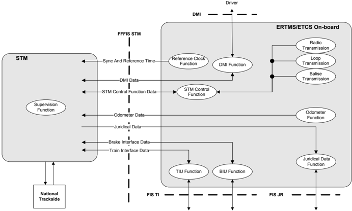

Figure 1 - General configuration of STM and ERTMS/ETCS on-board [¶93]

# 5.2 Data and ERTMS/ETCS on-board functions [¶94]

- 5.2.1.1 The  following  paragraphs  describe  the  ERTMS/ETCS  on-board  functions  that  are available for STM and the data that shall be transmitted over the interface. [¶95]

- 5.2.1.2 The data is transmitted over the STM bus using Multicast or Point-to-Point Connections, see chapter 6.5. [¶96]

# 5.2.2 Reference time [¶97]

© This document has been developed and released by UNISIG

---
<!-- pagina 35 -->

- 5.2.2.1 ERTMS/ETCS  on-board  is  responsible  for  providing  common  reference  time  to  all connected STMs. This is defined in [2]. [¶98]

# 5.2.3 Odometer [¶99]

- 5.2.3.1 Odometry data & parameters shall be sent by the ERTMS/ETCS on-board to all STMs using multicast messages. [¶100]

# 5.2.4 Train Interface (TIU) [¶101]

- 5.2.4.1 A subset of the train interface signals specified in [6], command and status / availability are  transmitted  via  the  FFFIS  STM.  These  train  interface  signals  transmitted  via  the FFFIS STM are called Train Interface FFFIS STM signals. [¶102]

- 5.2.4.2 The  TIU  Function  is  described  as  the  exchange  of  information  between  the  train interface and the STM, in this case: [¶103]

- Status: is functional information coming from the train interface to the STM, [¶104]

- Command: is functional information coming from the STM to the train interface. [¶105]

- 5.2.4.3 Train Interface FFFIS STM command signals shall be: [¶106]

- 5.2.4.3.1 Note: Service and Emergency Brake commands are handled in the BIU interface see chapter 5.2.5. [¶107]

- 5.2.4.4 Train Interface FFFIS STM status signals shall be: [¶108]

- 5.2.4.4.1 Note: Service and Emergency Brake status are handled in the BIU interface see chapter 5.2.5. [¶109]

[¶110]
| Command signal                         | Description                                                                              |
|----------------------------------------|------------------------------------------------------------------------------------------|
| Regenerative Brake                     | To allow or to suppress the use of the Regenerative Brake.                               |
| Magnetic Shoe Brake                    | To allow or to suppress the use of the Magnetic Shoes Brake.                             |
| Eddy Current Brake for Service Brake   | To allow or to suppress the use of the Eddy Current Brake for Service Brake.             |
| Eddy Current Brake for Emergency Brake | To allow or to suppress the use of the Eddy Current Brake for Emergency Brake.           |
| Pantograph                             | Lower or raise the Pantograph                                                            |
| Air Tightness                          | Open or close air flaps                                                                  |
| Main Switch / Circuit Breaker          | Open or close the Main Switch / Circuit Breaker. This is considered as only one command. |
| Traction Cut Off                       | Cut off or not the traction                                                              |

[¶111]
| Status signal                    | Description                                        |
|----------------------------------|----------------------------------------------------|
| Traction status                  | Specifies the status of the traction power         |
| Direction Controller information | Specifies the position of the direction controller |
| Cab Status                       | Specifies the active cab                           |

# 5.2.5 Brake Interface (BIU) [¶112]

© This document has been developed and released by UNISIG

---
<!-- pagina 36 -->

- 5.2.5.1 The Brake Interface via ETCS is formally a part of the Train Interface. It shall include the  brake  interface  parameters,  command  and  status  /  availability  of  the  Emergency Brake access and the Service Brake access. [¶113]

- 5.2.5.2 Note: The BIU Function is separated from the TIU Function to allow physical separation and different safety and performance levels between brake commands/status and other commands/status on the Train Interface. [¶114]

- 5.2.5.3 The brake status gives the availability of the brake command. [¶115]

# 5.2.6 Juridical data [¶116]

- 5.2.6.1 The FFFIS STM shall offer the possibility to the STM to transmit the national juridical data to be forwarded (together with the ETCS data) to the On-Board Recording Device. [¶117]

# 5.2.7 STM Control Function [¶118]

- 5.2.7.1 The  STM  Control  Function  shall  control  the  STM  state  and  the  compatibility  of  the ERTMS/ETCS on-board and STM versions. [¶119]

- 5.2.7.2 The STM Control Function shall handle the transmission of the ETCS data for STM and of the Specific NTC Data Entry/Data View for STM. [¶120]

- 5.2.7.3 The STM Control Function shall handle the transmission of the ETCS status data for STM. [¶121]

- 5.2.7.4 The STM Control Function shall handle the transmission of the language used to display information to the driver. [¶122]

- 5.2.7.5 The STM Control Function shall handle the test procedure for STMs. [¶123]

- 5.2.7.6 The STM Control Function shall handle the Override procedure for STMs. [¶124]

- 5.2.7.7 The STM Control Function shall handle the airgap data to be transmitted to an NTC. [¶125]

- 5.2.7.8 The STM  Control Function shall handle STM  max speed and STM  system speed/distance. [¶126]

- 5.2.7.9 The STM Control Function shall handle the transmission of the bus address, safety level and availability of the ERTMS/ETCS on-board functions. [¶127]

- 5.2.7.10 The STM Control Function shall handle the display of STM failure status. [¶128]

- 5.2.7.11 The  STM  Control  Function  shall  handle  the  transmission  of  the  active  Interface  'K' Antenna/BTM. [¶129]

- 5.2.7.12 The STM control function shall handle the transmission of the BTM alarm data. [¶130]

# 5.2.8 DMI [¶131]

- 5.2.8.1 The DMI Function shall allow an active STM to dialogue with the driver for what regards its default window (see [9] chapter 9). This includes: [¶132]

© This document has been developed and released by UNISIG [¶133]

---
<!-- pagina 37 -->

- Management of buttons, [¶134]

- Management of indicators, [¶135]

-  Management of sounds, [¶136]

- Management of text messages, [¶137]

- Management of supervision information [¶138]

# 5.3 ERTMS/ETCS on-board functions and resources available for STMs [¶139]

- 5.3.1.1 The ERTMS/ETCS on-board shall allow the STM to access its functions and resources according to the following table: [¶140]

- x = access is allowed in all Levels [¶141]

- (x) = access is allowed in all Levels if possible [¶142]

-  s = access is only allowed for an active STM (see chapter 4.1.1.3) [¶143]

- h = access is allowed for an STM in HS for preliminary request for DMI objects (see 13.2.1.5) [¶144]

- 5.3.1.2 When an ERTMS/ETCS on-board function fails, it shall isolate itself from the bus and shall try to close the connection with the STM. [¶145]

[¶146]
| ERTMS/ETCS ON-BOARD functions and resources available for STMs   | N P   | S B   | P S   | S H   | F S   | L S   | S R   | O S   | S L   | N L   | U N   | T R   | P T   | S F   | S N   | R V   |
|------------------------------------------------------------------|-------|-------|-------|-------|-------|-------|-------|-------|-------|-------|-------|-------|-------|-------|-------|-------|
| STM Control Function                                             |       | x     | x     | x     | x     | x     | x     | x     | x     | x     | x     | x     | x     |       | x     | x     |
| Reference Time                                                   |       | x     | x     | x     | x     | x     | x     | x     | x     | x     | x     | x     | x     |       | x     | x     |
| DMI Function                                                     |       | h     |       |       | h     | h     | h     | h     |       | s, h  | h     | h     | h     |       | s, h  |       |
| Juridical Data                                                   |       | x     | x     | x     | x     | x     | x     | x     | x     | x     | x     | x     | x     | (x)   | x     | x     |
| Odometer Function                                                |       | x     | x     | x     | x     | x     | x     | x     | x     | x     | x     | x     | x     |       | x     | x     |
| TIU command (Train Interface FFFIS STM signals)                  |       |       |       |       |       |       |       |       | s     | s     |       |       |       |       | s     |       |
| TIU status (Train Interface FFFIS STM signals)                   |       | x     | x     | x     | x     | x     | x     | x     | x     | x     | x     | x     | x     |       | x     | x     |
| BIU command                                                      |       |       |       |       |       |       |       |       |       |       |       |       |       |       | s     |       |
| BIU status                                                       |       | x     | x     | x     | x     | x     | x     | x     | x     | x     | x     | x     | x     |       | x     | x     |

---
<!-- pagina 38 -->

# 6. BUS [¶147]

# 6.1 The PROFIBUS [¶148]

- 6.1.1.1 The  bus  used  for  the  interface  between  STM  and  ERTMS/ETCS  on-board  functions shall be the PROFIBUS, defined by [5]. [¶149]

- 6.1.1.2 The PROFIBUS protocol is used up to the FDL layer. [¶150]

- 6.1.1.2.1 Note: The use of the FDL layer is specified in [3], chapter 4. [¶151]

- 6.1.1.3 The bus configuration parameters for the PROFIBUS shall be: [¶152]

- Baud Rate: 1500 Kbps [¶153]

- Minimum Station Delay of Responders (min TSDR): 11 tBit [¶154]

-  Maximum Station Delay of Responders (max TSDR): 150 tBit [¶155]

- Slot Time (TSL): 300 tBit [¶156]

- Quiet Time (TQUI): 0 tBit [¶157]

-  Setup Time (TSET): 1 tBit [¶158]

- Time Target Rotation (TTR): 30000 tBit (20 ms) [¶159]

- GAP Actualisation Factor (G): 10 [¶160]

-  Highest Station Address (HSA): 126 [¶161]

- Max Retry Limit (max_retry_limit): 1 [¶162]

- 6.1.1.3.1 Note: This allows for a maximum permissible line length (PROFIBUS length) of 200 m per segment and a maximum number of 32 stations when using cable type A. In case a greater length or more stations are required, repeaters can be used without changing the configuration. [¶163]

- 6.1.1.3.2 Note:  PROFIBUS may also be used for other communications than the one between STM and ERTMS/ETCS on-board specified in this FFFIS STM. [¶164]

# 6.1.2 Physical connection [¶165]

- 6.1.2.1 The default physical medium shall be RS-485 twisted pair shielded copper cable. [¶166]

- 6.1.2.2 The default connectors of the different equipments (ERTMS/ETCS on-board functions and  STMs)  shall  be  9-pin  female  D-SUB  and  cabling  according  to  PROFIBUS specifications. [¶167]

# 6.1.3 Bus redundancy and retransmission [¶168]

- 6.1.3.1 Retransmission is specified in [3] [¶169]

- 6.1.3.2 Regarding bus redundancy, the STM and ERTMS/ETCS on-board shall have at least one bus interface each, and may have two interfaces. [¶170]

---
<!-- pagina 39 -->

- 6.1.3.3 In case STM and ERTMS/ETCS on-board do not have the same number of buses, only one bus shall be connected. [¶171]

- 6.1.3.4 The dual bus configuration shall be managed by the 'Redundancy Supervisor' see Ref.: [3]. [¶172]

# 6.2 Safety [¶173]

- 6.2.1.1 To  allow  communication  between  different  equipment  with  different  Safety  Integrity Levels  (SIL),  the  FFFIS  STM  shall  provide  communication  with  three  levels  of  safety protocol (SL): [¶174]

- Safety Level 4 (SL 4) [¶175]

- Safety Level 2 (SL 2) [¶176]

-  Safety Level 0 (SL 0) [¶177]

- 6.2.1.1.1 Justification: According to the requirements for Safety-related communication  in transmission  systems  (see  [8]),  an  equipment  with  no  or  a  low  Safety  Integrity  Level shall  not  masquerade  as  an  equipment  with  a  higher  Safety  Integrity  Level.  This requirement shall be fulfilled by using the defined Safety Levels. [¶178]

- 6.2.1.1.2 Note: The three levels of safety are specified in [3] and [2]. [¶179]

- 6.2.1.2 No  equipment  shall  implement  any  Safety  Level  corresponding  to  a  higher  Safety Integrity Level (SIL). [¶180]

- 6.2.1.3 ERTMS/ETCS  on-board  functions  shall  implement  all  the  safety  protocols  up  to  the Safety Level (SL) corresponding to the SIL of the function. [¶181]

# 6.3 On-board Architecture [¶182]

- 6.3.1.1 Each STM shall only have one physical bus address (Station/Node address) towards the ERTMS/ETCS on-board. [¶183]

- 6.3.1.2 The ERTMS/ETCS on-board may use one or several physical bus addresses depending on its architecture. [¶184]

- 6.3.1.3 An STM shall be able to handle one different physical address for each ERTMS/ETCS on-board function. [¶185]

- 6.3.1.4 In case several STMs share the same physical address, each of them shall establish its own connection at Application Layer using different NID_STMs. [¶186]

# 6.4 Physical Addressing (Station/Nodes addresses) [¶187]

- 6.4.1.1 The physical addresses shall be allocated according to the following table. [¶188]

© This document has been developed and released by UNISIG [¶189]

---
<!-- pagina 40 -->

[¶190]
| Physical Address   | Device                               |
|--------------------|--------------------------------------|
| 2                  | STM Control Function                 |
| 0, 1, 2, 3 . . 19  | Other ERTMS/ETCS on-board functions  |
| 20 . . 49          | Unused by FFFIS STM                  |
| 50 . . 69          | STM configurable addresses range     |
| 70 . . 126         | STMs (NID_NTC+70)                    |
| 127                | Reserved for Broadcast and Multicast |

- 6.4.1.2 By default the Physical address of an STM shall be the NID_NTC value + 70. [¶191]

- 6.4.1.3 STM  configurable  addresses  range  shall  be  used  for  STMs  for  which  the  sum  of NID_STM value +70 goes out of the Profibus physical address range [¶192]

- 6.4.1.4 In case several STMs share the same physical address, the address value shall be the one of any of the supported STMs or a configurable physical address. [¶193]

- 6.4.1.5 When a physical  address  in  the  STM  configurable  addresses  range  is  to  be  used,  it shall  be  possible  to  configure  the value of this physical address in order to solve any potential address conflicts. [¶194]

# 6.5 Function Addressing [¶195]

- 6.5.1.1 The FFFIS STM requires communication with different functions of the ERTMS/ETCS on-board as e. g. Odometer, DMI and Juridical Data. [¶196]

- 6.5.1.2 The  FFFIS  STM  shall  use  Service  Access  Points  (SAPs)  to  support  communication between STMs and the different ERTMS/ETCS on-board functions. [¶197]

- 6.5.1.3 All ERTMS/ETCS on-board functions shall have a defined fixed SAP. [¶198]

- 6.5.1.3.1 Note: The SAP is fixed regardless of the chosen physical address. [¶199]

- 6.5.1.4 For  transmitting  data  between  ERTMS/ETCS  on-board  and  the  STMs,  the  local (Source) Service Access Point (SSAP) and partner (Destination) Service Access Point (DSAP) shall have the same value. [¶200]

- 6.5.1.5 The SAP number shall be defined according to the following table: [¶201]

[¶202]
| Logical connections    | SAP# (binary)   |   # of SAP | Comment                                            |
|------------------------|-----------------|------------|----------------------------------------------------|
| DMI channel 3          | 000000          |          1 | Point-to-point                                     |
| DMI channel 4          | 000001          |          1 | Point-to-point                                     |
| Juridical Data         | 000010          |          1 | Point-to-point                                     |
| Reserved for FFFIS STM | 000011          |          1 | Not used (reserved for backward compatibility).    |
| DMI channel 1          | 000100          |          1 | Point-to-point                                     |
| DMI channel 2          | 000101          |          1 | Point-to-point                                     |
| Reserved for FFFIS STM | 000110          |          1 | Not used (reserved for backward compatibility).    |
| Reserved for FFFIS STM | 000111          |          1 | Reserved for future extension of the specification |
| Unused by FFFIS STM    | 001XXX          |          8 | To be defined by on-board implementers             |

---
<!-- pagina 41 -->

[¶203]
| Logical connections    | SAP# (binary)                               |   # of SAP | Comment                                            |
|------------------------|---------------------------------------------|------------|----------------------------------------------------|
| Unused by FFFIS STM    | 01XXXX                                      |         16 | To be defined by on-board implementers             |
| Reference Time         | 100000                                      |          1 | Multicast                                          |
| STM Control            | 100001                                      |          1 | Point-to-point                                     |
| Reserved for FFFIS STM | 100010                                      |          1 | Not used (reserved for backward compatibility).    |
| Reserved for FFFIS STM | 100011                                      |          1 | Not used (reserved for backward compatibility).    |
| Reserved for FFFIS STM | 100100                                      |          1 | Not used (reserved for backward compatibility).    |
| Train Interface        | 100101                                      |          1 | Point-to-point                                     |
| Brake Interface        | 100110                                      |          1 | Point-to-point                                     |
| Odometer               | 100111                                      |          1 | Multicast for FFFIS STM version number X=4         |
| Unused by FFFIS STM    | 101XXX                                      |          8 | Defined by each implementer.                       |
| Reserved for FFFIS STM | 11XXXX Except 111111 reserved for broadcast |         15 | Reserved for future extension of the specification |
| Broadcast              | 111111                                      |          1 | Reserved due to PROFIBUS specification             |

- 6.5.1.6 There  shall  be  only  one  source  (one  station/node  address)  which  shall  transmit messages using the SAP reserved for the Reference Clock Function. [¶204]

- 6.5.1.7 There  shall  be  only  one  source  (one  station/node  address)  which  shall  transmit messages using the SAP reserved for the Odometer Function. [¶205]

# 6.6 Protocol Layers [¶206]

- 6.6.1.1 The protocol layers are Application Layer (see [4]), Safe Time Layer (see [2]), Safe Link Layer (see [3]) and PROFIBUS FDL layer (see [5]). [¶207]

- 6.6.1.2 The Safe Time Layer and Safe Link Layer together shall be considered as the Safety Layers. [¶208]

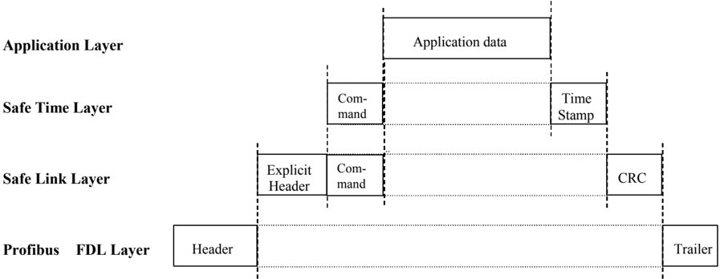

Figure 2 - Application Data encapsulation by the layers in PROFIBUS telegram [¶209]

© This document has been developed and released by UNISIG [¶210]

---
<!-- pagina 42 -->

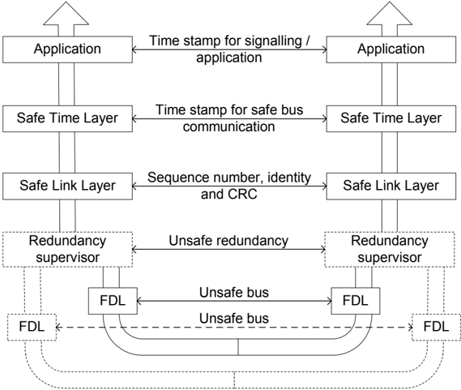

Figure 3 - FFFIS STM Protocol Layers [¶211]

---
<!-- pagina 43 -->

# 7. CONNECTION MANAGEMENT AND VERSION CHECK [¶212]

# 7.1 General  requirements  linked  to  the  opening  of  point-to-point connection between STM and ERTMS/ETCS on-board [¶213]

# 7.1.1 Opening of the connection [¶214]

- 7.1.1.1 A connection shall be considered as established when the version check is considered as completed and successful (see chapter 7.1.2). [¶215]

- 7.1.1.2 The STM shall take the initiative to establish the connection. [¶216]

- 7.1.1.3 When a STM has to establish a connection with an ERTMS/ETCS on-board function, and  fails to establish the connection  2  times,  it shall be  allowed  to  retry the establishment of connection after 10 seconds. [¶217]

# 7.1.2 Check of version [¶218]

- 7.1.2.1 Each time the STM opens a connection with any ERTMS/ETCS on-board function, the STM  shall  send  its  'FFFIS  STM  version  number'  to  this  ERTMS/ETCS  on-board function, followed by the STM state report information in the same application message. [¶219]

- 7.1.2.2 When  receiving  the  'FFFIS  STM  version  number'  from  the  STM,  the  concerned ERTMS/ETCS on-board function shall check the version compatibility as follows: [¶220]

- if the 'FFFIS STM version number X' from the STM is lower than the lowest 'FFFIS STM version number X' supported by the ERTMS/ETCS on-board equipment, the ERTMS/ETCS on-board function shall close the connection (final disconnection on Safety Layers). [¶221]

- if the 'FFFIS STM version number X' from the STM is amongst the ones supported by the ERTMS/ETCS on-board equipment, the ERTMS/ETCS on-board function shall send  to  the  STM  the  highest  supported  FFFIS  STM  version  number  of  which  the version number X is equal to the one received from the STM. The ERTMS/ETCS onboard function shall be allowed to transmit application data to the STM. [¶222]

-  if  the  'FFFIS  STM  version  number  X'  from  the  STM  is  greater  than  the  highest version  number  X  supported  by  the  ERTMS/ETCS  on-board  equipment,  the ERTMS/ETCS on-board function shall close the connection (final disconnection). [¶223]

- 7.1.2.3 When receiving 'FFFIS STM version number' from ERTMS/ETCS on-board, the STM shall  check  the  version  compatibility.  If  it  is  compatible  with  the  'FFFIS  STM  version number'  of  the  STM,  then  the  version  check  is  considered  as  terminated  and successful.  The  STM  shall  be  allowed  to  transmit  further  application  data  to  the ERTMS/ETCS on-board function. [¶224]

- 7.1.2.4 If  the  'FFFIS  STM  version  number'  of  the  ERTMS/ETCS  on-board  is  not  compatible with  the  'FFFIS  STM  version  number'  of  the  STM,  then  the  STM  shall  close  the connection (final disconnection) to the concerned ERTMS/ETCS on-board function. [¶225]

© This document has been developed and released by UNISIG [¶226]

---
<!-- pagina 44 -->

# 7.1.3 Closing of the connection [¶227]

- 7.1.3.1 Closing a connection on application layer shall be done by requesting the Safety Layers (see 6.6.1.2) to close the connection. [¶228]

- 7.1.4 Connection Sequence Charts. [¶229]

- 7.2 General requirements linked to handling multicast connection [¶230]

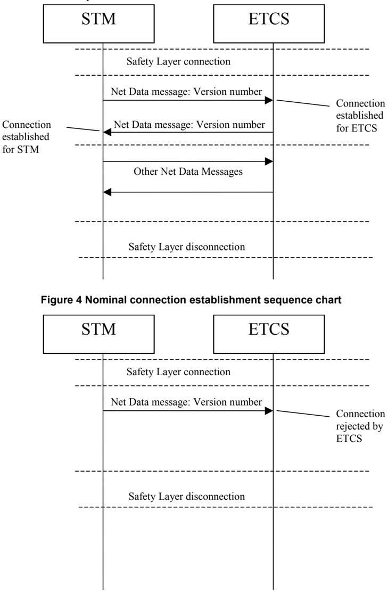

Figure 5  Bad version number disconnection sequence chart [¶231]

© This document has been developed and released by UNISIG [¶232]

---
<!-- pagina 45 -->

- 7.2.1.1 The  multicast  sender  shall  open  a  separate  connection  for  all  'FFFIS  STM  version numbers' defined in the Legal backward compatibility envelope (see table 16.3.1.1). [¶233]

- 7.2.1.2 Note: For each multicast application connection (currently limited to  Odometer Function), the table 6.5.1.5 contains one SAP for each 'FFFIS STM version number'. This allows opening separate connections. [¶234]

- 7.2.1.3 On each connection, the multicast sender shall transmit the corresponding 'FFFIS STM version number' over the FFFIS STM. The transmission shall be repeated to support restarting STMs. [¶235]

- 7.2.1.4 When receiving 'FFFIS STM version number' from ERTMS/ETCS on-board, the STM shall check the version compatibility. [¶236]

- 7.2.1.5 If  the  'FFFIS  STM  version  number'  of  the  ERTMS/ETCS  on-board  is  not  compatible with  the  'FFFIS  STM  version  number'  of  the  STM,  then  the  STM  shall  ignore  any information received from this multicast connection. [¶237]

---
<!-- pagina 46 -->

# 8. STM STATES [¶238]

# 8.1 No Power (NP) [¶239]

- 8.1.1.1 The NP state means that the STM is unpowered. [¶240]

# 8.2 Power On (PO) [¶241]

- 8.2.1.1 This state is the default state entered by the STM after the STM is switched on. [¶242]

- 8.2.1.2 Once in PO state, the STM shall perform the synchronisation of the Safe Time Layer. [¶243]

- 8.2.1.3 Once  in  PO  state,  the  STM  shall  establish  a  connection  with  the  ERTMS/ETCS  onboard STM Control Function. [¶244]

- 8.2.1.4 When the STM has established the connection to the STM Control Function, the STM shall  send  a  'Specific  NTC  Data  Need'  information  to  the  STM  Control  Function indicating whether it needs or not Specific NTC Data. [¶245]

- 8.2.1.5 Once the ERTMS/ETCS on-board has sent the bus addresses and safety levels of all available  ERTMS/ETCS  on-board  functions  (see  10.1.1.4),  it  shall  allow  STM  to establish connections with any of these functions. [¶246]

- 8.2.1.6 Once the STM Control Function has sent the ETCS status data to an STM in PO state (see chapter 10.5.1.1), it shall allow this STM to request CO state. [¶247]

# 8.3 Configuration (CO) [¶248]

- 8.3.1.1 The  STM  CO  state  is  used  to  wait  until  all  configuration  data  between  STM  and ERTMS/ETCS on-board have been exchanged. 'Configuration data' means data that is necessary for the national operation, except Specific NTC Data. [¶249]

- 8.3.1.2 Configuration data from ERTMS/ETCS on-board to STMs consists of: [¶250]

- ETCS data (see chapter 10.4) [¶251]

- Status / availability of the train interface FFFIS STM signals (TIU) [¶252]

-  Status / availability of the brake interface FFFIS STM signals (BIU) [¶253]

- Odometer performance parameters (see chapter 12.4) [¶254]

- Brake performance parameters: Maximum time delay for the ERTMS/ETCS on-board to process the STM Emergency and the STM Service Brake commands. This is the time from receiving the brake command from the STM until the ETCS commands the brake. [¶255]

- 8.3.1.2.1 Note: Configuration data has not necessarily to be sent in CO state. Some data could be sent in PO state. [¶256]

- 8.3.1.2.2 Note:  The  brake  performance  parameter  can  be  used  by  the  STM  in  braking  curves calculation. [¶257]

---
<!-- pagina 47 -->

- 8.3.1.3 Once the transmission of configuration data is finished and the Specific NTC Data Entry procedure is started, if the STM does not require any Specific NTC Data, then the STM shall request Cold Standby state to the STM Control Function. [¶258]

- 8.3.1.4 If an STM in Configuration State detects that the ERTMS/ETCS on-board is in the mode Non-Leading  or  Sleeping  and  has  received  all  the  configuration  data  except  for  the ETCS data, the STM shall request to go to Cold Standby state. [¶259]

- 8.3.1.4.1 Justification:  This  allows  STM  operation  in  Non-Leading  or  Sleeping  in  which  ETCS Train Data is not available. [¶260]

- 8.3.1.5 Once the transmission of configuration data is finished and the Specific NTC Data Entry procedure  is  started,  if  the  STM  does  require  any  Specific  NTC  Data,  then  the  STM shall request Data Entry state to the STM Control Function. [¶261]

- 8.3.1.6 When an STM exits CO state, it shall have the possibility to close any connection except with STM Control Function. [¶262]

# 8.4 Data Entry (DE) [¶263]

- 8.4.1.1 The state DE is used by any STM that requires Specific NTC Data in order to have all the required national information for operating the train with the STM. [¶264]

- 8.4.1.1.1 Note: This state is only entered once at the start up process of the STM. [¶265]

- 8.4.1.2 In  the  state  DE,  the  Specific  NTC  Data  Entry  procedure  (see  chapter  10.7)  shall  be performed. [¶266]

- 8.4.1.3 Once the Specific NTC Data Entry procedure is terminated, the STM shall request Cold Standby state to the STM Control Function. [¶267]

- 8.4.1.4 Note:  The  Specific  NTC  Data  Entry  procedure  can  be  terminated  without  having received the Specific NTC Data (e.g. when the Specific NTC Data Entry procedure is skipped). However, the Cold Standby state is still requested in order to have the same system behaviour when the Specific NTC Data is invalid. [¶268]

# 8.5 Cold Standby (CS) [¶269]

- 8.5.1.1 Being in the state CS, the STM has been initialised, tested (if required), configured and is  in  possession  of  all  required  information  for  operating,  but  is  not  able  to  receive  a message from the trackside, because the reception is turned off. [¶270]

- 8.5.1.1.1 Exception: Specific NTC Data could be invalid, see 10.7.3.3. [¶271]

# 8.6 Hot Standby (HS) [¶272]

- 8.6.1.1 Being in the state HS, the STM shall be able to process the information from or to the national trackside. [¶273]

© This document has been developed and released by UNISIG [¶274]

---
<!-- pagina 48 -->

- 8.6.1.1.1 Note:  In  HS  state,  when  receiving  national  trackside  information,  the  STM  treats  this information  to  be  prepared  to  take  charge  of  the  train  movement  supervision  once  it switches to Data Available state. [¶275]

- 8.6.1.2 The  STM  in  HS  state  shall  have  the  possibility  to  send  an  'STM  max  speed' (V_STMMAX) to the ERTMS/ETCS on-board through the STM Control Function. [¶276]

- 8.6.1.2.1 Note: This 'STM max speed' is to allow the STM, for national reasons unknown to the ERTMS/ETCS on-board or ETCS Trackside, to request a given train speed at the level transition border in order to have a smooth transition. [¶277]

- 8.6.1.3 The STM in HS shall have the possibility to send an 'STM system speed' (V_STMSYS) together with an 'STM system distance' (D_STMSYS) to the ERTMS/ETCS on-board through the STM Control Function. [¶278]

- 8.6.1.3.1 Note:  This  'STM  system  speed'  together  with  the  'STM  system  distance'  is  sent  to allow  the  STM,  to  request  a  given  train  speed  at  a  given  position  ('STM  system distance')  before  the  level  transition  border  in  order  to  be  able  to  detect  its  national trackside. [¶279]

- 8.6.1.4 When an STM in HS state receives an order to go in CS state, the STM shall have the possibility to close any connection except with STM Control Function. [¶280]

# 8.7 Data Available (DA) [¶281]

- 8.7.1.1 In DA state, an STM is responsible for the train movement supervision, according to the received national trackside information. [¶282]

- 8.7.1.2 When an STM in DA state receives an order to go in CS state, the STM shall have the possibility to close any connection except with STM Control Function. [¶283]

# 8.8 Failure (FA) [¶284]

- 8.8.1.1 Being in this state, the STM is not able to work any more, due to internal or external reasons. [¶285]

- 8.8.1.2 Being in this state, the STM shall not send messages any more on the bus except to report this state to the ERTMS/ETCS on-board functions. [¶286]

© This document has been developed and released by UNISIG [¶287]

---
<!-- pagina 49 -->

# 9. STM MANAGER SYSTEM - REQUIREMENTS ON STM [¶288]

# 9.1 Scope [¶289]

- 9.1.1.1 The scope of this chapter is to define how the STM handles its state. [¶290]

# 9.2 STM States transitions table [¶291]

- 9.2.1.1 Transitions table for STM [¶292]

- 9.2.1.2 Transitions conditions table [¶293]

- 9.2.1.2.1 Note:  This  table  only  contains  the  event(s)  that  triggers  the  transition.  It  does  not describe the reasons why this(these) event(s) happens. ETCS orders referred to below are described in chapter 10.3.2. [¶294]

[¶295]
| NP   | < 15      | < 15      | < 15      | < 15      | < 15      | < 15      | < 15   |
|------|-----------|-----------|-----------|-----------|-----------|-----------|--------|
| 1 >  | PO        |           |           |           |           |           |        |
|      | 2 >       | CO        |           |           |           |           |        |
|      |           | 3 >       | DE        |           |           |           |        |
|      |           | 4a >      | 4a >      | CS        | < 4a      | < 4a < 4b |        |
|      |           |           |           | 6 >       | HS        |           |        |
|      |           |           |           | 9 >       | 9 >       | DA        |        |
|      | 16 > 17 > | 16 > 17 > | 16 > 17 > | 16 > 17 > | 16 > 17 > | 16 > 17 > | FA     |

[¶296]
| Condition Id   | Content of the conditions                                                                                              |
|----------------|------------------------------------------------------------------------------------------------------------------------|
| 1              | STM is powered on                                                                                                      |
| 2              | ETCS order 'Configuration'                                                                                             |
| 3              | ETCS order 'Data Entry'                                                                                                |
| 4a             | ETCS unconditional order 'Cold Standby'                                                                                |
| 4b             | (ETCS conditional order 'Cold Standby' has been received) AND (STM does not or no more report National Trip Procedure) |
| 5              | intentionally deleted                                                                                                  |
| 6              | ETCS order 'Hot Standby'                                                                                               |
| 7              | intentionally deleted                                                                                                  |
| 8              | intentionally deleted                                                                                                  |
| 9              | ETCS order 'Data Available'                                                                                            |

© This document has been developed and released by UNISIG

---
<!-- pagina 50 -->

[¶297]
|   Condition Id | Content of the conditions                |
|----------------|------------------------------------------|
|             10 | intentionally deleted                    |
|             11 | intentionally deleted                    |
|             12 | intentionally deleted                    |
|             13 | intentionally deleted                    |
|             14 | intentionally deleted                    |
|             15 | STM is powered off                       |
|             16 | ETCS order 'Failure'                     |
|             17 | The STM decides itself to go in FA state |

- 9.2.1.3 Note: As long as an STM in DA state is in a National Trip Procedure in SN mode, the STM  sends  cyclically  the  'National  Trip  Procedure'  information  to  the  STM  Control Function in order to fulfil the timeout requirements defined in 10.3.2.4 (transitions E16 and F16). If the mode changes to TR, the STM is expected to enter CS state even if its National  Trip  Procedure  is  not  finished,  as  the  Trip  procedure  is  handed  over  by ERTMS/ETCS  on-board  (otherwise,  the  STM  would  be  ordered  to  FA  state  through transition Q16 once the TR mode is exited). [¶298]

# 9.3 General STM requirements [¶299]

- 9.3.1.1 The STM antenna shall not energise trackside equipment, and shall not read trackside data, and shall not transmit data to trackside, except: [¶300]

- in HS or DA state, [¶301]

- for test purpose. [¶302]

- 9.3.1.2 If the STM receives from the ERTMS/ETCS on-board a state transition order, which is not allowed by the state transition table (9.2.1.2), then the STM shall go in FA state. [¶303]

- 9.3.1.3 The STM  shall report its NID_STM  on  all point-to-point connections with the ERTMS/ETCS on-board: [¶304]

- intentionally deleted

- with each transmitted application message from the STM to the ERTMS/ETCS onboard function or DMI channel. [¶305]

- 9.3.1.4 The  STM  shall  report  its  current  state  on  all  point-to-point  connections  with  the ERTMS/ETCS on-board: [¶306]

- intentionally deleted

- with each transmitted application message from the STM to the ERTMS/ETCS onboard function or DMI channel, and [¶307]

-  whenever  the  STM  state  is  changed,  while  the  connection  to  the  respective ERTMS/ETCS on-board function or DMI channel is established. [¶308]

© This document has been developed and released by UNISIG [¶309]

---
<!-- pagina 51 -->

- 9.3.1.4.1 Exception: The FA state shall be reported if possible. Due to a failure of the STM itself it may not be possible to report the FA state. [¶310]

---
<!-- pagina 52 -->

# 10. STM CONTROL FUNCTION [¶311]

# 10.1 General requirements [¶312]

- 10.1.1.1 It  shall  be possible to configure the ERTMS/ETCS on-board equipment with the list of STMs installed on-board. [¶313]

- 10.1.1.2 The STM Control Function shall maintain a list of 'available' STMs, which includes all STMs  that  have  an  established  connection  to  the  STM  Control  Function  and  report either CS, HS or DA state. [¶314]

- 10.1.1.3 Level  NTC  X  shall  be  considered  as  'Available  for  use'  for  level  transition  (see  [1] paragraph 5.10.2.4.1) if the STM X associated to this level is available. [¶315]

- 10.1.1.4 The STM Control Function shall send to the STM the following information when the connection to the STM is established: [¶316]

- The ERTMS/ETCS on-board functions that are available [¶317]

- The ETCS bus address of all available ERTMS/ETCS on-board functions [¶318]

-  The safety level of all available ERTMS/ETCS on-board functions (see 6.2) [¶319]

- 10.1.1.4.1  Note: Only Juridical Data and DMI channels 2, 3 & 4 can be marked as not available. [¶320]

- 10.1.1.5 The STM Control Function shall inform the STM about the active DMI channel [¶321]

- whenever the active DMI channel changes, [¶322]

- whenever the connection to STM Control Function is established. [¶323]

# 10.2 Association of STM X to Level NTC X [¶324]

- 10.2.1.1 The ERTMS/ETCS on-board shall be configurable with a look-up table that gives the correspondence  between  NID_NTC  values  and  the  NID_STM  values  of  the  STM(s) fitted  on-board.  For  each  NID_NTC  value  within  this  look-up  table,  a  list  of  one  or several NID_STM values shall be configured, with a priority order. [¶325]

- 10.2.1.1.1  Note: A National System can cover the functionalities of other National Systems having their  own  NID_NTC  values.  For  that  case,  the  look-up  table  is  needed  to  map  the NID_NTC  values  corresponding  to  these  encapsulated  National  Systems  to  the NID_STM value(s) of the STM(s) fitted on-board supporting them. But an entry in the look-up  table  is  not  needed  for  the  case  there  is  a  one-to-one  relation  between NID_NTC value and NID_STM value. [¶326]

- 10.2.1.1.2  Throughout this document, 'STM X' stands for 'STM associated to Level NTC X'. This STM is not necessarily fitted on-board. [¶327]

- 10.2.1.2 If  Level  NTC  X  (defined  by  its  NID_NTC)  is  not  already  associated  to  an  STM,  the ERTMS/ETCS on-board shall associate this Level NTC X to STM X as follows: [¶328]

- When a level transition order to Level NTC X is accepted, [¶329]

© This document has been developed and released by UNISIG [¶330]

---
<!-- pagina 53 -->

the STM X shall be the STM which NID_STM is equal to NID_NTC, if the level transition  order  is  received  from  a  trackside  constituent  with  ETCS  system version  strictly  lower  than  2.0  or  if  the  look-up  table  does  not  contain  the NID_NTC value of Level NTC X. [¶331]

Otherwise  the  STM  X  shall  be  the  STM  having  the  highest  priority  among  the available STMs linked to the NID_NTC value in the look-up table. If there is no available STM linked to this NID_NTC value, the STM X shall be the STM having the highest priority among the STMs linked to this NID_NTC value. [¶332]

- When the ERTMS/ETCS on-board receives airgap data to be transmitted to an STM with the NID_NTC value of Level NTC X, the STM X shall be associated as for the level transition. [¶333]

-  When the Level NTC X is selected/validated by driver, [¶334]

the STM X shall be the STM which NID_STM is equal to NID_NTC, if the look-up table does not contain the NID_NTC value of Level NTC X. [¶335]

Otherwise,  the  STM  X  shall  be  the  STM  having  the  highest  priority  among  the available STMs linked to this NID_NTC value in the look-up table. If there is no available STM linked to this NID_NTC value, then the STM X shall be the STM having the highest priority  among the connected STMs linked to this NID_NTC value and that are not considered as failed or seen as isolated. Otherwise, the STM X shall be the STM having the highest priority among the STMs linked to this NID_NTC value. [¶336]

- 10.2.1.3 The association between a Level NTC X and an STM X shall be kept until the Level NTC X is left  after  having  been  entered,  or  until  the  Stand-By  or  No  Power  mode  is entered. [¶337]

- 10.2.1.3.1  Note: If STM X associated to the current Level NTC X is no more available, it remains associated to Level NTC X until one of these conditions is fulfilled, even if another STM supporting NTC X is available. This avoids that there is a change of active STM that is neither due to a level transition from trackside, nor due to a driver level selection/validation. [¶338]

# 10.3 STM MANAGER SYSTEM [¶339]

# 10.3.1 Scope [¶340]

- 10.3.1.1 The present chapter does not specify the whole STM Control Function, but only the part of the STM Control Function that manages the states of the connected STM(s). [¶341]

# 10.3.2 State transition orders [¶342]

- 10.3.2.1 The STM Control Function STM state order table is a table that lists all the events that lead to a state order given by the STM Control Function to the STM. [¶343]

© This document has been developed and released by UNISIG

---
<!-- pagina 54 -->

# 10.3.2.2 STM state order table (ERTMS/ETCS on-board STM Control Function) [¶344]

[¶345]
| NP         | < A15                                           | < A15                                           | < A15                                           | < A15                                                 | < A15                                                 | < A15                                                 | < A15   |
|------------|-------------------------------------------------|-------------------------------------------------|-------------------------------------------------|-------------------------------------------------------|-------------------------------------------------------|-------------------------------------------------------|---------|
| A1 >       | PO                                              | < A1                                            | < A1                                            | < A1                                                  | < A1                                                  | < A1                                                  | < A1    |
|            | A2 >                                            | CO                                              |                                                 |                                                       |                                                       |                                                       |         |
|            |                                                 | A3 >                                            | DE                                              |                                                       |                                                       |                                                       |         |
|            |                                                 | A4a >                                           | A4a >                                           | CS                                                    | < C4a < E4a < G4a < H4a < I4a < J4a                   | < B4a < B4b < I4a < A4b < E4a < K4a < L4a             |         |
|            |                                                 |                                                 |                                                 | A6 > B6 >                                             | HS                                                    |                                                       |         |
|            |                                                 |                                                 |                                                 | A9>                                                   | A9 >                                                  | DA                                                    |         |
| A17 > B16> | A16 > B16 > C16 > H16 > I16 > L16 > P16 > A17 > | A16 > B16 > C16 > H16 > I16 > O16 > P16 > A17 > | A16 > B16 > C16 > H16 > I16 > O16 > P16 > A17 > | A16 > B16 > C16 > D16 > H16 > N16 > O16 > P16 > A17 > | A16 > B16 > C16 > D16 > H16 > N16 > O16 > P16 > A17 > | A16 > B16 > C16 > E16 > F16 > H16 > N16 > O16 > P16 > | FA      |

- 10.3.2.3 The state indicated in table 10.3.2.2 corresponds to the last state report received from the STM or to FA state if an FA state order has been sent since the reception of the last state report. The STM Control Function shall consider the STM to be in NP when it has not received any state report from the STM. [¶346]

- 10.3.2.4 STM  state  order  conditions  table  applicable  to  STM  X,  associated  to  Level  NTC  X (ERTMS/ETCS on-board STM Control Function) [¶347]

[¶348]
| Condition Id   | Content of the conditions                                                 |
|----------------|---------------------------------------------------------------------------|
| A1             | (STM X connects to the STM Control Function) AND (STM X reports PO state) |
| A2             | ('Request CO state' received from STM X)                                  |

© This document has been developed and released by UNISIG [¶349]

---
<!-- pagina 55 -->

[¶350]
| Condition Id   | Content of the conditions                                                                                                                                                                                                                              |
|----------------|--------------------------------------------------------------------------------------------------------------------------------------------------------------------------------------------------------------------------------------------------------|
| A3             | ('Request DE state' received from STM X) AND (ETCS Train Data is validated)                                                                                                                                                                            |
| A4a            | ('Request CS state' received from STM X)                                                                                                                                                                                                               |
| B4a            | (ERTMS/ETCS on-board performs a level transition ordered by the trackside from Level NTC X to Level 0, 1, 2, 3)                                                                                                                                        |
| C4a            | (announcement for a transition to Level NTC X is stored) AND (STM X reports HS state) AND (a level transition order to Level NTC Y is received before the transition to Level NTC X) AND (STM X is different from the STM Y associated to Level NTC Y) |
| B4b            | (The driver manually changes the level from Level NTC X to Level NTC Y) AND (STM X is different from the STM Y associated to Level NTC Y)                                                                                                              |
| E4a            | (ETCS mode changes to SB)                                                                                                                                                                                                                              |
| G4a            | (STM X reports 'HS state') AND (no transition to any level associated to STM X for further location is stored on-board) AND (Override function is not active) AND (ETCS level is different from any level associated to STM X)                         |
| H4a            | (ETCS mode is SB) AND (No cab is active)                                                                                                                                                                                                               |
| I4a            | (ETCS mode changes to SH)                                                                                                                                                                                                                              |
| J4a            | (announcement for a transition to Level NTC X is stored) AND (STM X reports HS state) AND (a level transition order to Level 0, 1, 2 or 3 is received before the transition to Level NTC X)                                                            |
| K4a            | (The driver manually changes the level from Level NTC X to Level 0, 1, 2 or 3)                                                                                                                                                                         |
| L4a            | (ETCS mode changes to TR)                                                                                                                                                                                                                              |
| A4b            | (ERTMS/ETCS on-board performs a transition ordered by the trackside from Level NTC X to Level NTC Y) AND (STM X is different from the STM Y associated to Level NTC Y)                                                                                 |
| A6             | (A transition to Level NTC X for a further location is stored on-board) AND (STM X reports CS state) AND (no other STM reports HS state)                                                                                                               |
| B6             | (ETCS mode is SB) AND (Cab is active) AND (valid level of the ERTMS/ETCS on-board is Level NTC X) AND (STM X reports CS state) AND (no other STM reports HS state)                                                                                     |
| A9             | (level of the ERTMS/ETCS on-board is Level NTC X) AND (STM X reports CS or HS state) AND (no other STM reports DA state) AND (ETCS mode is SN, SL or NL)                                                                                               |
| A15            | (the ERTMS/ETCS on-board equipment is NOT powered)                                                                                                                                                                                                     |
| A16            | (the STM Control Function receives from STM X a state request which is not allowed by the state transition table)                                                                                                                                      |
| B16            | (STM X reports a state it must not be in according to table 9.2.1.1)                                                                                                                                                                                   |
| C16            | (the STM Control Function has sent a state transition order except 'DA state transition order' and except 'conditional CS state transition order') AND (STM X does not report the required state within a maximum delay time of 10 seconds)            |

© This document has been developed and released by UNISIG [¶351]

---
<!-- pagina 56 -->

[¶352]
| Condition Id   | Content of the conditions                                                                                                                                                                                                                                                                                           |
|----------------|---------------------------------------------------------------------------------------------------------------------------------------------------------------------------------------------------------------------------------------------------------------------------------------------------------------------|
| D16            | (the STM Control Function has sent a 'DA state transition order') AND (STM X does not report the required state within a maximum delay time of 5 seconds)                                                                                                                                                           |
| E16            | (the STM Control Function has sent a 'conditional CS state transition order') AND (STM X does not report CS state or send a 'National Trip Procedure' information within a maximum delay time of 10 seconds)                                                                                                        |
| F16            | (the STM Control Function has sent a 'conditional CS state transition order') AND (the STM Control Function has already received a 'National Trip Procedure' information from STM X) AND (STM X does not report CS state or send a 'National Trip Procedure' information within a maximum delay time of 10 seconds) |
| H16            | (a final disconnection between the ERTMS/ETCS on-board STM Control Function and STM X was detected (see [3] and [2]))                                                                                                                                                                                               |
| I16            | (The ERTMS/ETCS on-board performs a transition ordered by trackside to Level NTC X) AND (STM X is not available)                                                                                                                                                                                                    |
| L16            | (STM X has not yet sent the Specific NTC Data Need) AND (STM X requests CO state)                                                                                                                                                                                                                                   |
| N16            | (The timeout TrainDataView_STM_Response_Timeout for STM X has expired)                                                                                                                                                                                                                                              |
| O16            | (The timeout TrainDataEntry_STM_Response_Timeout for STM X has expired)                                                                                                                                                                                                                                             |
| P16            | (A safety-related information has not been transmitted to STM because of disconnection)                                                                                                                                                                                                                             |
| Q16            | ('National Trip Procedure' is active) AND (STM X reports again 'National Trip Procedure' information) AND (the current ETCS mode is PT or UN)                                                                                                                                                                       |
| A17            | (STM X reports FA state)                                                                                                                                                                                                                                                                                            |

- 10.3.2.5 Note: The delay is shorter for transition to DA state because this transition is assumed as the most critical one from a safety aspect. [¶353]

- 10.3.2.6 When the conditions to change the STM state within the STM Control Function are valid according to 10.3.2.2 and 10.3.2.4, the STM  Control Function shall send the corresponding state transition order to STM X. [¶354]

- 10.3.2.6.1  Exception 1: The STM Control Function shall not send an order for NP or PO state. [¶355]

- 10.3.2.6.2  Exception 2: The STM Control Function shall not send an order for FA state if the STM has reported FA state (transition A17). [¶356]

- 10.3.2.7 When the state transition  order  is  going  to  CS  state,  the  STM  Control  Function  shall send  an  'unconditional  order  CS  state'  for  the  transitions  A4a,  B4a,  C4a,  E4a,  G4a, H4a, I4a, J4a, K4a and L4a, and a 'conditional order CS state' for the transitions A4b and B4b. [¶357]

- 10.3.2.8 Note about Q16 condition: The Trip mode is entered if the STM X is in National Trip Procedure when a transition to level 0, 1, 2 or 3 occurs. The National Trip Procedure [¶358]

---
<!-- pagina 57 -->

may still be reported after this transition in case the STM has been ordered to CS with a conditional order due to a previous level transition from NTC X to NTC Y. [¶359]

# 10.3.3 Requirements linked to state transition orders and state reports [¶360]

- 10.3.3.1 The  STM  Control  Function  shall  not  evaluate  the  state  transition  order  conditions, except conditions to FA state, if this STM has not reported the state corresponding to the last state transition order. [¶361]

- 10.3.3.2 An STM is considered as active by the ERTMS/ETCS on-board from the moment it has sent the DA state order to the STM until it sends another state order to this STM (except 'conditional CS state transition order') or receives a state report different from DA from this STM. [¶362]

- 10.3.3.3 The  STM  Control  Function  shall  command  the  emergency  brake  from  the  moment  a 'conditional  CS  state  transition  order'  has  been  sent  to  a  STM  and  this  STM  is  in National Trip Procedure, up to the moment this STM reports CS state, or is considered as failed and the train reaches standstill. [¶363]

- 10.3.3.3.1  Note: This brake command avoids that the train could run untimely without supervision, in case the active STM does not send a brake command but still sends its National Trip Procedure which delays the activation of the STM of the newly entered area. [¶364]

- 10.3.3.4 The STM Control Function shall apply the emergency brake when the level is NTC X and the mode is SN and STM X is known as installed on-board but not available. [¶365]

- 10.3.3.5 Exception: the brake shall not be applied in case the STM X is known to be isolated, through the corresponding input on the Train Interface. [¶366]

- 10.3.3.6 The emergency brake application shall be released by the STM Control Function when [¶367]

- the STM X has established the connection to the STM Control Function after a nonfinal disconnection and the reported STM X state is DA, [¶368]

- or the level changes to Level 0, 1, 2, 3, [¶369]

-  or the level changes to a Level NTC Y that is not associated to STM X, [¶370]

- or the mode SN is left with no change of level, [¶371]

- or the dedicated input on the Train Interface informs the ERTMS/ETCS on-board that the STM X is isolated. [¶372]

- 10.3.3.7 The ERTMS/ETCS on-board shall accept the reconnection of an STM not considered as in FA state or reporting PO state, except in case of final disconnection on Safety Layers. [¶373]

- 10.3.3.8 The STM Control Function shall inform the driver that the STM X is not available while all of the following conditions are fulfilled [¶374]

- -the level is NTC X, [¶375]

- -and (the mode is SN) or (the mode is NL and has been so for at least 5s), [¶376]

- -and STM X is known as installed on-board but not available, [¶377]

© This document has been developed and released by UNISIG [¶378]

---
<!-- pagina 58 -->

- -and STM X is not known to be isolated through the corresponding input on the Train Interface. [¶379]

- 10.3.3.8.1  Note:  the  5s  delay  on  the  information  to  the  driver  is  required  because  the  STM  X requests to enter in CS state only after the mode has changed to NL. [¶380]

# 10.4 ETCS data [¶381]

- 10.4.1.1 The ETCS data transmitted by the ERTMS/ETCS on-board to the STMs shall include a subset of the ETCS Train Data (defined in [1]), as listed below: [¶382]

- Train category(ies) [¶383]

- Train length [¶384]

-  Traction / brake parameters [¶385]

- Maximum train speed [¶386]

- Loading gauge [¶387]

-  Axle load category [¶388]

- Traction system(s) accepted by the engine [¶389]

- Train fitted with airtight system [¶390]

- 10.4.1.2 The ETCS data transmitted by the ERTMS/ETCS on-board to the STMs shall include a subset of the ETCS Train Data entry input fields (defined in [9]), as listed below: [¶391]

- Train Type, if applicable for the train [¶392]

- 10.4.1.3 Note:  Extra  data  for  the  available  STMs  are  handled  in  the  Specific  NTC  Data  Entry procedure see chapter 10.7. [¶393]

- 10.4.1.4 The traction / brake parameters shall include: [¶394]

- Equivalent brake build up time for full service brake for the combination of none of the special brakes being used [¶395]

- Equivalent brake build up time for emergency brake for the combination of none of the special brakes being used [¶396]

-  Traction cut off time [¶397]

- Brake position [¶398]

- Brake percentage, if applicable for the train [¶399]

- 10.4.1.5 The ETCS data transmitted by the ERTMS/ETCS on-board to the STMs shall include a subset of ETCS Additional Data (defined in [1]) as listed below: [¶400]

- Train Running Number [¶401]

- ETCS identity [¶402]

-  Adhesion factor [¶403]

- Date and Time (UTC Time) [¶404]

© This document has been developed and released by UNISIG [¶405]

---
<!-- pagina 59 -->

- 10.4.1.6 The ETCS data transmitted by the ERTMS/ETCS on-board to the STMs shall include the ETCS National / Default Values (defined in [1]) [¶406]

- 10.4.1.7 The STM Control Function shall transmit the subset of valid ETCS Train Data when the ETCS Train Data is validated. [¶407]

- 10.4.1.7.1  Note: ETCS Train Data could be changed and validated from sources different from the driver if acquired from ERTMS/ETCS on-board external sources. [¶408]

- 10.4.1.8 The STM Control Function shall transmit the valid ETCS Additional Data [¶409]

- when the STM has entered into Configuration (CO) state, and [¶410]

- when the valid ETCS Additional Data except date / time has changed. [¶411]

- 10.4.1.9 The  STM  Control  Function  shall  transmit  the  currently  used  ETCS  National  /  Default Values [¶412]

- when the STM has entered into Configuration (CO) state, and [¶413]

- when the currently used ETCS National Values have changed (this also includes the case when the National Values are reset to the Default Values). [¶414]

# 10.5 ETCS status data [¶415]

- 10.5.1.1 The STM Control Function shall send the  ETCS status data consisting of the current ETCS mode and level (defined in [1]): [¶416]

- To all connected STMs whenever the ETCS mode or level changes. [¶417]

- To any STM when the connection to the STM Control Function is established. [¶418]

# 10.6 Language used to display information to the driver [¶419]

- 10.6.1.1 The STM Control Function shall transmit the language used to display information to the driver: [¶420]

- To all connected STMs whenever the language is changed, [¶421]

- To any STM when the connection to the STM Control Function is established. [¶422]

# 10.7 Specific NTC Data Entry [¶423]

# 10.7.1 Definitions [¶424]

- 10.7.1.1 The 'Specific NTC Data' are the national data that need to be requested to the driver. [¶425]

- 10.7.1.2 The STM may use the transmitted ETCS data: ETCS Train Data, ETCS Additional Data and ETCS National Values in order to reduce the entry of 'Specific NTC Data' by the driver. [¶426]

- 10.7.1.3 All  'Specific NTC Data' used by all the different STMs are assigned a unique identity made of NID_STM and Data Identifier. [¶427]

© This document has been developed and released by UNISIG [¶428]

---
<!-- pagina 60 -->

- 10.7.1.4 The process to deliver those 'Specific NTC Data' to the STM is called 'Specific NTC Data Entry'. [¶429]

- 10.7.1.4.1  Note:  Specific  NTC  Data  Entry  is  possible  at  start-up  and  later  on  during  mission through the Train Data Entry procedure. [¶430]

# 10.7.2 Responsibilities [¶431]

- 10.7.2.1 The ERTMS/ETCS on-board equipment is responsible for the dialogue with the driver during the Specific NTC Data Entry/Validation process, for checking the technical range checks (if configured on-board) and for the transmission of the Specific NTC Data after the driver's validation. [¶432]

- 10.7.2.2 The  STM  is  responsible  for checking  the content (e.g. range, spares, internal dependency of parameters) of the data. The STM can be exempted of technical range checks if those are configured in the ERTMS/ETCS on-board equipment. [¶433]

# 10.7.3 General requirements [¶434]

- 10.7.3.1 The ERTMS/ETCS on-board equipment shall offer the possibility to the driver to skip the Specific NTC Data Entry for a STM. [¶435]

- 10.7.3.2 The ETCS Train Data as well as the Specific NTC Data might become invalid within the STM at any time due to national requirements. In this case, the STM may request the data from the ETCS by sending the 'Specific NTC Data Need'. [¶436]

- 10.7.3.3 Specific NTC Data can be or become invalid, because: [¶437]

- the  ETCS  Train  Data  Entry/Specific  NTC  Data  Entry  procedure  has  not  yet  been performed or has been aborted, or [¶438]

- the driver has skipped the Specific NTC Data Entry for this STM before the STM has sent the 'End of Specific NTC Data Entry' to the ERTMS/ETCS on-board, or [¶439]

-  the  ETCS Train Data Entry procedure has already been performed by the time the STM has entered  into  CO  state,  e.g.  the  STM  has  been  powered  on  or  restarted during train mission, or [¶440]

- the  ETCS  Train  Data  has  changed  from  sources different  from  the  driver  and  this change impacts the validity status of the Specific  NTC Data, according to national rules, or [¶441]

- because of STM internal function, e.g. national shunting. [¶442]

- 10.7.3.4 When the ERTMS/ETCS on-board receives the 'Specific NTC Data Need' while in FS, LS,  SR,  OS,  UN,  TR,  PT  and  SN  modes,  it  shall  inform  the  driver  that  the  national system needs data. [¶443]

- 10.7.3.5 The ERTMS/ETCS on-board shall delete this information to the driver when the driver initiates the Train Data entry procedure or when the corresponding STM is considered as failed or when this STM is known to be isolated by TIU 'NTC isolation status' input data. [¶444]

© This document has been developed and released by UNISIG [¶445]

---
<!-- pagina 61 -->

- 10.7.3.6 The  STM  requests  its  Specific  NTC  Data  with  a  'Specific  NTC  Data  Entry  request' which  shall  include  for  each  Specific  NTC  Data,  the  following  information:  the  label, optionally a default value, and optionally values for a dedicated keyboard. [¶446]

- 10.7.3.7 Note: Unless values for a dedicated keyboard are provided or the type of keyboard is configured on-board, an alphanumeric keyboard will by default be used (see document ref [9]). [¶447]

- 10.7.3.8 It shall be possible to configure in the ERTMS/ETCS on-board the following parameters for any STM: [¶448]

- The window titles for the NTC data entry, the NTC data validation and the NTC data view windows [¶449]

- For each Specific NTC Data Identifier not using a dedicated keyboard: [¶450]

-  The type of keyboard amongst numeric, enhanced numeric and alphanumeric [¶451]

- If  the  type  of  keyboard  is  numeric  or  enhanced  numeric,  whether  leading zeros have to be kept and sent to the STM [¶452]

- The  allowed  minimum  and  maximum  value,  that  shall  be  used  by  the ERTMS/ETCS on-board with a technical range check [¶453]

- 10.7.3.9 By  analogy  to  the  modification/revalidation  of  ETCS  Train  data,  the  [1]  requirements 3.14.1.7.3,  3.18.3.3.1  regarding  the  brake  command/release  when  a  movement  is detected  while  modifying  or  revalidating  the  Train  Data  in  normal  operation  after  the start of mission shall also apply for the NTC data modification/revalidation. [¶454]

# 10.7.4 Specific NTC Data Entry procedure [¶455]

- 10.7.4.1 As soon as the ETCS Train Data is validated by the driver and if the connected STM is in CO, DE, CS, HS or DA state, the ERTMS/ETCS on-board shall indicate to the STM the beginning of its Specific NTC Data Entry procedure by sending the START flag. [¶456]

- 10.7.4.2 The ETCS Train Data shall be sent immediately after the START flag. [¶457]

- 10.7.4.3 While a Specific NTC Data Entry is ongoing, the ERTMS/ETCS on-board shall indicate to the STM the end of its Specific NTC Data Entry procedure by sending the STOP flag when one of the following conditions is fulfilled: [¶458]

- after having received the 'End of Specific NTC Data Entry' from the respective STM, [¶459]

- at expiration of the timeout specified in 10.7.4.9 for the respective STM, [¶460]

-  when the Train Data Entry procedure is aborted by the ERTMS/ETCS on-board for reasons not related to the STM interface [¶461]

- the  Specific  NTC  Data  Entry  for  this  STM  has  been  skipped  by  the  driver  see 10.7.3.1. [¶462]

- 10.7.4.3.1  Note: Reasons leading to the abortion of the Train Data entry procedure and not related to the STM interface can be e.g. the cab deactivation, the driver aborting the Train Data entry procedure,... [¶463]

© This document has been developed and released by UNISIG [¶464]

---
<!-- pagina 62 -->

- 10.7.4.4 Note: ETCS Train Data is also sent without the START and STOP flags outside a Train Data entry procedure, see 10.4.1.7. [¶465]

- 10.7.4.5 Once the STM has received the ETCS Train Data while its Specific NTC Data Entry is ongoing: [¶466]

- If  the  STM  requires  Specific  NTC  Data,  the  STM shall send a 'Specific NTC Data Entry request' information to the ERTMS/ETCS on-board. [¶467]

- If  the  STM  doesn't  require  Specific  NTC  Data,  the  STM  shall  send  an  'End  of Specific NTC Data Entry' information to the ERTMS/ETCS on-board. [¶468]

- 10.7.4.6 After the ERTMS/ETCS on-board has received the Specific NTC Data Entry request, it shall  perform  the  Specific  NTC  Data  Entry/Validation  exchanges  with  the driver when the driver selects this Specific NTC Data Entry. [¶469]

- 10.7.4.7 Once  the  Specific  NTC  Data  for  an  STM  has  been  validated  by  the  driver,  the ERTMS/ETCS on-board shall send the 'Specific NTC Data' to this STM. [¶470]

- 10.7.4.8 When  the  STM  receives  the  Specific  NTC  Data,  it  checks  the  data  according  to  its national criteria. Depending on the check result: [¶471]

- the STM shall send an 'End of Specific NTC Data Entry' if the checks are OK and the STM has all the requested data. [¶472]

- the STM shall send again Specific NTC Data Entry request. [¶473]

- 10.7.4.9 For  all  connected  STMs,  the  ERTMS/ETCS  on-board  shall  supervise  separately  a timeout of 10s (TrainDataEntry_STM_Response_Timeout, see chapter 10.3.2.4, O16): [¶474]

- from sending the ETCS Train Data by the ETCS while the Specific NTC Data Entry procedure is running, until the reception of a Specific NTC Data Entry request or the 'End of Specific NTC Data Entry' from the STM and [¶475]

- from each sending Specific NTC Data by the ETCS until the reception of the Specific NTC Data Entry request or the 'End of Specific NTC Data Entry' from the STM. [¶476]

---
<!-- pagina 63 -->

# 10.7.5 Sequence diagrams for the Specific NTC Data Entry [¶477]

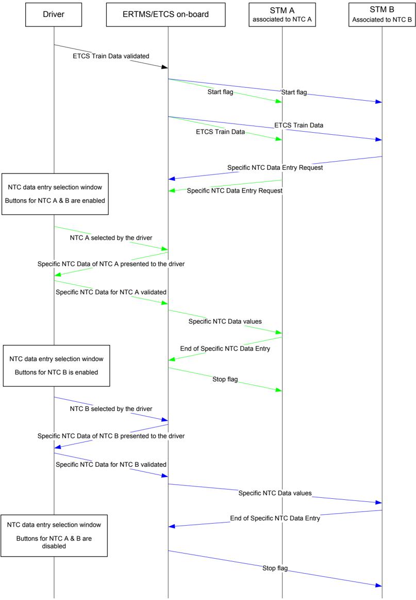

Figure 6 - Specific NTC Data Entry performed [¶478]

© This document has been developed and released by UNISIG [¶479]

---
<!-- pagina 64 -->

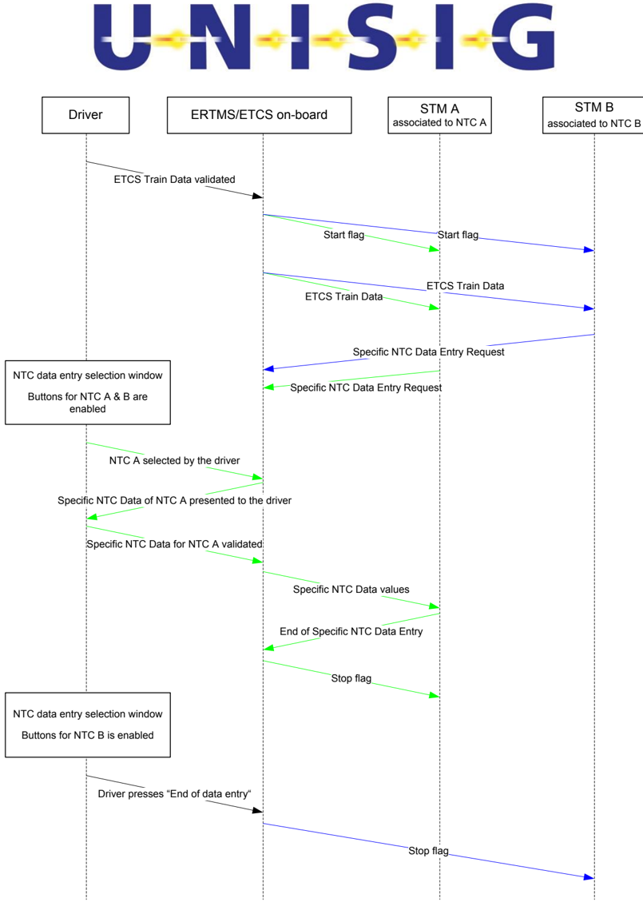

Figure 7 - Specific NTC Data Entry skipped for NTC B [¶480]

---
<!-- pagina 65 -->

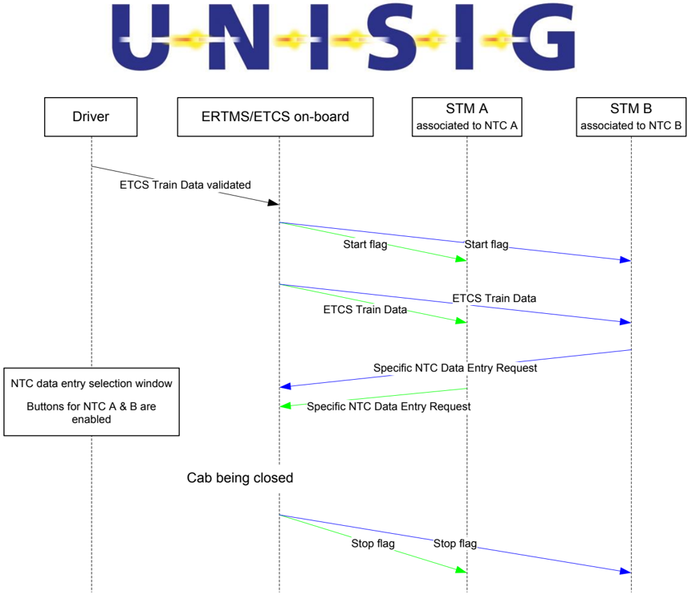

Figure 8 - Specific NTC Data Entry aborted [¶481]

# 10.8 Specific NTC Data View [¶482]

- 10.8.1.1 This  procedure  shall  allow  the  driver  to  view  the  Specific  NTC  Data  View  values currently known by the STM. [¶483]

- 10.8.1.2 When the Data View procedure is triggered, the ERTMS/ETCS on-board shall send to all available STMs a Request for Specific NTC Data View values. [¶484]

- 10.8.1.3 Once the STM has received the ETCS Request for Specific NTC Data View values: [¶485]

- If the STM requires Specific NTC Data View values to be displayed, the STM shall send those Specific NTC Data View values (labels and corresponding values) to the STM Control Function. [¶486]

- If the STM doesn't require Specific NTC Data View values to be displayed, the STM shall send a 'No Specific NTC Data View values' to the ETCS STM Control Function. [¶487]

- 10.8.1.4 When the ERTMS/ETCS on-board receives the Specific NTC Data View values, it shall present them to the driver. [¶488]

- 10.8.1.5 For  all  connected  STMs,  the  ERTMS/ETCS  on-board  shall  supervise  separately  a timeout  of  10s  (TrainDataView_STM_Response_Timeout,  see  chapter  10.3.2.4,  N16) from  sending  the  Request  for  Specific  NTC  Data  View  values  until  the  reception  of Specific NTC Data View values or the 'No Specific Data View values' information from the respective STM. [¶489]

---
<!-- pagina 66 -->

# 10.9 STM Test Procedure [¶490]

- 10.9.1.1 The STM shall be allowed to send a Test Procedure Permission Request, including a Test Identity, to the STM Control Function. [¶491]

- 10.9.1.2 Having received this Test Procedure Permission Request, the ERTMS/ETCS on-board shall grant Test Procedure Permission when technically suitable. [¶492]

- 10.9.1.2.1  Note: the condition to grant this Test Procedure Permission is specific to ERTMS/ETCS on-board implementation and to the Test Identity requested by the STM. [¶493]

- 10.9.1.3 Having received this  Test  Procedure  Permission,  the  STM shall perform the test  and then report the End of Test Procedure, including test result and optional text message. [¶494]

- 10.9.1.3.1  Note: the way  the test result and text message  are  displayed is specific to ERTMS/ETCS on-board implementation. [¶495]

# 10.10 Override [¶496]

# 10.10.1 Introduction [¶497]

- 10.10.1.1 This  Override  procedure  (Trip  Inhibition,  Pass  Stop  or  Pass  signal  at  danger)  is specified in order to provide an override for the active system as well as for the system to be activated without applying the brakes (e.g. trip) by both systems. [¶498]

- 10.10.1.2 When Override is activated in the active system (ERTMS/ETCS on-board or STM), all on-board systems receive a notification. Each system can then activate and monitor its specific  Override  procedure  limits  (e.g.  time,  distance  and/or  reception  of  trackside information) and trip inhibition. Termination of this monitoring is done independently in each system. [¶499]

- 10.10.1.3 After  a  level  transition,  the  activated  system  is  able  to  immediately  have  its  Override function active. It can then start to supervise the relevant speed for Override under the limits of the activated system according to its specific requirements. The limits may be considered from the location where driver requested Override. [¶500]

# 10.10.2 Requirements [¶501]

- 10.10.2.1 In addition to the conditions defined in [1], the ETCS Override status shall be activated when in level NTC, the ERTMS/ETCS on-board has received from the active STM the activation report of its own Override procedure. [¶502]

- 10.10.2.2 The ETCS Override function shall be reset each time a new activation report is received from the active STM. [¶503]

- 10.10.2.3 The ERTMS/ETCS on-board shall report its Override status (activated or deactivated): [¶504]

- To any STM with an established connection to the STM Control Function whenever its Override status changes, [¶505]

- To  any  connecting  STM  when  the  connection  to  the  STM  Control  Function  is established. [¶506]

© This document has been developed and released by UNISIG [¶507]

---
<!-- pagina 67 -->

- 10.10.2.4 Note: If the Override function is active while in the Mode SN, no speed supervision is performed by the ERTMS/ETCS on-board and all connected STMs except for the active STM. [¶508]

# 10.11 Transmission of ETCS airgap messages for STMs [¶509]

- 10.11.1.1 When the ERTMS/ETCS on-board receives from an RBC or from a Balise Group as non-infill  information  airgap  data  to  be  transmitted  to  an  NTC,  the  data  shall  be transmitted by the STM Control Function to the STM associated to the Level NTC which NID_NTC is contained in this airgap data. [¶510]

- 10.11.1.1.1  Note: Airgap data received as infill information is not transmitted to STMs. [¶511]

- 10.11.1.2 The  STM  Control  Function  shall  add  to  the  transmitted  airgap  data  the  odometer reading  of  the  balise  group  which  transmitted  the  airgap  message,  or  the  odometer reading of the LRBG of the message if it was received from RBC. [¶512]

- 10.11.1.3 The odometer reading shall correspond to the estimated odometer value of the location reference of the balise group. [¶513]

# 10.12 STM max speed and STM system speed/distance [¶514]

# 10.12.1 After announcement, but before the transition to Level NTC X [¶515]

- 10.12.1.1 When an 'STM max speed' (V_STMMAX) from STM  X in HS state is accepted, the ERTMS/ETCS on-board includes the 'STM max speed' in the computation of the MRSP (see [1] 4.5.2) as a speed restriction that shall start at the level transition border. [¶516]

- 10.12.1.2 When the ERTMS/ETCS on-board accepts a new 'STM max speed' (V_STMMAX) from STM X, the ERTMS/ETCS on-board shall replace the previously  received  'STM  max speed' (V_STMMAX) with the new value. [¶517]

- 10.12.1.3 If the STM X connected or known as installed on-board (see 10.1.1.1) is not available, then the ERTMS/ETCS on-board shall consider that 'STM max speed' = 0. [¶518]

- 10.12.1.3.1  Note: The purpose of the above requirement is to try to prevent the train to enter in a Level NTC area while this STM is not available. [¶519]

- 10.12.1.4 When an 'STM system speed' (V_STMSYS) together with an 'STM system distance' (D_STMSYS) from STM X in HS state is accepted, the ERTMS/ETCS onboard includes the  'STM  system  speed'  (V_STMSYS)  into  the  computation  of  the  MRSP  (see  [1] 4.5.2), as a new speed restriction that shall start at a location 'STM system distance' (D_STMSYS) in rear of the level transition border and shall end at the level transition border. [¶520]

- 10.12.1.5 When an ERTMS/ETCS on-board accepts a new 'STM system speed' (V_STMSYS) and  'STM  system  distance'  (D_STMSYS)  from  STM  X,  the  ERTMS/ETCS  on-board shall replace previously received 'STM system speed' (V_STMSYS) and 'STM system distance' (D_STMSYS) with the new value. [¶521]

© This document has been developed and released by UNISIG [¶522]

---
<!-- pagina 68 -->

- 10.12.1.6 When the level transition announcement to level NTC X is deleted by the ERTMS/ETCS on-board: [¶523]

- The 'STM system speed' (V_STMSYS) shall be deleted and the supervision of the 'STM system speed' (V_STMSYS) shall be stopped by the ERTMS/ETCS on-board; [¶524]

- The  'STM  max  speed'  (V_STMMAX)  shall  be  deleted  and  the  supervision  of  the 'STM max speed' (V_STMMAX) shall be stopped by the ERTMS/ETCS on-board. [¶525]

- 10.12.1.6.1  Note: when a new level transition to another level than NTC X is accepted, the previous one is deleted and replaced with this new one. [¶526]

- 10.12.1.6.2  Note: when a level transition announcement to the same level NTC X is updated (i.e. with a new distance), the "STM system speed" and "STM max speed" are not deleted. [¶527]

# 10.12.2 After the level transition to Level NTC X [¶528]

- 10.12.2.1 Once the train has passed the level transition border, the ERTMS/ETCS on-board shall supervise the 'STM max speed' (V_STMMAX) previously sent by the STM in HS state as  ceiling  speed  until  the  STM  DA  state  report  is  received  by  the  ERTMS/ETCS  onboard. [¶529]

- 10.12.2.2 If the STM is considered to be in FA state by the ERTMS/ETCS on-board after the level transition border, then the ERTMS/ETCS on-board shall stop the supervision of 'STM max speed' (V_STMMAX). [¶530]

- 10.12.2.3 If,  for  any  reasons  (e.g.  reception  of  a  level  transition  order  or  a  manual  change  of level),  the  level  changes  to  another  level  than  NTC  X,  the  'STM  max  speed' (V_STMMAX)  shall be deleted and the supervision of the 'STM  max  speed' (V_STMMAX) shall be stopped by the ERTMS/ETCS on-board. [¶531]

# 10.13 Validity of 'National Trip Procedure' information [¶532]

- 10.13.1.1 The ERTMS/ETCS on-board shall consider that a National Trip Procedure is active if the 'National Trip Procedure' packet has been received within the last 10 seconds (see [1]). [¶533]

- 10.13.1.2 Note:  if  the  National  Trip  Procedure  has  been  released  before  a  level  transition,  the ERTMS/ETCS on-board will consider it as still active for a maximum of 10 seconds after the reception of the information, but it is assumed that the level transition after the end of this National Trip Procedure won't happen within this time, as the train is at standstill. [¶534]

# 10.14 Display of STM failure status [¶535]

- 10.14.1.1 When an STM has reported FA state or is commanded to FA state, the ERTMS/ETCS on-board shall inform the driver about the failed status of the national system supported by this STM. [¶536]

- 10.14.1.2 When at Start of Mission just after validation of ETCS Train Data an STM known by ERTMS/ETCS on-board configuration to be installed is not in CO, CS, HS or DA state and  this  STM  is  not  known  to  be  isolated  by  TIU  'NTC  isolation  status'  input  data, [¶537]

---
<!-- pagina 69 -->

ERTMS/ETCS on-board shall inform the driver about the  failed  status  of the national system supported by this STM. [¶538]

# 10.15 Interface 'K' Antenna/BTM ID [¶539]

- 10.15.1.1 If  the  ERTMS/ETCS  on-board  uses  alternative  1  of  interface  'K'  (see  [10]),  it  shall indicate to all KER (KVB, Ebicab, RSDD) STMs whether it can or not guarantee by its own  that  the  interface  'K'  data  is  coming  from  the  intended  Antenna/BTM,  when  the connection to the STM Control Function is established. [¶540]

- 10.15.1.2 If  ERTMS/ETCS  on-board  cannot  guarantee  by  its  own  that  the  interface  'K'  data  is coming from the intended Antenna/BTM, the STM Control Function shall inform whether there is an active Antenna/BTM and, if so, which one: [¶541]

-  To all connected KER STMs whenever this information changes, [¶542]

-  To any KER STM when the connection to the STM Control Function is established. [¶543]

- 10.15.1.3 Note: This information enables an STM using interface 'K' to fulfil a requirement of [10] asking to supervise that the interface 'K' information comes from the intended source. [¶544]

# 10.16 BTM alarm data [¶545]

- 10.16.1.1 The STM Control Function shall send the BTM alarm data consisting of the BTM alarm status and whether the antenna is within an announced Big Metal Mass track condition: [¶546]

-  To all connected STMs whenever the BTM alarm status changes or whenever an announced Big Metal Mass track condition is entered or exited during a BTM alarm, [¶547]

- To any STM when the connection to the STM Control Function is established. [¶548]

- 10.16.1.2 Note: The ERTMS/ETCS on-board always sends this information over the FFFIS STM interface regardless the alarms are ignored according to [1] 3.12.1 and 3.15.7. [¶549]

---
<!-- pagina 70 -->

# 11. TIU AND BIU FUNCTIONS [¶550]

- 11.1.1.1 The TIU Function shall transmit train interface inputs status / availability : [¶551]

- To  any  STM  with  an  established  connection  to  the  TIU  Function  whenever  a  train interface inputs status / availability changes. [¶552]

- To any connecting STM when the connection to the TIU Function is established. [¶553]

- 11.1.1.1.1  The TIU  Function  shall transmit train interface  commands  configuration  to  any connecting STM when the connection to the TIU Function is established. [¶554]

- 11.1.1.2 The BIU Function shall transmit the brake performance parameters to any connecting STM when the connection to the BIU Function is established. [¶555]

- 11.1.1.3 The BIU Function shall transmit the brake status / availability : [¶556]

- To any STM with an established connection to the BIU Function whenever a brake status / availability changes. [¶557]

- To any connecting STM when the connection to the BIU Function is established. [¶558]

- 11.1.1.4 When the service brake is commanded by an STM, the STM shall indicate in its request if  the  service  brake  shall  be  backed  up  automatically  by  the  ERTMS/ETCS  on-board with an Emergency Brake command if the service brake fails to be applied. [¶559]

- 11.1.1.4.1  Note: If it is not the case, this has to be considered as an exception to [1]. [¶560]

---
<!-- pagina 71 -->

# 12. ODOMETER FUNCTION [¶561]

# 12.1 General [¶562]

- 12.1.1.1 The FFFIS STM specifies the odometer information to be transmitted from ERTMS/ETCS on-board to all STMs via FFFIS STM. [¶563]

- 12.1.1.2 The  ERTMS/ETCS on-board  shall  transmit  odometer  information  via  the  FFFIS  STM interface at regular intervals. This information shall include current values of estimated distance,  direction,  estimated  speed,  confidence  interval  of  measurement  of  distance (i.e. minimum and maximum distances) and confidence interval for speed (i.e. minimum and maximum speeds). [¶564]

- 12.1.1.3 Every transmitted odometer information report shall be time stamped. The time base for timestamp shall be the Reference Time obtained from the Safe Time Layer, see 5.2.2. The time in the timestamp shall be the time when the odometer data were valid. [¶565]

- 12.1.1.3.1  Justification: this time information allows an STM to extrapolate distance and speed to fit its algorithms and processing cycles. [¶566]

- 12.1.1.4 Positive  movement  direction  is  defined  as  a  movements  in  the  forward  direction  in relation  to  cab  A.  It  shall  be  indicated  with  positive  speed  and  increasing  odometer distance values. [¶567]

- 12.1.1.5 Negative  movement  direction  is  defined  as  movements  in  the  backwards  direction  in relation  to  cab  A.  It  shall  be  indicated  with  negative  speed  and  decreasing  odometer distance values. [¶568]

- 12.1.1.5.1  Note:  Allocation  of  cab(s)  on  a  specific  train  is  a  pure  ERTMS/ETCS  on-board implementation issue. [¶569]

- 12.1.1.6 The ERTMS/ETCS on-board shall not reset the odometer distance values as long as the ERTMS/ETCS on-board is powered-on. [¶570]

- 12.1.1.6.1  Justification: The ETCS odometer information is used as a common reference within the FFFIS STM. [¶571]

- 12.1.1.7 The  ERTMS/ETCS on-board  shall  transmit  odometer  configuration  data  (see  chapter 12.4) to the STMs. [¶572]

# 12.2 Speed [¶573]

- 12.2.1.1 Estimated speed, V_Est, shall be the estimated speed as used by the ERTMS/ETCS on-board (also referred as the train speed in [1]). [¶574]

- 12.2.1.2 Maximum  speed,  V_Max, is  defined  as  the  most  positive  speed,  i.e.  the  highest possible  physical  speed  including  under-reading  amount,  in  case  of  movement  in positive  direction  (V_Max  =  V_Est  +  |V_ura|).  For  movements  in  negative  direction [¶575]

© This document has been developed and released by UNISIG [¶576]

---
<!-- pagina 72 -->

V_Max reports the lowest possible speed in absolute value, i.e. including over-reading amount (V_Max = V_Est + |V_ora|). [¶577]

- 12.2.1.3 Minimum  speed,  V_Min, is  defined  as  the  most  negative  speed,  i.e.  the  lowest possible physical speed including over-reading amount, in case of movement in positive direction (V_Min = V_Est - |V_ora|). For movements in negative direction V_Min reports the  highest  possible  speed  in  absolute  value,  i.e.  including  under-reading  amount (V_Min = V_Est - |V_ura|). [¶578]

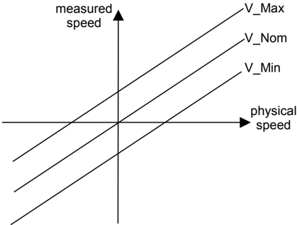

Figure 9 - Example of transmitted speed information [¶579]

# 12.3 Distance [¶580]

- 12.3.1.1 The estimated distance, D_Est , shall be the most probable position of the vehicle in the vehicle coordinate system at the time given in the odometer packet, with reference to the vehicle position at the last reset of the odometry. [¶581]

- 12.3.1.2 Note: For any train movement, the  most probable distance travelled between any two track positions can be computed as the difference between the measurement values of D_Est at the two positions. [¶582]

- 12.3.1.3 D_Max is defined as the most positive position of the vehicle in the vehicle coordinate system  at  the  time  given  in  the  odometer  packet,  with  all  over-  and  under-reading amounts accumulated since the last reset of the odometry. [¶583]

- 12.3.1.4 D_Min is defined as the most negative position of the vehicle in the vehicle coordinate system  at  the  time  given  in  the  odometer  packet,  with  all  over-  and  under-reading amounts accumulated since the last reset of the odometry. [¶584]

- 12.3.1.5 The confidence interval shall comply with the relevant requirements specified in [7]. [¶585]

- 12.3.1.6 The  resolution  part  of  an  odometer  report  shall  be  given  as  a  parameter  in  each odometer report from the ETCS Odometer Function. This allows for sensor technologies with varying resolution. [¶586]

---
<!-- pagina 73 -->

- 12.3.1.7 Note: The STM can then compute the maximum and minimum travelled distances at the current  vehicle  position  p2  with  regards  to  any  reference  location  p1  by  using  the resolution  information,  maximum  and  minimum  distances  at  the  these  locations,  as follows: [¶587]

- max_distance(p1  p2) = max(D_Res(p1), D_Res(p2)) + D_Max(p2) - D_Max(p1) [¶588]

- min_distance(p1  p2) = - max(D_Res(p1), D_Res(p2)) + D_Min(p2) - D_Min(p1) [¶589]

- 12.3.1.8 The  distance  parameters  D_Est,  D_Max  and  D_Min  are  allowed  to  wrap  when exceeding the value range. The parameters wrap individually. [¶590]

# 12.4 Configuration information [¶591]

- 12.4.1.1 The  ERTMS/ETCS  on-board  Odometer  Function  shall  transmit  performance  related information  (configuration  data)  over  the  FFFIS  STM.  The  transmission  shall  be repeated to support restarting STMs. [¶592]

- 12.4.1.1.1  Note: The STM may use the performance-related information (e.g. ageing) to adjust its supervision, e.g. braking curves. [¶593]

- 12.4.1.2 Typical  cycle  time,  T_OdoCycle is  the  typical  time  for  the  odometer  cycle  time between each generating of new odometer data. [¶594]

- 12.4.1.3 Note: The actual cycle time may well exceed T_OdoCycle. [¶595]

- 12.4.1.4 Maximum  production  delay  time,  T_OdoMaxProd is  the  maximum  ageing  of odometer data from when the data was true until the data is available on the bus. This shall include clock synchronisation inaccuracy of the Odometer Function. [¶596]

- 12.4.1.5 Note: The actual production delay time should not exceed T_OdoMaxProd. [¶597]

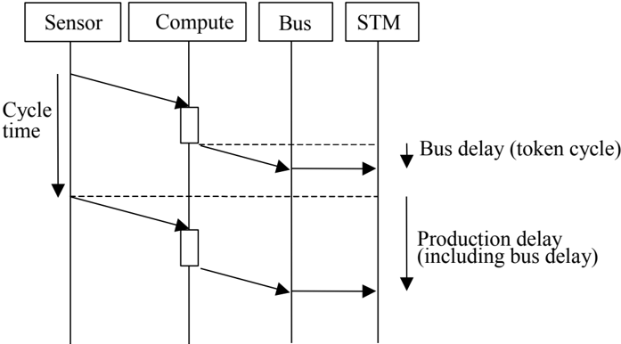

Figure 10 - Odometer cycle and delay times [¶598]

---
<!-- pagina 74 -->

# 13. DRIVER MACHINE INTERFACE FUNCTION [¶599]

# 13.1 Introduction [¶600]

- 13.1.1.1 The DMI Function allows the driver to directly interact with the ERTMS/ETCS on-board for what regards the national information related to the default window. That means that all  inputs  from  the  driver  to  the  ERTMS/ETCS  on-board  and  all  outputs  from  the ERTMS/ETCS  on-board  to  the  driver  in  the  default  window  are  controlled  by  this function. [¶601]

- 13.1.1.2 The DMI Function shall provide the unified DMI and the customisable DMI services. [¶602]

- 13.1.1.3 An STM designed for usage with a customisable DMI provides a set of configuration data for its default window as part of its product documentation as described in chapter 13.5.  The  ERTMS/ETCS on-board shall be configurable to store this  information  and serve  the  STM  DMI  requests  according  to  this  configuration.  The  customisable  DMI service shall be used, when configuration data for a customisable DMI layout are stored in the ERTMS/ETCS on-board for the NID_STM of the STM. [¶603]

- 13.1.1.4 An STM designed to use the unified DMI provides no configuration data as part of its product documentation. The unified DMI service shall be used, when no configuration data  for  a  customisable  DMI  layout  is  stored  in  the  ERTMS/ETCS  on-board  for  the NID_STM of the STM. [¶604]

- 13.1.1.5 Note: Unconfigurable parts of the DMI functions shall be handled in the same way by the unified and the customisable DMI services. [¶605]

# 13.2 General requirements regarding DMI Function [¶606]

- 13.2.1.1 The ERTMS/ETCS on-board shall only allow the active STM to communicate with the driver. [¶607]

- 13.2.1.2 When the STM is no more active (see 4.1.1.3), the ERTMS/ETCS on-board shall delete all DMI objects controlled by this STM. [¶608]

- 13.2.1.3 When  the  connection  between  an  STM  and  the  DMI  Function  is  disconnected,  the ERTMS/ETCS  on-board  shall  delete  all  the  DMI  objects  controlled  by  this  STM (including preliminary requests) after a timeout of 2 seconds. [¶609]

- 13.2.1.3.1  Justification: The timeout of 2 seconds is to give the STM the chance to re-establish the connection. [¶610]

- 13.2.1.4 When the  connection  between  the  active  STM  and  the  DMI  Function  is  lost  and  reestablished within the timeout of 2 seconds, the ERTMS/ETCS on-board shall delete all the  DMI  objects  controlled  by  the  STM  when  the  DMI  connection  to  the  STM  is established. [¶611]

© This document has been developed and released by UNISIG [¶612]

---
<!-- pagina 75 -->

- 13.2.1.5 The ERTMS/ETCS on-board shall be able to receive and store preliminary request for DMI objects from an STM being in HS state and display them immediately after having received the DA state report. [¶613]

- 13.2.1.5.1  Note:  The  sending  of  preliminary  request  is  to  allow  the  DMI  Function  to  prepare  in background the information to be presented to the driver once the STM switches to DA state. Therefore, the STM should send all DMI objects that needs to be displayed after the change to DA as preliminary DMI request. [¶614]

- 13.2.1.6 When an STM reports PO, CS or FA, or is considered as failed, the ERTMS/ETCS onboard shall delete all preliminary requests for DMI objects from this STM. [¶615]

- 13.2.1.7 If  the  ETCS  train  speed  is  configured  not  to  be  displayed  for  an  STM  while  the ERTMS/ETCS on-board is in SN mode (see chapter 13.5.1.1.7), the ERTMS/ETCS onboard shall inhibit the display of the ETCS train speed only once the DA state report is received from this STM by the STM Control Function. [¶616]

# 13.3 DMI channels [¶617]

- 13.3.1.1 The DMI Function shall be allowed to use up to four DMI channels. Each channel shall correspond to one connection. [¶618]

- 13.3.1.2 At  most  one  DMI  channel  shall  be  active,  only  this  one  shall  be  used  for  the communication related to DMI objects with the DMI Function at application level. [¶619]

- 13.3.1.3 Note 1: Connections corresponding to the inactive DMI channels may however remain open. [¶620]

- 13.3.1.3.1  Note  2:  The  ERTMS/ETCS  on-board  may  report  a  DMI  channel  as  active  even  if  no interaction with the driver is possible, e.g. when no cab is active. [¶621]

- 13.3.1.4 At the time the active DMI channel changes, the DMI Function shall delete all the DMI objects controlled by the STM. [¶622]

# 13.4 DMI Objects [¶623]

# 13.4.1 DMI object identities [¶624]

- 13.4.1.1 The  DMI  objects  indicators  and  buttons  used  by  the  different  STMs  are  assigned  a unique object identity made of NID_STM and Indicator/Button Identifier. [¶625]

- 13.4.1.2 The  STM  Identity  is  implicitly  provided  by  the  STM  by  its  announced  NID_STM  (and repeated in each message header according to the language). [¶626]

- 13.4.1.3 The  Indicator/Button  Identifier  is  provided  by  the  STM  as  part  of  the  corresponding Indicator/Button request. [¶627]

- 13.4.1.4 The  Indicator/Button  Identifier  is  used  by  the  STM  to  be  able  to  change  the  state  of objects  and  to  move  or  remove  them.  The  Button  Identifier  is  also  used  by  the ERTMS/ETCS on-board to transmit the button events to the STM. If the customisable DMI service is used, it is also used to define the properties of the object. [¶628]

© This document has been developed and released by UNISIG [¶629]

---
<!-- pagina 76 -->

- 13.4.1.5 All  icons  (bitmap  symbols) used by the different STMs using a customisable DMI are assigned an icon identity made of NID_STM and Icon Identifier. [¶630]

- 13.4.1.6 An  Icon Identifier can  be  provided  by the STM  as  part  of  the  corresponding Indicator/Button request. [¶631]

- 13.4.1.7 All  sounds  (wave  form  for  audible  information)  used  by  the  different  STMs  using  a customisable DMI are assigned a unique sound identity made of NID_STM and Sound Identifier. [¶632]

- 13.4.1.8 A  Sound  Identifier  can  be  provided  by  the  STM  as  part  of  the  corresponding  sound request. [¶633]

- 13.4.1.9 For specifying the position of DMI objects, Position Identifiers are used. [¶634]

- 13.4.1.10 If the unified DMI service is used, the Position Identifier specifies an area of the ETCS layout as defined in [9]. [¶635]

- 13.4.1.11 If  the  customisable  DMI  service  is  used,  the  Position  Identifier  and  the  NID_STM  are used to define the position in cell coordinates and size as specified in the configuration data for this STM. [¶636]

# 13.4.2 Text messages [¶637]

- 13.4.2.1 The DMI Function shall display a text message when requested by the STM. The text message request shall consist of a Text Identifier, a string of text to be shown to the driver, a display attribute and a possible request for driver acknowledgement. [¶638]

- 13.4.2.2 The  DMI  Function  shall  report  to  the  STM  the  acknowledgement  of  text  messages (which were required to be acknowledged) from the driver referencing the corresponding Text Identifier. [¶639]

- 13.4.2.3 The DMI Function shall delete a text message when requested by the active STM. The request shall reference the Text Identifier of the text message to be deleted. [¶640]

- 13.4.2.3.1  Note: The acknowledgement does not lead to the end of the display of a text message. [¶641]

- 13.4.2.4 If the STM requests a text message with the same Text Identifier as a not yet deleted text  message, the ERTMS/ETCS on-board shall delete the original text message and display the new requested text message. [¶642]

- 13.4.2.5 The display attribute specifies the colour of the text, its background colour, the flashing mode and the group of text messages. [¶643]

- 13.4.2.6 The  flashing mode  specifies  if the slow, fast or no  flashing and  if  normal  or counterphase flashing shall be used. [¶644]

# 13.4.3 Indicators [¶645]

- 13.4.3.1 An Indicator is a DMI object for display of information without input. [¶646]

- 13.4.3.2 The STM shall request the display of an Indicator by means of the following definition: [¶647]

---
<!-- pagina 77 -->

- its Indicator Identifier, [¶648]

- an optional Icon Identifier, [¶649]

-  an optional caption text, [¶650]

- a Position Identifier, [¶651]

- a display attribute. [¶652]

- 13.4.3.3 The Icon Identifier shall be used by the DMI Function in case of the customisable DMI service  to  retrieve  from  the  configuration  data  the  corresponding  icon  attached  to  an Indicator/Button object. [¶653]

- 13.4.3.4 The display attribute shall specify the background colour and the flashing mode for the whole Indicator and the display colour of the caption text. [¶654]

- 13.4.3.5 The  flashing mode  specifies  if the slow, fast or no  flashing and  if  normal  or counterphase flashing shall be used. [¶655]

# 13.4.4 Buttons [¶656]

- 13.4.4.1 Buttons are a pure functional extension of Indicators. All requirements of chapter 13.4.3 shall apply to Buttons, by replacing "Indicator" with "Button". [¶657]

- 13.4.4.2 The extension is the transmission of Button events from the DMI Function to STM. The DMI Function shall make a distinction between push event (transition from Button not pressed to pressed state) and release event (opposite transition). [¶658]

- 13.4.4.3 The DMI Function shall report  Button  push  and  release  events to the STM and shall timestamp those event reports to reflect the sequence of events. [¶659]

- 13.4.4.4 The DMI Function shall use the Reference Time (see chapter 5.2.2) for timestamping the Button events reports. [¶660]

# 13.4.5 Sounds [¶661]

- 13.4.5.1 STM shall request a Sound by means of the following definition: [¶662]

- an optional Sound Identifier, [¶663]

- only in case of a unified DMI and a Sound to be generated, a sequence of segments defined by a duration and an associated frequency, [¶664]

---
<!-- pagina 78 -->

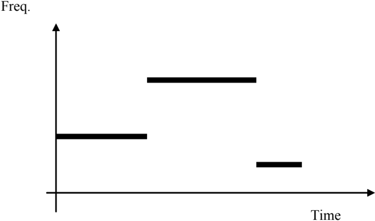

Figure 11 : Example of sound definition [¶665]

-  an indication if the Sound has to be repeated continuously or not or to be stopped. [¶666]

- 13.4.5.2 The  Sound  Identifier  shall  be  used  by  the  ERTMS/ETCS  on-board  in  case  of  the customisable  DMI  service  to  retrieve  from  the  configuration  data  the  corresponding sound. [¶667]

- 13.4.5.3 The Sound Identifier shall be used by the ERTMS/ETCS on-board in both DMI services to stop the generation of a Sound, if requested by the STM. [¶668]

- 13.4.5.4 The DMI Function shall be able to manage two STM requests for Sounds at the same time. [¶669]

- 13.4.5.4.1  Note: This will allow an STM  to request a long Sound  and a short  Sound simultaneously. [¶670]

# 13.4.6 Supervision information [¶671]

- 13.4.6.1 There shall be two sets of supervision information: [¶672]

- Speed and distance values [¶673]

- Colours and display modes [¶674]

- 13.4.6.2 Speed and distance values consists of : [¶675]

- Permitted Speed [¶676]

- Target Speed [¶677]

-  Target Distance [¶678]

- Release Speed [¶679]

- Intervention Speed [¶680]

- 13.4.6.3 Colours and display modes consists of: [¶681]

- Current train speed pointer [¶682]

© This document has been developed and released by UNISIG [¶683]

---
<!-- pagina 79 -->

-  Colour [¶684]

- Permitted Speed [¶685]

-  Colour [¶686]

-  Display mode: no display, bar only, hook only or hook and bar [¶687]

-  Target Speed [¶688]

-  Colour [¶689]

-  Display mode: no display, bar only, hook only or hook and bar [¶690]

- Target Distance [¶691]

-  Display mode: no display, bar only, digital only or bar and digital [¶692]

- Release Speed [¶693]

-  Colour [¶694]

-  Display mode: no display, bar only, digital only or bar and digital [¶695]

-  Intervention Speed [¶696]

-  Colour [¶697]

-  Display mode: no display, display with normal bar width or display with wide bar width. [¶698]

- 13.4.6.4 The DMI Function shall use the last received information for Current train speed pointer, Target  Speed,  Release  Speed,  Permitted  Speed,  Intervention  Speed  and  Target Distance. [¶699]

# 13.5 Customisable DMI service [¶700]

- 13.5.1.1 The configuration of the customisable DMI shall define the following data for each STM using the customisable DMI service: [¶701]

- 13.5.1.1.1  The NID_STM of the STM. [¶702]

- 13.5.1.1.2  The list of Indicators defined for the STM with the following data for each Indicator: [¶703]

- identifier (a number); [¶704]

- font size (height in cells); [¶705]

-  horizontal text-alignment (left, right or centred); [¶706]

- vertical text-alignment (upper part, lower part or centred). [¶707]

- 13.5.1.1.3  Two lists  of Indicator positions (one list for soft key technology and one list for touch screen technology) defined for the STM, and for each Indicator position: [¶708]

- identifier (a number); [¶709]

- x:y offset of the upper left corner in cells; [¶710]

-  x:y size of the area in cells. [¶711]

- 13.5.1.1.4  The list of Buttons defined for the STM with the following data for each Button: [¶712]

---
<!-- pagina 80 -->

- identifier (a number); [¶713]

- font size (height in cells); [¶714]

-  horizontal text-alignment (left, right or centred); [¶715]

- vertical text-alignment (upper part, lower part or centred). [¶716]

- 13.5.1.1.5  Two  lists  of  Button  positions  (one  list  for  soft  key  technology  and  one  list  for  touch screen technology) defined for the STM and, for each Button position: [¶717]

- identifier (a number); [¶718]

- x:y offset of the upper left corner in cells; [¶719]

-  x:y size of the area in cells; [¶720]

- linked soft key (for soft key technology). [¶721]

- 13.5.1.1.6  The list of Icons defined for the STM and, for each Icon: [¶722]

- identifier (a number); [¶723]

- bitmap,  as  RGB  bitmap  file  (according  to  Microsoft  BMP  file  format);  Pixels  in  the bitmap files shall be understood as cells. [¶724]

-  display of text upon icon: yes/no. [¶725]

- 13.5.1.1.7  ETCS speed and distance supervision [¶726]

- For speed and distance supervision display in speed dial as for ETCS in area B0-B2, B6 and A2-A3 (applicable as long as the STM is active): [¶727]

- Yes/No; 'Yes' means that the ETCS train speed display is re-used as such together with the supervision information as specified in 13.4.6. 'No' means that there is no display of speed and distance supervision in the ETCS way. [¶728]

-  if Yes: speed dial range (0-140/180/250/400 km/h or same range as ETCS). [¶729]

- 13.5.1.1.8  Options for flashing of Indicators and Buttons (additionally to flashing mode): [¶730]

- the frequency for slow and fast flashing; [¶731]

- the flashing style either as 'yellow frame' or as 'whole area'. [¶732]

- 13.5.1.1.9  The list of Sounds defined for the STM and, for each sound, its Sound definition. [¶733]

- identifier (a number); [¶734]

- sound, as WAV file (according to Microsoft WAV file format); [¶735]

- 13.5.1.1.10  Moved areas of the ETCS layout: [¶736]

- If  a  STM  needs  partially  or  totally  the  cells  used  by  an  area  defined  in  the  ETCS layout and in which ETCS DMI objects are displayed in level NTC modes SN or NL, the  ETCS  objects  displayed  in  it  must  be  moved  somewhere  else  on  the  national layout.  Therefore  it  shall  be  possible  to  specify  a  changed  location  for  moving  the following  ETCS  areas  and  their  related  ETCS  objects.  For  buttons  also  the  new related soft key (F1-F5) must be defined: [¶737]

© This document has been developed and released by UNISIG [¶738]

---
<!-- pagina 81 -->

-  Areas F1-F5 for the buttons for selecting the main, override, data view, special or settings window; [¶739]

-  Area A4 for the adhesion 'slippery rail'; [¶740]

-  Areas B7 and C8 for the ETCS mode and level display; [¶741]

-  Area C1 for the mode/level acknowledgements; [¶742]

-  Area C7 for the Override status indication; [¶743]

-  Area C9 for the brake indication; [¶744]

-  Area E1 for safe radio connection indication; [¶745]

-  Area G13 for local time [¶746]

- The new location shall be specified by a new x:y position in cells. [¶747]

-  The moved areas shall have the same size as the original ETCS areas. [¶748]

[¶749]
| Description                                                      | Multiplicity                | Range and unit                  |
|------------------------------------------------------------------|-----------------------------|---------------------------------|
| NID_STM of the STM                                               | 1                           | 0-254                           |
| Number of Indicators                                             | 1                           | 0-255                           |
| Indicator id (i)                                                 | For each Indicator          | 1-255                           |
| Font size (i)                                                    | For each Indicator          | height in cells (8-60)          |
| Horizontal text alignment (i)                                    | For each Indicator          | Left , right, centred           |
| Vertical text alignment (i)                                      | For each Indicator          | upper part, lower part, centred |
| Number of Indicator positions in case of touch screen technology | 1                           | 0-24                            |
| Indicator position id (i)                                        | For each Indicator position | 1-24                            |
| X Offset of the upper left corner (i)                            | For each Indicator position | 0-639 [cells]                   |
| Y Offset of the upper left corner (i)                            | For each Indicator position | 0-479 [cells]                   |
| Horizontal size (i)                                              | For each Indicator position | 8-640 [cells]                   |
| Vertical size (i)                                                | For each Indicator position | 8-480 [cells]                   |
| Number of Indicator positions in case of soft key technology     | 1                           | 0-24                            |
| Indicator position id (i)                                        | For each Indicator position | 1-24                            |
| X Offset of the upper left corner (i)                            | For each Indicator position | 0-639 [cells]                   |
| Y Offset of the upper left corner (i)                            | For each Indicator position | 0-479 [cells]                   |
| Horizontal size (i)                                              | For each Indicator position | 8-640 [cells]                   |
| Vertical size (i)                                                | For each Indicator position | 8-480 [cells]                   |
| Number of Buttons                                                | 1                           | 0-255                           |
| Button id (i)                                                    | For each Button             | 1-255                           |

13.5.1.2 Recapping Table with configuration data for customisable DMI: [¶750]

© This document has been developed and released by UNISIG

---
<!-- pagina 82 -->

[¶751]
| Font size (i)                                                 | For each Button          | height in cells (8-60)                    |
|---------------------------------------------------------------|--------------------------|-------------------------------------------|
| Horizontal text alignment (i)                                 | For each Button          | Left , right, centred                     |
| Vertical text alignment (i)                                   | For each Button          | upper part, lower part, centred           |
| Number of Button positions in case of touch screen technology | 1                        | 0-24                                      |
| Button position id for touch screen (i)                       | For each Button position | 1-24                                      |
| X Offset of the upper left corner (i)                         | For each Button position | 0-639 [cells]                             |
| Y Offset of the upper left corner (i)                         | For each Button position | 0-479 [cells]                             |
| Horizontal size (i)                                           | For each Button position | 8-640 [cells]                             |
| Vertical size (i)                                             | For each Button position | 8-480 [cells]                             |
| Number of Button positions in case of soft key technology     | 1                        | 0-24                                      |
| Button position id for soft key (i)                           | For each Button position | 1-24                                      |
| X Offset of the upper left corner (i)                         | For each Button position | 0-639 [cells]                             |
| Y Offset of the upper left corner (i)                         | For each Button position | 0-479 [cells]                             |
| Horizontal size (i)                                           | For each Button position | 8-640 [cells]                             |
| Vertical size (i)                                             | For each Button position | 8-480 [cells]                             |
| Linked soft key                                               | For each Button position | F1-F10,H2-H4                              |
| Number of Icons                                               | 1                        | 0-255                                     |
| Icon id (i)                                                   | For each Icon            | 1-255                                     |
| Icon (i)                                                      | For each Icon            | Bitmap file                               |
| Display text upon icon                                        | For each Icon            | Yes/No                                    |
| ETCS speed and distance supervision                           | 1                        | Yes/No                                    |
| ETCS speed dial range                                         | 1                        | No, same as ETCS, 140, 180, 250, 400 km/h |
| Slow flashing frequency for Buttons and Indicators            | 1                        | (0,5 - 8) Hz                              |
| Fast flashing frequency for Buttons and Indicators            | 1                        | (0,5 - 8) Hz                              |
| Flashing style                                                | 1                        | Frame, whole area                         |
| Number of Sounds                                              | 1                        | 0-255                                     |
| Sound id (i)                                                  | For each Sound           | 1-255                                     |
| sound (i)                                                     | For each Sound           | Wave file                                 |
| Number of moved areas of the ETCS layout                      | 1                        | 0 - 13                                    |
| ETCS area of moved element(i)                                 | For each moved element   | A4, B7, C1, C7-C9, E1, F1-F5, G13         |

© This document has been developed and released by UNISIG [¶752]

---
<!-- pagina 83 -->

[¶753]
| X Offset of the upper left corner (i) of new location   | For each moved element   | 0-639 [cells]   |
|---------------------------------------------------------|--------------------------|-----------------|
| Y Offset of the upper left corner (i) of new location   | For each moved element   | 0-479 [cells]   |
| Soft key Identifier (i)                                 | For each moved button    | F1-F10, H2-H4   |

---
<!-- pagina 84 -->

# 14. JURIDICAL DATA FUNCTION [¶754]

- 14.1.1.1 The ERTMS/ETCS on-board equipment shall be able to receive and forward national juridical data to the On-Board Recording Device. [¶755]

- 14.1.1.2 The  STM  shall  use  the  Reference  Time  (see  chapter  5.2.2)  for  time  stamping  the juridical data sent to the ERTMS/ETCS on-board. [¶756]

- 14.1.1.3 The time stamp of the juridical data shall represent the time the sent event occurred. [¶757]

- 14.1.1.3.1  Note: This is in order to respect the event chronology. [¶758]

---
<!-- pagina 85 -->

# 15. LIMITATIONS [¶759]

# 15.1 Limitations related to DMI [¶760]

- 15.1.1.1 The maximum number of characters (coded in UTF-8 by 1 or 2 bytes) to display shall be [¶761]

- 40 characters for text messages in text message request. [¶762]

- 12 characters for button and indicator caption text in button and indicator requests [¶763]

- 15.1.1.2 The allowed text font height range for the configurable elements of the DMI layout of an STM using the customisable DMI service shall be from 8 to 60 cells. [¶764]

- 15.1.1.3 The allowed range for the frequencies for slow and fast flashing for an STM using the customisable DMI service is 0,5 - 8 Hz. [¶765]

- 15.1.1.4 The ERTMS/ETCS on-board DMI Function shall be able to store at least 10 STM text messages. [¶766]

# 15.2 Limitations related to Specific NTC Data Entry/Data View [¶767]

- 15.2.1.1 The number of Data Identifiers within one 'Specific NTC Data Entry request' shall be limited to 15 Data Identifiers. [¶768]

- 15.2.1.2 The number of Data Identifiers within one 'Specific NTC Data values' shall be limited to 15 Data Identifiers. [¶769]

- 15.2.1.3 The  number  of  Data  Identifiers  within  one  'Specific  NTC  Data  View  values'  shall  be limited to 15 Data Identifiers. [¶770]

- 15.2.1.4 The maximum number of characters (coded in UTF-8 by 1 or 2 bytes) shall be: [¶771]

- 20 characters for data labels in 'Specific NTC Data Entry request' and 'Specific NTC Data View values' [¶772]

- 10  characters  for  data  values  in  'Specific  NTC  Data  Entry  request'  and  'Specific NTC Data values' [¶773]

-  10 characters for data view values in 'Specific NTC Data View values' [¶774]

---
<!-- pagina 86 -->

# 16. VERSION MANAGEMENT [¶775]

# 16.1 Introduction [¶776]

- 16.1.1.1 The  version  of  the  FFFIS  STM  defines  unambiguously  the  mandatory  interface functions  that  ensure  technical  exchangeability  between  ERTMS/ETCS  on-board  and STM. [¶777]

- 16.1.1.2 During the life time of the FFFIS STM there may be several versions of the FFFIS STM. [¶778]

- 16.1.1.3 The objective of this section is to define requirements applicable to ERTMS/ETCS onboard  equipment  and  to  STM,  when  different  versions  of  the  FFFIS  STM  have  been defined. [¶779]

# 16.2 Identification/evolution of the versions [¶780]

- 16.2.1.1 The evolution of the versions of the FFFIS STM shall be sequential, i. e. there shall only be a direct upgrade of an existing version and no branch is accepted. [¶781]

- 16.2.1.2 The version of the FFFIS STM shall be identified by a number which complies with the following: [¶782]

- Each Version Number will have the following format: X.Y, where X and Y are any number between 0 and 255 (examples: 2.0, 3.0, 4.2). [¶783]

- The first number (X) distinguishes not compatible versions. [¶784]

-  The second number (Y) indicates compatibility within a version X. [¶785]

- If the first number of two versions is the same, that indicates that those versions are compatible, independently of the second number (e. g. version 4.5 is compatible with 4.3, 4.14). [¶786]

- 16.2.1.3 The 'FFFIS STM version number X or Y' is incremented only when the functionality of the FFFIS STM changes. [¶787]

# 16.3 Version numbers [¶788]

- 16.3.1.1 Table of FFFIS STM version numbers [¶789]

---
<!-- pagina 87 -->

[¶790]
| FFFIS Version Number                           | Supported by ERTMS/ETCS on- board equipment   | Remark                                                                                              |
|------------------------------------------------|-----------------------------------------------|-----------------------------------------------------------------------------------------------------|
| X=2, Y=0, Z=0                                  | Supplier specific                             | Initial Version, introduced in SUBSET-035 v2.0.0.                                                   |
| X=3, Y=0, Z                                    | Supplier specific                             | Introduced in SUBSET-035 v2.1.1 (General revision of the FFFIS STM) Z is vendor specific            |
| Legal backward compatibility envelope X=4, Y=0 | Yes                                           | Introduced in SUBSET-035 v3.x.0 (General revision of the FFFIS STM in the frame of ETCS baseline 3) |

- 16.3.1.2 The STM shall support and send one and only one 'FFFIS STM version number', which is  the  highest  one  amongst  those  included  in  the  'legal  backward  compatibility envelope', as defined in table 16.3.1.1. [¶791]

- 16.3.1.3 The ERTMS/ETCS on-board equipment shall support any of the 'FFFIS STM version numbers X' included in the 'legal backward compatibility envelope', as defined in table 16.3.1.1. [¶792]

- 16.3.1.4 All  nodes/functions  of  the  ERTMS/ETCS  on-board  equipment  shall  support  the  same 'FFFIS STM version numbers' and shall therefore send the same 'FFFIS STM version number', when opening a connection with a given STM (see section 7.1.2). [¶793]

- 16.3.1.5 When a connection is successfully established with a 'FFFIS STM version number X' lower  than  the  highest  STM  version  numbers  X  included  in  the  'legal  backward compatibility envelope', the ERTMS/ETCS  on-board  equipment shall apply the corresponding  set  of  requirements  as  per  section  16.4,  in  order  to  ensure  backward compatibility between the ERTMS/ETCS on-board equipment and the STM. [¶794]

# 16.4 Management of older FFFIS STM versions by ERTMS/ETCS onboard [¶795]

- 16.4.1.1 The 'FFFIS STM version number' introduced in this version of the SUBSET-035 is the starting point of the 'legal backward compatibility envelope', which means that whether an ERTMS/ETCS on-board equipment supports a 'FFFIS STM version number X' lower than  the  one  introduced  in  this  version  of  the  SUBSET-035  is  supplier  specific  and outside the scope of this document. [¶796]

---
<!-- pagina 88 -->

# 17. ANNEX A: SYSTEM DIAGRAMS LINKED TO THE LEVEL TRANSITIONS WITH  STMS (INFORMATIVE) [¶797]

# 17.1 ETCS  NTC [¶798]

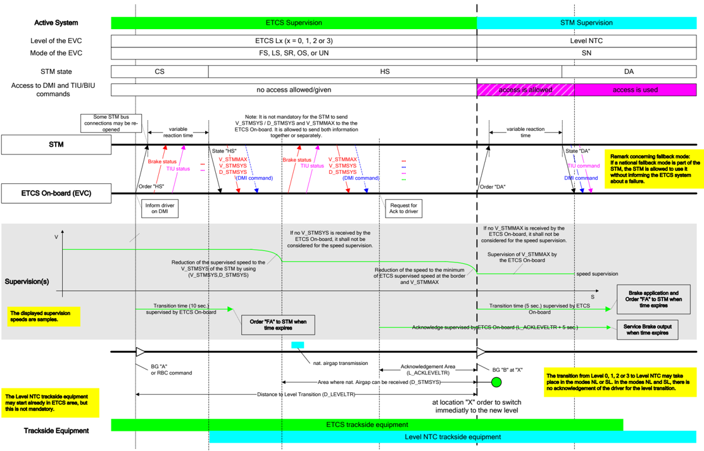

---
<!-- pagina 89 -->

# 17.2 ETCS  NTC (Trip Mode) [¶799]

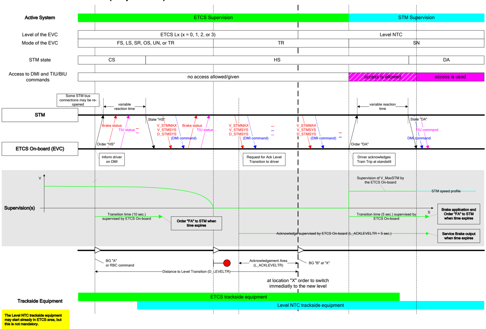

---
<!-- pagina 90 -->

# 17.3 ETCS  NTC (NL/SL) [¶800]

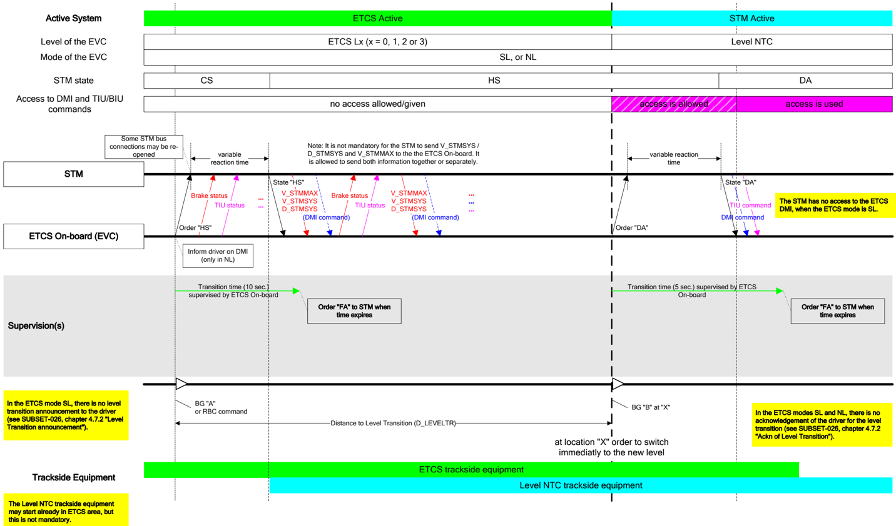

---
<!-- pagina 91 -->

# 17.4 NTC  ETCS [¶801]

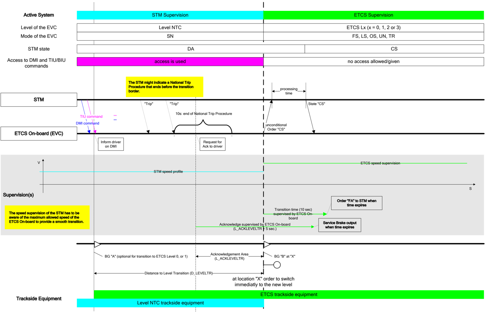

---
<!-- pagina 92 -->

# 17.5 NTC  ETCS (National Trip Procedure) [¶802]

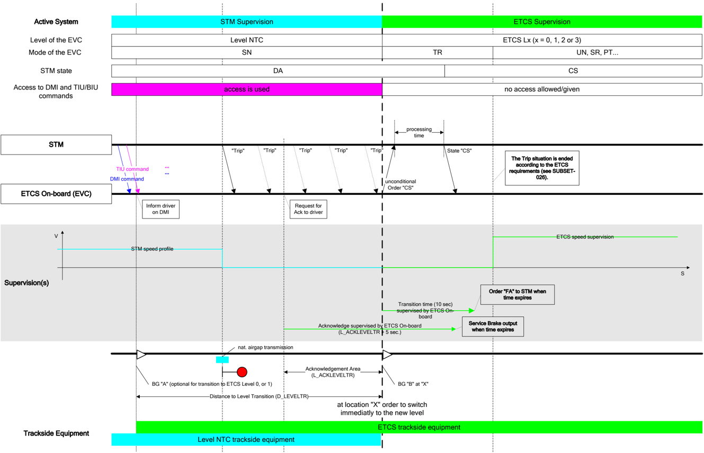

---
<!-- pagina 93 -->

# 17.6 NTC  ETCS (NL/SL) [¶803]

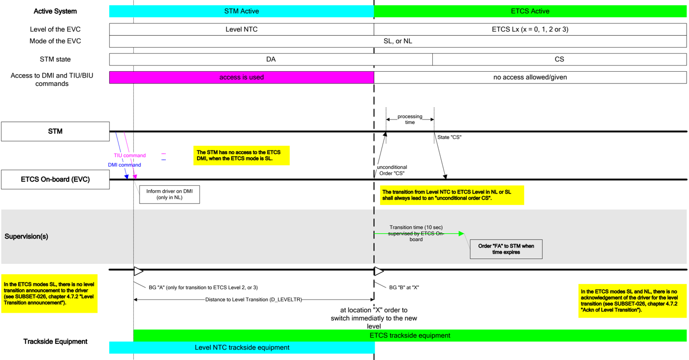

© This document has been developed and released by UNISIG [¶804]

---
<!-- pagina 94 -->

# 17.7 NTC X  NTC Y [¶805]

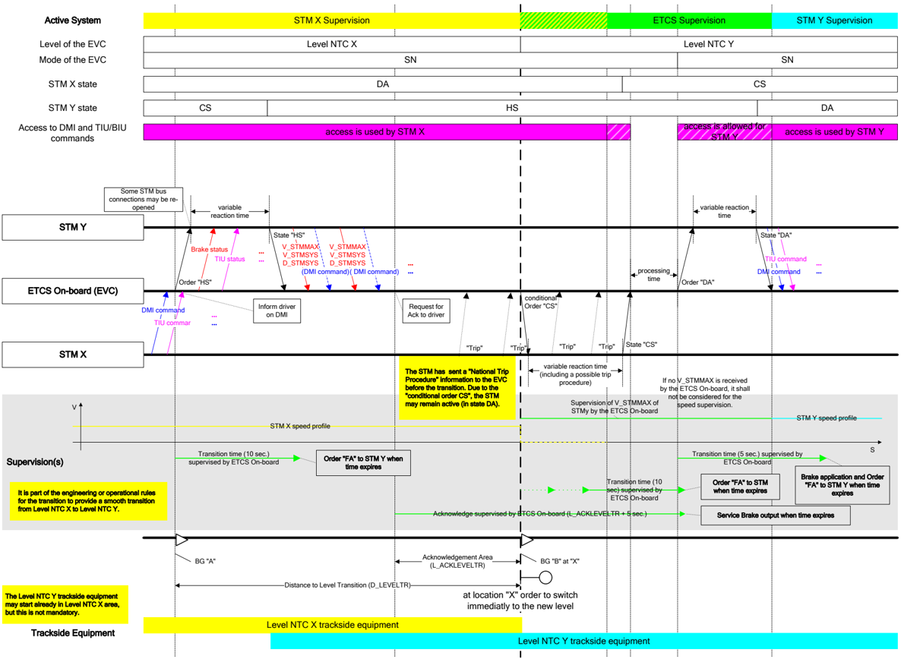

© This document has been developed and released by UNISIG [¶806]

---
<!-- pagina 95 -->

# 17.8 NTC X  NTC Y (NL/SL) [¶807]

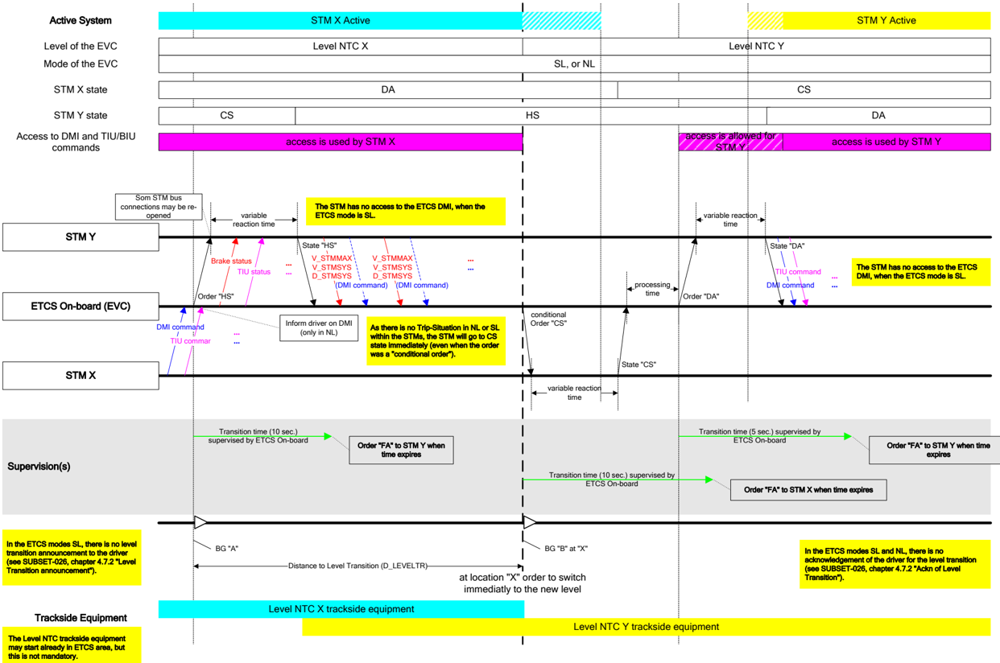

---
<!-- pagina 96 -->

# 17.9 Power On in Level NTC (SoM) [¶808]

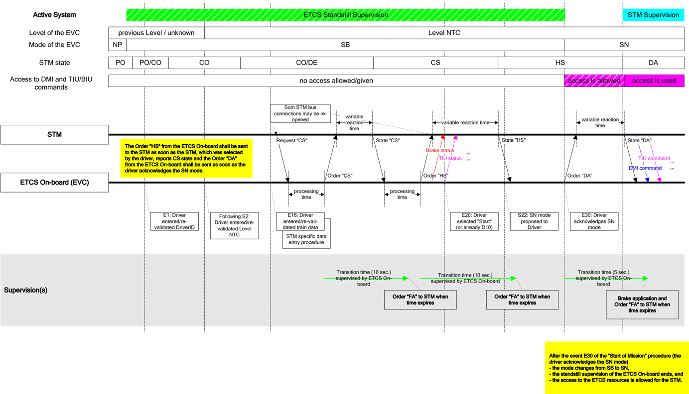

---
<!-- pagina 97 -->

# 17.10 Power On in Level NTC (NL) [¶809]

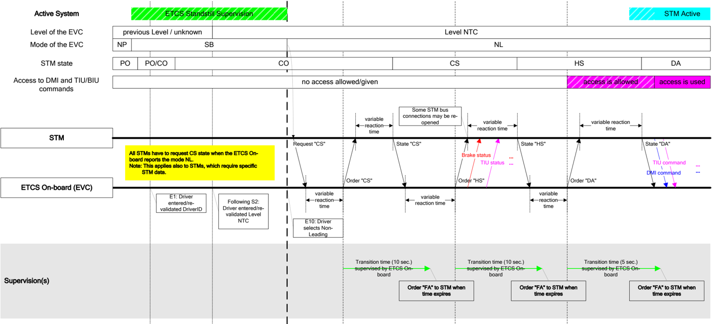

---
<!-- pagina 98 -->

# 17.11 Power On in Level NTC (SL) [¶810]

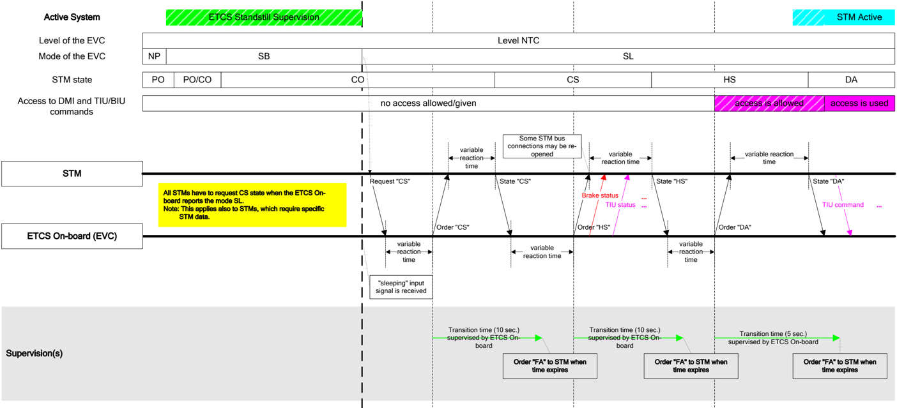

---
<!-- pagina 99 -->

# 18. ANNEX B : TRAIN DATA ENTRY PROCEDURE (INFORMATIVE) [¶811]

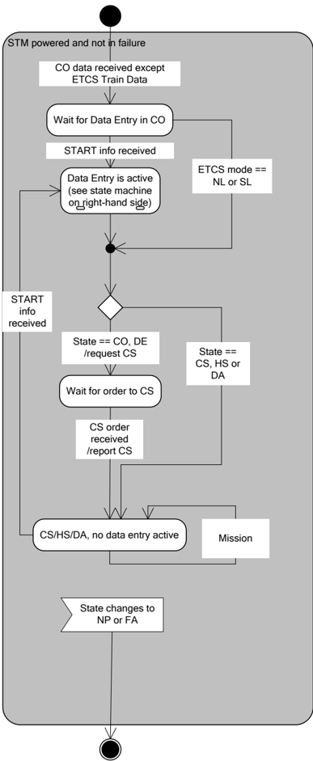

Figure 12 - Train Data Entry procedure [¶812]

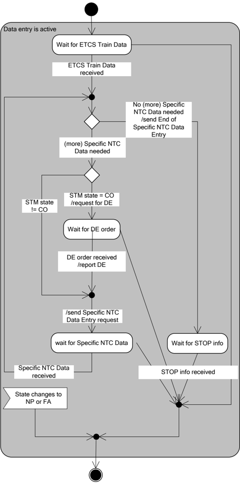

© This document has been developed and released by UNISIG [¶813]
