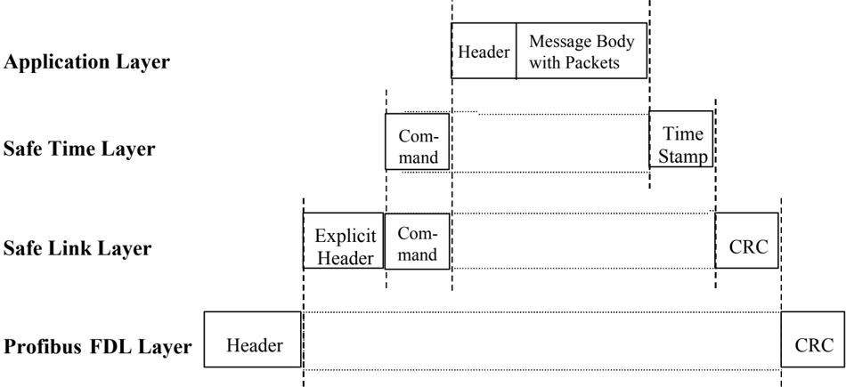
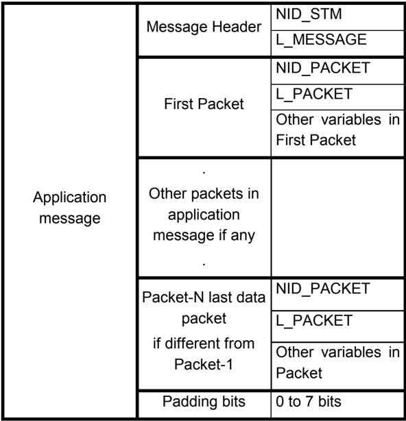

---
<!-- pagina 1 -->

# ERTMS/ETCS [¶0]

# FFFIS STM Application Layer [¶1]

REF : [¶2]

SUBSET-058 [¶3]

ISSUE : [¶4]

3.2.0 [¶5]

DATE  : [¶6]

2015-12-16 [¶7]

[¶8]
| Company    | Technical Approval   | Management approval   |
|------------|----------------------|-----------------------|
| ALSTOM     |                      |                       |
| ANSALDO    |                      |                       |
| AZD        |                      |                       |
| BOMBARDIER |                      |                       |
| CAF        |                      |                       |
| SIEMENS    |                      |                       |
| THALES     |                      |                       |

---
<!-- pagina 2 -->

# 1. MODIFICATION HISTORY [¶9]

[¶10]
| Issue Number Date   | Section Number                                                                          | Modification / Description                                                                                                                                                                                                                                                                    | Author              |
|---------------------|-----------------------------------------------------------------------------------------|-----------------------------------------------------------------------------------------------------------------------------------------------------------------------------------------------------------------------------------------------------------------------------------------------|---------------------|
| 0.0.4 19-04-00      | Most sections                                                                           | Modified according to review comments circulated before and found during UNISIG STM meeting 000417-000418 in Brussels.                                                                                                                                                                        | J. Näsström         |
| 0.0.5 10-05-00      | Most sections                                                                           | All variables moved to new chapter 23. Modified taking into account 'Cenelec review of Application Layer 004' 19-04-00, Invensys review comments per 04-05- 2000, Alcatel comments and Alstom comment reply. Alstom 'Review and comment on Application Layer' 25-04-2000 has been integrated. | J. Näsström         |
| 0.0.6 30-05-00      | General General Picture 6.1.1.3 17.1.1.1 4.2.1.2 19.1 17.4.4 17.6.5 & 23.1.1.144 22.2.1 | Editorial corrections Empty lines in packets Deleted. Editorial Updated Legend of drawings Clarified JRU introduction Configuration clarified Added variable for Availability of Additional TI. NID_STM added                                                                                 | J. Näsström         |
| 2.0.0 31-05-00      |                                                                                         | Final version.                                                                                                                                                                                                                                                                                | J. Näsström         |
| 2.0.1 17-12-02      |                                                                                         | Modified during the STM Meeting in Brussels- 17.12.02                                                                                                                                                                                                                                         | R. Ramos (Invensys) |
| 2.0.2 14-01-03      |                                                                                         | Modified during the STM Meeting in Paris                                                                                                                                                                                                                                                      | R. Ramos (Invensys) |

© This document has been developed and released by UNISIG [¶11]

---
<!-- pagina 3 -->

[¶12]
| Issue Number Date   | Section Number   | Modification / Description                                                                                                                                                                                                                                                                                                            | Author                 |
|---------------------|------------------|---------------------------------------------------------------------------------------------------------------------------------------------------------------------------------------------------------------------------------------------------------------------------------------------------------------------------------------|------------------------|
| 2.0.3 26/01/03      |                  | Modification according to agreed comments                                                                                                                                                                                                                                                                                             | M. Deladrière (Alstom) |
| 2.0.4 2003-01-30    |                  | Modified during the Meeting of the STM Workgroup in Brussels.                                                                                                                                                                                                                                                                         | R. Ramos (Invensys)    |
| 2.0.5 2003-03-13    |                  | Modified during the Meeting of the STM Workgroup in Brussels.                                                                                                                                                                                                                                                                         | P. Lührs (Siemens)     |
| 2.0.6 2003-03-26    |                  | JRU requirements moved to SUBSET-035. Modified during the Meeting of the STM Workgroup in Braunschweig.                                                                                                                                                                                                                               | P. Lührs (Siemens)     |
| 2.0.7 2003-04-15    | All              | Override packets from STM to STM control function and from STM control function to STM added to the specification according to comment INV058- 30. Suppress T_INTERVENT & N_EOAOVERPASS according to Als058-39/40 D_NOMODO_LRBG variable added according to comment SIE058-035. Packet STM-37 deleted according to comment SIE058-045 | M. Deladrière (Alstom) |
| 2.0.8 27/05/2003    | All              | Up-date according to new Subset-035 and comments proposals.                                                                                                                                                                                                                                                                           | M. Deladrière (Alstom) |
| 2.0.9 25/06/2003    | All              | Traceability and consistency to Subset-035 A-27 has been performed. Taking into accounts Invensys comments to the previous issue.                                                                                                                                                                                                     | M. Deladrière (Alstom) |
| 2.0.10 25/06/2003   | All              | Modification performed during WGmeeting in Stockholm: Added STM provider within the packet for DRU                                                                                                                                                                                                                                    | M. Deladrière (Alstom) |

© This document has been developed and released by UNISIG [¶13]

---
<!-- pagina 4 -->

[¶14]
| Issue Number Date   | Section Number   | Modification / Description                                                                                                                                       | Author                 |
|---------------------|------------------|------------------------------------------------------------------------------------------------------------------------------------------------------------------|------------------------|
| 2.0.11 25/07/2003   | All              | Modification performed during WGmeeting in Brussels                                                                                                              | M. Deladrière (Alstom) |
| 2.0.12 12-08-03     | All              | Modification according to review process and review sheet UNISIG_ALL_COM_WP_STM_S UBSET058_V2011_v001.doc                                                        | M. Deladrière (Alstom) |
| 2.0.13              | All              | Modification according to review process and review sheet UNISIG_ALL_COM_WP_STM_S UBSET058_V2012_ v001.doc                                                       | M. Deladrière (Alstom) |
| 2.0.14              | All              | Modification done during the meeting in Stuttgart on the 7- 8/10/2003                                                                                            | M. Deladrière (Alstom) |
| 2.0.15              | All              | Modification done after the meeting in Stuttgart on the 7- 8/10/2003 and agreed during the meeting according to UNISIG_ALL_COM_WP_STM_S UBSET058_V2012_ v002.doc | M. Deladrière (Alstom) |
| 2.0.16              | All              | Modification done at the meeting in Madrid on the 22-23/10/2003 and agreed during the meeting according to UNISIG_ALL_COM_WP_STM _SUBSET058_V2015_ v002.doc      | M. Deladrière (Alstom) |
| 2.1.0               | All              | Modification according to comment sheet UNISIG_ALL_COM_WP_STM_S UBSET058_V2016_v001.doc                                                                          | M. Deladrière (Alstom) |

---
<!-- pagina 5 -->

[¶15]
| Issue Number Date   | Section Number                                                                   | Modification / Description                                 | Author                 |
|---------------------|----------------------------------------------------------------------------------|------------------------------------------------------------|------------------------|
| 2.1.1               | 7.2.3 7.2.16 8.1.36 8.1.44 8.1.48 8.1.68 8.1.109 8.1.152 8.1.153 8.1.158 8.1.159 | Modification according to EEIG comments on the issue 2.1.0 | M. Deladrière (Alstom) |

---
<!-- pagina 6 -->

[¶16]
| Issue Number Date   | Section Number                                                                                                                                                                                                                   | Modification / Description                                                                                                                                                                                                                                                               | Author                  |
|---------------------|----------------------------------------------------------------------------------------------------------------------------------------------------------------------------------------------------------------------------------|------------------------------------------------------------------------------------------------------------------------------------------------------------------------------------------------------------------------------------------------------------------------------------------|-------------------------|
| 2.2.0               | 5.2.1.2 7.2.17 7.8.2 ,7.8.3 , 8.1.14 , 8.1.16 8.1.19 8.1.17 , 8.1.27 , 8.1.50 7.1.1 7.2.16 8.1.3 8.1.102 , 8.1.104 , 8.1.105 7.1.1 , 8.1.68, 8.1.69 NID_DRIVER, 7.2.14 7.2.16 , 7.2.17 7.9.1. 8.1.112 , 8.1.113 , 8.1.110 7.2.21 | Compatibility version WG-10: § updated WG-4, § updated WG-7 § updated. WG-8: § updated. WG-12: Note added WG-13: § updated. WG-15 : § updated. WG-16: § updated. WG-20 : § updated. WG-5 : § updated. WG-22 : § updated. WG-21: § updated and added WG-11 : § updated. WG-23 : § updated | A. Schoevaerts (Alstom) |

---
<!-- pagina 7 -->

[¶17]
| Issue Number Date   | Section Number                                                                                                  | Modification / Description                                                                                                                                                                                                                            | Author                    |
|---------------------|-----------------------------------------------------------------------------------------------------------------|-------------------------------------------------------------------------------------------------------------------------------------------------------------------------------------------------------------------------------------------------------|---------------------------|
| 2.2.0               | 8.1.14, 8.1.16, 7.8.2, 7.8.3 7.3.1 8 7.7.1, 7.7.4, 8.1.33, 8.1.34 8.1.32, 8.1.35 7.5.10, 8.1.72, 8.1.80 7.3.2 8 | WG-27: Requirements updated. WG-29: Requirement updated, the associated variables deleted. WG-28, Requirements updated, New requirements. WG-24, Requirements updated, new requirement. WG-31: Requirement updated, the associated variables deleted. | A. Fanea (Ansaldo Signal) |
| 2.2.0.              | 7.2                                                                                                             | WG-32 packet STM-45 deleted.                                                                                                                                                                                                                          | A. Schoevaerts (Alstom)   |
| 2.2.0.              | 1                                                                                                               | Change manual to automatic references.                                                                                                                                                                                                                | A. Schoevaerts (Alstom)   |
| 2.2.0               | 6.1.4.11.1                                                                                                      | WG-32 packet STM-45 deleted.                                                                                                                                                                                                                          | P. Lührs (Siemens)        |

---
<!-- pagina 8 -->

[¶18]
| Issue Number Date   | Section Number                                                                                                                                                        | Modification / Description                                                                                                                                                                                                                                                                                                                                                                                                                                                                                                                           | Author         |
|---------------------|-----------------------------------------------------------------------------------------------------------------------------------------------------------------------|------------------------------------------------------------------------------------------------------------------------------------------------------------------------------------------------------------------------------------------------------------------------------------------------------------------------------------------------------------------------------------------------------------------------------------------------------------------------------------------------------------------------------------------------------|----------------|
| 2.2.0               | 7.9.1 1.1.1 7.4 7.5.8 8.1.84 7.2.2 7.2.14 M_BRAKE_POSITI ON, 8.1.17, 7.2.13 8.1.8 7.2.12, 8.1.49 7.2.5, 7.2.15, 8.1.100 7.2.15 M_ADHESION 7.2.22, 8.1.2 7.2.10 7.2.14 | WG-38 packet STM-161 updated WG-45 variable M_MODE updated, new modes PS, LS added mode SE deleted, variables connected to mode SE deleted, STM-42 deleted Variable NID_STMTYPE updated STM-4 updated WG-5 NID_DRIVER updated WG-35 brake percentage and position added WG-39 variable updated WG-40 STM-175 updated, variables updated and added WG-43 Override EOA -> Override WG-44 STM-178 updated, new variables added and updated WG-47 variable updated WG-48 STM-45 brought back and updated WG-49 STM-18 name updated WG-50 STM-177 updated | J. Sukup (AZD) |

---
<!-- pagina 9 -->

[¶19]
| Issue Number Date   | Section Number                                                                                                                                                                                                                                                                                                                                             | Modification / Description                                                                                                                                                                                                                                                                                                                                                                                                                                                                                                                             | Author        |
|---------------------|------------------------------------------------------------------------------------------------------------------------------------------------------------------------------------------------------------------------------------------------------------------------------------------------------------------------------------------------------------|--------------------------------------------------------------------------------------------------------------------------------------------------------------------------------------------------------------------------------------------------------------------------------------------------------------------------------------------------------------------------------------------------------------------------------------------------------------------------------------------------------------------------------------------------------|---------------|
| 2.2.0               | 8.1.115, 7.5.9 8.1.111, 7.5.9 7.2.13 7.2.13 7.9.1 8.1.102 6.1.4.13.1 8.1.49, 8.1.97 5.2.1.2 7.2.15, 7.5.9, 8.1.17, 7.2.1, 7.2.3, 8.1.112, 8.1.113, 8.1.110, 8.1.117, 8.1.61 7.2.21 NID_DRIVER 8.1.102, 8.1.104, 8.1.105 6.1.12.1 7.2.1, 8.1.63, 8.1.94 7.2.13 figure 3 A_EB_CHAR, A_SB_CHAR, V_EB_CHAR, V_SB_CHAR, 7.2.13 NID_OPERATIONA L 7.2.15 6.1.4.15 | WG-51 variable and STM-43 updated WG-52 variable and STM-43 updated WG-53 STM-176 name updated WG-56 STM-176 and variable updated WG-57 STM-161 updated WG-54 Q_INDICATE updated WG-36 requirement added WG-59 variables updated WG-60 final version TBD WG-62 editorial changes WG-63 STM-184 updated WG-64 variable updated WG-65 variables updated WG-66 note deleted WG-67 STM-2 and variables updated WG-68 Figure 3 updated WG-69 variables and STM-176 updated WG-70 variable updated WG-71 variables and STM-178 updated WG-72 chapter updated | J.Sukup (AZD) |
| 2.2.0               | 7                                                                                                                                                                                                                                                                                                                                                          | WG-30 references in packets updated, relevant states added                                                                                                                                                                                                                                                                                                                                                                                                                                                                                             | J.Sukup (AZD) |

© This document has been developed and released by UNISIG [¶20]

---
<!-- pagina 10 -->

[¶21]
| Issue Number Date   | Section Number                                                                                                                                                                  | Modification / Description                                                                                                                                                                                                                                                                              | Author        |
|---------------------|---------------------------------------------------------------------------------------------------------------------------------------------------------------------------------|---------------------------------------------------------------------------------------------------------------------------------------------------------------------------------------------------------------------------------------------------------------------------------------------------------|---------------|
| 2.2.0               | 8.1.1, 8.1.2, 8.1.3, 8.1.4 T_YEAR First page 8.1.10 7.2.15 6.1.4.6, 6.1.4.7, 7.2.3, 7.2.17, 7.2.18, 7.2.20, 7.5.2, 7.5.3, 7.5.4, 7.5.10, 8.1.9, 8.1.64, 8.1.68, 8.1.69, 8.1.72, | WG-73 variables updated WG-74 variable updated WG-75 first page updated WG-76 variable updated WG-61 note to STM-178 added WG-78 CR802 Level STM -> Level NTC, NID_STM - >NID_NTC, STM national -> National system                                                                                      | J.Sukup (AZD) |
| 2.2.0 2010-12-17    | 7.2.12 V_NVALLOWOVTR P 7.9.1, 8                                                                                                                                                 | WG-79 variable updated (CR953) WG-80 variable updated WG-77 STM-161 updated, variables NID_JRUMESSAGE, L_JRUMESSAGE, NID_LRBG, D_LRBG, Q_DIRLRBG, Q_DLRBG, L_DOUBTOVER, L_DOUBTUNDER, V_TRAIN deleted                                                                                                   | J.Sukup (AZD) |
| 2.9.1               | 7, 8 7.2.15 7.2.12                                                                                                                                                              | ERA comment #1 on v2.2.0: Description of variables that may be referenced to SRS were deleted. They are now referenced in packet description. CR927, CR1003 impact considered: update of National Value packet CR 731 impact considered: Variable M_TRACTION is replaced with M_VOLTAGE & NID_CTRACTION | J.Sukup (AZD) |

---
<!-- pagina 11 -->

[¶22]
| Issue Number Date   | Section Number                                                                                                                                                                                                | Modification / Description                                                                                                                                                                                                                                                       | Author        |
|---------------------|---------------------------------------------------------------------------------------------------------------------------------------------------------------------------------------------------------------|----------------------------------------------------------------------------------------------------------------------------------------------------------------------------------------------------------------------------------------------------------------------------------|---------------|
|                     | 7.2.13, 8.1.101, 8.1.102                                                                                                                                                                                      | WG-89 A_MAX is removed and the brake delays are transmitted as T_EQUIVALENT_EB_EF & T_EQUIVALENT_SB_EF (covers ERA comment #22)                                                                                                                                                  |               |
|                     | 7.3.2, 8                                                                                                                                                                                                      | WG-90 variables Q_NOM_ODO, Q_SAFE_DIR removed (covers ERA comment #29)                                                                                                                                                                                                           |               |
|                     | 7.2.22, 8.1.2                                                                                                                                                                                                 | CR904: STM-45 updated, D_NOMODO_BG updated                                                                                                                                                                                                                                       |               |
|                     | 6.1.4.16, 7.2.1, 7.2.2, 8.1.71                                                                                                                                                                                | CR 1042: STM-2 updated, STM-4 deleted, NID_PACKET updated                                                                                                                                                                                                                        |               |
| 2.9.1               | 5, 7.1.1, 8.1.51, 8.1.52                                                                                                                                                                                      | CR 1043: chapter 5 deleted, STM-1 updated, relevant variables deleted/updated, paragraph under history about compatibility deleted                                                                                                                                               | J.Sukup (AZD) |
|                     | 7.2.23, 7.2.24, 7.2.25, 8.1.29, 8.1.77                                                                                                                                                                        | CR 1045: new packets STM-21, STM-22, STM-23 added, new variables NID_TEST, M_TESTOK added                                                                                                                                                                                        |               |
|                     | 7.2.1, 7.2.27, 7.6, 8.1.66, 8.1.54, 8.1.55, 8.1.56, 8.1.57, 8.1.58, 8.1.81, 8.1.82, 8.1.83, 8.1.84, 8.1.85, 8 7.2.16, 7.2.17, 7.2.18, 7.2.19, 7.2.20, 7.2.21, 8.1.92, 8.1.99, 8.1.25, 8.1.65, 8.1.12, 8.1.121 | CR 1073: packet STM-2 updated, new packet STM-31, packet STM- 77 deleted, new variable NID_DMICHANNEL, variables updated (DMI, JD), unused variables (DRU, EUROSUP, CLOCK) deleted CR 1074: packets STM-181, 179, 180, 182, 183, 184 updated and corresponding variables updated |               |

---
<!-- pagina 12 -->

[¶23]
| Issue Number Date   | Section Number                                                                                                                                                                                                                                                                                                                                                                                                                                               | Modification / Description                                                                                                                                                                                                                                                                                                                                                                                                                                                                                                                                                                                                                                                                                                                    | Author   |
|---------------------|--------------------------------------------------------------------------------------------------------------------------------------------------------------------------------------------------------------------------------------------------------------------------------------------------------------------------------------------------------------------------------------------------------------------------------------------------------------|-----------------------------------------------------------------------------------------------------------------------------------------------------------------------------------------------------------------------------------------------------------------------------------------------------------------------------------------------------------------------------------------------------------------------------------------------------------------------------------------------------------------------------------------------------------------------------------------------------------------------------------------------------------------------------------------------------------------------------------------------|----------|
|                     | 6.1.3.12, 6.1.3.13, 6.1.3.15 7.5.2, 7.5.3, 7.5.4, 7.5.5, 7.5.6, 7.5.7, 7.5.9, 7.5.10, 8, 8.1.7, 8.1.8, 8.1.11, 8.1.18, 8.1.26, 8.1.27, 8.1.50, 8.1.63, 8.1.64, 8.1.68, 8.1.69, 8.1.70, 8.1.72, 8.1.78, 8.1.101, 8.1.109, 8.1.111, 8.1.114, 8.1.115, 8.1.118, 8.1.119, 8.1.120, 8.1.19, 8.1.20, 8.1.21, 8.1.22, 8.1.23, 8.1.94, 8.1.95, 8.1.96, 8.1.97, 8.1.98 8.1.73 4.1 6.1.1.2.1 6.1.2.3, 6.1.2.4, 6.1.2.12.x 6.1.4.11.4, 6.1.4.11.5 6.1.4.11.7 6.1.4.11.6 | CR1066: Text transmitted in 1 or 2 bytes STM-32, 34, 35, 38, 39, 40, 43, 46 updated, M_SUP, Q_INDICATE, Q_INDICATIONLIMIT, Q_WARNINGLIMIT deleted, D_TARGET, L_CAPTION, L_TEXT, M_BUT_ATTRIB, M_FREQ, M_IND_ATTRIB, M_XATTRIBUTE, NID_BUTPOS, NID_BUTTON, NID_ICON, NID_INDICATOR, NID_INDPOS, NID_SOUND, NID_XMESSAGE, Q_SOUND, T_SOUND, V_INTERV, V_PERMIT, V_RELEASE, V_TARGET, X_CAPTION, X_TEXT updated, new variables M_COLOUR_SP/PS/TS/RS/IS, Q_DISPLAY_IS/PS/TS/RS/TD CR 1044: NID_STM updated Table of references and all references updated ERA comment #2 on v2.2.0: Paragraphs deleted (obsolete) Paragraphs deleted (obsolete) Exceptions deleted (obsolete) ERA comment #4 on v2.2.0: Note deleted Exception updated (JRU  JD) |          |

© This document has been developed and released by UNISIG [¶24]

---
<!-- pagina 13 -->

[¶25]
| Issue Number Date   | Section Number                           | Modification / Description                                                                                                                                                                                                                                     | Author   |
|---------------------|------------------------------------------|----------------------------------------------------------------------------------------------------------------------------------------------------------------------------------------------------------------------------------------------------------------|----------|
|                     | 6.1.4.13                                 | ERA comment #6 on v2.2.0: Wording improved                                                                                                                                                                                                                     |          |
| 2.9.1 2012-01-21    | 6.1.4.14, 6.1.4.16 6.1.4.6, 6.1.4.8      | Wording improved ERA comment #3 on v2.2.0: References to Subset-035 deleted (obsolete) ERA comment #14 on v2.2.0: N_L_ITER  N_LITER ERA comment #20/28 on Passenger EB deleted ERA comment #21 on v2.2.0: Term "Boolean" deleted wrong New variable M_MODESTM |          |
| 2.9.1 2012-01-21    | 6.1.3.9, 6.1.3.10, 7.2.22, 7.9.1, 8.1.61 |                                                                                                                                                                                                                                                                |          |
| 2.9.1 2012-01-21    | 7.7.1, 7.7.4, 8                          | v2.2.0:                                                                                                                                                                                                                                                        |          |
| 2.9.1 2012-01-21    | 8                                        | wherever                                                                                                                                                                                                                                                       |          |
| 2.9.1 2012-01-21    | 7.2.3, 1.1.1                             | and STM-5 updated, because M_MODE of SRS does not contain PS mode                                                                                                                                                                                              |          |
| 2.9.1 2012-01-21    | 7.2.11                                   | Packet STM-19 deleted (CR1045 additional impact)                                                                                                                                                                                                               |          |
| 2.9.1 2012-01-21    | 7.5.1, 7.2.26                            | Packet STM-30 moved from DMI function to STM Control Function (CR1073 additional impact)                                                                                                                                                                       |          |
| 2.9.1 2012-01-21    | 7.2.14, 8                                | Packet STM-177 updated: NID_DRIVER removed                                                                                                                                                                                                                     |          |
| 2.9.1 2012-01-21    | 8                                        | Variables A_EB_CHAR, A_SB_CHAR, V_EB_CHAR, V_SB_CHAR deleted                                                                                                                                                                                                   |          |
| 2.9.1 2012-01-21    | 8.1.14, 8.1.16                           | Variables M_BIEB_STATUS & M_BISB_STATUS updated as availability status                                                                                                                                                                                         |          |
| 2.9.1 2012-01-21    | 7                                        | Unified text in packet description (Direction of information) References to SS035 in all packets updated                                                                                                                                                       |          |
| 2.9.1 2012-01-21    | 8.1.15                                   | Variable M_BISB_CMD updated (value 00)                                                                                                                                                                                                                         |          |

© This document has been developed and released by UNISIG [¶26]

---
<!-- pagina 14 -->

[¶27]
| Issue Number Date   | Section Number                                                                                                                        | Modification / Description                                                                                                                                                                                                                                                                                                                                                                                                                                                                                                                                                                                                                                                                                       | Author                           |
|---------------------|---------------------------------------------------------------------------------------------------------------------------------------|------------------------------------------------------------------------------------------------------------------------------------------------------------------------------------------------------------------------------------------------------------------------------------------------------------------------------------------------------------------------------------------------------------------------------------------------------------------------------------------------------------------------------------------------------------------------------------------------------------------------------------------------------------------------------------------------------------------|----------------------------------|
|                     | 7.2.17                                                                                                                                | "Maximum value = 16 if the maximum length has been used for all caption texts." removed: no added value                                                                                                                                                                                                                                                                                                                                                                                                                                                                                                                                                                                                          |                                  |
| 2.9.2 2012-02-18    | Front Page 7.7.3, 8.1.48, 8.1.30 7.8.2 [10] 6.1.4.12 7.1.2, 8.1.74 7.2.12 7.2.13, 8, 8.1.17 7.2.22, 8.1.2 7.3.1 7.3.2, 8.1.1, 8.1.110 | ERA/SG comment #1 on v2.9.1 ERA comment #2 on v2.9.1: Definition of packet 139, variables M_TITR_STATUS & M_TICAB_STATUS updated ERA comment #3 on v2.9.1: brake command status -> brake status ERA comment #4 on v2.9.1: Formal change of referenced document ERA comment #5 on v2.9.1: requirement deleted ERA comment #6 on v2.9.1: description updated ERA comment #7 on v2.9.1: variable name updated ERA comment #8 on v2.9.1: variables refer to SS027, variables deleted, M_BRAKE_PERCENTAGE renamed to M_BRAKE_PERCENTAGE_STM ERA comment #9 on v2.9.1: DNOMODO_BG => D_ESTODO_BG, comment updated ERA comment #10 on v2.9.1: Description updated ERA comment #11 on v2.9.1: D_NOM replaced with D_EST, | T.Mandry (Alstom), J.Sukup (AZD) |

© This document has been developed and released by UNISIG [¶28]

---
<!-- pagina 15 -->

[¶29]
| Issue Number Date   | Section Number                 | Modification / Description                                                                                                                                                                                                                                                                                                                                                                                                                                                                                                                                                                                                                                              | Author   |
|---------------------|--------------------------------|-------------------------------------------------------------------------------------------------------------------------------------------------------------------------------------------------------------------------------------------------------------------------------------------------------------------------------------------------------------------------------------------------------------------------------------------------------------------------------------------------------------------------------------------------------------------------------------------------------------------------------------------------------------------------|----------|
|                     | 7.8.3                          | ERA comment #12 on v2.9.1: M_BIEB_STATUS and M_BISB_STATUS removed T_SBMAXDELAY updated Last sentence in description deleted ERA comment #13 on v2.9.1: variables updated ERA comment #14 on v2.9.1: variable renamed and updated ERA comment #15 on v2.9.1: variable renamed and updated SG comment #2 on v2.9.1: Subchapters where part of intentionally deleted part SG comment #3 on v2.9.1: editorial SG comment #6 on v2.9.1: X_CAPTION(k)-> X_CAPTION(k,j) SG comments #7/#8 on v2.9.1: variables description added/updated CR1049: STM-20 added, variables Q_CHECKNEEDED, Q_ANTN_BTM_ACTIVE, NID_ANTENNA_BTM added CR1126: STM-47 added, variables Q_BTM_ALARM, |          |
|                     | 8.1.108 7.8.3                  |                                                                                                                                                                                                                                                                                                                                                                                                                                                                                                                                                                                                                                                                         |          |
|                     | 8.1.3, 8.1.4                   |                                                                                                                                                                                                                                                                                                                                                                                                                                                                                                                                                                                                                                                                         |          |
|                     | 8.1.1                          |                                                                                                                                                                                                                                                                                                                                                                                                                                                                                                                                                                                                                                                                         |          |
|                     | 8.1.2                          |                                                                                                                                                                                                                                                                                                                                                                                                                                                                                                                                                                                                                                                                         |          |
|                     | 6.1.2.12                       |                                                                                                                                                                                                                                                                                                                                                                                                                                                                                                                                                                                                                                                                         |          |
|                     | 6.1.4.13                       |                                                                                                                                                                                                                                                                                                                                                                                                                                                                                                                                                                                                                                                                         |          |
|                     | 7.5.2                          |                                                                                                                                                                                                                                                                                                                                                                                                                                                                                                                                                                                                                                                                         |          |
|                     | 8.1.18, 8.1.27, 8.1.50         |                                                                                                                                                                                                                                                                                                                                                                                                                                                                                                                                                                                                                                                                         |          |
|                     | 7.2.28, 8.1.92, 8.1.88, 8.1.62 |                                                                                                                                                                                                                                                                                                                                                                                                                                                                                                                                                                                                                                                                         |          |
|                     | 7.2.29, 8.1.90, 8.1.89         | Q_BMM_ANNOUNCED added                                                                                                                                                                                                                                                                                                                                                                                                                                                                                                                                                                                                                                                   |          |
|                     | All                            | Reference documents are referenced with numbers only.                                                                                                                                                                                                                                                                                                                                                                                                                                                                                                                                                                                                                   |          |
|                     | 4.1                            | Reference to Subsets 027 and 034 added, title of Subset-059 corrected                                                                                                                                                                                                                                                                                                                                                                                                                                                                                                                                                                                                   |          |

© This document has been developed and released by UNISIG [¶30]

---
<!-- pagina 16 -->

[¶31]
| Issue Number Date   | Section Number                                                                                           | Modification / Description                                                                                                                                                                                                                                                                                                                                                                                                        | Author                 |
|---------------------|----------------------------------------------------------------------------------------------------------|-----------------------------------------------------------------------------------------------------------------------------------------------------------------------------------------------------------------------------------------------------------------------------------------------------------------------------------------------------------------------------------------------------------------------------------|------------------------|
|                     | All All 7.2.1, 7.7, 7.8, 8.1.53, 8.1.60, 8.1.103, 8.1.108 7.2.14, 8 7.2.26 7.2.27 7.8.3 8.1.103, 8.1.108 | Consolidation of Capital letters in the names of functions Minor editorial corrections "Train Interface" replaced by "TIU" ; "Brake Interface" replaced by "BIU" Variables for Date & Time defined by reference to SS027, variables deleted "DE & CS" state added as allowed for sending "All states" replaced by "PO, CO, DE, CS, HS, DA" Packet STM-143 renamed Resolution changed (was too high compared to SS059 requirement) |                        |
| 2.9.3 2012-02-29    | 7.2.22, 7.9.1                                                                                            | Add "Maximum value = 228" in comment to N_LITER (limitation resulting from lower layers)                                                                                                                                                                                                                                                                                                                                          | Thomas Mandry (Alstom) |
| 2.9.4 2012-03-02    | 7.2.22                                                                                                   | Change to "Maximum value = 222" in comment to N_LITER (limitation resulting from lower layers for a SIL4 STM, limitation used in Subset-040)                                                                                                                                                                                                                                                                                      | Thomas Mandry (Alstom) |
| 3.0.0 2012-03-02    | No change                                                                                                | Baseline 3 release version                                                                                                                                                                                                                                                                                                                                                                                                        | Thomas Mandry (Alstom) |
| 3.0.1 2013-10-31    | 7.2.14, 8.1.70.1 6.1.3.18, 7.2.22                                                                        | Update according to CR1173 #4 Update according to CR1173 #6                                                                                                                                                                                                                                                                                                                                                                       | J. Sukup (AZD)         |
| 3.0.2 2014-03-04    | 7.5.2, 8.1.63, 8.1.70                                                                                    | Update according to CR1173 #8                                                                                                                                                                                                                                                                                                                                                                                                     | J. Sukup (AZD)         |
| 3.0.3 2014-04-24    | 6.1.3.18 8.1.70.1 Front page                                                                             | Requirement wording update Numbering correction Baseline 3 1 st Maintenance pre- release version                                                                                                                                                                                                                                                                                                                                  | Thomas Mandry (Alstom) |
| 3.1.0 2014-05-09    | -                                                                                                        | Baseline 3 1 st Maintenance release version                                                                                                                                                                                                                                                                                                                                                                                       | Philippe Prieels       |

© This document has been developed and released by UNISIG [¶32]

---
<!-- pagina 17 -->

[¶33]
| Issue Number Date   | Section Number                                                                                                                | Modification / Description      | Author                 |
|---------------------|-------------------------------------------------------------------------------------------------------------------------------|---------------------------------|------------------------|
| 3.1.1 2015-11-12    | 7.1.1, 7.1.2, 7.2.7, 7.2.10, 7.2.16, 7.2.17, 7.2.19, 7.2.22, 7.2.25, 7.2.27, 7.5.2, 7.5.4, 7.5.5, 7.8.1, 7.8.2, 7.8.3, 8.1.57 | CR1242                          | J. Sukup (AZD)         |
| 3.2.0 2015-12-16    | -                                                                                                                             | Baseline 3 2 nd release version | Thomas Mandry (Alstom) |

---
<!-- pagina 18 -->

# 2. TABLE OF CONTENTS [¶34]

| 1. MODIFICATION HISTORY................................................................................................................2          | 1. MODIFICATION HISTORY................................................................................................................2                                                                                                                                                                      |                                                                                    |
|---------------------------------------------------------------------------------------------------------------------------------------------------|---------------------------------------------------------------------------------------------------------------------------------------------------------------------------------------------------------------------------------------------------------------------------------------------------------------|------------------------------------------------------------------------------------|
| 2. TABLE OF CONTENTS..................................................................................................................18          | 2. TABLE OF CONTENTS..................................................................................................................18                                                                                                                                                                      |                                                                                    |
| 3. SCOPE.......................................................................................................................................23 | 3. SCOPE.......................................................................................................................................23                                                                                                                                                             |                                                                                    |
| 4. I NTRODUCTION...........................................................................................................................24     | 4. I NTRODUCTION...........................................................................................................................24                                                                                                                                                                 |                                                                                    |
| 4.1 References .....................................................................................................................24            | 4.1 References .....................................................................................................................24                                                                                                                                                                        |                                                                                    |
| 5. INTENTIONALLY DELETED ............................................................................................................25           | 5. INTENTIONALLY DELETED ............................................................................................................25                                                                                                                                                                       |                                                                                    |
| 6. COMPONENTS OF FFFIS STMLANGUAGE ...................................................................................26                          | 6. COMPONENTS OF FFFIS STMLANGUAGE ...................................................................................26                                                                                                                                                                                      |                                                                                    |
| 6.1.1                                                                                                                                             | Introduction ...................................................................................................................................................................                                                                                                                              | 26                                                                                 |
| 6.1.2                                                                                                                                             | Definition of Variables and rules for variable coding ......................................................................................................                                                                                                                                                  | 26                                                                                 |
| 6.1.3                                                                                                                                             | Definition of Packets and rules for packets handling......................................................................................................                                                                                                                                                    | 27                                                                                 |
| 6.1.4                                                                                                                                             | Definition of a message and rules for messages handling.............................................................................................                                                                                                                                                          | 29                                                                                 |
| 7. PACKET DEFINITIONS ..................................................................................................................31        | 7. PACKET DEFINITIONS ..................................................................................................................31                                                                                                                                                                    |                                                                                    |
| 7.1                                                                                                                                               | Packets related to all on-board functions (ETCS+STM)..................................................31                                                                                                                                                                                                      |                                                                                    |
| 7.1.1                                                                                                                                             | Packet STM-1 STM/ETCS function version number......................................................................................................                                                                                                                                                           | 31                                                                                 |
| 7.1.2                                                                                                                                             | Packet STM-15: State report from STM.........................................................................................................................                                                                                                                                                 | 32                                                                                 |
| 7.2                                                                                                                                               | Packets related to the STM Control Function..................................................................33                                                                                                                                                                                               |                                                                                    |
| 7.2.1                                                                                                                                             | Packet STM-2: ERTMS/ETCS on-board physical addresses and safety levels .............................................................                                                                                                                                                                          | 33                                                                                 |
| 7.2.2                                                                                                                                             | Intentionally deleted.......................................................................................................................................................                                                                                                                                  | 34                                                                                 |
| 7.2.3                                                                                                                                             | Packet STM-5: ETCS status data..................................................................................................................................                                                                                                                                              | 35                                                                                 |
| 7.2.4                                                                                                                                             | Packet STM-6: Override activation ................................................................................................................................                                                                                                                                            | 35                                                                                 |
| 7.2.5                                                                                                                                             | Packet STM-7: Override status......................................................................................................................................                                                                                                                                           | 36                                                                                 |
| 7.2.6                                                                                                                                             | Packet STM-13: State request from STM......................................................................................................................                                                                                                                                                   | 36                                                                                 |
| 7.2.7                                                                                                                                             | Packet STM-14: State order to STM..............................................................................................................................                                                                                                                                               | 37                                                                                 |
| 7.2.8                                                                                                                                             | Packet STM-16: Transition variables STM max speed from STM..................................................................................                                                                                                                                                                  | 37                                                                                 |
| 7.2.9                                                                                                                                             | Packet STM-17: Transition variables STM system speed and distance from STM........................................................                                                                                                                                                                            | 38                                                                                 |
| 7.2.10                                                                                                                                            | Packet STM-18: National Trip Procedure..................................................................................................................                                                                                                                                                      | 38                                                                                 |
| 7.2.11                                                                                                                                            | Intentionally deleted..................................................................................................................................................                                                                                                                                       | 38                                                                                 |
| 7.2.12                                                                                                                                            | Packet STM-175: Train Data ....................................................................................................................................                                                                                                                                               | 39                                                                                 |
| 7.2.13                                                                                                                                            | Packet STM-176: Train data traction/brake parameters to STM                                                                                                                                                                                                                                                   | ............................................................................... 40 |
| 7.2.14                                                                                                                                            | Packet STM-177: Additional Data Values and date/time to STM..............................................................................                                                                                                                                                                     | 41                                                                                 |
| 7.2.15                                                                                                                                            | Packet STM-178: National Values to STM................................................................................................................                                                                                                                                                        | 42                                                                                 |
| 7.2.16                                                                                                                                            | Packet STM-181: Specific NTC Data Need ..............................................................................................................                                                                                                                                                         | 44                                                                                 |
| 7.2.17                                                                                                                                            | Packet STM-179: Specific NTC Data Entry request..................................................................................................                                                                                                                                                             | 45                                                                                 |
| 7.2.18                                                                                                                                            | Packet STM-180: Specific NTC Data values.............................................................................................................                                                                                                                                                         | 46                                                                                 |
| 7.2.19                                                                                                                                            | Packet STM-182: Request for Specific NTC Data View values.................................................................................                                                                                                                                                                    | 47                                                                                 |
| 7.2.20                                                                                                                                            | Packet STM-183: Specific NTC Data View values....................................................................................................                                                                                                                                                             | 48                                                                                 |
| 7.2.21                                                                                                                                            | Packet STM-184: Specific NTC Data Entry flag........................................................................................................                                                                                                                                                          | 49                                                                                 |
| 7.2.22                                                                                                                                            | Packet STM-45: ETCS airgap message for STM......................................................................................................                                                                                                                                                              | 50                                                                                 |
| 7.2.23                                                                                                                                            | Packet STM-21: Test Procedure Permission Request..............................................................................................                                                                                                                                                                | 51                                                                                 |
| 7.2.24 7.2.25                                                                                                                                     | Packet STM-22: Test Procedure Permission............................................................................................................ Packet STM-23: End of Test Procedure ................................................................................................................... | 51 52                                                                              |
| 7.2.26                                                                                                                                            | Packet STM-30: Driver language transmission .........................................................................................................                                                                                                                                                         | 52                                                                                 | [¶35]

© This document has been developed and released by UNISIG [¶36]

---
<!-- pagina 19 -->

8. [¶37]

| 7.2.27                                                                                                                                                                                                                                                                                                          | 7.2.27                                                                                                                                                                                                                                                                                                          | Packet STM-31: Active DMI channel ........................................................................................................................                                                                                                                                                      | 53 53                                                                                                                                       |
|-----------------------------------------------------------------------------------------------------------------------------------------------------------------------------------------------------------------------------------------------------------------------------------------------------------------|-----------------------------------------------------------------------------------------------------------------------------------------------------------------------------------------------------------------------------------------------------------------------------------------------------------------|-----------------------------------------------------------------------------------------------------------------------------------------------------------------------------------------------------------------------------------------------------------------------------------------------------------------|---------------------------------------------------------------------------------------------------------------------------------------------|
| 7.2.28 7.2.29                                                                                                                                                                                                                                                                                                   | 7.2.28 7.2.29                                                                                                                                                                                                                                                                                                   | Packet STM-20: Antenna/BTM ID............................................................................................................................. Packet STM-47: ETCS BTM status message to                                                                                                            | STM............................................................................................... 54                                       |
| 7.3                                                                                                                                                                                                                                                                                                             | 7.3                                                                                                                                                                                                                                                                                                             | Packets related to the Odometer Function......................................................................55                                                                                                                                                                                                |                                                                                                                                             |
|                                                                                                                                                                                                                                                                                                                 |                                                                                                                                                                                                                                                                                                                 | STM...............................................................................................................                                                                                                                                                                                              |                                                                                                                                             |
| 7.3.1                                                                                                                                                                                                                                                                                                           | 7.3.1                                                                                                                                                                                                                                                                                                           | Packet STM-9: Odometer parameters to                                                                                                                                                                                                                                                                            | 55                                                                                                                                          |
| 7.3.2                                                                                                                                                                                                                                                                                                           | 7.3.2                                                                                                                                                                                                                                                                                                           | Packet STM-8: Odometer                                                                                                                                                                                                                                                                                          | multicast............................................................................................................................... 56 |
| 7.4                                                                                                                                                                                                                                                                                                             | Intentionally deleted ........................................................................................................57                                                                                                                                                                                | Packets related to the DMI Function                                                                                                                                                                                                                                                                             | ...............................................................................58                                                           |
| 7.5                                                                                                                                                                                                                                                                                                             | 7.5                                                                                                                                                                                                                                                                                                             |                                                                                                                                                                                                                                                                                                                 | 58                                                                                                                                          |
| 7.5.1                                                                                                                                                                                                                                                                                                           | 7.5.1                                                                                                                                                                                                                                                                                                           | Intentionally deleted.......................................................................................................................................................                                                                                                                                    |                                                                                                                                             |
| 7.5.3                                                                                                                                                                                                                                                                                                           | 7.5.3                                                                                                                                                                                                                                                                                                           | Packet STM-34: Button event report..............................................................................................................................                                                                                                                                                | 59                                                                                                                                          |
| 7.5.4                                                                                                                                                                                                                                                                                                           | 7.5.4                                                                                                                                                                                                                                                                                                           | Packet STM-35: Indicator request                                                                                                                                                                                                                                                                                | ................................................................................................................................. 60        |
| 7.5.5                                                                                                                                                                                                                                                                                                           | 7.5.5                                                                                                                                                                                                                                                                                                           | Packet STM-38: Text message .....................................................................................................................................                                                                                                                                               | 61                                                                                                                                          |
| 7.5.6                                                                                                                                                                                                                                                                                                           | 7.5.6                                                                                                                                                                                                                                                                                                           | Packet STM-39: Delete text message ...........................................................................................................................                                                                                                                                                  | 61                                                                                                                                          |
| 7.5.7                                                                                                                                                                                                                                                                                                           | 7.5.7                                                                                                                                                                                                                                                                                                           | Packet STM-40: Acknowledgement reply                                                                                                                                                                                                                                                                            | ...................................................................................................................... 62                   |
| 7.5.8                                                                                                                                                                                                                                                                                                           | 7.5.8                                                                                                                                                                                                                                                                                                           | Intentionally deleted.......................................................................................................................................................                                                                                                                                    | 62                                                                                                                                          |
| 7.5.9                                                                                                                                                                                                                                                                                                           | 7.5.9                                                                                                                                                                                                                                                                                                           | Packet STM-43: Speed and distance supervision information .......................................................................................                                                                                                                                                               | 63                                                                                                                                          |
| 7.5.10                                                                                                                                                                                                                                                                                                          | 7.5.10                                                                                                                                                                                                                                                                                                          | Packet STM-46: Sound command............................................................................................................................                                                                                                                                                        | 64                                                                                                                                          |
| 7.6                                                                                                                                                                                                                                                                                                             | Intentionally deleted ........................................................................................................65                                                                                                                                                                                | Intentionally deleted ........................................................................................................65                                                                                                                                                                                |                                                                                                                                             |
| 7.7                                                                                                                                                                                                                                                                                                             |                                                                                                                                                                                                                                                                                                                 | Packets related to the TIU Function................................................................................66 Packet STM-129: STM specific brake control command                                                                                                                                        | ............................................................................................... 66                                          |
| 7.7.1 7.7.2                                                                                                                                                                                                                                                                                                     | 7.7.1 7.7.2                                                                                                                                                                                                                                                                                                     | Packet STM-130: STM commands to train interface .....................................................................................................                                                                                                                                                           | 67                                                                                                                                          |
| 7.7.3                                                                                                                                                                                                                                                                                                           | 7.7.3                                                                                                                                                                                                                                                                                                           | Packet STM-139: Train interface inputs status/availability to STM.................................................................................                                                                                                                                                              | 67                                                                                                                                          |
| 7.7.4                                                                                                                                                                                                                                                                                                           | 7.7.4                                                                                                                                                                                                                                                                                                           | Packet STM-141: Train interface command configuration to STM.................................................................................                                                                                                                                                                   | 68                                                                                                                                          |
| 7.8 7.8.1                                                                                                                                                                                                                                                                                                       | 7.8 7.8.1                                                                                                                                                                                                                                                                                                       | Packets related to the BIU Function................................................................................69 Packet STM-128: STM emergency and service brake command to                                                                                                                                | brake interface ...................................................... 69                                                                   |
| 7.8.2                                                                                                                                                                                                                                                                                                           | 7.8.2                                                                                                                                                                                                                                                                                                           | Packet STM-136: Brake interface emergency and service brake status/availability to STM...........................................                                                                                                                                                                               | 69                                                                                                                                          |
| 7.8.3                                                                                                                                                                                                                                                                                                           | 7.8.3                                                                                                                                                                                                                                                                                                           | Packet STM-143: Emergency and service brake parameters to STM............................................................................                                                                                                                                                                       | 70                                                                                                                                          |
| 7.9                                                                                                                                                                                                                                                                                                             | 7.9                                                                                                                                                                                                                                                                                                             | Packets related to the Juridical Data Function (JD).........................................................71                                                                                                                                                                                                  |                                                                                                                                             |
|                                                                                                                                                                                                                                                                                                                 |                                                                                                                                                                                                                                                                                                                 |                                                                                                                                                                                                                                                                                                                 | 71                                                                                                                                          |
| 7.9.1 Packet STM-161: STM information to JD ...................................................................................................................... VARIABLES.................................................................................................................................72 | 7.9.1 Packet STM-161: STM information to JD ...................................................................................................................... VARIABLES.................................................................................................................................72 | 7.9.1 Packet STM-161: STM information to JD ...................................................................................................................... VARIABLES.................................................................................................................................72 |                                                                                                                                             |
| 8.1.1                                                                                                                                                                                                                                                                                                           | 8.1.1                                                                                                                                                                                                                                                                                                           | D_EST ..........................................................................................................................................................................                                                                                                                                | 72                                                                                                                                          |
| 8.1.2                                                                                                                                                                                                                                                                                                           | 8.1.2                                                                                                                                                                                                                                                                                                           | D_ESTODO_BG ...........................................................................................................................................................                                                                                                                                         | 72                                                                                                                                          |
| 8.1.3                                                                                                                                                                                                                                                                                                           | 8.1.3                                                                                                                                                                                                                                                                                                           | D_MAX..........................................................................................................................................................................                                                                                                                                 | 72                                                                                                                                          |
| 8.1.4                                                                                                                                                                                                                                                                                                           | 8.1.4                                                                                                                                                                                                                                                                                                           | D_MIN...........................................................................................................................................................................                                                                                                                                | 73                                                                                                                                          |
| 8.1.5                                                                                                                                                                                                                                                                                                           | 8.1.5                                                                                                                                                                                                                                                                                                           | D_RES..........................................................................................................................................................................                                                                                                                                 | 73                                                                                                                                          |
| 8.1.6                                                                                                                                                                                                                                                                                                           | 8.1.6                                                                                                                                                                                                                                                                                                           | D_STMSYS...................................................................................................................................................................                                                                                                                                     | 73                                                                                                                                          |
| 8.1.7                                                                                                                                                                                                                                                                                                           | 8.1.7                                                                                                                                                                                                                                                                                                           | D_TARGET...................................................................................................................................................................                                                                                                                                     | 73                                                                                                                                          |
| 8.1.8                                                                                                                                                                                                                                                                                                           | 8.1.8                                                                                                                                                                                                                                                                                                           | L_CAPTION ..................................................................................................................................................................                                                                                                                                    | 74                                                                                                                                          |
| 8.1.9                                                                                                                                                                                                                                                                                                           | 8.1.9                                                                                                                                                                                                                                                                                                           | L_MESSAGE ................................................................................................................................................................                                                                                                                                      | 74                                                                                                                                          |
| 8.1.10                                                                                                                                                                                                                                                                                                          | 8.1.10                                                                                                                                                                                                                                                                                                          | L_PACKET...............................................................................................................................................................                                                                                                                                         | 74                                                                                                                                          |
| 8.1.11                                                                                                                                                                                                                                                                                                          | 8.1.11                                                                                                                                                                                                                                                                                                          | L_TEXT....................................................................................................................................................................                                                                                                                                      | 74                                                                                                                                          |
| 8.1.12                                                                                                                                                                                                                                                                                                          | 8.1.12                                                                                                                                                                                                                                                                                                          | L_VALUE..................................................................................................................................................................                                                                                                                                       | 75                                                                                                                                          |
| 8.1.13 8.1.14                                                                                                                                                                                                                                                                                                   | 8.1.13 8.1.14                                                                                                                                                                                                                                                                                                   | M_BIEB_CMD..........................................................................................................................................................                                                                                                                                            | 75                                                                                                                                          | [¶38]

---
<!-- pagina 20 -->

| 8.1.15        | M_BISB_CMD.......................................................................................................................................................... 76                                                                                                                                                                        |                                                                                                                                                                         |
|---------------|------------------------------------------------------------------------------------------------------------------------------------------------------------------------------------------------------------------------------------------------------------------------------------------------------------------------------------------------|-------------------------------------------------------------------------------------------------------------------------------------------------------------------------|
| 8.1.16        | M_BISB_STATUS....................................................................................................................................................                                                                                                                                                                              | 76                                                                                                                                                                      |
| 8.1.17        | M_BRAKE_PERCENTAGE_STM.............................................................................................................................                                                                                                                                                                                            | 76                                                                                                                                                                      |
| 8.1.18        | M_BUT_ATTRIB.......................................................................................................................................................                                                                                                                                                                            | 77                                                                                                                                                                      |
| 8.1.19        | M_COLOUR_IS........................................................................................................................................................                                                                                                                                                                            | 78                                                                                                                                                                      |
| 8.1.20        | M_COLOUR_PS ......................................................................................................................................................                                                                                                                                                                             | 78                                                                                                                                                                      |
| 8.1.21        | M_COLOUR_RS ......................................................................................................................................................                                                                                                                                                                             | 79                                                                                                                                                                      |
| 8.1.22        | M_COLOUR_SP ......................................................................................................................................................                                                                                                                                                                             | 79                                                                                                                                                                      |
| 8.1.23        | M_COLOUR_TS.......................................................................................................................................................                                                                                                                                                                             | 80                                                                                                                                                                      |
| 8.1.24        | M_DATA...................................................................................................................................................................                                                                                                                                                                      | 80                                                                                                                                                                      |
| 8.1.25        | M_DATAENTRYFLAG..............................................................................................................................................                                                                                                                                                                                  | 80                                                                                                                                                                      |
| 8.1.26        | M_FREQ ..................................................................................................................................................................                                                                                                                                                                      | 81                                                                                                                                                                      |
| 8.1.27        | M_IND_ATTRIB........................................................................................................................................................                                                                                                                                                                           | 82                                                                                                                                                                      |
| 8.1.28        | M_MODESTM..........................................................................................................................................................                                                                                                                                                                            | 83                                                                                                                                                                      |
| 8.1.29        | M_TESTOK..............................................................................................................................................................                                                                                                                                                                         | 83                                                                                                                                                                      |
| 8.1.30        | M_TICAB_STATUS..................................................................................................................................................                                                                                                                                                                               | 84                                                                                                                                                                      |
| 8.1.31        | M_TIDIR_STATUS................................................................................................................................................... 84                                                                                                                                                                           |                                                                                                                                                                         |
| 8.1.32        | M_TIEDCBEB_CMD.................................................................................................................................................                                                                                                                                                                                | 84                                                                                                                                                                      |
| 8.1.33        | M_TIEDCBSB_CMD.................................................................................................................................................                                                                                                                                                                                | 85                                                                                                                                                                      |
| 8.1.34        | M_TIEDCBEB_CMD_AVAIL.....................................................................................................................................                                                                                                                                                                                      | 85                                                                                                                                                                      |
| 8.1.35        | M_TIEDCBSB_CMD_AVAIL..................................................................................................................................... M_TIFLAP_CMD 85                                                                                                                                                                      | 85                                                                                                                                                                      |
| 8.1.36        | ...................................................................................................................................................... M_TIFLAP_CMD_AVAIL ..........................................................................................................................................                           | 86                                                                                                                                                                      |
| 8.1.37 8.1.38 | M_TIMS_CMD..........................................................................................................................................................                                                                                                                                                                           | 86                                                                                                                                                                      |
| 8.1.39        | M_TIMS_CMD_AVAIL..............................................................................................................................................                                                                                                                                                                                 | 86                                                                                                                                                                      |
| 8.1.40        | M_TIMSH_CMD .......................................................................................................................................................                                                                                                                                                                            | 86                                                                                                                                                                      |
| 8.1.41        |                                                                                                                                                                                                                                                                                                                                                | 87                                                                                                                                                                      |
|               | M_TIMSH_CMD_AVAIL ...........................................................................................................................................                                                                                                                                                                                  |                                                                                                                                                                         |
| 8.1.42        | M_TIPANTO_CMD...................................................................................................................................................                                                                                                                                                                               | 87                                                                                                                                                                      |
| 8.1.43        | M_TIPANTO_CMD_AVAIL.......................................................................................................................................                                                                                                                                                                                     | 87                                                                                                                                                                      |
| 8.1.44        | M_TIRB_CMD..........................................................................................................................................................                                                                                                                                                                           | 87                                                                                                                                                                      |
| 8.1.45        | M_TIRB_CMD_AVAIL..............................................................................................................................................                                                                                                                                                                                 | 88                                                                                                                                                                      |
| 8.1.46        | M_TITR_C_CMD......................................................................................................................................................                                                                                                                                                                             | 88                                                                                                                                                                      |
|               |                                                                                                                                                                                                                                                                                                                                                | 88                                                                                                                                                                      |
| 8.1.48        | M_TITR_STATUS ....................................................................................................................................................                                                                                                                                                                             |                                                                                                                                                                         |
| 8.1.49        | M_TRAINTYPE ........................................................................................................................................................ 89                                                                                                                                                                        | 89                                                                                                                                                                      |
| 8.1.50        | M_XATTRIBUTE ......................................................................................................................................................                                                                                                                                                                            |                                                                                                                                                                         |
| 8.1.51        | N_VERMAJOR.........................................................................................................................................................                                                                                                                                                                            | 90                                                                                                                                                                      |
| 8.1.52 8.1.53 |                                                                                                                                                                                                                                                                                                                                                | N_VERMINOR.......................................................................................................................................................... 90 |
|               | N_ADDR_BI .............................................................................................................................................................                                                                                                                                                                        | 90                                                                                                                                                                      |
| 8.1.54        | N_ADDR_DMI_CHANNEL1......................................................................................................................................                                                                                                                                                                                      | 90                                                                                                                                                                      |
| 8.1.55        | N_ADDR_DMI_CHANNEL2......................................................................................................................................                                                                                                                                                                                      | 91                                                                                                                                                                      |
| 8.1.56        | N_ADDR_DMI_CHANNEL3...................................................................................................................................... 91                                                                                                                                                                                   | 91                                                                                                                                                                      |
| 8.1.57        | N_ADDR_DMI_CHANNEL4......................................................................................................................................                                                                                                                                                                                      |                                                                                                                                                                         |
| 8.1.58        | N_ADDR_JD ............................................................................................................................................................                                                                                                                                                                         | 91                                                                                                                                                                      |
| 8.1.59 8.1.60 | N_ADDR_ODO......................................................................................................................................................... 92 N_ADDR_TI ............................................................................................................................................................. | 92                                                                                                                                                                      |
| 8.1.61        | N_LITER...................................................................................................................................................................                                                                                                                                                                     | 92                                                                                                                                                                      |
| 8.1.62        | NID_ANTENNA_BTM...............................................................................................................................................                                                                                                                                                                                 | 92                                                                                                                                                                      | [¶39]

---
<!-- pagina 21 -->

| 8.1.63        | NID_BUTPOS ..........................................................................................................................................................                                                                                                                                                                     | 93      |
|---------------|-------------------------------------------------------------------------------------------------------------------------------------------------------------------------------------------------------------------------------------------------------------------------------------------------------------------------------------------|---------|
| 8.1.64 8.1.65 | NID_BUTTON...........................................................................................................................................................                                                                                                                                                                     | 93      |
| 8.1.66        | NID_DATA................................................................................................................................................................                                                                                                                                                                  | 94      |
|               | NID_DMICHANNEL..................................................................................................................................................                                                                                                                                                                          | 94      |
| 8.1.67        | NID_DRV_LANG......................................................................................................................................................                                                                                                                                                                        | 95      |
| 8.1.68        | NID_ICON................................................................................................................................................................                                                                                                                                                                  | 96      |
| 8.1.69        | NID_INDICATOR......................................................................................................................................................                                                                                                                                                                       | 96      |
| 8.1.70        | NID_INDPOS ...........................................................................................................................................................                                                                                                                                                                    | 97      |
| 8.1.71        | NID_PACKET...........................................................................................................................................................                                                                                                                                                                     | 98      |
| 8.1.72        | NID_SOUND ............................................................................................................................................................                                                                                                                                                                    | 98      |
| 8.1.73        | NID_STM..................................................................................................................................................................                                                                                                                                                                 | 98      |
| 8.1.74        | NID_STMSTATE......................................................................................................................................................                                                                                                                                                                        | 99      |
| 8.1.75        | NID_STMSTATEORDER .........................................................................................................................................                                                                                                                                                                               | 99      |
| 8.1.76        | NID_STMSTATEREQUEST...................................................................................................................................                                                                                                                                                                                    | 100     |
| 8.1.77        | NID_TEST..............................................................................................................................................................                                                                                                                                                                    | 100     |
| 8.1.78 8.1.79 | NID_XMESSAGE ................................................................................................................................................... Q_ACK................................................................................................................................................................... | 100 101 |
| 8.1.80        | Q_ADDR_BI...........................................................................................................................................................                                                                                                                                                                      | 101     |
| 8.1.81        | Q_ADDR_DMI_CHANNEL1 ...................................................................................................................................                                                                                                                                                                                   | 101     |
| 8.1.82        | Q_ADDR_DMI_CHANNEL2 ...................................................................................................................................                                                                                                                                                                                   | 102     |
| 8.1.83        | Q_ADDR_DMI_CHANNEL3 ...................................................................................................................................                                                                                                                                                                                   | 102     |
| 8.1.84        | Q_ADDR_DMI_CHANNEL4 ...................................................................................................................................                                                                                                                                                                                   | 102     |
| 8.1.85        | Q_ADDR_JD..........................................................................................................................................................                                                                                                                                                                       | 103     |
| 8.1.86        | Q_ADDR_ODO ......................................................................................................................................................                                                                                                                                                                         | 103     |
| 8.1.87        | Q_ADDR_TI ...........................................................................................................................................................                                                                                                                                                                     | 103     |
| 8.1.88        | Q_ANTN_BTM_ACTIVE.........................................................................................................................................                                                                                                                                                                                | 104     |
| 8.1.89        | Q_BMM_ANNOUNCED..........................................................................................................................................                                                                                                                                                                                 | 104     |
| 8.1.90        | Q_BTM_ALARM.....................................................................................................................................................                                                                                                                                                                          | 104     |
| 8.1.91        | Q_BUTTON............................................................................................................................................................                                                                                                                                                                      | 104     |
| 8.1.92        | Q_CHECKNEEDED...............................................................................................................................................                                                                                                                                                                              | 105     |
| 8.1.93        | Q_DATAENTRY.....................................................................................................................................................                                                                                                                                                                          | 105     |
| 8.1.94        | Q_DISPLAY_IS......................................................................................................................................................                                                                                                                                                                        | 105     |
| 8.1.95        | Q_DISPLAY_PS.....................................................................................................................................................                                                                                                                                                                         | 106     |
| 8.1.96        | Q_DISPLAY_RS.....................................................................................................................................................                                                                                                                                                                         | 106     |
| 8.1.97        | Q_DISPLAY_TD.....................................................................................................................................................                                                                                                                                                                         | 106     |
| 8.1.98        | Q_DISPLAY_TS.....................................................................................................................................................                                                                                                                                                                         | 107     |
| 8.1.99        | Q_FOLLOWING.....................................................................................................................................................                                                                                                                                                                          | 107     |
| 8.1.100       | Q_OVR_STATUS...................................................................................................................................................                                                                                                                                                                           | 107     |
| 8.1.101       | Q_SOUND..............................................................................................................................................................                                                                                                                                                                     | 108     |
| 8.1.102       | T_BUTTONEVENT.................................................................................................................................................                                                                                                                                                                            | 108     |
| 8.1.103       |                                                                                                                                                                                                                                                                                                                                           | 108     |
|               | T_EB_MAXDELAY.................................................................................................................................................                                                                                                                                                                            |         |
| 8.1.104       | T_JD.......................................................................................................................................................................                                                                                                                                                               | 108     |
| 8.1.105       | T_ODO...................................................................................................................................................................                                                                                                                                                                  | 109     |
| 8.1.106       | T_ODOCYCLE.......................................................................................................................................................                                                                                                                                                                         | 109     |
| 8.1.108       | T_SB_MAXDELAY.................................................................................................................................................                                                                                                                                                                            | 109     |
| 8.1.109       | T_SOUND..............................................................................................................................................................                                                                                                                                                                     | 110     |
| 8.1.110       | V_EST....................................................................................................................................................................                                                                                                                                                                 | 110     | [¶40]

---
<!-- pagina 22 -->

| 8.1.111   | V_INTERV.............................................................................................................................................................. 110     |
|-----------|--------------------------------------------------------------------------------------------------------------------------------------------------------------------------------|
| 8.1.112   | V_MAX................................................................................................................................................................... 110   |
| 8.1.113   | V_MIN .................................................................................................................................................................... 111 |
| 8.1.114   | V_PERMIT ............................................................................................................................................................. 111     |
| 8.1.115   | V_RELEASE .......................................................................................................................................................... 111       |
| 8.1.116   | V_STMMAX............................................................................................................................................................ 111       |
| 8.1.117   | V_STMSYS............................................................................................................................................................ 112       |
| 8.1.118   | V_TARGET ............................................................................................................................................................ 112      |
| 8.1.119   | X_CAPTION........................................................................................................................................................... 112       |
| 8.1.120   | X_TEXT.................................................................................................................................................................. 112   |
| 8.1.121   | X_VALUE............................................................................................................................................................... 113     | [¶41]

---
<!-- pagina 23 -->

# 3. SCOPE [¶42]

- 3.1.1.1 The  FFFIS  STM  Application  Layer  specifies  data  formats  that  shall  be  used  in  the communication  between  Specific  Transmission  Module  STM  and  ERTMS/ETCS  onboard. [¶43]

- 3.1.1.2 The boundary to lower layers is the Safe Time Layer. [¶44]

- 3.1.1.3 The  boundary  to  higher  layer  is  the  application  processes  within  the  STM  and  the ERTMS/ETCS on-board. [¶45]

- 3.1.1.4 The scope of this document is the Application Layer only. [¶46]

- 3.1.1.5 The  transmitted  message  is  embedded  in  a  safety  protocol  structure  as  defined  by Safe Time Layer and Safe Link Layer. (See [5] and [6]). [¶47]

Figure 1: FFFIS STM Layers [¶48]

---
<!-- pagina 24 -->

# 4. INTRODUCTION [¶49]

# 4.1 References [¶50]

[¶51]
| Ref. N°   | Document Reference   | Title                                                                                                            |
|-----------|----------------------|------------------------------------------------------------------------------------------------------------------|
| [1]       | SUBSET-026           | System Requirements Specification                                                                                |
| [2]       | SUBSET-027           | FIS Juridical Recording                                                                                          |
| [3]       | SUBSET-034           | Train Interface FIS                                                                                              |
| [4]       | SUBSET-035           | Specific Transmision Module FFFIS                                                                                |
| [5]       | SUBSET-056           | STM FFFIS Safe Time Layer                                                                                        |
| [6]       | SUBSET-057           | STM FFFIS Safe Link Layer                                                                                        |
| [7]       | SUBSET-059           | Performance requirements for STMs                                                                                |
| [8]       | ISO 639-1:2002(E/F)  | Codes for the representation of names of languages-Part 1: Alpha-2 Code                                          |
| [9]       | ISO 10646 Annex R    | Information technology -Universal Multiple-Octet Coded Character Set (UCS) - UCS Transformation Format 8 (UTF-8) |
| [10]      | ERA_ERTMS_015560     | ETCS Driver Machine interface                                                                                    |

---
<!-- pagina 25 -->

# 5. INTENTIONALLY DELETED

© [¶52]

This document has been developed and released by UNISIG [¶53]

---
<!-- pagina 26 -->

# 6. COMPONENTS OF FFFIS STM LANGUAGE [¶54]

# 6.1.1 Introduction [¶55]

- 6.1.1.1 The FFFIS STM language is used for transmitting information over the Profibus link between the STM and the ERTMS/ETCS on-board functions. [¶56]

- 6.1.1.2 The FFFIS STM language is based on variables, packets, and messages (variables are described in §6.1.2, packets are described in §6.1.3, and messages are described in §6.1.3.18). [¶57]

- 6.1.1.2.1 Intentionally deleted

Figure 2: Application message detailed structure [¶58]

[¶59]
| Application message   | Message Header                                       | NID_STM                         |
|-----------------------|------------------------------------------------------|---------------------------------|
| Application message   | Message Header                                       | L_MESSAGE                       |
| Application message   | First Packet                                         | NID_PACKET                      |
| Application message   | First Packet                                         | L_PACKET                        |
| Application message   | First Packet                                         | Other variables in First Packet |
| Application message   | . Other packets in application message if any .      |                                 |
| Application message   | Packet-N last data packet if different from Packet-1 | NID_PACKET                      |
| Application message   | Packet-N last data packet if different from Packet-1 | L_PACKET                        |
| Application message   | Packet-N last data packet if different from Packet-1 | Other variables in Packet       |
| Application message   | Padding bits                                         | 0 to 7 bits                     |

# 6.1.2 Definition of Variables and rules for variable coding [¶60]

- 6.1.2.1 Variables shall be used to encode single data values. Variables cannot be splitted in minor units. The whole variable has one type (meaning). [¶61]

- 6.1.2.2 Variables  may  have  special  values,  which  are  related  to  the  basic  meaning  of  the variable. [¶62]

- 6.1.2.3 Intentionally deleted

---
<!-- pagina 27 -->

- 6.1.2.4 Intentionally deleted

- 6.1.2.5 Names  of  variables  are  unique.  A  variable  is  used  in  context  with  the  meaning  as described  in  the  variable  definition.  Variables  with  different  meanings  have  different names. [¶63]

- 6.1.2.6 Signed values shall be encoded as 2's complement. [¶64]

- 6.1.2.7 One bit variables (Boolean) shall always use 0 for false and 1 for true. [¶65]

- 6.1.2.8 Offsets  for  numerical  values  shall  be  avoided  (0  shall  be  used  for  0,  1  for  1,  etc.) except where justified. [¶66]

- 6.1.2.9 When transmitting, the most significant bit must be transmitted first. [¶67]

- 6.1.2.10 All Variables have one of the following prefixes: [¶68]

- 6.1.2.11 Length of variables is given in bits, unless otherwise stated. [¶69]

- 6.1.2.12 Intentionally deleted

- 6.1.2.13 Reserved values and spare values for variables shall not be used. [¶70]

- A_ Acceleration [¶71]

- D_ Distance [¶72]

G_ Gradient [¶73]

L_ [¶74]

Length [¶75]

M_ Miscellaneous [¶76]

N_ Number [¶77]

NC_ Class Number [¶78]

NID_ [¶79]

Identity Number [¶80]

Q_ Qualifier [¶81]

T_ Time/Date [¶82]

V_ [¶83]

Speed [¶84]

X_ Text [¶85]

# 6.1.3 Definition of Packets and rules for packets handling [¶86]

- 6.1.3.1 Packets  are  multiple  variables  grouped  into  a  single  unit,  with  a  defined  internal structure. [¶87]

- 6.1.3.2 This structure consists of a unique packet number, the length of the packet in bits and an  information  section  containing  a  defined  set  of  variables.  The  packet  structure  is defined as follows: [¶88]

---
<!-- pagina 28 -->

[¶89]
| Description   | This is the format of packets when transmitted over FFFIS STM.   | This is the format of packets when transmitted over FFFIS STM.   | This is the format of packets when transmitted over FFFIS STM.                                                                                                                                                                      |
|---------------|------------------------------------------------------------------|------------------------------------------------------------------|-------------------------------------------------------------------------------------------------------------------------------------------------------------------------------------------------------------------------------------|
| Content       | Variable                                                         | Length                                                           | Comment                                                                                                                                                                                                                             |
|               | NID_PACKET                                                       | 8                                                                | Packet identifier                                                                                                                                                                                                                   |
|               | L_PACKET                                                         | 13                                                               | Packet length                                                                                                                                                                                                                       |
|               | Q_SCALE                                                          | 2                                                                | Specifies which distance scale is used for all distance information within the packet. There is no Q_SCALE variable in packets, which do not contain distance information in a variable, which requires the information in Q_SCALE. |
|               | Other variables in packet if any                                 | N                                                                | Refer to packet definition in §7                                                                                                                                                                                                    |

- 6.1.3.3 The data element transmission order shall respect the order of data elements listed in the packet definition (from top to bottom). [¶90]

- 6.1.3.4 The packet length (number of bits) shall be the length in bits of the whole packet. It shall take into account the following variables NID_PACKET and L_PACKET plus all other packet variables length as well as iterations for its value computation. [¶91]

- 6.1.3.5 All currently not defined packet identifiers are reserved for future use. All future packet definitions shall follow the above-defined structure. [¶92]

- 6.1.3.6 The sender of a packet shall ensure that the packet length will fit within one message. [¶93]

- 6.1.3.7 The variable N_ITER in a packet shall specify the number of iterations of a variable or group of variables, which follow. [¶94]

- 6.1.3.8 If N_ITER is 0 then no variable(s) which belong to the iteration given by N_ITER shall follow. [¶95]

- 6.1.3.9 The variable N_LITER in a packet shall specify the number of iterations of a variable or group of variables, which follow. [¶96]

- 6.1.3.10 If  N_LITER  is  0  then  no  variable(s)  which  belong  to  the  iteration  given  by  N_LITER shall follow. [¶97]

- 6.1.3.11 Two nested levels of iterations shall be possible. [¶98]

- 6.1.3.12 The variable L_CAPTION in a packet shall specify the number of bytes in a data label, button label, or indicator label. [¶99]

- 6.1.3.13 The variable L_VALUE in a packet shall specify the number of bytes in a data value. [¶100]

---
<!-- pagina 29 -->

- 6.1.3.14 If L_VALUE is 0 then no variable(s) for characters shall follow. [¶101]

- 6.1.3.15 The variable L_TEXT in a packet shall specify the number of bytes in a text string. [¶102]

- 6.1.3.16 If L_TEXT is 0 then no variable(s) for characters shall follow. [¶103]

- 6.1.3.17 If,  depending on the value of a previous qualifier variable in the packet, a variable is optional, it is written indented in the packet definition. [¶104]

- 6.1.3.18 If  the full ETCS packet 44 to transmit through packet STM-45 is not composed of an integer  number  of  bytes,  padding  shall  be  added  at  the  end  of  the  last  iteration  of M_DATA(k) within this packet. [¶105]

# 6.1.4 Definition of a message and rules for messages handling [¶106]

- 6.1.4.1 A message is the whole application data transmitted at a given time on the interface between an ERTMS/ETCS on-board function and an STM or between an STM and an ERTMS/ETCS on-board function. [¶107]

- 6.1.4.2 The  message  shall  have  the  format  as  defined  in  Figure  2:  Application  message detailed structure. [¶108]

- 6.1.4.3 The data element transmission order shall respect the order of data elements listed in the message format (from top to bottom). [¶109]

- 6.1.4.4 The sender of messages shall transmit the messages in a chronological way. The first transmitted message shall be the oldest. [¶110]

- 6.1.4.5 Messages belonging to the same ERTMS/ETCS on-board function shall be treated by the receiver in the order of their reception. [¶111]

- 6.1.4.6 The  message  header  shall  be  composed  of  the  NID_STM  and  the  L_MESSAGE variables. [¶112]

- 6.1.4.7 The NID_STM in the message header shall indicate the STM, which is the receiver or transmitter of the message. [¶113]

- 6.1.4.8 The message header shall be part of the message at every transmission. [¶114]

- 6.1.4.9 The message header shall be the same for all connections to ERTMS/ETCS on-board functions in both directions (from STM  to ERTMS/ETCS  function and from ERTMS/ETCS function to STM). [¶115]

- 6.1.4.10 The Message Body shall consist of one or many packets. [¶116]

- 6.1.4.11 It  shall  be  forbidden  to  send  more  instances  of  the  same  packet  type  in  the  same message. [¶117]

- 6.1.4.11.1  Exception  1:  It  shall  be  possible  that  a  message  contains  several  ETCS  airgap messages for STM (packet STM-45). [¶118]

---
<!-- pagina 30 -->

- 6.1.4.11.2  Exception  2:  It  shall  be  possible  that  a  message  contains  several  'Text  message' (packet STM-38) [¶119]

- 6.1.4.11.3  Exception 3: It shall be possible that a message contains several 'Delete text message' (packet STM-39) [¶120]

- 6.1.4.11.4  Intentionally deleted

- 6.1.4.11.5  Intentionally deleted

- 6.1.4.11.6  Exception 4: It shall be possible that a message contains several STM information to Juridical Data Function (packet STM-161) [¶121]

- 6.1.4.11.7  Intentionally deleted

- 6.1.4.12 Intentionally deleted

- 6.1.4.13 The receiver of a message shall process the packets of this message in a way that the result  is  the  same  as  if  each  packet  has  been  processed  separately  in  the  received order. [¶122]

- 6.1.4.14 Packets  within  a  message  depend  on  what  has  to  be  transmitted  according  to  the requirements in [4]. [¶123]

- 6.1.4.15 The message shall be completed by arbitrary padding bits to have the whole message length to be byte aligned for transmission through the safety layers. (See [5] and [6]). [¶124]

- 6.1.4.16 Transmission  of  non  standard  packets  (i.e.  packets  which  are  not  described  in  this document, but whose numbers are within the allocated range of non standard packets, see  NID_PACKET  definition):  in  case  a  message  includes  such  non  standard packet(s) unknown to the receiver, the non standard packet(s) shall be ignored and the message shall not be rejected. [¶125]

---
<!-- pagina 31 -->

# 7. PACKET DEFINITIONS [¶126]

# 7.1 Packets related to all on-board functions (ETCS+STM) [¶127]

# 7.1.1 Packet STM-1 STM/ETCS function version number [¶128]

[¶129]
| Subset-035 Ref.           | §.7.1, 7.1.2.1, 7.1.2.2, 7.1.2.3, 7.1.2.4, 8.2.1.3, 16.3                                                                                                                                      | §.7.1, 7.1.2.1, 7.1.2.2, 7.1.2.3, 7.1.2.4, 8.2.1.3, 16.3                                                                                                                                      | §.7.1, 7.1.2.1, 7.1.2.2, 7.1.2.3, 7.1.2.4, 8.2.1.3, 16.3                                                                                                                                      |
|---------------------------|-----------------------------------------------------------------------------------------------------------------------------------------------------------------------------------------------|-----------------------------------------------------------------------------------------------------------------------------------------------------------------------------------------------|-----------------------------------------------------------------------------------------------------------------------------------------------------------------------------------------------|
| Allowed to send in states | PO, CO, DE, CS, HS, DA, FA                                                                                                                                                                    | PO, CO, DE, CS, HS, DA, FA                                                                                                                                                                    | PO, CO, DE, CS, HS, DA, FA                                                                                                                                                                    |
| Description               | This packet contains implicitly the connection request from the STM or the connection confirmation from the ERTMS/ETCS on-board function and provide also FFFIS STM version number for check. | This packet contains implicitly the connection request from the STM or the connection confirmation from the ERTMS/ETCS on-board function and provide also FFFIS STM version number for check. | This packet contains implicitly the connection request from the STM or the connection confirmation from the ERTMS/ETCS on-board function and provide also FFFIS STM version number for check. |
| Direction of information  | From STM to ERTMS/ETCS on-board function From ERTMS/ETCS on-board function to STM                                                                                                             | From STM to ERTMS/ETCS on-board function From ERTMS/ETCS on-board function to STM                                                                                                             | From STM to ERTMS/ETCS on-board function From ERTMS/ETCS on-board function to STM                                                                                                             |
| Content                   | Variable                                                                                                                                                                                      | Length                                                                                                                                                                                        | Comment                                                                                                                                                                                       |
|                           | NID_PACKET                                                                                                                                                                                    | 8                                                                                                                                                                                             | Packet identifier Value=1                                                                                                                                                                     |
|                           | L_PACKET                                                                                                                                                                                      | 13                                                                                                                                                                                            | Packet length                                                                                                                                                                                 |
|                           | N_VERMAJOR                                                                                                                                                                                    | 8                                                                                                                                                                                             | FFFIS STM version number, major number: X                                                                                                                                                     |
|                           | N_VERMINOR                                                                                                                                                                                    | 8                                                                                                                                                                                             | FFFIS STM version number, minor number: Y                                                                                                                                                     |

---
<!-- pagina 32 -->

# 7.1.2 Packet STM-15: State report from STM [¶130]

[¶131]
| Subset-035 Ref.           | §5.2.7.1, 9.3.1.4, 9.3.1.4.1, 10.1.1.2, 10.3.2.3, 10.3.2.4, 10.3.3.1, 10.3.3.2, 10.3.3.3, 10.3.3.4, 10.3.3.6, 10.3.3.7, 10.14.1.1, 13.2.1.5, 13.2.1.6   | §5.2.7.1, 9.3.1.4, 9.3.1.4.1, 10.1.1.2, 10.3.2.3, 10.3.2.4, 10.3.3.1, 10.3.3.2, 10.3.3.3, 10.3.3.4, 10.3.3.6, 10.3.3.7, 10.14.1.1, 13.2.1.5, 13.2.1.6   | §5.2.7.1, 9.3.1.4, 9.3.1.4.1, 10.1.1.2, 10.3.2.3, 10.3.2.4, 10.3.3.1, 10.3.3.2, 10.3.3.3, 10.3.3.4, 10.3.3.6, 10.3.3.7, 10.14.1.1, 13.2.1.5, 13.2.1.6   |
|---------------------------|---------------------------------------------------------------------------------------------------------------------------------------------------------|---------------------------------------------------------------------------------------------------------------------------------------------------------|---------------------------------------------------------------------------------------------------------------------------------------------------------|
| Allowed to send in states | PO, CO, DE, CS, HS, DA, FA                                                                                                                              | PO, CO, DE, CS, HS, DA, FA                                                                                                                              | PO, CO, DE, CS, HS, DA, FA                                                                                                                              |
| Description               | Indicates to the ERTMS/ETCS on-board the STM state.                                                                                                     | Indicates to the ERTMS/ETCS on-board the STM state.                                                                                                     | Indicates to the ERTMS/ETCS on-board the STM state.                                                                                                     |
| Direction of information  | From STM to ERTMS/ETCS on-board function                                                                                                                | From STM to ERTMS/ETCS on-board function                                                                                                                | From STM to ERTMS/ETCS on-board function                                                                                                                |
| Content                   | Variable                                                                                                                                                | Length                                                                                                                                                  | Comment                                                                                                                                                 |
|                           | NID_PACKET                                                                                                                                              | 8                                                                                                                                                       | Packet identifier Value = 15                                                                                                                            |
|                           | L_PACKET                                                                                                                                                | 13                                                                                                                                                      | Packet length                                                                                                                                           |
|                           | NID_STMSTATE                                                                                                                                            | 4                                                                                                                                                       | Current STM state                                                                                                                                       |

---
<!-- pagina 33 -->

# 7.2 Packets related to the STM Control Function [¶132]

# 7.2.1 Packet STM-2: ERTMS/ETCS on-board physical addresses and safety levels [¶133]

[¶134]
| Subset-035 Ref.          | §5.2.7.9, 6.2.1.1, 6.4, 8.2.1.5, 10.1.1.4                                                             | §5.2.7.9, 6.2.1.1, 6.4, 8.2.1.5, 10.1.1.4                                                             | §5.2.7.9, 6.2.1.1, 6.4, 8.2.1.5, 10.1.1.4                                                             |
|--------------------------|-------------------------------------------------------------------------------------------------------|-------------------------------------------------------------------------------------------------------|-------------------------------------------------------------------------------------------------------|
| Allowed to send in state | PO                                                                                                    | PO                                                                                                    | PO                                                                                                    |
| Description              | Message defining each ERTMS/ETCS on-board function physical bus address, and associated safety level. | Message defining each ERTMS/ETCS on-board function physical bus address, and associated safety level. | Message defining each ERTMS/ETCS on-board function physical bus address, and associated safety level. |
| Direction of information | From ERTMS/ETCS on-board function to STM                                                              | From ERTMS/ETCS on-board function to STM                                                              | From ERTMS/ETCS on-board function to STM                                                              |
| Content                  | Variable                                                                                              | Length                                                                                                | Comment                                                                                               |
|                          | NID_PACKET                                                                                            | 8                                                                                                     | Packet identifier Value = 2                                                                           |
|                          | L_PACKET                                                                                              | 13                                                                                                    | Packet length                                                                                         |
|                          | N_ADDR_JD                                                                                             | 7                                                                                                     | Address of Juridical Data Function                                                                    |
|                          | Q_ADDR_JD                                                                                             | 2                                                                                                     | Safety level/Availability of Juridical Data Function                                                  |
|                          | N_ADDR_DMI_CHANNEL1                                                                                   | 7                                                                                                     | Address of DMI channel 1                                                                              |
|                          | Q_ADDR_DMI_CHANNEL1                                                                                   | 2                                                                                                     | Safety level of DMI channel 1                                                                         |
|                          | N_ADDR_DMI_CHANNEL2                                                                                   | 7                                                                                                     | Address of DMI channel 2                                                                              |
|                          | Q_ADDR_DMI_CHANNEL2                                                                                   | 2                                                                                                     | Safety level/Availability of DMI channel 2                                                            |
|                          | N_ADDR_DMI_CHANNEL3                                                                                   | 7                                                                                                     | Address of DMI channel 3                                                                              |
|                          | Q_ADDR_DMI_CHANNEL3                                                                                   | 2                                                                                                     | Safety level/Availability of DMI channel 3                                                            |
|                          | N_ADDR_DMI_CHANNEL4                                                                                   | 7                                                                                                     | Address of DMI channel 4                                                                              |
|                          | Q_ADDR_DMI_CHANNEL4                                                                                   | 2                                                                                                     | Safety level/Availability of DMI channel 4                                                            |
|                          | N_ADDR_ODO                                                                                            | 7                                                                                                     | Address of Odometer Function                                                                          |
|                          | Q_ADDR_ODO                                                                                            | 2                                                                                                     | Safety level of Odometer Function                                                                     |
|                          | N_ADDR_TI                                                                                             | 7                                                                                                     | Address of TIU Function                                                                               |
|                          | Q_ADDR_TI                                                                                             | 2                                                                                                     | Safety level of TIU Function                                                                          |
|                          | N_ADDR_BI                                                                                             | 7                                                                                                     | Address of BIU Function                                                                               |
|                          | Q_ADDR_BI                                                                                             | 2                                                                                                     | Safety level of BIU Function                                                                          |

---
<!-- pagina 34 -->

# 7.2.2 Intentionally deleted

---
<!-- pagina 35 -->

# 7.2.3 Packet STM-5: ETCS status data [¶135]

[¶136]
| Subset-035 Ref.           | §5.2.7.3, 8.2.1.6, 10.5.1.1                                                                                      | §5.2.7.3, 8.2.1.6, 10.5.1.1                                                                                      | §5.2.7.3, 8.2.1.6, 10.5.1.1                                                                                      |
|---------------------------|------------------------------------------------------------------------------------------------------------------|------------------------------------------------------------------------------------------------------------------|------------------------------------------------------------------------------------------------------------------|
| Allowed to send in states | PO, CO, DE, CS, HS, DA                                                                                           | PO, CO, DE, CS, HS, DA                                                                                           | PO, CO, DE, CS, HS, DA                                                                                           |
| Description               | This packet contains the ERTMS/ETCS on-board current status (ETCS mode and ETCS level of operation) for the STM. | This packet contains the ERTMS/ETCS on-board current status (ETCS mode and ETCS level of operation) for the STM. | This packet contains the ERTMS/ETCS on-board current status (ETCS mode and ETCS level of operation) for the STM. |
| Direction of information  | From ERTMS/ETCS on-board function to STM                                                                         | From ERTMS/ETCS on-board function to STM                                                                         | From ERTMS/ETCS on-board function to STM                                                                         |
| Content                   | Variable                                                                                                         | Length                                                                                                           | Comment                                                                                                          |
|                           | NID_PACKET                                                                                                       | 8                                                                                                                | Packet identifier Value=5                                                                                        |
|                           | L_PACKET                                                                                                         | 13                                                                                                               | Packet length                                                                                                    |
|                           | M_LEVEL                                                                                                          |                                                                                                                  | Defined in Chapter 7 of [1]                                                                                      |
|                           | NID_NTC                                                                                                          |                                                                                                                  | If M_LEVEL = 1 (NTC), this value shall be transmitted only in Level NTC. Variable defined in Chapter 7 of [1]    |
|                           | M_MODESTM                                                                                                        | 4                                                                                                                | ETCS mode                                                                                                        |

# 7.2.4 Packet STM-6: Override activation [¶137]

[¶138]
| Subset-035 Ref.          | §5.2.7.6, 10.10.1.2, 10.10.2.1, 10.10.2.2                                                                            | §5.2.7.6, 10.10.1.2, 10.10.2.1, 10.10.2.2                                                                            | §5.2.7.6, 10.10.1.2, 10.10.2.1, 10.10.2.2                                                                            |
|--------------------------|----------------------------------------------------------------------------------------------------------------------|----------------------------------------------------------------------------------------------------------------------|----------------------------------------------------------------------------------------------------------------------|
| Allowed to send in state | DA                                                                                                                   | DA                                                                                                                   | DA                                                                                                                   |
| Description              | Report of the activation of the STM Override procedure from the STM to the ERTMS/ETCS on-board STM Control Function. | Report of the activation of the STM Override procedure from the STM to the ERTMS/ETCS on-board STM Control Function. | Report of the activation of the STM Override procedure from the STM to the ERTMS/ETCS on-board STM Control Function. |
| Direction of information | From STM to ERTMS/ETCS on-board function                                                                             | From STM to ERTMS/ETCS on-board function                                                                             | From STM to ERTMS/ETCS on-board function                                                                             |
| Content                  | Variable                                                                                                             | Length                                                                                                               | Comment                                                                                                              |
|                          | NID_PACKET                                                                                                           | 8                                                                                                                    | Packet identifier Value = 6                                                                                          |
|                          | L_PACKET                                                                                                             | 13                                                                                                                   | Packet length                                                                                                        |

---
<!-- pagina 36 -->

# 7.2.5 Packet STM-7: Override status [¶139]

[¶140]
| Subset-035 Ref.           | §5.2.7.6, 10.10.1.2, 10.10.2.3                                                                               | §5.2.7.6, 10.10.1.2, 10.10.2.3                                                                               | §5.2.7.6, 10.10.1.2, 10.10.2.3                                                                               |
|---------------------------|--------------------------------------------------------------------------------------------------------------|--------------------------------------------------------------------------------------------------------------|--------------------------------------------------------------------------------------------------------------|
| Allowed to send in states | PO, CO, DE, CS, HS, DA                                                                                       | PO, CO, DE, CS, HS, DA                                                                                       | PO, CO, DE, CS, HS, DA                                                                                       |
| Description               | Reports a change of the ETCS Override status from the ERTMS/ETCS on- board STM Control Function to the STMs. | Reports a change of the ETCS Override status from the ERTMS/ETCS on- board STM Control Function to the STMs. | Reports a change of the ETCS Override status from the ERTMS/ETCS on- board STM Control Function to the STMs. |
| Direction of information  | From ERTMS/ETCS on-board function to STM                                                                     | From ERTMS/ETCS on-board function to STM                                                                     | From ERTMS/ETCS on-board function to STM                                                                     |
| Content                   | Variable                                                                                                     | Length                                                                                                       | Comment                                                                                                      |
|                           | NID_PACKET                                                                                                   | 8                                                                                                            | Packet identifier Value = 7                                                                                  |
|                           | L_PACKET                                                                                                     | 13                                                                                                           | Packet length                                                                                                |
|                           | Q_OVR_STATUS                                                                                                 | 1                                                                                                            | ETCS Override status                                                                                         |

# 7.2.6 Packet STM-13: State request from STM [¶141]

[¶142]
| Subset-035 Ref.           | §5.2.7.1, 8.2.1.6, 8.3.1.3, 8.3.1.4, 8.3.1.5, 8.4.1.3, 8.4.1.4, 10.3.2.4                            | §5.2.7.1, 8.2.1.6, 8.3.1.3, 8.3.1.4, 8.3.1.5, 8.4.1.3, 8.4.1.4, 10.3.2.4                            | §5.2.7.1, 8.2.1.6, 8.3.1.3, 8.3.1.4, 8.3.1.5, 8.4.1.3, 8.4.1.4, 10.3.2.4                            |
|---------------------------|-----------------------------------------------------------------------------------------------------|-----------------------------------------------------------------------------------------------------|-----------------------------------------------------------------------------------------------------|
| Allowed to send in states | PO, CO, DE                                                                                          | PO, CO, DE                                                                                          | PO, CO, DE                                                                                          |
| Description               | Reports a request for a state change from the STM to the ERTMS/ETCS on- board STM Control Function. | Reports a request for a state change from the STM to the ERTMS/ETCS on- board STM Control Function. | Reports a request for a state change from the STM to the ERTMS/ETCS on- board STM Control Function. |
| Direction of information  | From STM to ERTMS/ETCS on-board function                                                            | From STM to ERTMS/ETCS on-board function                                                            | From STM to ERTMS/ETCS on-board function                                                            |
| Content                   | Variable                                                                                            | Length                                                                                              | Comment                                                                                             |
|                           | NID_PACKET                                                                                          | 8                                                                                                   | Packet identifier Value = 13                                                                        |
|                           | L_PACKET                                                                                            | 13                                                                                                  | Packet length                                                                                       |
|                           | NID_STMSTATEREQUEST                                                                                 | 4                                                                                                   | Request to change state                                                                             |

---
<!-- pagina 37 -->

# 7.2.7 Packet STM-14: State order to STM [¶143]

[¶144]
| Subset-035 Ref.           | §5.2.7.1, 8.6.1.4, 8.7.1.2, 9.2.1.2.1, 10.2.1.2, 10.3.2.2, 10.3.2.4, 10.3.2.6, 10.3.2.6.1, 10.3.2.6.2, , 10.3.2.7, 10.3.3.1, 10.3.3.2, 10.3.3.3, 10.14.1.1   | §5.2.7.1, 8.6.1.4, 8.7.1.2, 9.2.1.2.1, 10.2.1.2, 10.3.2.2, 10.3.2.4, 10.3.2.6, 10.3.2.6.1, 10.3.2.6.2, , 10.3.2.7, 10.3.3.1, 10.3.3.2, 10.3.3.3, 10.14.1.1   | §5.2.7.1, 8.6.1.4, 8.7.1.2, 9.2.1.2.1, 10.2.1.2, 10.3.2.2, 10.3.2.4, 10.3.2.6, 10.3.2.6.1, 10.3.2.6.2, , 10.3.2.7, 10.3.3.1, 10.3.3.2, 10.3.3.3, 10.14.1.1   |
|---------------------------|--------------------------------------------------------------------------------------------------------------------------------------------------------------|--------------------------------------------------------------------------------------------------------------------------------------------------------------|--------------------------------------------------------------------------------------------------------------------------------------------------------------|
| Allowed to send in states | PO, CO, DE, CS, HS, DA, FA                                                                                                                                   | PO, CO, DE, CS, HS, DA, FA                                                                                                                                   | PO, CO, DE, CS, HS, DA, FA                                                                                                                                   |
| Description               | State order to STM.                                                                                                                                          | State order to STM.                                                                                                                                          | State order to STM.                                                                                                                                          |
| Direction of information  | From ERTMS/ETCS on-board function to STM                                                                                                                     | From ERTMS/ETCS on-board function to STM                                                                                                                     | From ERTMS/ETCS on-board function to STM                                                                                                                     |
| Content                   | Variable                                                                                                                                                     | Length                                                                                                                                                       | Comment                                                                                                                                                      |
|                           | NID_PACKET                                                                                                                                                   | 8                                                                                                                                                            | Packet identifier Value = 14                                                                                                                                 |
|                           | L_PACKET                                                                                                                                                     | 13                                                                                                                                                           | Packet length                                                                                                                                                |
|                           | NID_STMSTATEORDER                                                                                                                                            | 4                                                                                                                                                            | STM state order                                                                                                                                              |

# 7.2.8 Packet STM-16: Transition variables STM max speed from STM [¶145]

[¶146]
| Subset-035 Ref.          | §5.2.7.8, 8.6.1.2, 10.12.1.1, 10.12.1.2, 10.12.1.3, 10.12.1.6, 10.12.2.1, 10.12.2.2, 10.12.2.3¨   | §5.2.7.8, 8.6.1.2, 10.12.1.1, 10.12.1.2, 10.12.1.3, 10.12.1.6, 10.12.2.1, 10.12.2.2, 10.12.2.3¨   | §5.2.7.8, 8.6.1.2, 10.12.1.1, 10.12.1.2, 10.12.1.3, 10.12.1.6, 10.12.2.1, 10.12.2.2, 10.12.2.3¨   |
|--------------------------|---------------------------------------------------------------------------------------------------|---------------------------------------------------------------------------------------------------|---------------------------------------------------------------------------------------------------|
| Allowed to send in state | HS                                                                                                | HS                                                                                                | HS                                                                                                |
| Description              | Transmit to the ERTMS/ETCS on-board the STM max speed.                                            | Transmit to the ERTMS/ETCS on-board the STM max speed.                                            | Transmit to the ERTMS/ETCS on-board the STM max speed.                                            |
| Direction of information | From STM to ERTMS/ETCS on-board function                                                          | From STM to ERTMS/ETCS on-board function                                                          | From STM to ERTMS/ETCS on-board function                                                          |
| Content                  | Variable                                                                                          | Length                                                                                            | Comment                                                                                           |
|                          | NID_PACKET                                                                                        | 8                                                                                                 | Packet identifier Value = 16                                                                      |
|                          | L_PACKET                                                                                          | 13                                                                                                | Packet length                                                                                     |
|                          | V_STMMAX                                                                                          | 7                                                                                                 | STM max speed                                                                                     |

---
<!-- pagina 38 -->

# 7.2.9 Packet STM-17: Transition variables STM system speed and distance from STM [¶147]

[¶148]
| Subset-035 Ref.          | §5.2.7.8, 8.6.1.3, 10.12.1.4, 10.12.1.5, 10.12.1.6                     | §5.2.7.8, 8.6.1.3, 10.12.1.4, 10.12.1.5, 10.12.1.6                     | §5.2.7.8, 8.6.1.3, 10.12.1.4, 10.12.1.5, 10.12.1.6                     |
|--------------------------|------------------------------------------------------------------------|------------------------------------------------------------------------|------------------------------------------------------------------------|
| Allowed to send in state | HS                                                                     | HS                                                                     | HS                                                                     |
| Description              | Transmit to the ERTMS/ETCS on-board the STM system speed and distance. | Transmit to the ERTMS/ETCS on-board the STM system speed and distance. | Transmit to the ERTMS/ETCS on-board the STM system speed and distance. |
| Direction of information | From STM to ERTMS/ETCS on-board function                               | From STM to ERTMS/ETCS on-board function                               | From STM to ERTMS/ETCS on-board function                               |
| Content                  | Variable                                                               | Length                                                                 | Comment                                                                |
|                          | NID_PACKET                                                             | 8                                                                      | Packet identifier Value = 17                                           |
|                          | L_PACKET                                                               | 13                                                                     | Packet length                                                          |
|                          | V_STMSYS                                                               | 7                                                                      | STM system speed                                                       |
|                          | D_STMSYS                                                               | 15                                                                     | STM system distance                                                    |

# 7.2.10 Packet STM-18: National Trip Procedure [¶149]

[¶150]
| Subset-035 Ref.          | §9.2.1.2.1, 9.2.1.3, 10.3.2.4, 10.3.3.3, 10.13.1.1                                           | §9.2.1.2.1, 9.2.1.3, 10.3.2.4, 10.3.3.3, 10.13.1.1                                           | §9.2.1.2.1, 9.2.1.3, 10.3.2.4, 10.3.3.3, 10.13.1.1                                           |
|--------------------------|----------------------------------------------------------------------------------------------|----------------------------------------------------------------------------------------------|----------------------------------------------------------------------------------------------|
| Allowed to send in state | DA                                                                                           | DA                                                                                           | DA                                                                                           |
| Description              | Indicates to the ERTMS/ETCS on-board that the STM is currently in a National Trip Procedure. | Indicates to the ERTMS/ETCS on-board that the STM is currently in a National Trip Procedure. | Indicates to the ERTMS/ETCS on-board that the STM is currently in a National Trip Procedure. |
| Direction of information | From STM to ERTMS/ETCS on-board function                                                     | From STM to ERTMS/ETCS on-board function                                                     | From STM to ERTMS/ETCS on-board function                                                     |
| Content                  | Variable                                                                                     | Length                                                                                       | Comment                                                                                      |
|                          | NID_PACKET                                                                                   | 8                                                                                            | Packet identifier Value = 18                                                                 |
|                          | L_PACKET                                                                                     | 13                                                                                           | Packet length                                                                                |

# 7.2.11 Intentionally deleted

---
<!-- pagina 39 -->

# 7.2.12 Packet STM-175: Train Data [¶151]

[¶152]
| Subset-035 Ref.           | §5.2.7.2, 8.3.1.1, 8.3.1.2, 8.3.1.2.1, 10.4.1.1, 10.4.1.2, 10.4.1.7, 10.7.4.4, 10.7.4.9   | §5.2.7.2, 8.3.1.1, 8.3.1.2, 8.3.1.2.1, 10.4.1.1, 10.4.1.2, 10.4.1.7, 10.7.4.4, 10.7.4.9   | §5.2.7.2, 8.3.1.1, 8.3.1.2, 8.3.1.2.1, 10.4.1.1, 10.4.1.2, 10.4.1.7, 10.7.4.4, 10.7.4.9   |
|---------------------------|-------------------------------------------------------------------------------------------|-------------------------------------------------------------------------------------------|-------------------------------------------------------------------------------------------|
| Allowed to send in states | PO, CO, DE, CS, HS, DA                                                                    | PO, CO, DE, CS, HS, DA                                                                    | PO, CO, DE, CS, HS, DA                                                                    |
| Description               | Validated train data.                                                                     | Validated train data.                                                                     | Validated train data.                                                                     |
| Direction of information  | From ERTMS/ETCS on-board function to STM                                                  | From ERTMS/ETCS on-board function to STM                                                  | From ERTMS/ETCS on-board function to STM                                                  |
| Content                   | Variable                                                                                  | Length                                                                                    | Comment                                                                                   |
|                           | NID_PACKET                                                                                | 8                                                                                         | Packet identifier Value =175                                                              |
|                           | L_PACKET                                                                                  | 13                                                                                        | Packet length                                                                             |
|                           | NC_CDTRAIN                                                                                |                                                                                           | Defined in Chapter 7 of [1]                                                               |
|                           | NC_TRAIN                                                                                  |                                                                                           | Defined in Chapter 7 of [1]                                                               |
|                           | L_TRAIN                                                                                   |                                                                                           | Defined in Chapter 7 of [1]                                                               |
|                           | V_MAXTRAIN                                                                                |                                                                                           | Defined in Chapter 7 of [1]                                                               |
|                           | M_LOADINGGAUGE                                                                            |                                                                                           | Defined in Chapter 7 of [1]                                                               |
|                           | M_AXLELOADCAT                                                                             |                                                                                           | Defined in Chapter 7 of [1]                                                               |
|                           | M_AIRTIGHT                                                                                |                                                                                           | Defined in Chapter 7 of [1]                                                               |
|                           | M_TRAINTYPE                                                                               | 8                                                                                         | Train type                                                                                |
|                           | N_ITER                                                                                    |                                                                                           | Defined in Chapter 7 of[1]                                                                |
|                           | M_VOLTAGE(k)                                                                              |                                                                                           | Defined in Chapter 7 of [1]                                                               |
|                           | NID_CTRACTION(k)                                                                          |                                                                                           | NID_CTRACTION(k) given only if M_VOLTAGE(k)  0 Defined in Chapter 7 of [1]               |

---
<!-- pagina 40 -->

# 7.2.13 Packet STM-176: Train data traction/brake parameters to STM [¶153]

[¶154]
| Subset-035 Ref.           | §5.2.7.2, 8.3.1.1, 8.3.1.2, 8.3.1.2.1, 8.3.1.2.2, 10.4.1.1, 10.4.1.4, 10.4.1.7, 10.7.1.2   | §5.2.7.2, 8.3.1.1, 8.3.1.2, 8.3.1.2.1, 8.3.1.2.2, 10.4.1.1, 10.4.1.4, 10.4.1.7, 10.7.1.2   | §5.2.7.2, 8.3.1.1, 8.3.1.2, 8.3.1.2.1, 8.3.1.2.2, 10.4.1.1, 10.4.1.4, 10.4.1.7, 10.7.1.2   |
|---------------------------|--------------------------------------------------------------------------------------------|--------------------------------------------------------------------------------------------|--------------------------------------------------------------------------------------------|
| Allowed to send in states | PO, CO, DE, CS, HS, DA                                                                     | PO, CO, DE, CS, HS, DA                                                                     | PO, CO, DE, CS, HS, DA                                                                     |
| Description               | Validated train data traction/brake parameters.                                            | Validated train data traction/brake parameters.                                            | Validated train data traction/brake parameters.                                            |
| Direction of information  | From ERTMS/ETCS on-board function to STM                                                   | From ERTMS/ETCS on-board function to STM                                                   | From ERTMS/ETCS on-board function to STM                                                   |
| Content                   | Variable                                                                                   | Length                                                                                     | Comment                                                                                    |
|                           | NID_PACKET                                                                                 | 8                                                                                          | Packet identifier Value = 176                                                              |
|                           | L_PACKET                                                                                   | 13                                                                                         | Packet length                                                                              |
|                           | T_BRAKE_SERVICE                                                                            |                                                                                            | Defined in [2]                                                                             |
|                           | T_BRAKE_EMERGENCY                                                                          |                                                                                            | Defined in [2]                                                                             |
|                           | T_TRACTION_CUT_OFF                                                                         |                                                                                            | Defined in [2]                                                                             |
|                           | M_BRAKE_POSITION                                                                           |                                                                                            | Defined in [2]                                                                             |
|                           | M_BRAKE_PERCENTAGE_ STM                                                                    | 8                                                                                          | Brake percentage                                                                           |

---
<!-- pagina 41 -->

# 7.2.14 Packet STM-177: Additional Data Values and date/time to STM [¶155]

[¶156]
| Subset-035 Ref.           | §5.2.7.2, 8.3.1.1, 8.3.1.2, 8.3.1.2.1, 10.4.1.5, 10.4.1.7, 10.4.1.8, 10.7.1.2   | §5.2.7.2, 8.3.1.1, 8.3.1.2, 8.3.1.2.1, 10.4.1.5, 10.4.1.7, 10.4.1.8, 10.7.1.2   | §5.2.7.2, 8.3.1.1, 8.3.1.2, 8.3.1.2.1, 10.4.1.5, 10.4.1.7, 10.4.1.8, 10.7.1.2   |
|---------------------------|---------------------------------------------------------------------------------|---------------------------------------------------------------------------------|---------------------------------------------------------------------------------|
| Allowed to send in states | PO, CO, DE, CS, HS, DA                                                          | PO, CO, DE, CS, HS, DA                                                          | PO, CO, DE, CS, HS, DA                                                          |
| Description               | ETCS additional data and date / time.                                           | ETCS additional data and date / time.                                           | ETCS additional data and date / time.                                           |
| Direction of information  | From ERTMS/ETCS on-board function to STM                                        | From ERTMS/ETCS on-board function to STM                                        | From ERTMS/ETCS on-board function to STM                                        |
| Content                   | Variable                                                                        | Length                                                                          | Comment                                                                         |
|                           | NID_PACKET                                                                      | 8                                                                               | Packet identifier Value = 177                                                   |
|                           | L_PACKET                                                                        | 13                                                                              | Packet length                                                                   |
|                           | NID_ENGINE                                                                      |                                                                                 | Defined in Chapter 7 of [1]                                                     |
|                           | M_ADHESION                                                                      |                                                                                 | Defined in Chapter 7 of [1]                                                     |
|                           | YEAR                                                                            |                                                                                 | Defined in [2]                                                                  |
|                           | MONTH                                                                           |                                                                                 | Defined in [2]                                                                  |
|                           | DAY                                                                             |                                                                                 | Defined in [2]                                                                  |
|                           | HOUR                                                                            |                                                                                 | Defined in [2]                                                                  |
|                           | MINUTES                                                                         |                                                                                 | Defined in [2]                                                                  |
|                           | SECONDS                                                                         |                                                                                 | Defined in [2]                                                                  |
|                           | TTS                                                                             |                                                                                 | Defined in [2]                                                                  |
|                           | NID_OPERATIONAL_ST M                                                            | 32                                                                              | Train Running Number                                                            |

---
<!-- pagina 42 -->

# 7.2.15 Packet STM-178: National Values to STM [¶157]

[¶158]
| Subset-035 Ref.           | §5.2.7.2, 8.3.1.1, 8.3.1.2.1, 10.4.1.6, 10.4.1.7, 10.4.1.9, 10.7.1.2                                    | §5.2.7.2, 8.3.1.1, 8.3.1.2.1, 10.4.1.6, 10.4.1.7, 10.4.1.9, 10.7.1.2                                    | §5.2.7.2, 8.3.1.1, 8.3.1.2.1, 10.4.1.6, 10.4.1.7, 10.4.1.9, 10.7.1.2                                    |
|---------------------------|---------------------------------------------------------------------------------------------------------|---------------------------------------------------------------------------------------------------------|---------------------------------------------------------------------------------------------------------|
| Allowed to send in states | PO, CO, DE, CS, HS, DA                                                                                  | PO, CO, DE, CS, HS, DA                                                                                  | PO, CO, DE, CS, HS, DA                                                                                  |
| Description               | Downloads a set of National Values. Note: See [1] chapter 7.4.2.1.1 [Packet Number 3: National Values]. | Downloads a set of National Values. Note: See [1] chapter 7.4.2.1.1 [Packet Number 3: National Values]. | Downloads a set of National Values. Note: See [1] chapter 7.4.2.1.1 [Packet Number 3: National Values]. |
| Direction of information  | From ERTMS/ETCS on-board function to STM                                                                | From ERTMS/ETCS on-board function to STM                                                                | From ERTMS/ETCS on-board function to STM                                                                |
| Content                   | Variable                                                                                                | Length                                                                                                  | Comment                                                                                                 |
|                           | NID_PACKET                                                                                              | 8                                                                                                       | Packet identifier Value = 178                                                                           |
|                           | L_PACKET                                                                                                | 13                                                                                                      | Packet length                                                                                           |
|                           | Q_SCALE                                                                                                 |                                                                                                         | Defined in Chapter 7 of [1]                                                                             |
|                           | V_NVSHUNT                                                                                               |                                                                                                         | Defined in Chapter 7 of [1]                                                                             |
|                           | V_NVSTFF                                                                                                |                                                                                                         | Defined in Chapter 7 of [1]                                                                             |
|                           | V_NVONSIGHT                                                                                             |                                                                                                         | Defined in Chapter 7 of [1]                                                                             |
|                           | V_NVLIMSUPERV                                                                                           |                                                                                                         | Defined in Chapter 7 of [1]                                                                             |
|                           | V_NVUNFIT                                                                                               |                                                                                                         | Defined in Chapter 7 of [1]                                                                             |
|                           | V_NVREL                                                                                                 |                                                                                                         | Defined in Chapter 7 of [1]                                                                             |
|                           | D_NVROLL                                                                                                |                                                                                                         | Defined in Chapter 7 of [1]                                                                             |
|                           | Q_NVSBTSMPERM                                                                                           |                                                                                                         | Defined in Chapter 7 of [1]                                                                             |
|                           | Q_NVEMRRLS                                                                                              |                                                                                                         | Defined in Chapter 7 of [1]                                                                             |
|                           | Q_NVGUIPERM                                                                                             |                                                                                                         | Defined in Chapter 7 of [1]                                                                             |
|                           | Q_NVSBFBPERM                                                                                            |                                                                                                         | Defined in Chapter 7 of [1]                                                                             |
|                           | Q_NVINHSMICPERM                                                                                         |                                                                                                         | Defined in Chapter 7 of [1]                                                                             |
|                           | V_NVALLOWOVTRP                                                                                          |                                                                                                         | Defined in Chapter 7 of [1]                                                                             |
|                           | V_NVSUPOVTRP                                                                                            |                                                                                                         | Defined in Chapter 7 of [1]                                                                             |
|                           | D_NVOVTRP                                                                                               |                                                                                                         | Defined in Chapter 7 of [1]                                                                             |
|                           | T_NVOVTRP                                                                                               |                                                                                                         | Defined in Chapter 7 of [1]                                                                             |
|                           | D_NVPOTRP                                                                                               |                                                                                                         | Defined in Chapter 7 of [1]                                                                             |
|                           | M_NVCONTACT                                                                                             |                                                                                                         | Defined in Chapter 7 of [1]                                                                             |
|                           | T_NVCONTACT                                                                                             |                                                                                                         | Defined in Chapter 7 of [1]                                                                             |
|                           | M_NVDERUN                                                                                               |                                                                                                         | Defined in Chapter 7 of [1]                                                                             |
|                           | D_NVSTFF                                                                                                |                                                                                                         | Defined in Chapter 7 of [1]                                                                             |
|                           | Q_NVDRIVER_ADHES                                                                                        |                                                                                                         | Defined in Chapter 7 of [1]                                                                             |

© This document has been developed and released by UNISIG

---
<!-- pagina 43 -->

[¶159]
| A_NVMAXREDADH1   | Defined in Chapter 7 of [1]                                                                       |
|------------------|---------------------------------------------------------------------------------------------------|
| A_NVMAXREDADH2   | Defined in Chapter 7 of [1]                                                                       |
| A_NVMAXREDADH3   | Defined in Chapter 7 of [1]                                                                       |
| Q_NVLOCACC       | Defined in Chapter 7 of [1]                                                                       |
| M_NVAVADH        | Defined in Chapter 7 of [1]                                                                       |
| M_NVEBCL         | Defined in Chapter 7 of [1]                                                                       |
| Q_NVKINT         | Defined in Chapter 7 of [1]                                                                       |
| Q_NVKVINTSET     | Only if Q_NVKINT = 1, Q_NVKVINTSET and the following variables follow Defined in Chapter 7 of [1] |
| A_NVP12          | Only if Q_NVKVINTSET = 1 Defined in Chapter 7 of [1]                                              |
| A_NVP23          | Only if Q_NVKVINTSET = 1 Defined in Chapter 7 of [1]                                              |
| V_NVKVINT        | = 0 km/h Defined in Chapter 7 of [1]                                                              |
| M_NVKVINT        | Valid between V_NVKVINT and V_NVKVINT(1) Defined in Chapter 7 of [1]                              |
| M_NVKVINT        | Only if Q_NVKVINTSET = 1 Valid between V_NVKVINT and V_NVKVINT(1) Defined in Chapter 7 of [1]     |
| N_ITER           | Defined in Chapter 7 of [1]                                                                       |
| V_NVKVINT(n)     | Defined in Chapter 7 of [1]                                                                       |
| M_NVKVINT(n)     | Only if Q_NVKVINTSET = 1 Defined in Chapter 7 of [1]                                              |
| N_ITER           | Defined in Chapter 7 of [1]                                                                       |
| Q_NVKVINTSET(k)  | Defined in Chapter 7 of [1]                                                                       |
| A_NVP12(k)       | Only if Q_NVKVINTSET(k) = 1 Defined in Chapter 7 of [1]                                           |
| A_NVP23(k)       | Only if Q_NVKVINTSET(k) = 1 Defined in Chapter 7 of [1]                                           |
| V_NVKVINT(k)     | Defined in Chapter 7 of [1]                                                                       |

---
<!-- pagina 44 -->

[¶160]
| M_NVKVINT(k)   | Defined in Chapter 7 of [1]                             |
|----------------|---------------------------------------------------------|
| M_NVKVINT(k)   | Only if Q_NVKVINTSET(k) = 1 Defined in Chapter 7 of [1] |
| N_ITER(k)      | Defined in Chapter 7 of [1]                             |
| V_NVKVINT(k,m) | Defined in Chapter 7 of [1]                             |
| M_NVKVINT(k,m) | Defined in Chapter 7 of [1]                             |
| M_NVKVINT(k,m) | Only if Q_NVKVINTSET(k) = 1 Defined in Chapter 7 of [1] |
| L_NVKRINT      | Defined in Chapter 7 of [1]                             |
| M_NVKRINT      | Defined in Chapter 7 of [1]                             |
| N_ITER         | Defined in Chapter 7 of [1]                             |
| L_NVKRINT(l)   | Defined in Chapter 7 of [1]                             |
| M_NVKRINT(l)   | Defined in Chapter 7 of [1]                             |
| M_NVKTINT      | Defined in Chapter 7 of [1]                             |

# 7.2.16 Packet STM-181: Specific NTC Data Need [¶161]

[¶162]
| Subset-035 Ref.           | §8.2.1.4, 10.3.2.4, 10.7.3.2, 10.7.3.4, 10.7.5                                                                                                                                                                                                                     | §8.2.1.4, 10.3.2.4, 10.7.3.2, 10.7.3.4, 10.7.5                                                                                                                                                                                                                     | §8.2.1.4, 10.3.2.4, 10.7.3.2, 10.7.3.4, 10.7.5                                                                                                                                                                                                                     |
|---------------------------|--------------------------------------------------------------------------------------------------------------------------------------------------------------------------------------------------------------------------------------------------------------------|--------------------------------------------------------------------------------------------------------------------------------------------------------------------------------------------------------------------------------------------------------------------|--------------------------------------------------------------------------------------------------------------------------------------------------------------------------------------------------------------------------------------------------------------------|
| Allowed to send in states | PO, CO, CS, HS, DA                                                                                                                                                                                                                                                 | PO, CO, CS, HS, DA                                                                                                                                                                                                                                                 | PO, CO, CS, HS, DA                                                                                                                                                                                                                                                 |
| Description               | STM need for Specific NTC Data Entry. Note: At PO state STM-181 indicates that the STM will request for a Specific NTC Data during a Specific NTC Data Entry procedure. In all other states STM-181 indicates the current need of Specific NTC Data to the driver. | STM need for Specific NTC Data Entry. Note: At PO state STM-181 indicates that the STM will request for a Specific NTC Data during a Specific NTC Data Entry procedure. In all other states STM-181 indicates the current need of Specific NTC Data to the driver. | STM need for Specific NTC Data Entry. Note: At PO state STM-181 indicates that the STM will request for a Specific NTC Data during a Specific NTC Data Entry procedure. In all other states STM-181 indicates the current need of Specific NTC Data to the driver. |
| Direction of information  | From STM to ERTMS/ETCS on-board function                                                                                                                                                                                                                           | From STM to ERTMS/ETCS on-board function                                                                                                                                                                                                                           | From STM to ERTMS/ETCS on-board function                                                                                                                                                                                                                           |
| Content                   | Variable                                                                                                                                                                                                                                                           | Length                                                                                                                                                                                                                                                             | Comment                                                                                                                                                                                                                                                            |
|                           | NID_PACKET                                                                                                                                                                                                                                                         | 8                                                                                                                                                                                                                                                                  | Packet identifier Value = 181                                                                                                                                                                                                                                      |
|                           | L_PACKET                                                                                                                                                                                                                                                           | 13                                                                                                                                                                                                                                                                 | Packet length                                                                                                                                                                                                                                                      |
|                           | Q_DATAENTRY                                                                                                                                                                                                                                                        | 1                                                                                                                                                                                                                                                                  | Need for Specific NTC Data Entry                                                                                                                                                                                                                                   |

---
<!-- pagina 45 -->

# 7.2.17 Packet STM-179: Specific NTC Data Entry request [¶163]

[¶164]
| Subset-035 Ref.           | §8.3.1.3, 8.4.1.1, 10.7.3.3, 10.7.3.6, 10.7.4.3, 10.7.4.5, 10.7.4.6, 10.7.4.8, 10.7.4.9, 10.7.5, 15.2.1.1, 15.2.1.4                                                                                                                                                                         | §8.3.1.3, 8.4.1.1, 10.7.3.3, 10.7.3.6, 10.7.4.3, 10.7.4.5, 10.7.4.6, 10.7.4.8, 10.7.4.9, 10.7.5, 15.2.1.1, 15.2.1.4                                                                                                                                                                         | §8.3.1.3, 8.4.1.1, 10.7.3.3, 10.7.3.6, 10.7.4.3, 10.7.4.5, 10.7.4.6, 10.7.4.8, 10.7.4.9, 10.7.5, 15.2.1.1, 15.2.1.4                                                                                                                                                                         |
|---------------------------|---------------------------------------------------------------------------------------------------------------------------------------------------------------------------------------------------------------------------------------------------------------------------------------------|---------------------------------------------------------------------------------------------------------------------------------------------------------------------------------------------------------------------------------------------------------------------------------------------|---------------------------------------------------------------------------------------------------------------------------------------------------------------------------------------------------------------------------------------------------------------------------------------------|
| Allowed to send in states | DE, CS, HS, DA                                                                                                                                                                                                                                                                              | DE, CS, HS, DA                                                                                                                                                                                                                                                                              | DE, CS, HS, DA                                                                                                                                                                                                                                                                              |
| Description               | Request for Specific NTC Data Entry. This packet can be grouped with other STM-179 packets by using the Q_FOLLOWING indicator in order to form one common Specific NTC Data Entry request. Note: The STM indicates the "End of Specific NTC Data Entry" by a packet STM-179, with N_ITER=0. | Request for Specific NTC Data Entry. This packet can be grouped with other STM-179 packets by using the Q_FOLLOWING indicator in order to form one common Specific NTC Data Entry request. Note: The STM indicates the "End of Specific NTC Data Entry" by a packet STM-179, with N_ITER=0. | Request for Specific NTC Data Entry. This packet can be grouped with other STM-179 packets by using the Q_FOLLOWING indicator in order to form one common Specific NTC Data Entry request. Note: The STM indicates the "End of Specific NTC Data Entry" by a packet STM-179, with N_ITER=0. |
| Direction of information  | From STM to ERTMS/ETCS on-board function                                                                                                                                                                                                                                                    | From STM to ERTMS/ETCS on-board function                                                                                                                                                                                                                                                    | From STM to ERTMS/ETCS on-board function                                                                                                                                                                                                                                                    |
| Content                   | Variable                                                                                                                                                                                                                                                                                    | Length                                                                                                                                                                                                                                                                                      | Comment                                                                                                                                                                                                                                                                                     |
|                           | NID_PACKET                                                                                                                                                                                                                                                                                  | 8                                                                                                                                                                                                                                                                                           | Packet identifier Value = 179                                                                                                                                                                                                                                                               |
|                           | L_PACKET                                                                                                                                                                                                                                                                                    | 13                                                                                                                                                                                                                                                                                          | Packet length                                                                                                                                                                                                                                                                               |
|                           | Q_FOLLOWING                                                                                                                                                                                                                                                                                 | 1                                                                                                                                                                                                                                                                                           | Indicate a following STM- 179 packet                                                                                                                                                                                                                                                        |
|                           | N_ITER                                                                                                                                                                                                                                                                                      | 5                                                                                                                                                                                                                                                                                           | Maximum iteration data =0 if there is 'End of Specific NTC Data Entry' Maximum value = 15 Variable defined in Chapter 7 of [1]                                                                                                                                                              |
|                           | NID_DATA(j)                                                                                                                                                                                                                                                                                 | 8                                                                                                                                                                                                                                                                                           | Identifier of a Specific NTC Data to be entered.                                                                                                                                                                                                                                            |
|                           | L_CAPTION(j)                                                                                                                                                                                                                                                                                | 6                                                                                                                                                                                                                                                                                           | Length of X_CAPTION for data label in bytes Maximum value = 40                                                                                                                                                                                                                              |
|                           | X_CAPTION(j,q)                                                                                                                                                                                                                                                                              | 8                                                                                                                                                                                                                                                                                           | Data label caption text byte string                                                                                                                                                                                                                                                         |
|                           | L_VALUE(j)                                                                                                                                                                                                                                                                                  | 5                                                                                                                                                                                                                                                                                           | Length of X_VALUE for default value in bytes. Maximum value = 20                                                                                                                                                                                                                            |
|                           | X_VALUE(j,i)                                                                                                                                                                                                                                                                                | 8                                                                                                                                                                                                                                                                                           | Data value caption text byte string                                                                                                                                                                                                                                                         |

© This document has been developed and released by UNISIG

---
<!-- pagina 46 -->

[¶165]
| N_ITER(j)      |    | Maximum iteration data dedicated keyboard values =0 if there is no dedicated keyboard Variable defined in Chapter 7 of [1]   |
|----------------|----|------------------------------------------------------------------------------------------------------------------------------|
| L_VALUE(j,i)   |  5 | Length of X_VALUE for dedicated keyboard value in bytes Maximum value = 20                                                   |
| X_VALUE(j,i,k) |  8 | Data for dedicated keyboard value caption text byte string                                                                   |

# 7.2.18 Packet STM-180: Specific NTC Data values [¶166]

[¶167]
| Subset-035 Ref.           | §10.7.5, 15.2.1.2, 15.2.1.4                                                            | §10.7.5, 15.2.1.2, 15.2.1.4                                                            | §10.7.5, 15.2.1.2, 15.2.1.4                                                            |
|---------------------------|----------------------------------------------------------------------------------------|----------------------------------------------------------------------------------------|----------------------------------------------------------------------------------------|
| Allowed to send in states | DE, CS, HS, DA                                                                         | DE, CS, HS, DA                                                                         | DE, CS, HS, DA                                                                         |
| Description               | ERTMS/ETCS on-board report of the Specific NTC Data Entry values requested by the STM. | ERTMS/ETCS on-board report of the Specific NTC Data Entry values requested by the STM. | ERTMS/ETCS on-board report of the Specific NTC Data Entry values requested by the STM. |
| Direction of information  | From ERTMS/ETCS on-board function to STM                                               | From ERTMS/ETCS on-board function to STM                                               | From ERTMS/ETCS on-board function to STM                                               |
| Content                   | Variable                                                                               | Length                                                                                 | Comment                                                                                |
|                           | NID_PACKET                                                                             | 8                                                                                      | Packet identifier Value = 180                                                          |
|                           | L_PACKET                                                                               | 13                                                                                     | Packet length                                                                          |
|                           | N_ITER                                                                                 |                                                                                        | Maximum iteration data Maximum value = 15 Variable defined in Chapter 7 of [1]         |
|                           | NID_DATA(j)                                                                            | 8                                                                                      | Identifier of a Specific NTC Data to be selected by the driver.                        |
|                           | L_VALUE(j)                                                                             | 5                                                                                      | Length of X_VALUE in bytes Maximum value = 20                                          |
|                           | X_VALUE(j,k)                                                                           | 8                                                                                      | Data value caption text byte string selected by the driver                             |

---
<!-- pagina 47 -->

# 7.2.19 Packet STM-182: Request for Specific NTC Data View values [¶168]

[¶169]
| Subset-035 Ref.           | §5.2.7.2, 10.8.1.1, 10.8.1.2, 10.8.1.5                                                                                | §5.2.7.2, 10.8.1.1, 10.8.1.2, 10.8.1.5                                                                                | §5.2.7.2, 10.8.1.1, 10.8.1.2, 10.8.1.5                                                                                |
|---------------------------|-----------------------------------------------------------------------------------------------------------------------|-----------------------------------------------------------------------------------------------------------------------|-----------------------------------------------------------------------------------------------------------------------|
| Allowed to send in states | CS, HS, DA                                                                                                            | CS, HS, DA                                                                                                            | CS, HS, DA                                                                                                            |
| Description               | Request for Specific NTC Data View values. This request is sent to the STM when the Data View procedure is triggered. | Request for Specific NTC Data View values. This request is sent to the STM when the Data View procedure is triggered. | Request for Specific NTC Data View values. This request is sent to the STM when the Data View procedure is triggered. |
| Direction of information  | From ERTMS/ETCS on-board function to STM                                                                              | From ERTMS/ETCS on-board function to STM                                                                              | From ERTMS/ETCS on-board function to STM                                                                              |
| Content                   | Variable                                                                                                              | Length                                                                                                                | Comment                                                                                                               |
|                           | NID_PACKET                                                                                                            | 8                                                                                                                     | Packet identifier Value = 182                                                                                         |
|                           | L_PACKET                                                                                                              | 13                                                                                                                    | Packet length                                                                                                         |

---
<!-- pagina 48 -->

# 7.2.20 Packet STM-183: Specific NTC Data View values [¶170]

[¶171]
| Subset-035 Ref.           | §5.2.7.2, 10.3.2.4, 10.8.1.1, 10.8.1.3, 10.8.1.4, 10.8.1.5, 15.2.1.3, 15.2.1.4                                                                                                                                                                                                                                               | §5.2.7.2, 10.3.2.4, 10.8.1.1, 10.8.1.3, 10.8.1.4, 10.8.1.5, 15.2.1.3, 15.2.1.4                                                                                                                                                                                                                                               | §5.2.7.2, 10.3.2.4, 10.8.1.1, 10.8.1.3, 10.8.1.4, 10.8.1.5, 15.2.1.3, 15.2.1.4                                                                                                                                                                                                                                               |
|---------------------------|------------------------------------------------------------------------------------------------------------------------------------------------------------------------------------------------------------------------------------------------------------------------------------------------------------------------------|------------------------------------------------------------------------------------------------------------------------------------------------------------------------------------------------------------------------------------------------------------------------------------------------------------------------------|------------------------------------------------------------------------------------------------------------------------------------------------------------------------------------------------------------------------------------------------------------------------------------------------------------------------------|
| Allowed to send in states | CS, HS, DA                                                                                                                                                                                                                                                                                                                   | CS, HS, DA                                                                                                                                                                                                                                                                                                                   | CS, HS, DA                                                                                                                                                                                                                                                                                                                   |
| Description               | Specific NTC Data View values. Those data are sent by the STM when the data view procedure is triggered and the ERTMS/ETCS on-board has requested for the data. This packet can be grouped with other STM-183 packets by using the Q_FOLLOWING indicator in order to form one common set of 'Specific NTC Data View values'. | Specific NTC Data View values. Those data are sent by the STM when the data view procedure is triggered and the ERTMS/ETCS on-board has requested for the data. This packet can be grouped with other STM-183 packets by using the Q_FOLLOWING indicator in order to form one common set of 'Specific NTC Data View values'. | Specific NTC Data View values. Those data are sent by the STM when the data view procedure is triggered and the ERTMS/ETCS on-board has requested for the data. This packet can be grouped with other STM-183 packets by using the Q_FOLLOWING indicator in order to form one common set of 'Specific NTC Data View values'. |
| Direction of information  | From STM to ERTMS/ETCS on-board function                                                                                                                                                                                                                                                                                     | From STM to ERTMS/ETCS on-board function                                                                                                                                                                                                                                                                                     | From STM to ERTMS/ETCS on-board function                                                                                                                                                                                                                                                                                     |
| Content                   | Variable                                                                                                                                                                                                                                                                                                                     | Length                                                                                                                                                                                                                                                                                                                       | Comment                                                                                                                                                                                                                                                                                                                      |
|                           | NID_PACKET                                                                                                                                                                                                                                                                                                                   | 8                                                                                                                                                                                                                                                                                                                            | Packet identifier Value = 183                                                                                                                                                                                                                                                                                                |
|                           | L_PACKET                                                                                                                                                                                                                                                                                                                     | 13                                                                                                                                                                                                                                                                                                                           | Packet length                                                                                                                                                                                                                                                                                                                |
|                           | Q_FOLLOWING                                                                                                                                                                                                                                                                                                                  | 1                                                                                                                                                                                                                                                                                                                            | Indicate a following STM-183 packet                                                                                                                                                                                                                                                                                          |
|                           | N_ITER                                                                                                                                                                                                                                                                                                                       |                                                                                                                                                                                                                                                                                                                              | Maximum iteration data =0 if there is 'No Specific Data Values' Maximum value = 15 Variable defined in Chapter 7 of [1]                                                                                                                                                                                                      |
|                           | NID_DATA(j)                                                                                                                                                                                                                                                                                                                  | 8                                                                                                                                                                                                                                                                                                                            | Identifier of the Specific NTC Data                                                                                                                                                                                                                                                                                          |
|                           | L_CAPTION(j)                                                                                                                                                                                                                                                                                                                 | 6                                                                                                                                                                                                                                                                                                                            | Length of X_CAPTION for data label in bytes Maximum value = 40                                                                                                                                                                                                                                                               |
|                           | X_CAPTION(j,q)                                                                                                                                                                                                                                                                                                               | 8                                                                                                                                                                                                                                                                                                                            | Data label caption text byte string                                                                                                                                                                                                                                                                                          |
|                           | L_VALUE(j)                                                                                                                                                                                                                                                                                                                   | 5                                                                                                                                                                                                                                                                                                                            | Length of X_VALUE for current value in bytes. Maximum value = 20 =0 if there is no current value                                                                                                                                                                                                                             |
|                           | X_VALUE(j,i)                                                                                                                                                                                                                                                                                                                 | 8                                                                                                                                                                                                                                                                                                                            | Data value caption text byte string                                                                                                                                                                                                                                                                                          |

---
<!-- pagina 49 -->

# 7.2.21 Packet STM-184: Specific NTC Data Entry flag [¶172]

[¶173]
| Subset-035 Ref.           | §8.3.1.5, 8.4.1.2, 8.4.1.3, 8.4.1.4, 10.7.3.1, 10.7.3.3, 10.7.4.1, 10.7.4.2, 10.7.4.3, 10.7.4.4, 10.7.5                                                                                                                                    | §8.3.1.5, 8.4.1.2, 8.4.1.3, 8.4.1.4, 10.7.3.1, 10.7.3.3, 10.7.4.1, 10.7.4.2, 10.7.4.3, 10.7.4.4, 10.7.5                                                                                                                                    | §8.3.1.5, 8.4.1.2, 8.4.1.3, 8.4.1.4, 10.7.3.1, 10.7.3.3, 10.7.4.1, 10.7.4.2, 10.7.4.3, 10.7.4.4, 10.7.5                                                                                                                                    |
|---------------------------|--------------------------------------------------------------------------------------------------------------------------------------------------------------------------------------------------------------------------------------------|--------------------------------------------------------------------------------------------------------------------------------------------------------------------------------------------------------------------------------------------|--------------------------------------------------------------------------------------------------------------------------------------------------------------------------------------------------------------------------------------------|
| Allowed to send in states | CO, DE, CS, HS, DA                                                                                                                                                                                                                         | CO, DE, CS, HS, DA                                                                                                                                                                                                                         | CO, DE, CS, HS, DA                                                                                                                                                                                                                         |
| Description               | Specific NTC Data Entry flag ERTMS/ETCS on-board shall indicate to the STM the beginning of its Specific NTC Data Entry procedure by sending the START flag and the end of its Specific NTC Data Entry procedure by sending the STOP flag. | Specific NTC Data Entry flag ERTMS/ETCS on-board shall indicate to the STM the beginning of its Specific NTC Data Entry procedure by sending the START flag and the end of its Specific NTC Data Entry procedure by sending the STOP flag. | Specific NTC Data Entry flag ERTMS/ETCS on-board shall indicate to the STM the beginning of its Specific NTC Data Entry procedure by sending the START flag and the end of its Specific NTC Data Entry procedure by sending the STOP flag. |
| Direction of information  | From ERTMS/ETCS on-board function to STM                                                                                                                                                                                                   | From ERTMS/ETCS on-board function to STM                                                                                                                                                                                                   | From ERTMS/ETCS on-board function to STM                                                                                                                                                                                                   |
| Content                   | Variable                                                                                                                                                                                                                                   | Length                                                                                                                                                                                                                                     | Comment                                                                                                                                                                                                                                    |
|                           | NID_PACKET                                                                                                                                                                                                                                 | 8                                                                                                                                                                                                                                          | Packet identifier Value = 184                                                                                                                                                                                                              |
|                           | L_PACKET                                                                                                                                                                                                                                   | 13                                                                                                                                                                                                                                         | Packet length                                                                                                                                                                                                                              |
|                           | M_DATAENTRYFLAG                                                                                                                                                                                                                            | 1                                                                                                                                                                                                                                          | Indicate the beginning or the end of the Specific NTC Data Entry procedure to each STM.                                                                                                                                                    |

---
<!-- pagina 50 -->

# 7.2.22 Packet STM-45: ETCS airgap message for STM [¶174]

[¶175]
| Subset-035 Ref.           | §5.2.7.7, 10.2.1.2, 10.11.1.1, 10.11.1.2, 10.11.1.3   | §5.2.7.7, 10.2.1.2, 10.11.1.1, 10.11.1.2, 10.11.1.3   | §5.2.7.7, 10.2.1.2, 10.11.1.1, 10.11.1.2, 10.11.1.3                                                                                                                                                                                                                    |
|---------------------------|-------------------------------------------------------|-------------------------------------------------------|------------------------------------------------------------------------------------------------------------------------------------------------------------------------------------------------------------------------------------------------------------------------|
| Allowed to send in states | PO, CO, DE, CS, HS, DA                                | PO, CO, DE, CS, HS, DA                                | PO, CO, DE, CS, HS, DA                                                                                                                                                                                                                                                 |
| Description               | ETCS airgap packet that is forwarded to STM.          | ETCS airgap packet that is forwarded to STM.          | ETCS airgap packet that is forwarded to STM.                                                                                                                                                                                                                           |
| Direction of information  | From ERTMS/ETCS on-board function to STM              | From ERTMS/ETCS on-board function to STM              | From ERTMS/ETCS on-board function to STM                                                                                                                                                                                                                               |
| Content                   | Variable                                              | Length                                                | Comment                                                                                                                                                                                                                                                                |
|                           | NID_PACKET                                            | 8                                                     | Packet identifier Value = 45                                                                                                                                                                                                                                           |
|                           | L_PACKET                                              | 13                                                    | Packet length                                                                                                                                                                                                                                                          |
|                           | D_ESTODO_BG                                           | 32                                                    | Value of the estimated distance given from the ERTMS/ETCS on- board Odometer Function (D_EST) at the location reference of the balise group, which transmitted the airgap message included within this packet, or the LRBG of the message if it was received by radio. |
|                           | N_LITER                                               | 8                                                     | Number of bytes in ETCS packet Maximum value = 222                                                                                                                                                                                                                     |
|                           | M_DATA(k)                                             | 8                                                     | Full ETCS packet 44 (containing also ETCS packet number…) See also 6.1.3.18                                                                                                                                                                                            |

---
<!-- pagina 51 -->

# 7.2.23 Packet STM-21: Test Procedure Permission Request [¶176]

[¶177]
| Subset-035 Ref.           | §5.2.7.5, 10.9.1.1, 10.9.1.2             | §5.2.7.5, 10.9.1.1, 10.9.1.2             | §5.2.7.5, 10.9.1.1, 10.9.1.2             |
|---------------------------|------------------------------------------|------------------------------------------|------------------------------------------|
| Allowed to send in states | PO, CO, DE, CS, HS, DA                   | PO, CO, DE, CS, HS, DA                   | PO, CO, DE, CS, HS, DA                   |
| Description               | Request to perform a Test Procedure      | Request to perform a Test Procedure      | Request to perform a Test Procedure      |
| Direction of information  | From STM to ERTMS/ETCS on-board function | From STM to ERTMS/ETCS on-board function | From STM to ERTMS/ETCS on-board function |
| Content                   | Variable                                 | Length                                   | Comment                                  |
|                           | NID_PACKET                               | 8                                        | Packet identifier Value = 21             |
|                           | L_PACKET                                 | 13                                       | Packet length                            |
|                           | NID_TEST                                 | 8                                        | Test Identity                            |

# 7.2.24 Packet STM-22: Test Procedure Permission [¶178]

[¶179]
| Subset-035 Ref.           | §5.2.7.5, 10.9.1.2, 10.9.1.3                  | §5.2.7.5, 10.9.1.2, 10.9.1.3                  | §5.2.7.5, 10.9.1.2, 10.9.1.3                  |
|---------------------------|-----------------------------------------------|-----------------------------------------------|-----------------------------------------------|
| Allowed to send in states | PO, CO, DE, CS, HS, DA                        | PO, CO, DE, CS, HS, DA                        | PO, CO, DE, CS, HS, DA                        |
| Description               | Grant permission to perform a Test Procedure. | Grant permission to perform a Test Procedure. | Grant permission to perform a Test Procedure. |
| Direction of information  | From ERTMS/ETCS on-board function to STM      | From ERTMS/ETCS on-board function to STM      | From ERTMS/ETCS on-board function to STM      |
| Content                   | Variable                                      | Length                                        | Comment                                       |
|                           | NID_PACKET                                    | 8                                             | Packet identifier Value = 22                  |
|                           | L_PACKET                                      | 13                                            | Packet length                                 |

---
<!-- pagina 52 -->

# 7.2.25 Packet STM-23: End of Test Procedure [¶180]

[¶181]
| Subset-035 Ref.           | §5.2.7.5, 10.9.1.3                             | §5.2.7.5, 10.9.1.3                             | §5.2.7.5, 10.9.1.3                                |
|---------------------------|------------------------------------------------|------------------------------------------------|---------------------------------------------------|
| Allowed to send in states | PO, CO, DE, CS, HS, DA                         | PO, CO, DE, CS, HS, DA                         | PO, CO, DE, CS, HS, DA                            |
| Description               | Reports the end and result of a Test Procedure | Reports the end and result of a Test Procedure | Reports the end and result of a Test Procedure    |
| Direction of information  | From STM to ERTMS/ETCS on-board function       | From STM to ERTMS/ETCS on-board function       | From STM to ERTMS/ETCS on-board function          |
| Content                   | Variable                                       | Length                                         | Comment                                           |
|                           | NID_PACKET                                     | 8                                              | Packet identifier Value = 23                      |
|                           | L_PACKET                                       | 13                                             | Packet length                                     |
|                           | M_TESTOK                                       | 1                                              | 1=Test(s) successful                              |
|                           | L_TEXT                                         | 8                                              | Number of bytes in text string Maximum value = 80 |
|                           | X_TEXT(k)                                      | 8                                              | Text character                                    |

# 7.2.26 Packet STM-30: Driver language transmission [¶182]

[¶183]
| Subset-035 Ref.           | §5.2.7.4, 10.6.1.1                       | §5.2.7.4, 10.6.1.1                       | §5.2.7.4, 10.6.1.1                       |
|---------------------------|------------------------------------------|------------------------------------------|------------------------------------------|
| Allowed to send in states | PO, CO, DE, CS, HS, DA                   | PO, CO, DE, CS, HS, DA                   | PO, CO, DE, CS, HS, DA                   |
| Description               | Driver language selection.               | Driver language selection.               | Driver language selection.               |
| Direction of information  | From ERTMS/ETCS on-board function to STM | From ERTMS/ETCS on-board function to STM | From ERTMS/ETCS on-board function to STM |
| Content                   | Variable                                 | Length                                   | Comment                                  |
|                           | NID_PACKET                               | 8                                        | Packet identifier Value = 30             |
|                           | L_PACKET                                 | 13                                       | Packet length                            |
|                           | NID_DRV_LANG                             | 16                                       | Driver language selection                |

---
<!-- pagina 53 -->

# 7.2.27 Packet STM-31: Active DMI channel [¶184]

[¶185]
| Subset-035 Ref.           | §10.1.1.5, 13.3.1.1, 13.3.1.2                | §10.1.1.5, 13.3.1.1, 13.3.1.2                | §10.1.1.5, 13.3.1.1, 13.3.1.2                |
|---------------------------|----------------------------------------------|----------------------------------------------|----------------------------------------------|
| Allowed to send in states | PO, CO, DE, CS, HS, DA                       | PO, CO, DE, CS, HS, DA                       | PO, CO, DE, CS, HS, DA                       |
| Description               | Informs the STM about the active DMI channel | Informs the STM about the active DMI channel | Informs the STM about the active DMI channel |
| Direction of information  | From ERTMS/ETCS on-board function to STM     | From ERTMS/ETCS on-board function to STM     | From ERTMS/ETCS on-board function to STM     |
| Content                   | Variable                                     | Length                                       | Comment                                      |
|                           | NID_PACKET                                   | 8                                            | Packet identifier Value = 31                 |
|                           | L_PACKET                                     | 13                                           | Packet length                                |
|                           | NID_DMICHANNEL                               | 3                                            | Active DMI channel identifier                |

# 7.2.28 Packet STM-20: Antenna/BTM ID [¶186]

[¶187]
| Subset-035 Ref.           | §5.2.7.11, 10.15                                                                             | §5.2.7.11, 10.15                                                                             | §5.2.7.11, 10.15                                                                             |
|---------------------------|----------------------------------------------------------------------------------------------|----------------------------------------------------------------------------------------------|----------------------------------------------------------------------------------------------|
| Allowed to send in states | PO, CO, DE, CS, HS, DA                                                                       | PO, CO, DE, CS, HS, DA                                                                       | PO, CO, DE, CS, HS, DA                                                                       |
| Description               | Identifier of the ERTMS/ETCS on-board Antenna/BTM that is currently active on Interface 'K'. | Identifier of the ERTMS/ETCS on-board Antenna/BTM that is currently active on Interface 'K'. | Identifier of the ERTMS/ETCS on-board Antenna/BTM that is currently active on Interface 'K'. |
| Direction of information  | From ERTMS/ETCS on-board function to STM                                                     | From ERTMS/ETCS on-board function to STM                                                     | From ERTMS/ETCS on-board function to STM                                                     |
| Content                   | Variable                                                                                     | Length                                                                                       | Comment                                                                                      |
|                           | NID_PACKET                                                                                   | 8                                                                                            | Packet identifier Value = 20                                                                 |
|                           | L_PACKET                                                                                     | 13                                                                                           | Packet length                                                                                |
|                           | Q_CHECKNEEDED                                                                                | 1                                                                                            | Indicates if KER STM has to perform the check                                                |
|                           | Q_ANTN_BTM_ACTIVE                                                                            | 1                                                                                            | Only if Q_CHECKNEEDED=1 Indicates if there is an Antenna/BTM active                          |
|                           | NID_ANTENNA_BTM                                                                              | 2                                                                                            | Only if Q_ANTN_BTM_ACTIVE=1 Valid Antenna/BTM ID                                             |

---
<!-- pagina 54 -->

# 7.2.29 Packet STM-47: ETCS BTM status message to STM [¶188]

[¶189]
| Subset-035 Ref.           | §5.2.7.12, 10.16                                                                                                           | §5.2.7.12, 10.16                                                                                                           | §5.2.7.12, 10.16                                                                                                           |
|---------------------------|----------------------------------------------------------------------------------------------------------------------------|----------------------------------------------------------------------------------------------------------------------------|----------------------------------------------------------------------------------------------------------------------------|
| Allowed to send in states | PO, CO, DE, CS, HS, DA                                                                                                     | PO, CO, DE, CS, HS, DA                                                                                                     | PO, CO, DE, CS, HS, DA                                                                                                     |
| Description               | Indicates the start and stop of BTM alarms and if a Big Metal Mass track condition has been announced in case of BTM alarm | Indicates the start and stop of BTM alarms and if a Big Metal Mass track condition has been announced in case of BTM alarm | Indicates the start and stop of BTM alarms and if a Big Metal Mass track condition has been announced in case of BTM alarm |
| Direction of information  | From ERTMS/ETCS on-board function to STM                                                                                   | From ERTMS/ETCS on-board function to STM                                                                                   | From ERTMS/ETCS on-board function to STM                                                                                   |
| Content                   | Variable                                                                                                                   | Length                                                                                                                     | Comment                                                                                                                    |
|                           | NID_PACKET                                                                                                                 | 8                                                                                                                          | Packet identifier Value = 47                                                                                               |
|                           | L_PACKET                                                                                                                   | 13                                                                                                                         | Packet length                                                                                                              |
|                           | Q_BTM_ALARM                                                                                                                | 1                                                                                                                          | BTM alarm status                                                                                                           |
|                           | Q_BMM_ANNOUNCED                                                                                                            | 1                                                                                                                          | Only if Q_BTM_ALARM = 1, Announced Big Metal Mass                                                                          |

---
<!-- pagina 55 -->

# 7.3 Packets related to the Odometer Function [¶190]

# 7.3.1 Packet STM-9: Odometer parameters to STM [¶191]

[¶192]
| Subset-035 Ref.           | §5.2.3.1, 6.5.1.5, 8.3.1.2, 12.4.1.1, 12.4.1.2, 12.4.1.4                                                                                | §5.2.3.1, 6.5.1.5, 8.3.1.2, 12.4.1.1, 12.4.1.2, 12.4.1.4                                                                                | §5.2.3.1, 6.5.1.5, 8.3.1.2, 12.4.1.1, 12.4.1.2, 12.4.1.4                                                                                |
|---------------------------|-----------------------------------------------------------------------------------------------------------------------------------------|-----------------------------------------------------------------------------------------------------------------------------------------|-----------------------------------------------------------------------------------------------------------------------------------------|
| Allowed to send in states | any state, multicast                                                                                                                    | any state, multicast                                                                                                                    | any state, multicast                                                                                                                    |
| Description               | Configuration data and performance parameters from the odometer. The packet is multicast by ERTMS/ETCS on-board from Odometer Function. | Configuration data and performance parameters from the odometer. The packet is multicast by ERTMS/ETCS on-board from Odometer Function. | Configuration data and performance parameters from the odometer. The packet is multicast by ERTMS/ETCS on-board from Odometer Function. |
| Direction of information  | From ERTMS/ETCS on-board function to STM                                                                                                | From ERTMS/ETCS on-board function to STM                                                                                                | From ERTMS/ETCS on-board function to STM                                                                                                |
| Content                   | Variable                                                                                                                                | Length                                                                                                                                  | Comment                                                                                                                                 |
|                           | NID_PACKET                                                                                                                              | 8                                                                                                                                       | Packet identifier Value = 9                                                                                                             |
|                           | L_PACKET                                                                                                                                | 13                                                                                                                                      | Packet length                                                                                                                           |
|                           | T_ODOCYCLE                                                                                                                              | 8                                                                                                                                       | Typical cycle time of odometer function                                                                                                 |
|                           | T_ODOMAXPROD                                                                                                                            | 8                                                                                                                                       | Maximum production delay time.                                                                                                          |

---
<!-- pagina 56 -->

# 7.3.2 Packet STM-8: Odometer multicast [¶193]

[¶194]
| Subset-035 Ref.           | §5.2.3.1, 5.3.1.1, 6.5.1.5, 12.1, 12.2, 12.3   | §5.2.3.1, 5.3.1.1, 6.5.1.5, 12.1, 12.2, 12.3   | §5.2.3.1, 5.3.1.1, 6.5.1.5, 12.1, 12.2, 12.3        |
|---------------------------|------------------------------------------------|------------------------------------------------|-----------------------------------------------------|
| Allowed to send in states | any state, multicast                           | any state, multicast                           | any state, multicast                                |
| Description               | Periodic transmission of odometer data.        | Periodic transmission of odometer data.        | Periodic transmission of odometer data.             |
| Direction of information  | From ERTMS/ETCS on-board function to STM       | From ERTMS/ETCS on-board function to STM       | From ERTMS/ETCS on-board function to STM            |
| Content                   | Variable                                       | Length                                         | Comment                                             |
|                           | NID_PACKET                                     | 8                                              | Packet identifier Value = 8                         |
|                           | L_PACKET                                       | 13                                             | Packet length                                       |
|                           | T_ODO                                          | 32                                             | Timestamp                                           |
|                           | V_MAX                                          | 16                                             | Upper bound of the measured speed.                  |
|                           | V_EST                                          | 16                                             | Estimated speed value.                              |
|                           | V_MIN                                          | 16                                             | Lower bound of the measured speed.                  |
|                           | D_MAX                                          | 32                                             | Positive direction side of the confidence interval. |
|                           | D_EST                                          | 32                                             | Estimated value of distance.                        |
|                           | D_MIN                                          | 32                                             | Negative direction side of the confidence interval. |
|                           | D_RES                                          | 8                                              | Resolution of distance measurement.                 |

---
<!-- pagina 57 -->

# 7.4 Intentionally deleted

---
<!-- pagina 58 -->

# 7.5 Packets related to the DMI Function [¶195]

# 7.5.1 Intentionally deleted

# 7.5.2 Packet STM-32: Button Request [¶196]

[¶197]
| Subset-035 Ref.          | §5.2.8.1 a), 13.4.1, 13.4.4, 13.5.1.1.4, 13.5.1.1.5, 13.5.1.1.8, 15.1.1.1 b)               | §5.2.8.1 a), 13.4.1, 13.4.4, 13.5.1.1.4, 13.5.1.1.5, 13.5.1.1.8, 15.1.1.1 b)               | §5.2.8.1 a), 13.4.1, 13.4.4, 13.5.1.1.4, 13.5.1.1.5, 13.5.1.1.8, 15.1.1.1 b)               |
|--------------------------|--------------------------------------------------------------------------------------------|--------------------------------------------------------------------------------------------|--------------------------------------------------------------------------------------------|
| Allowed to send in state | HS, DA                                                                                     | HS, DA                                                                                     | HS, DA                                                                                     |
| Description              | Create or update the visual states of buttons by STM. Only referenced buttons are updated. | Create or update the visual states of buttons by STM. Only referenced buttons are updated. | Create or update the visual states of buttons by STM. Only referenced buttons are updated. |
| Direction of information | From STM to ERTMS/ETCS on-board function                                                   | From STM to ERTMS/ETCS on-board function                                                   | From STM to ERTMS/ETCS on-board function                                                   |
| Content                  | Variable                                                                                   | Length                                                                                     | Comment                                                                                    |
|                          | NID_PACKET                                                                                 | 8                                                                                          | Packet identifier Value=32                                                                 |
|                          | L_PACKET                                                                                   | 13                                                                                         | Packet length                                                                              |
|                          | N_ITER                                                                                     |                                                                                            | Maximum value = 24 Variable defined in Chapter 7 of [1]                                    |
|                          | NID_BUTTON(k)                                                                              | 8                                                                                          | Button identifier                                                                          |
|                          | NID_BUTPOS(k)                                                                              | 5                                                                                          | Button position identifier                                                                 |
|                          | NID_ICON(k)                                                                                | 8                                                                                          | Icon identifier                                                                            |
|                          | M_BUT_ATTRIB(k)                                                                            | 10                                                                                         | Attributes of the button                                                                   |
|                          | L_CAPTION(k)                                                                               | 6                                                                                          | Length of X_CAPTION in bytes Maximum value = 24                                            |
|                          | X_CAPTION(k, j)                                                                            | 8                                                                                          | Caption text bytestring                                                                    |

---
<!-- pagina 59 -->

# 7.5.3 Packet STM-34: Button event report [¶198]

[¶199]
| Subset-035 Ref.           | §5.2.8.1 a), 13.4.1, 13.4.4              | §5.2.8.1 a), 13.4.1, 13.4.4              | §5.2.8.1 a), 13.4.1, 13.4.4                                          |
|---------------------------|------------------------------------------|------------------------------------------|----------------------------------------------------------------------|
| Allowed to send in states | DA                                       | DA                                       | DA                                                                   |
| Description               | Report the button events.                | Report the button events.                | Report the button events.                                            |
| Direction of information  | From ERTMS/ETCS on-board function to STM | From ERTMS/ETCS on-board function to STM | From ERTMS/ETCS on-board function to STM                             |
| Content                   | Variable                                 | Length                                   | Comment                                                              |
|                           | NID_PACKET                               | 8                                        | Packet identifier Value=34                                           |
|                           | L_PACKET                                 | 13                                       | Packet length                                                        |
|                           | N_ITER                                   |                                          | Number of events being reported Variable defined in Chapter 7 of [1] |
|                           | NID_BUTTON(k)                            | 8                                        | Button identifier                                                    |
|                           | Q_BUTTON(k)                              | 1                                        | Button event                                                         |
|                           | T_BUTTONEVENT(k)                         | 32                                       | Event timestamp                                                      |

---
<!-- pagina 60 -->

# 7.5.4 Packet STM-35: Indicator request [¶200]

[¶201]
| Subset-035 Ref.           | §5.2.8.1 b), 13.4.1, 13.4.3, 13.5.1.1.2, 13.5.1.1.3, 13.5.1.1.8, 15.1.1.1 b)                     | §5.2.8.1 b), 13.4.1, 13.4.3, 13.5.1.1.2, 13.5.1.1.3, 13.5.1.1.8, 15.1.1.1 b)                     | §5.2.8.1 b), 13.4.1, 13.4.3, 13.5.1.1.2, 13.5.1.1.3, 13.5.1.1.8, 15.1.1.1 b)                     |
|---------------------------|--------------------------------------------------------------------------------------------------|--------------------------------------------------------------------------------------------------|--------------------------------------------------------------------------------------------------|
| Allowed to send in states | HS, DA                                                                                           | HS, DA                                                                                           | HS, DA                                                                                           |
| Description               | Create or update the visual states of indicators by STM. Only referenced indicators are updated. | Create or update the visual states of indicators by STM. Only referenced indicators are updated. | Create or update the visual states of indicators by STM. Only referenced indicators are updated. |
| Direction of information  | From STM to ERTMS/ETCS on-board function                                                         | From STM to ERTMS/ETCS on-board function                                                         | From STM to ERTMS/ETCS on-board function                                                         |
| Content                   | Variable                                                                                         | Length                                                                                           | Comment                                                                                          |
|                           | NID_PACKET                                                                                       | 8                                                                                                | Packet identifier Value = 35                                                                     |
|                           | L_PACKET                                                                                         | 13                                                                                               | Packet length                                                                                    |
|                           | N_ITER                                                                                           |                                                                                                  | Maximum value = 24 Variable defined in Chapter 7 of [1]                                          |
|                           | NID_INDICATOR(k)                                                                                 | 8                                                                                                | Indicator identifier                                                                             |
|                           | NID_INDPOS(k)                                                                                    | 5                                                                                                | Indicator position identifier                                                                    |
|                           | NID_ICON(k)                                                                                      | 8                                                                                                | Icon identifier                                                                                  |
|                           | M_IND_ATTRIB(k)                                                                                  | 10                                                                                               | Attributes of the indicator                                                                      |
|                           | L_CAPTION(k)                                                                                     | 6                                                                                                | Length of X_CAPTION Maximum value = 24                                                           |
|                           | X_CAPTION(k,j)                                                                                   | 8                                                                                                | Caption text bytestring                                                                          |

---
<!-- pagina 61 -->

# 7.5.5 Packet STM-38: Text message [¶202]

[¶203]
| Subset-035 Ref.           | §5.2.8.1 d), 13.4.2, 15.1.1.1 a)                            | §5.2.8.1 d), 13.4.2, 15.1.1.1 a)                            | §5.2.8.1 d), 13.4.2, 15.1.1.1 a)                            |
|---------------------------|-------------------------------------------------------------|-------------------------------------------------------------|-------------------------------------------------------------|
| Allowed to send in states | HS, DA                                                      | HS, DA                                                      | HS, DA                                                      |
| Description               | Text messages for the DMI, with or without acknowledgement. | Text messages for the DMI, with or without acknowledgement. | Text messages for the DMI, with or without acknowledgement. |
| Direction of information  | From STM to ERTMS/ETCS on-board function                    | From STM to ERTMS/ETCS on-board function                    | From STM to ERTMS/ETCS on-board function                    |
| Content                   | Variable                                                    | Length                                                      | Comment                                                     |
|                           | NID_PACKET                                                  | 8                                                           | Packet identifier Value = 38                                |
|                           | L_PACKET                                                    | 13                                                          | Packet length                                               |
|                           | NID_XMESSAGE                                                | 8                                                           | Text message identifier                                     |
|                           | M_XATTRIBUTE                                                | 10                                                          | Attributes of text                                          |
|                           | Q_ACK                                                       | 1                                                           | Acknowledgement qualifier                                   |
|                           | L_TEXT                                                      | 8                                                           | Number of bytes in text string Maximum value = 80           |
|                           | X_TEXT(k)                                                   | 8                                                           | Text character                                              |

# 7.5.6 Packet STM-39: Delete text message [¶204]

[¶205]
| Subset-035 Ref.           | §5.2.8.1 d), 13.4.2                        | §5.2.8.1 d), 13.4.2                        | §5.2.8.1 d), 13.4.2                        |
|---------------------------|--------------------------------------------|--------------------------------------------|--------------------------------------------|
| Allowed to send in states | HS, DA                                     | HS, DA                                     | HS, DA                                     |
| Description               | STM commands the deletion of text message. | STM commands the deletion of text message. | STM commands the deletion of text message. |
| Direction of information  | From STM to ERTMS/ETCS on-board function   | From STM to ERTMS/ETCS on-board function   | From STM to ERTMS/ETCS on-board function   |
| Content                   | Variable                                   | Length                                     | Comment                                    |
|                           | NID_PACKET                                 | 8                                          | Packet identifier Value = 39               |
|                           | L_PACKET                                   | 13                                         | Packet length                              |
|                           | NID_XMESSAGE                               | 8                                          | Text message identifier                    |

---
<!-- pagina 62 -->

# 7.5.7 Packet STM-40: Acknowledgement reply [¶206]

[¶207]
| Subset-035 Ref.          | §5.2.8.1 d), 13.4.2                                                 | §5.2.8.1 d), 13.4.2                                                 | §5.2.8.1 d), 13.4.2                                                 |
|--------------------------|---------------------------------------------------------------------|---------------------------------------------------------------------|---------------------------------------------------------------------|
| Allowed to send in state | DA                                                                  | DA                                                                  | DA                                                                  |
| Description              | Report from ERTMS/ETCS on-board on acknowledgement of text message. | Report from ERTMS/ETCS on-board on acknowledgement of text message. | Report from ERTMS/ETCS on-board on acknowledgement of text message. |
| Direction of information | From ERTMS/ETCS on-board function to STM                            | From ERTMS/ETCS on-board function to STM                            | From ERTMS/ETCS on-board function to STM                            |
| Content                  | Variable                                                            | Length                                                              | Comment                                                             |
|                          | NID_PACKET                                                          | 8                                                                   | Packet identifier Value = 40                                        |
|                          | L_PACKET                                                            | 13                                                                  | Packet length                                                       |
|                          | NID_XMESSAGE                                                        | 8                                                                   | Text message identifier                                             |

# 7.5.8 Intentionally deleted

---
<!-- pagina 63 -->

# 7.5.9 Packet STM-43: Speed and distance supervision information [¶208]

[¶209]
| Subset-035 Ref.           | §5.2.8.1e), 13.4.6, 13.5.1.1.7                                                    | §5.2.8.1e), 13.4.6, 13.5.1.1.7                                                    | §5.2.8.1e), 13.4.6, 13.5.1.1.7                                                    |
|---------------------------|-----------------------------------------------------------------------------------|-----------------------------------------------------------------------------------|-----------------------------------------------------------------------------------|
| Allowed to send in states | HS, DA                                                                            | HS, DA                                                                            | HS, DA                                                                            |
| Description               | Speed and distance supervision information with values, colours and display modes | Speed and distance supervision information with values, colours and display modes | Speed and distance supervision information with values, colours and display modes |
| Direction of information  | From STM to ERTMS/ETCS on-board function                                          | From STM to ERTMS/ETCS on-board function                                          | From STM to ERTMS/ETCS on-board function                                          |
| Content                   | Variable                                                                          | Length                                                                            | Comment                                                                           |
|                           | NID_PACKET                                                                        | 8                                                                                 | Packet identifier Value = 43                                                      |
|                           | L_PACKET                                                                          | 13                                                                                | Packet length                                                                     |
|                           | Q_SCALE                                                                           |                                                                                   | Defined in Chapter 7 of [1]                                                       |
|                           | V_PERMIT                                                                          | 10                                                                                | Permitted speed                                                                   |
|                           | V_TARGET                                                                          | 7                                                                                 | Target speed                                                                      |
|                           | V_RELEASE                                                                         | 10                                                                                | Release speed                                                                     |
|                           | V_INTERV                                                                          | 10                                                                                | Intervention speed                                                                |
|                           | D_TARGET                                                                          | 15                                                                                | Target distance                                                                   |
|                           | M_COLOUR_SP                                                                       | 3                                                                                 | Colour of speed pointer                                                           |
|                           | M_COLOUR_PS                                                                       | 3                                                                                 | Colour of permitted speed                                                         |
|                           | Q_DISPLAY_PS                                                                      | 2                                                                                 | Display of permitted speed                                                        |
|                           | M_COLOUR_TS                                                                       | 3                                                                                 | Colour of target speed                                                            |
|                           | Q_DISPLAY_TS                                                                      | 2                                                                                 | Display of target speed                                                           |
|                           | M_COLOUR_RS                                                                       | 3                                                                                 | Colour of release speed                                                           |
|                           | Q_DISPLAY_RS                                                                      | 2                                                                                 | Display of release speed                                                          |
|                           | M_COLOUR_IS                                                                       | 3                                                                                 | Colour of intervention speed                                                      |
|                           | Q_DISPLAY_IS                                                                      | 2                                                                                 | Display of intervention speed                                                     |
|                           | Q_DISPLAY_TD                                                                      | 2                                                                                 | Display of target distance                                                        |

---
<!-- pagina 64 -->

# 7.5.10 Packet STM-46: Sound command [¶210]

[¶211]
| Subset-035 Ref.           | §5.2.8.1.c), 13.4.1, 13.4.5, 13.5.1.1.9   | §5.2.8.1.c), 13.4.1, 13.4.5, 13.5.1.1.9   | §5.2.8.1.c), 13.4.1, 13.4.5, 13.5.1.1.9                                                                                                                                                              |
|---------------------------|-------------------------------------------|-------------------------------------------|------------------------------------------------------------------------------------------------------------------------------------------------------------------------------------------------------|
| Allowed to send in states | HS, DA                                    | HS, DA                                    | HS, DA                                                                                                                                                                                               |
| Description               | Commands sound.                           | Commands sound.                           | Commands sound.                                                                                                                                                                                      |
| Direction of information  | From STM to ERTMS/ETCS on-board function  | From STM to ERTMS/ETCS on-board function  | From STM to ERTMS/ETCS on-board function                                                                                                                                                             |
| Content                   | Variable                                  | Length                                    | Comment                                                                                                                                                                                              |
|                           | NID_PACKET                                | 8                                         | Packet identifier Value = 46                                                                                                                                                                         |
|                           | L_PACKET                                  | 13                                        | Packet length                                                                                                                                                                                        |
|                           | N_ITER                                    |                                           | Number of sounds to be generated Maximum value = 2 The STM is able to request to the ERTMS/ETCS on- board to generate a maximum of two sounds at the same time. Variable defined in Chapter 7 of [1] |
|                           | NID_SOUND(n)                              | 8                                         | Sound identifier                                                                                                                                                                                     |
|                           | Q_SOUND(n)                                | 2                                         | Continuous/ Not continuous/ Stopped                                                                                                                                                                  |
|                           | N_ITER(n)                                 |                                           | Number of segments of sound Variable defined in Chapter 7 of [1]                                                                                                                                     |
|                           | M_FREQ (n,k)                              | 8                                         | Frequency of a segment                                                                                                                                                                               |
|                           | T_SOUND(n,k)                              | 8                                         | Duration of segment                                                                                                                                                                                  |

---
<!-- pagina 65 -->

# 7.6 Intentionally deleted

---
<!-- pagina 66 -->

# 7.7 Packets related to the TIU Function [¶212]

# 7.7.1 Packet STM-129: STM specific brake control command [¶213]

[¶214]
| Subset-035 Ref.           | §5.2.4.1, 5.2.4.3, 5.3.1.1, 6.5.1.5,     | §5.2.4.1, 5.2.4.3, 5.3.1.1, 6.5.1.5,     | §5.2.4.1, 5.2.4.3, 5.3.1.1, 6.5.1.5,           |
|---------------------------|------------------------------------------|------------------------------------------|------------------------------------------------|
| Allowed to send in states | DA                                       | DA                                       | DA                                             |
| Description               | STM specific brake command control.      | STM specific brake command control.      | STM specific brake command control.            |
| Direction of information  | From STM to ERTMS/ETCS on-board function | From STM to ERTMS/ETCS on-board function | From STM to ERTMS/ETCS on-board function       |
| Content                   | Variable                                 | Length                                   | Comment                                        |
|                           | NID_PACKET                               | 8                                        | Packet identifier Value = 129                  |
|                           | L_PACKET                                 | 13                                       | Packet length                                  |
|                           | M_TIRB_CMD                               | 2                                        | Inhibit regenerative brake                     |
|                           | M_TIMSH_CMD                              | 2                                        | Inhibit magnetic shoes brake                   |
|                           | M_TIEDCBEB_CMD                           | 2                                        | Inhibit Eddy current brake for Emergency Brake |
|                           | M_TIEDCBSB_CMD                           | 2                                        | Inhibit Eddy current brake for Service Brake   |

---
<!-- pagina 67 -->

# 7.7.2 Packet STM-130: STM commands to train interface [¶215]

[¶216]
| Subset-035 Ref.          | §5.2.4.1, 5.2.4.3, 5.3.1.1, 6.5.1.5                      | §5.2.4.1, 5.2.4.3, 5.3.1.1, 6.5.1.5                      | §5.2.4.1, 5.2.4.3, 5.3.1.1, 6.5.1.5                      |
|--------------------------|----------------------------------------------------------|----------------------------------------------------------|----------------------------------------------------------|
| Allowed to send in state | DA                                                       | DA                                                       | DA                                                       |
| Description              | Transmission of the STM commands to the train interface. | Transmission of the STM commands to the train interface. | Transmission of the STM commands to the train interface. |
| Direction of information | From STM to ERTMS/ETCS on-board function                 | From STM to ERTMS/ETCS on-board function                 | From STM to ERTMS/ETCS on-board function                 |
| Content                  | Variable                                                 | Length                                                   | Comment                                                  |
|                          | NID_PACKET                                               | 8                                                        | Packet identifier Value = 130                            |
|                          | L_PACKET                                                 | 13                                                       | Packet length                                            |
|                          | M_TIPANTO_CMD                                            | 2                                                        | Pantograph                                               |
|                          | M_TIFLAP_CMD                                             | 2                                                        | Air tightness                                            |
|                          | M_TIMS_CMD                                               | 2                                                        | Main switch/Circuit breaker                              |
|                          | M_TITR_C_CMD                                             | 2                                                        | Traction cut-off                                         |

# 7.7.3 Packet STM-139: Train interface inputs status/availability to STM [¶217]

[¶218]
| Subset-035 Ref.           | §5.2.4.1, 5.2.4.4, 5.3.1.1, 6.5.1.5, 8.3.1.2, 8.3.1.2.1, 11.1.1.1      | §5.2.4.1, 5.2.4.4, 5.3.1.1, 6.5.1.5, 8.3.1.2, 8.3.1.2.1, 11.1.1.1      | §5.2.4.1, 5.2.4.4, 5.3.1.1, 6.5.1.5, 8.3.1.2, 8.3.1.2.1, 11.1.1.1      |
|---------------------------|------------------------------------------------------------------------|------------------------------------------------------------------------|------------------------------------------------------------------------|
| Allowed to send in states | PO, CO, DE, CS, HS, DA                                                 | PO, CO, DE, CS, HS, DA                                                 | PO, CO, DE, CS, HS, DA                                                 |
| Description               | Transmission of the train interface inputs status/availability to STM. | Transmission of the train interface inputs status/availability to STM. | Transmission of the train interface inputs status/availability to STM. |
| Direction of information  | From ERTMS/ETCS on-board function to STM                               | From ERTMS/ETCS on-board function to STM                               | From ERTMS/ETCS on-board function to STM                               |
| Content                   | Variable                                                               | Length                                                                 | Comment                                                                |
|                           | NID_PACKET                                                             | 8                                                                      | Packet identifier Value = 139                                          |
|                           | L_PACKET                                                               | 13                                                                     | Packet length                                                          |
|                           | M_TITR_STATUS                                                          | 2                                                                      | Traction status                                                        |
|                           | M_TIDIR_STATUS                                                         | 3                                                                      | Direction Controller position                                          |
|                           | M_TICAB_STATUS                                                         | 2                                                                      | Cab status                                                             |

---
<!-- pagina 68 -->

# 7.7.4 Packet STM-141: Train interface command configuration to STM [¶219]

[¶220]
| Subset-035 Ref.           | §5.2.4.1, 5.2.4.3, 5.3.1.1, 6.5.1.5, 8.3.1.2, 8.3.1.2.1, 11.1.1.1   | §5.2.4.1, 5.2.4.3, 5.3.1.1, 6.5.1.5, 8.3.1.2, 8.3.1.2.1, 11.1.1.1   | §5.2.4.1, 5.2.4.3, 5.3.1.1, 6.5.1.5, 8.3.1.2, 8.3.1.2.1, 11.1.1.1   |
|---------------------------|---------------------------------------------------------------------|---------------------------------------------------------------------|---------------------------------------------------------------------|
| Allowed to send in states | PO, CO, DE, CS, HS, DA                                              | PO, CO, DE, CS, HS, DA                                              | PO, CO, DE, CS, HS, DA                                              |
| Description               | Transmission of the train interface commands availability to STM.   | Transmission of the train interface commands availability to STM.   | Transmission of the train interface commands availability to STM.   |
| Direction of information  | From ERTMS/ETCS on-board function to STM                            | From ERTMS/ETCS on-board function to STM                            | From ERTMS/ETCS on-board function to STM                            |
| Content                   | Variable                                                            | Length                                                              | Comment                                                             |
|                           | NID_PACKET                                                          | 8                                                                   | Packet identifier Value = 141                                       |
|                           | L_PACKET                                                            | 13                                                                  | Packet length                                                       |
|                           | M_TIRB_CMD_AVAIL                                                    | 1                                                                   | Inhibit regenerative brake command availability                     |
|                           | M_TIMSH_CMD_AVAIL                                                   | 1                                                                   | Inhibit magnetic shoes brake command availability                   |
|                           | M_TIEDCBEB_CMD_AVAIL                                                | 1                                                                   | Inhibit Eddy current brake for Emergency Brake command availability |
|                           | M_TIEDCBSB_CMD_AVAIL                                                | 1                                                                   | Inhibit Eddy current brake for Service Brake command availability   |
|                           | M_TIPANTO_CMD_AVAIL                                                 | 1                                                                   | Pantograph command availability                                     |
|                           | M_TIFLAP_CMD_AVAIL                                                  | 1                                                                   | Air tightness command availability                                  |
|                           | M_TIMS_CMD_AVAIL                                                    | 1                                                                   | Main switch/Circuit breaker command availability                    |
|                           | M_TITR_C_CMD_AVAIL                                                  | 1                                                                   | Traction cut-off command availability                               |

---
<!-- pagina 69 -->

# 7.8 Packets related to the BIU Function [¶221]

# 7.8.1 Packet STM-128: STM emergency and service brake command to brake interface [¶222]

[¶223]
| Subset-035 Ref.          | §5.2.5.1, 10.3.3.3, 10.3.3.4, 10.3.3.6, 10.7.3.9, 11.1.1.3        | §5.2.5.1, 10.3.3.3, 10.3.3.4, 10.3.3.6, 10.7.3.9, 11.1.1.3        | §5.2.5.1, 10.3.3.3, 10.3.3.4, 10.3.3.6, 10.7.3.9, 11.1.1.3        |
|--------------------------|-------------------------------------------------------------------|-------------------------------------------------------------------|-------------------------------------------------------------------|
| Allowed to send in state | DA                                                                | DA                                                                | DA                                                                |
| Description              | Transmission of the STM EB and SB command to the brake interface. | Transmission of the STM EB and SB command to the brake interface. | Transmission of the STM EB and SB command to the brake interface. |
| Direction of information | From STM to ERTMS/ETCS on-board function                          | From STM to ERTMS/ETCS on-board function                          | From STM to ERTMS/ETCS on-board function                          |
| Content                  | Variable                                                          | Length                                                            | Comment                                                           |
|                          | NID_PACKET                                                        | 8                                                                 | Packet identifier Value = 128                                     |
|                          | L_PACKET                                                          | 13                                                                | Packet length                                                     |
|                          | M_BIEB_CMD                                                        | 2                                                                 | EB command                                                        |
|                          | M_BISB_CMD                                                        | 2                                                                 | SB command                                                        |

# 7.8.2 Packet STM-136: Brake interface emergency and service brake status/availability to STM [¶224]

[¶225]
| Subset-035 Ref.           | §5.2.5.1, 8.3.1.2, 11.1.1.3                             | §5.2.5.1, 8.3.1.2, 11.1.1.3                             | §5.2.5.1, 8.3.1.2, 11.1.1.3                             |
|---------------------------|---------------------------------------------------------|---------------------------------------------------------|---------------------------------------------------------|
| Allowed to send in states | PO, CO, DE, CS, HS, DA                                  | PO, CO, DE, CS, HS, DA                                  | PO, CO, DE, CS, HS, DA                                  |
| Description               | Transmission of the brake status / availability to STM. | Transmission of the brake status / availability to STM. | Transmission of the brake status / availability to STM. |
| Direction of information  | From ERTMS/ETCS on-board function to STM                | From ERTMS/ETCS on-board function to STM                | From ERTMS/ETCS on-board function to STM                |
| Content                   | Variable                                                | Length                                                  | Comment                                                 |
|                           | NID_PACKET                                              | 8                                                       | Packet identifier Value = 136                           |
|                           | L_PACKET                                                | 13                                                      | Packet length                                           |
|                           | M_BIEB_STATUS                                           | 2                                                       | EB status / availability                                |
|                           | M_BISB_STATUS                                           | 2                                                       | SB status / availability                                |

---
<!-- pagina 70 -->

# 7.8.3 Packet STM-143: Emergency and service brake parameters to STM [¶226]

[¶227]
| Subset-035 Ref.           | §5.2.5.1, 8.3.1.2, 8.3.1.2.1, 11.1.1.2                              | §5.2.5.1, 8.3.1.2, 8.3.1.2.1, 11.1.1.2                              | §5.2.5.1, 8.3.1.2, 8.3.1.2.1, 11.1.1.2                              |
|---------------------------|---------------------------------------------------------------------|---------------------------------------------------------------------|---------------------------------------------------------------------|
| Allowed to send in states | PO, CO, DE, CS, HS, DA                                              | PO, CO, DE, CS, HS, DA                                              | PO, CO, DE, CS, HS, DA                                              |
| Description               | Transmission of the train interface EB and SB configuration to STM. | Transmission of the train interface EB and SB configuration to STM. | Transmission of the train interface EB and SB configuration to STM. |
| Direction of information  | From ERTMS/ETCS on-board function to STM                            | From ERTMS/ETCS on-board function to STM                            | From ERTMS/ETCS on-board function to STM                            |
| Content                   | Variable                                                            | Length                                                              | Comment                                                             |
|                           | NID_PACKET                                                          | 8                                                                   | Packet identifier Value = 143                                       |
|                           | L_PACKET                                                            | 13                                                                  | Packet length                                                       |
|                           | T_EB_MAXDELAY                                                       | 8                                                                   | Maximum emergency brake command issue time delay                    |
|                           | T_SB_MAXDELAY                                                       | 8                                                                   | Maximum service brake command issue time delay                      |

---
<!-- pagina 71 -->

# 7.9 Packets related to the Juridical Data Function (JD) [¶228]

# 7.9.1 Packet STM-161: STM information to JD [¶229]

[¶230]
| Subset-035 Ref.           | §5.2.6.1, 5.3.1.1, 6.5.1.5, 14                                                            | §5.2.6.1, 5.3.1.1, 6.5.1.5, 14                                                            | §5.2.6.1, 5.3.1.1, 6.5.1.5, 14                                                            |
|---------------------------|-------------------------------------------------------------------------------------------|-------------------------------------------------------------------------------------------|-------------------------------------------------------------------------------------------|
| Allowed to send in states | PO, CO, DE, CS, HS, DA, FA                                                                | PO, CO, DE, CS, HS, DA, FA                                                                | PO, CO, DE, CS, HS, DA, FA                                                                |
| Description               | National STM data transmitted to the JD. (Structure of the data internal to each company) | National STM data transmitted to the JD. (Structure of the data internal to each company) | National STM data transmitted to the JD. (Structure of the data internal to each company) |
| Direction of information  | From STM to ERTMS/ETCS on-board function                                                  | From STM to ERTMS/ETCS on-board function                                                  | From STM to ERTMS/ETCS on-board function                                                  |
| Content                   | Variable                                                                                  | Length                                                                                    | Comment                                                                                   |
|                           | NID_PACKET                                                                                | 8                                                                                         | Packet identifier Value = 161                                                             |
|                           | L_PACKET                                                                                  | 13                                                                                        | Packet length                                                                             |
|                           | T_JD                                                                                      | 32                                                                                        | Time Stamp                                                                                |
|                           | N_LITER                                                                                   | 8                                                                                         | Number of data bytes in message Maximum value = 228                                       |
|                           | M_DATA(k)                                                                                 | 8                                                                                         | Information to JD                                                                         |

---
<!-- pagina 72 -->

# 8. VARIABLES [¶231]

# 8.1.1 D_EST [¶232]

[¶233]
| Name                    | Estimated value of a measured distance                                         | Estimated value of a measured distance                                         | Estimated value of a measured distance                                         |
|-------------------------|--------------------------------------------------------------------------------|--------------------------------------------------------------------------------|--------------------------------------------------------------------------------|
| Description             | Signed estimated value of a measured distance provided by the odometer to STM. | Signed estimated value of a measured distance provided by the odometer to STM. | Signed estimated value of a measured distance provided by the odometer to STM. |
| Length of variable      | Minimum Value                                                                  | Maximum Value                                                                  | Resolution/formula                                                             |
| 32 bits                 | - 2 147 483 648 cm                                                             | + 2 147 483 647 cm                                                             | Signed, unit 1 cm.                                                             |
| Special/Reserved Values |                                                                                |                                                                                |                                                                                |

# 8.1.2 D_ESTODO_BG [¶234]

[¶235]
| Name                    | Estimated distance reference of the balise group                                                                                                                                                                                                                                                       | Estimated distance reference of the balise group                                                                                                                                                                                                                                                       | Estimated distance reference of the balise group                                                                                                                                                                                                                                                       |
|-------------------------|--------------------------------------------------------------------------------------------------------------------------------------------------------------------------------------------------------------------------------------------------------------------------------------------------------|--------------------------------------------------------------------------------------------------------------------------------------------------------------------------------------------------------------------------------------------------------------------------------------------------------|--------------------------------------------------------------------------------------------------------------------------------------------------------------------------------------------------------------------------------------------------------------------------------------------------------|
| Description             | Signed value of the estimated distance given from the ERTMS/ETCS on-board Odometer Function (D_EST) at the location reference of the balise group, which transmitted the airgap message included within this packet, or the LRBG of the message if it was received by radio. Coded as two's complement | Signed value of the estimated distance given from the ERTMS/ETCS on-board Odometer Function (D_EST) at the location reference of the balise group, which transmitted the airgap message included within this packet, or the LRBG of the message if it was received by radio. Coded as two's complement | Signed value of the estimated distance given from the ERTMS/ETCS on-board Odometer Function (D_EST) at the location reference of the balise group, which transmitted the airgap message included within this packet, or the LRBG of the message if it was received by radio. Coded as two's complement |
| Length of variable      | Minimum Value                                                                                                                                                                                                                                                                                          | Maximum Value                                                                                                                                                                                                                                                                                          | Resolution/formula                                                                                                                                                                                                                                                                                     |
| 32 bits                 | - 2 147 483 648 cm                                                                                                                                                                                                                                                                                     | + 2 147 483 647 cm                                                                                                                                                                                                                                                                                     | 1 cm                                                                                                                                                                                                                                                                                                   |
| Special/Reserved Values |                                                                                                                                                                                                                                                                                                        |                                                                                                                                                                                                                                                                                                        |                                                                                                                                                                                                                                                                                                        |

# 8.1.3 D_MAX [¶236]

[¶237]
| Name                    | Upper bound of the confidence interval of a measured distance                                                                                                                                                                                                 | Upper bound of the confidence interval of a measured distance                                                                                                                                                                                                 | Upper bound of the confidence interval of a measured distance                                                                                                                                                                                                 |
|-------------------------|---------------------------------------------------------------------------------------------------------------------------------------------------------------------------------------------------------------------------------------------------------------|---------------------------------------------------------------------------------------------------------------------------------------------------------------------------------------------------------------------------------------------------------------|---------------------------------------------------------------------------------------------------------------------------------------------------------------------------------------------------------------------------------------------------------------|
| Description             | D_MAX is defined as the most positive position of the vehicle in the vehicle coordinate system at the time given in the odometer packet, with all over- and under-reading amounts accumulated since the last reset of the odometry.Coded as two's complement. | D_MAX is defined as the most positive position of the vehicle in the vehicle coordinate system at the time given in the odometer packet, with all over- and under-reading amounts accumulated since the last reset of the odometry.Coded as two's complement. | D_MAX is defined as the most positive position of the vehicle in the vehicle coordinate system at the time given in the odometer packet, with all over- and under-reading amounts accumulated since the last reset of the odometry.Coded as two's complement. |
| Length of variable      | Minimum Value                                                                                                                                                                                                                                                 | Maximum Value                                                                                                                                                                                                                                                 | Resolution/formula                                                                                                                                                                                                                                            |
| 32 bits                 | - 2 147 483 648 cm                                                                                                                                                                                                                                            | + 2 147 483 647 cm                                                                                                                                                                                                                                            | Signed, unit 1 cm.                                                                                                                                                                                                                                            |
| Special/Reserved Values |                                                                                                                                                                                                                                                               |                                                                                                                                                                                                                                                               |                                                                                                                                                                                                                                                               |

---
<!-- pagina 73 -->

# 8.1.4 D_MIN [¶238]

[¶239]
| Name                    | Lower bound of the confidence interval of a measured distance                                                                                                                                                                                                 | Lower bound of the confidence interval of a measured distance                                                                                                                                                                                                 | Lower bound of the confidence interval of a measured distance                                                                                                                                                                                                 |
|-------------------------|---------------------------------------------------------------------------------------------------------------------------------------------------------------------------------------------------------------------------------------------------------------|---------------------------------------------------------------------------------------------------------------------------------------------------------------------------------------------------------------------------------------------------------------|---------------------------------------------------------------------------------------------------------------------------------------------------------------------------------------------------------------------------------------------------------------|
| Description             | D_MIN is defined as the most negative position of the vehicle in the vehicle coordinate system at the time given in the odometer packet, with all over- and under-reading amounts accumulated since the last reset of the odometry. Coded as two's complement | D_MIN is defined as the most negative position of the vehicle in the vehicle coordinate system at the time given in the odometer packet, with all over- and under-reading amounts accumulated since the last reset of the odometry. Coded as two's complement | D_MIN is defined as the most negative position of the vehicle in the vehicle coordinate system at the time given in the odometer packet, with all over- and under-reading amounts accumulated since the last reset of the odometry. Coded as two's complement |
| Length of variable      | Minimum Value                                                                                                                                                                                                                                                 | Maximum Value                                                                                                                                                                                                                                                 | Resolution/formula                                                                                                                                                                                                                                            |
| 32 bits                 | - 2 147 483 648 cm                                                                                                                                                                                                                                            | + 2 147 483 647 cm                                                                                                                                                                                                                                            | Signed, unit 1 cm.                                                                                                                                                                                                                                            |
| Special/Reserved Values |                                                                                                                                                                                                                                                               |                                                                                                                                                                                                                                                               |                                                                                                                                                                                                                                                               |

# 8.1.5 D_RES [¶240]

[¶241]
| Name                    | Distance resolution                                                                                                               | Distance resolution                                                                                                               | Distance resolution                                                                                                               |
|-------------------------|-----------------------------------------------------------------------------------------------------------------------------------|-----------------------------------------------------------------------------------------------------------------------------------|-----------------------------------------------------------------------------------------------------------------------------------|
| Description             | Current distance resolution included in the odometer data transmitted from the ERTMS/ETCS on-board Odometer Function to the STMs. | Current distance resolution included in the odometer data transmitted from the ERTMS/ETCS on-board Odometer Function to the STMs. | Current distance resolution included in the odometer data transmitted from the ERTMS/ETCS on-board Odometer Function to the STMs. |
| Length of variable      | Minimum Value                                                                                                                     | Maximum Value                                                                                                                     | Resolution/ formula                                                                                                               |
| 8 bits                  | 0cm                                                                                                                               | 255cm                                                                                                                             | 1cm                                                                                                                               |
| Special/Reserved Values |                                                                                                                                   |                                                                                                                                   |                                                                                                                                   |

# 8.1.6 D_STMSYS [¶242]

[¶243]
| Name                    | STM system distance                                                                       | STM system distance                                                                       | STM system distance                                                                       |
|-------------------------|-------------------------------------------------------------------------------------------|-------------------------------------------------------------------------------------------|-------------------------------------------------------------------------------------------|
| Description             | Distance to beginning of STM system speed area measured from the level transition border. | Distance to beginning of STM system speed area measured from the level transition border. | Distance to beginning of STM system speed area measured from the level transition border. |
| Length of variable      | Minimum Value                                                                             | Maximum Value                                                                             | Resolution/formula                                                                        |
| 15 bits                 | 0 m                                                                                       | 327.670 Km                                                                                | 10 m                                                                                      |
| Special/Reserved Values |                                                                                           |                                                                                           |                                                                                           |

# 8.1.7 D_TARGET [¶244]

[¶245]
| Name                    | Target distance   | Target distance   | Target distance                       |
|-------------------------|-------------------|-------------------|---------------------------------------|
| Description             | Target distance   | Target distance   | Target distance                       |
| Length of variable      | Minimum Value     | Maximum Value     | Resolution/formula                    |
| 15 bits                 | 0 m               | 327.660 Km        | 10 cm, 1 m or 10 m depends on Q_SCALE |
| Special/Reserved Values | 32767             | Unknown value     | Unknown value                         |

---
<!-- pagina 74 -->

# 8.1.8 L_CAPTION [¶246]

[¶247]
| Name                    | Length of caption text string in bytes for button, indicator and data.                                                                                                                                                                                                            | Length of caption text string in bytes for button, indicator and data.                                                                                                                                                                                                            | Length of caption text string in bytes for button, indicator and data.                                                                                                                                                                                                            |
|-------------------------|-----------------------------------------------------------------------------------------------------------------------------------------------------------------------------------------------------------------------------------------------------------------------------------|-----------------------------------------------------------------------------------------------------------------------------------------------------------------------------------------------------------------------------------------------------------------------------------|-----------------------------------------------------------------------------------------------------------------------------------------------------------------------------------------------------------------------------------------------------------------------------------|
| Description             | L_CAPTION defines the length of a text caption bytestring (L_CAPTION * X_CAPTION) Additional restrictions for maximum allowed length are specified in the respective packet. Additional restrictions for maximum length in character in UTF-8 coding are found in [4] chapter 15. | L_CAPTION defines the length of a text caption bytestring (L_CAPTION * X_CAPTION) Additional restrictions for maximum allowed length are specified in the respective packet. Additional restrictions for maximum length in character in UTF-8 coding are found in [4] chapter 15. | L_CAPTION defines the length of a text caption bytestring (L_CAPTION * X_CAPTION) Additional restrictions for maximum allowed length are specified in the respective packet. Additional restrictions for maximum length in character in UTF-8 coding are found in [4] chapter 15. |
| Length of variable      | Minimum Value                                                                                                                                                                                                                                                                     | Maximum Value                                                                                                                                                                                                                                                                     | Resolution/formula                                                                                                                                                                                                                                                                |
| 6 bits                  | 1                                                                                                                                                                                                                                                                                 | 63                                                                                                                                                                                                                                                                                | 1 byte                                                                                                                                                                                                                                                                            |
| Special/Reserved Values | 0                                                                                                                                                                                                                                                                                 | No X_CAPTION follows                                                                                                                                                                                                                                                              | No X_CAPTION follows                                                                                                                                                                                                                                                              |

# 8.1.9 L_MESSAGE [¶248]

[¶249]
| Name                    | Message length                                                                                                                                              | Message length                                                                                                                                              | Message length                                                                                                                                              |
|-------------------------|-------------------------------------------------------------------------------------------------------------------------------------------------------------|-------------------------------------------------------------------------------------------------------------------------------------------------------------|-------------------------------------------------------------------------------------------------------------------------------------------------------------|
| Description             | L_MESSAGE indicates the length of the message in bytes, including all packets and all variables defined in the message header (NID_STM and L_MESSAGE also). | L_MESSAGE indicates the length of the message in bytes, including all packets and all variables defined in the message header (NID_STM and L_MESSAGE also). | L_MESSAGE indicates the length of the message in bytes, including all packets and all variables defined in the message header (NID_STM and L_MESSAGE also). |
| Length of variable      | Minimum Value                                                                                                                                               | Maximum Value                                                                                                                                               | Resolution/formula                                                                                                                                          |
| 8 bits                  | 5                                                                                                                                                           | 238                                                                                                                                                         | 1 Byte                                                                                                                                                      |
| Special/Reserved Values | 0-4                                                                                                                                                         | Reserved                                                                                                                                                    | Reserved                                                                                                                                                    |
| Special/Reserved Values | 239-255                                                                                                                                                     | Reserved                                                                                                                                                    | Reserved                                                                                                                                                    |

# 8.1.10 L_PACKET [¶250]

[¶251]
| Name                    | Packet length                                                                                                                                          | Packet length                                                                                                                                          | Packet length                                                                                                                                          |
|-------------------------|--------------------------------------------------------------------------------------------------------------------------------------------------------|--------------------------------------------------------------------------------------------------------------------------------------------------------|--------------------------------------------------------------------------------------------------------------------------------------------------------|
| Description             | L_PACKET indicates the length of the transmitted packet in bits, including NID_PACKET, L_PACKET, Q_SCALE (if included) and all other packet variables. | L_PACKET indicates the length of the transmitted packet in bits, including NID_PACKET, L_PACKET, Q_SCALE (if included) and all other packet variables. | L_PACKET indicates the length of the transmitted packet in bits, including NID_PACKET, L_PACKET, Q_SCALE (if included) and all other packet variables. |
| Length of variable      | Minimum Value                                                                                                                                          | Maximum Value                                                                                                                                          | Resolution/formula                                                                                                                                     |
| 13 bits                 | 0                                                                                                                                                      | 1888 As allowed by maximum length of application                                                                                                       | 1 bit                                                                                                                                                  |
| Special/Reserved Values | 1889-8191                                                                                                                                              | Spare                                                                                                                                                  | Spare                                                                                                                                                  |

# 8.1.11 L_TEXT [¶252]

[¶253]
| Name                    | Length of text string in bytes                                                                                                                          | Length of text string in bytes                                                                                                                          | Length of text string in bytes                                                                                                                          |
|-------------------------|---------------------------------------------------------------------------------------------------------------------------------------------------------|---------------------------------------------------------------------------------------------------------------------------------------------------------|---------------------------------------------------------------------------------------------------------------------------------------------------------|
| Description             | L_TEXT defines the length of a text string (L_TEXT * X_TEXT) Additional restrictions for maximum allowed length are specified in the respective packet. | L_TEXT defines the length of a text string (L_TEXT * X_TEXT) Additional restrictions for maximum allowed length are specified in the respective packet. | L_TEXT defines the length of a text string (L_TEXT * X_TEXT) Additional restrictions for maximum allowed length are specified in the respective packet. |
| Length of variable      | Minimum Value                                                                                                                                           | Maximum Value                                                                                                                                           | Resolution/formula                                                                                                                                      |
| 8 bits                  | 1                                                                                                                                                       | 255                                                                                                                                                     | 1 byte                                                                                                                                                  |
| Special/Reserved Values | 0                                                                                                                                                       | No X_TEXT follows                                                                                                                                       | No X_TEXT follows                                                                                                                                       |

---
<!-- pagina 75 -->

# 8.1.12 L_VALUE [¶254]

[¶255]
| Name                    | Length of text string in bytes for value used for data value, default value of data and for dedicated keyboard values.                                                                    | Length of text string in bytes for value used for data value, default value of data and for dedicated keyboard values.                                                                    | Length of text string in bytes for value used for data value, default value of data and for dedicated keyboard values.                                                                    |
|-------------------------|-------------------------------------------------------------------------------------------------------------------------------------------------------------------------------------------|-------------------------------------------------------------------------------------------------------------------------------------------------------------------------------------------|-------------------------------------------------------------------------------------------------------------------------------------------------------------------------------------------|
| Description             | L_VALUE defines the length of a data caption bytestring in bytes (L_VALUE * X_VALUE) Additional restrictions for maximum length in character in UTF-8 coding are found in [4] chapter 15. | L_VALUE defines the length of a data caption bytestring in bytes (L_VALUE * X_VALUE) Additional restrictions for maximum length in character in UTF-8 coding are found in [4] chapter 15. | L_VALUE defines the length of a data caption bytestring in bytes (L_VALUE * X_VALUE) Additional restrictions for maximum length in character in UTF-8 coding are found in [4] chapter 15. |
| Length of variable      | Minimum Value                                                                                                                                                                             | Maximum Value                                                                                                                                                                             | Resolution/formula                                                                                                                                                                        |
| 5 bits                  | 1                                                                                                                                                                                         | 20                                                                                                                                                                                        | 1 Text String byte Element                                                                                                                                                                |
| Special/Reserved Values | 0                                                                                                                                                                                         | No X_VALUE shall follow.                                                                                                                                                                  | No X_VALUE shall follow.                                                                                                                                                                  |
| Special/Reserved Values | 21-31                                                                                                                                                                                     | Reserved                                                                                                                                                                                  | Reserved                                                                                                                                                                                  |

# 8.1.13 M_BIEB_CMD [¶256]

[¶257]
| Name                    | Emergency brake command                                            | Emergency brake command                                            | Emergency brake command                                            |
|-------------------------|--------------------------------------------------------------------|--------------------------------------------------------------------|--------------------------------------------------------------------|
| Description             | Information telling if the emergency brake must be applied or not. | Information telling if the emergency brake must be applied or not. | Information telling if the emergency brake must be applied or not. |
| Length of variable      | Minimum Value                                                      | Maximum Value                                                      | Resolution/formula                                                 |
| 2 bits                  |                                                                    |                                                                    |                                                                    |
| Special/Reserved Values | 00                                                                 | Reserved                                                           |                                                                    |
| Special/Reserved Values | 01                                                                 | Command to apply EB                                                |                                                                    |
| Special/Reserved Values | 10                                                                 | Command to release EB                                              |                                                                    |
| Special/Reserved Values | 11                                                                 | No command from STM ->Keep current output status                   | No command from STM ->Keep current output status                   |

# 8.1.14 M_BIEB_STATUS [¶258]

[¶259]
| Name                    | Emergency brake availability status                                     | Emergency brake availability status                                     | Emergency brake availability status                                     |
|-------------------------|-------------------------------------------------------------------------|-------------------------------------------------------------------------|-------------------------------------------------------------------------|
| Description             | Information telling if the emergency brake is failed, available or not. | Information telling if the emergency brake is failed, available or not. | Information telling if the emergency brake is failed, available or not. |
| Length of variable      | Minimum Value                                                           | Maximum Value                                                           | Resolution/formula                                                      |
| 2 bits                  |                                                                         |                                                                         |                                                                         |
| Special/Reserved Values | 00                                                                      | Fail                                                                    |                                                                         |
| Special/Reserved Values | 01                                                                      | Not available                                                           |                                                                         |
| Special/Reserved Values | 10                                                                      | Available                                                               |                                                                         |
| Special/Reserved Values | 11                                                                      | Reserved                                                                |                                                                         |

---
<!-- pagina 76 -->

# 8.1.15 M_BISB_CMD [¶260]

[¶261]
| Name                    | Service brake command                                            | Service brake command                                            | Service brake command                                            |
|-------------------------|------------------------------------------------------------------|------------------------------------------------------------------|------------------------------------------------------------------|
| Description             | Information telling if the service brake must be applied or not. | Information telling if the service brake must be applied or not. | Information telling if the service brake must be applied or not. |
| Length of variable      | Minimum Value                                                    | Maximum Value                                                    | Resolution/formula                                               |
| 2 bits                  |                                                                  |                                                                  |                                                                  |
| Special/Reserved Values | 00                                                               | Apply SB, or EB in case the SB fails to be applied               | Apply SB, or EB in case the SB fails to be applied               |
| Special/Reserved Values | 01                                                               | Apply SB                                                         | Apply SB                                                         |
| Special/Reserved Values | 10                                                               | Release SB                                                       | Release SB                                                       |
| Special/Reserved Values | 11                                                               | No command from STM ->Keep current output status                 | No command from STM ->Keep current output status                 |

# 8.1.16 M_BISB_STATUS [¶262]

[¶263]
| Name                    | Service brake availability status                                     | Service brake availability status                                     | Service brake availability status                                     |
|-------------------------|-----------------------------------------------------------------------|-----------------------------------------------------------------------|-----------------------------------------------------------------------|
| Description             | Information telling if the service brake is failed, available or not. | Information telling if the service brake is failed, available or not. | Information telling if the service brake is failed, available or not. |
| Length of variable      | Minimum Value                                                         | Maximum Value                                                         | Resolution/formula                                                    |
| 2 bits                  |                                                                       |                                                                       |                                                                       |
| Special/Reserved Values | 00                                                                    | Fail                                                                  |                                                                       |
| Special/Reserved Values | 01                                                                    | Not available                                                         |                                                                       |
| Special/Reserved Values | 10                                                                    | Available                                                             |                                                                       |
| Special/Reserved Values | 11                                                                    | Reserved                                                              |                                                                       |

# 8.1.17 M_BRAKE_PERCENTAGE_STM [¶264]

[¶265]
| Name                    | Brake percentage                                  | Brake percentage                                  | Brake percentage                                  |
|-------------------------|---------------------------------------------------|---------------------------------------------------|---------------------------------------------------|
| Description             | Information telling actual brake percentage value | Information telling actual brake percentage value | Information telling actual brake percentage value |
| Length of variable      | Minimum Value                                     | Maximum Value                                     | Resolution/formula                                |
| 8 bits                  | 0                                                 | 250                                               |                                                   |
| Special/Reserved Values | 251-254                                           | Spare                                             |                                                   |
| Special/Reserved Values | 255                                               | Unknown value                                     |                                                   |

---
<!-- pagina 77 -->

# 8.1.18 M_BUT_ATTRIB [¶266]

[¶267]
| Name                    | Attributes for buttons.                                        | Attributes for buttons.                                                                                                                    | Attributes for buttons.                                                                                                                    |
|-------------------------|----------------------------------------------------------------|--------------------------------------------------------------------------------------------------------------------------------------------|--------------------------------------------------------------------------------------------------------------------------------------------|
| Description             | Specifies flashing mode, text & background colour for buttons. | Specifies flashing mode, text & background colour for buttons.                                                                             | Specifies flashing mode, text & background colour for buttons.                                                                             |
| Length of variable      | Minimum Value                                                  | Maximum Value                                                                                                                              | Resolution/formula                                                                                                                         |
| 10 bits                 |                                                                |                                                                                                                                            |                                                                                                                                            |
| Special/Reserved Values | 0xxxxxxxxx                                                     | Not displayed (Note: This allow to 'removing' a button from display.)                                                                      | Not displayed (Note: This allow to 'removing' a button from display.)                                                                      |
|                         | 10xxxxxxxx                                                     | Button Normal flashing (only relevant in case "Button Slow flashing" or "Button Fast flashing" is transmitted in the same variable).       | Button Normal flashing (only relevant in case "Button Slow flashing" or "Button Fast flashing" is transmitted in the same variable).       |
|                         | 11xxxxxxxx                                                     | Button Counterphase flashing (only relevant in case "Button Slow flashing" or "Button Fast flashing" is transmitted in the same variable). | Button Counterphase flashing (only relevant in case "Button Slow flashing" or "Button Fast flashing" is transmitted in the same variable). |
|                         | 1x00xxxxxx                                                     | Button No flashing                                                                                                                         | Button No flashing                                                                                                                         |
|                         | 1x01xxxxxx                                                     | Button Slow flashing                                                                                                                       | Button Slow flashing                                                                                                                       |
|                         | 1x10xxxxxx                                                     | Button Fast flashing                                                                                                                       | Button Fast flashing                                                                                                                       |
|                         | 1x11xxxxxx                                                     | Reserved                                                                                                                                   | Reserved                                                                                                                                   |
|                         | 1xxx000xxx                                                     | Dark blue button background                                                                                                                | Dark blue button background                                                                                                                |
|                         | 1xxx001xxx                                                     | White button background                                                                                                                    | White button background                                                                                                                    |
|                         | 1xxx010xxx                                                     | Red button background                                                                                                                      | Red button background                                                                                                                      |
|                         | 1xxx011xxx                                                     | Blue button background                                                                                                                     | Blue button background                                                                                                                     |
|                         | 1xxx100xxx                                                     | Green button background                                                                                                                    | Green button background                                                                                                                    |
|                         | 1xxx101xxx                                                     | Yellow button background                                                                                                                   | Yellow button background                                                                                                                   |
|                         | 1xxx110xxx                                                     | Light red button background                                                                                                                | Light red button background                                                                                                                |
|                         | 1xxx111xxx                                                     | Light green button background                                                                                                              | Light green button background                                                                                                              |
|                         | 1xxxxxx000                                                     | Black text label                                                                                                                           | Black text label                                                                                                                           |
|                         | 1xxxxxx001                                                     | White text label                                                                                                                           | White text label                                                                                                                           |
|                         | 1xxxxxx010                                                     | Red text label                                                                                                                             | Red text label                                                                                                                             |
|                         | 1xxxxxx011                                                     | Blue text label                                                                                                                            | Blue text label                                                                                                                            |
|                         | 1xxxxxx100                                                     | Green text label                                                                                                                           | Green text label                                                                                                                           |
|                         | 1xxxxxx101                                                     | Yellow text label                                                                                                                          | Yellow text label                                                                                                                          |
|                         | 1xxxxxx110                                                     | Light red text label                                                                                                                       | Light red text label                                                                                                                       |
|                         | 1xxxxxx111                                                     | Light green text label                                                                                                                     | Light green text label                                                                                                                     |

---
<!-- pagina 78 -->

# 8.1.19 M_COLOUR_IS [¶268]

[¶269]
| Name                    | Colour for intervention speed                                                                                                       | Colour for intervention speed                                                                                                       | Colour for intervention speed                                                                                                       |
|-------------------------|-------------------------------------------------------------------------------------------------------------------------------------|-------------------------------------------------------------------------------------------------------------------------------------|-------------------------------------------------------------------------------------------------------------------------------------|
| Description             | Colour of intervention speed indication for speed supervision Definition of these colours is identical to the one provided in [10]. | Colour of intervention speed indication for speed supervision Definition of these colours is identical to the one provided in [10]. | Colour of intervention speed indication for speed supervision Definition of these colours is identical to the one provided in [10]. |
| Length of variable      | Minimum Value                                                                                                                       | Maximum Value                                                                                                                       | Resolution/formula                                                                                                                  |
| 3 bits                  |                                                                                                                                     |                                                                                                                                     |                                                                                                                                     |
| Special/Reserved Values | 0                                                                                                                                   | White                                                                                                                               | White                                                                                                                               |
| Special/Reserved Values | 1                                                                                                                                   | Grey                                                                                                                                | Grey                                                                                                                                |
| Special/Reserved Values | 2                                                                                                                                   | Medium grey                                                                                                                         | Medium grey                                                                                                                         |
| Special/Reserved Values | 3                                                                                                                                   | Dark grey                                                                                                                           | Dark grey                                                                                                                           |
| Special/Reserved Values | 4                                                                                                                                   | Yellow                                                                                                                              | Yellow                                                                                                                              |
| Special/Reserved Values | 5                                                                                                                                   | Orange                                                                                                                              | Orange                                                                                                                              |
| Special/Reserved Values | 6                                                                                                                                   | Red                                                                                                                                 | Red                                                                                                                                 |
| Special/Reserved Values | 7                                                                                                                                   | Reserved                                                                                                                            | Reserved                                                                                                                            |

# 8.1.20 M_COLOUR_PS [¶270]

[¶271]
| Name                    | Colour for permitted speed                                                                                                       | Colour for permitted speed                                                                                                       | Colour for permitted speed                                                                                                       |
|-------------------------|----------------------------------------------------------------------------------------------------------------------------------|----------------------------------------------------------------------------------------------------------------------------------|----------------------------------------------------------------------------------------------------------------------------------|
| Description             | Colour of permitted speed indication for speed supervision Definition of these colours is identical to the one provided in [10]. | Colour of permitted speed indication for speed supervision Definition of these colours is identical to the one provided in [10]. | Colour of permitted speed indication for speed supervision Definition of these colours is identical to the one provided in [10]. |
| Length of variable      | Minimum Value                                                                                                                    | Maximum Value                                                                                                                    | Resolution/formula                                                                                                               |
| 3 bits                  |                                                                                                                                  |                                                                                                                                  |                                                                                                                                  |
| Special/Reserved Values | 0                                                                                                                                | White                                                                                                                            | White                                                                                                                            |
| Special/Reserved Values | 1                                                                                                                                | Grey                                                                                                                             | Grey                                                                                                                             |
| Special/Reserved Values | 2                                                                                                                                | Medium grey                                                                                                                      | Medium grey                                                                                                                      |
| Special/Reserved Values | 3                                                                                                                                | Dark grey                                                                                                                        | Dark grey                                                                                                                        |
| Special/Reserved Values | 4                                                                                                                                | Yellow                                                                                                                           | Yellow                                                                                                                           |
| Special/Reserved Values | 5                                                                                                                                | Orange                                                                                                                           | Orange                                                                                                                           |
| Special/Reserved Values | 6                                                                                                                                | Red                                                                                                                              | Red                                                                                                                              |
| Special/Reserved Values | 7                                                                                                                                | Reserved                                                                                                                         | Reserved                                                                                                                         |

---
<!-- pagina 79 -->

# 8.1.21 M_COLOUR_RS [¶272]

[¶273]
| Name                    | Colour for release speed                                                                                                       | Colour for release speed                                                                                                       | Colour for release speed                                                                                                       |
|-------------------------|--------------------------------------------------------------------------------------------------------------------------------|--------------------------------------------------------------------------------------------------------------------------------|--------------------------------------------------------------------------------------------------------------------------------|
| Description             | Colour of release speed indication for speed supervision Definition of these colours is identical to the one provided in [10]. | Colour of release speed indication for speed supervision Definition of these colours is identical to the one provided in [10]. | Colour of release speed indication for speed supervision Definition of these colours is identical to the one provided in [10]. |
| Length of variable      | Minimum Value                                                                                                                  | Maximum Value                                                                                                                  | Resolution/formula                                                                                                             |
| 3 bits                  |                                                                                                                                |                                                                                                                                |                                                                                                                                |
| Special/Reserved Values | 0                                                                                                                              | White                                                                                                                          |                                                                                                                                |
| Special/Reserved Values | 1                                                                                                                              | Grey                                                                                                                           |                                                                                                                                |
| Special/Reserved Values | 2                                                                                                                              | Medium grey                                                                                                                    |                                                                                                                                |
| Special/Reserved Values | 3                                                                                                                              | Dark grey                                                                                                                      |                                                                                                                                |
| Special/Reserved Values | 4                                                                                                                              | Yellow                                                                                                                         |                                                                                                                                |
| Special/Reserved Values | 5                                                                                                                              | Orange                                                                                                                         |                                                                                                                                |
| Special/Reserved Values | 6                                                                                                                              | Red                                                                                                                            |                                                                                                                                |
| Special/Reserved Values | 7                                                                                                                              | Reserved                                                                                                                       |                                                                                                                                |

# 8.1.22 M_COLOUR_SP [¶274]

[¶275]
| Name                    | Colour for speed pointer                                                                                            | Colour for speed pointer                                                                                            | Colour for speed pointer                                                                                            |
|-------------------------|---------------------------------------------------------------------------------------------------------------------|---------------------------------------------------------------------------------------------------------------------|---------------------------------------------------------------------------------------------------------------------|
| Description             | Colour of speed pointer for speed supervision Definition of these colours is identical to the one provided in [10]. | Colour of speed pointer for speed supervision Definition of these colours is identical to the one provided in [10]. | Colour of speed pointer for speed supervision Definition of these colours is identical to the one provided in [10]. |
| Length of variable      | Minimum Value                                                                                                       | Maximum Value                                                                                                       | Resolution/formula                                                                                                  |
| 3 bits                  |                                                                                                                     |                                                                                                                     |                                                                                                                     |
| Special/Reserved Values | 0                                                                                                                   | White                                                                                                               |                                                                                                                     |
| Special/Reserved Values | 1                                                                                                                   | Grey                                                                                                                |                                                                                                                     |
| Special/Reserved Values | 2                                                                                                                   | Medium grey                                                                                                         |                                                                                                                     |
| Special/Reserved Values | 3                                                                                                                   | Dark grey                                                                                                           |                                                                                                                     |
| Special/Reserved Values | 4                                                                                                                   | Yellow                                                                                                              |                                                                                                                     |
| Special/Reserved Values | 5                                                                                                                   | Orange                                                                                                              |                                                                                                                     |
| Special/Reserved Values | 6                                                                                                                   | Red                                                                                                                 |                                                                                                                     |
| Special/Reserved Values | 7                                                                                                                   | Reserved                                                                                                            |                                                                                                                     |

---
<!-- pagina 80 -->

# 8.1.23 M_COLOUR_TS [¶276]

[¶277]
| Name                    | Colour for target speed                                                                                                       | Colour for target speed                                                                                                       | Colour for target speed                                                                                                       |
|-------------------------|-------------------------------------------------------------------------------------------------------------------------------|-------------------------------------------------------------------------------------------------------------------------------|-------------------------------------------------------------------------------------------------------------------------------|
| Description             | Colour of target speed indication for speed supervision Definition of these colours is identical to the one provided in [10]. | Colour of target speed indication for speed supervision Definition of these colours is identical to the one provided in [10]. | Colour of target speed indication for speed supervision Definition of these colours is identical to the one provided in [10]. |
| Length of variable      | Minimum Value                                                                                                                 | Maximum Value                                                                                                                 | Resolution/formula                                                                                                            |
| 3 bits                  |                                                                                                                               |                                                                                                                               |                                                                                                                               |
| Special/Reserved Values | 0                                                                                                                             | White                                                                                                                         |                                                                                                                               |
| Special/Reserved Values | 1                                                                                                                             | Grey                                                                                                                          |                                                                                                                               |
| Special/Reserved Values | 2                                                                                                                             | Medium grey                                                                                                                   |                                                                                                                               |
| Special/Reserved Values | 3                                                                                                                             | Dark grey                                                                                                                     |                                                                                                                               |
| Special/Reserved Values | 4                                                                                                                             | Yellow                                                                                                                        |                                                                                                                               |
| Special/Reserved Values | 5                                                                                                                             | Orange                                                                                                                        |                                                                                                                               |
| Special/Reserved Values | 6                                                                                                                             | Red                                                                                                                           |                                                                                                                               |
| Special/Reserved Values | 7                                                                                                                             | Reserved                                                                                                                      |                                                                                                                               |

# 8.1.24 M_DATA [¶278]

[¶279]
| Name                    | Data                                  | Data                                  | Data                                  |
|-------------------------|---------------------------------------|---------------------------------------|---------------------------------------|
| Description             | Data to be transmitted transparently. | Data to be transmitted transparently. | Data to be transmitted transparently. |
| Length of variable      | Minimum Value                         | Maximum Value                         | Resolution/formula                    |
| 8 bits                  | 0                                     | 255                                   |                                       |
| Special/Reserved Values |                                       |                                       |                                       |

# 8.1.25 M_DATAENTRYFLAG [¶280]

[¶281]
| Name                    | Specific NTC Data Entry flag                                                                                                                                           | Specific NTC Data Entry flag                                                                                                                                           | Specific NTC Data Entry flag                                                                                                                                           |
|-------------------------|------------------------------------------------------------------------------------------------------------------------------------------------------------------------|------------------------------------------------------------------------------------------------------------------------------------------------------------------------|------------------------------------------------------------------------------------------------------------------------------------------------------------------------|
| Description             | It is sent before sending the first packet of ETCS Train Data, with the value START, and after finishing or aborting the Specific NTC Data Entry, with the value STOP. | It is sent before sending the first packet of ETCS Train Data, with the value START, and after finishing or aborting the Specific NTC Data Entry, with the value STOP. | It is sent before sending the first packet of ETCS Train Data, with the value START, and after finishing or aborting the Specific NTC Data Entry, with the value STOP. |
| Length of variable      | Minimum Value                                                                                                                                                          | Maximum Value                                                                                                                                                          | Resolution/formula                                                                                                                                                     |
| 1 bit                   |                                                                                                                                                                        |                                                                                                                                                                        |                                                                                                                                                                        |
| Special/Reserved Values | 0                                                                                                                                                                      | Stop                                                                                                                                                                   |                                                                                                                                                                        |
| Special/Reserved Values | 1                                                                                                                                                                      | Start                                                                                                                                                                  |                                                                                                                                                                        |

---
<!-- pagina 81 -->

# 8.1.26 M_FREQ [¶282]

[¶283]
| Name                    | Sound segment frequency     | Sound segment frequency     | Sound segment frequency              |
|-------------------------|-----------------------------|-----------------------------|--------------------------------------|
| Description             | Frequency of sound segment. | Frequency of sound segment. | Frequency of sound segment.          |
| Length of variable      | Minimum Value               | Maximum Value               | Resolution/formula                   |
| 8 bits                  | 128 Hz                      | 8160 Hz                     | F = M_FREQ * 32 Hz Resolution: 32 Hz |
| Special/Reserved Values | 0                           | Silence                     | Silence                              |
| Special/Reserved Values | 1                           | Spare                       | Spare                                |
| Special/Reserved Values | 2                           | Spare                       | Spare                                |
| Special/Reserved Values | 3                           | Spare                       | Spare                                |

---
<!-- pagina 82 -->

# 8.1.27 M_IND_ATTRIB [¶284]

[¶285]
| Name                    | Attributes for indicators.                                        | Attributes for indicators.                                                                                                                          | Attributes for indicators.                                                                                                                          |
|-------------------------|-------------------------------------------------------------------|-----------------------------------------------------------------------------------------------------------------------------------------------------|-----------------------------------------------------------------------------------------------------------------------------------------------------|
| Description             | Specifies flashing mode, text & background colour for indicators. | Specifies flashing mode, text & background colour for indicators.                                                                                   | Specifies flashing mode, text & background colour for indicators.                                                                                   |
| Length of variable      | Minimum Value                                                     | Maximum Value                                                                                                                                       | Resolution/formula                                                                                                                                  |
| 10 bits                 |                                                                   |                                                                                                                                                     |                                                                                                                                                     |
| Special/Reserved Values | 0xxxxxxxxx                                                        | Not displayed (Note: This allow to 'removing' an indicator from display.)                                                                           | Not displayed (Note: This allow to 'removing' an indicator from display.)                                                                           |
|                         | 10xxxxxxxx                                                        | Indicator Normal flashing (only relevant in case "indicator slow flashing" or "Indicator Fast flashing" is transmitted in the same variable).       | Indicator Normal flashing (only relevant in case "indicator slow flashing" or "Indicator Fast flashing" is transmitted in the same variable).       |
|                         | 11xxxxxxxx                                                        | Indicator Counterphase flashing (only relevant in case "indicator slow flashing" or "Indicator Fast flashing" is transmitted in the same variable). | Indicator Counterphase flashing (only relevant in case "indicator slow flashing" or "Indicator Fast flashing" is transmitted in the same variable). |
|                         | 1x00xxxxxx                                                        | Indicator No flashing                                                                                                                               | Indicator No flashing                                                                                                                               |
|                         | 1x01xxxxxx                                                        | Indicator Slow flashing                                                                                                                             | Indicator Slow flashing                                                                                                                             |
|                         | 1x10xxxxxx                                                        | Indicator Fast flashing                                                                                                                             | Indicator Fast flashing                                                                                                                             |
|                         | 1x11xxxxxx                                                        | Reserved                                                                                                                                            | Reserved                                                                                                                                            |
|                         | 1xxx000xxx                                                        | Dark blue indicator background                                                                                                                      | Dark blue indicator background                                                                                                                      |
|                         | 1xxx001xxx                                                        | White indicator background                                                                                                                          | White indicator background                                                                                                                          |
|                         | 1xxx010xxx                                                        | Red indicator background                                                                                                                            | Red indicator background                                                                                                                            |
|                         | 1xxx011xxx                                                        | Blue indicator background                                                                                                                           | Blue indicator background                                                                                                                           |
|                         | 1xxx100xxx                                                        | Green indicator background                                                                                                                          | Green indicator background                                                                                                                          |
|                         | 1xxx101xxx                                                        | Yellow indicator background                                                                                                                         | Yellow indicator background                                                                                                                         |
|                         | 1xxx110xxx                                                        | Light red indicator background                                                                                                                      | Light red indicator background                                                                                                                      |
|                         | 1xxx111xxx                                                        | Light green indicator background                                                                                                                    | Light green indicator background                                                                                                                    |
|                         | 1xxxxxx000                                                        | Black text label                                                                                                                                    | Black text label                                                                                                                                    |
|                         | 1xxxxxx001                                                        | White text label                                                                                                                                    | White text label                                                                                                                                    |
|                         | 1xxxxxx010                                                        | Red text label                                                                                                                                      | Red text label                                                                                                                                      |
|                         | 1xxxxxx011                                                        | Blue text label                                                                                                                                     | Blue text label                                                                                                                                     |
|                         | 1xxxxxx100                                                        | Green text label                                                                                                                                    | Green text label                                                                                                                                    |
|                         | 1xxxxxx101                                                        | Yellow text label                                                                                                                                   | Yellow text label                                                                                                                                   |
|                         | 1xxxxxx110                                                        | Light red text label                                                                                                                                | Light red text label                                                                                                                                |
|                         | 1xxxxxx111                                                        | Light green text label                                                                                                                              | Light green text label                                                                                                                              |

---
<!-- pagina 83 -->

# 8.1.28 M_MODESTM [¶286]

[¶287]
| Name                    | On-board operating mode                                                                 | On-board operating mode                                                                 | On-board operating mode                                                                 |
|-------------------------|-----------------------------------------------------------------------------------------|-----------------------------------------------------------------------------------------|-----------------------------------------------------------------------------------------|
| Description             | ETCS mode Different from M_MODE defined in [1] by the addition of Passive Shunting mode | ETCS mode Different from M_MODE defined in [1] by the addition of Passive Shunting mode | ETCS mode Different from M_MODE defined in [1] by the addition of Passive Shunting mode |
| Length of variable      | Minimum Value                                                                           | Maximum Value                                                                           | Resolution/formula                                                                      |
| 4 bits                  |                                                                                         |                                                                                         |                                                                                         |
| Special/Reserved Values | 0                                                                                       | Full Supervision                                                                        |                                                                                         |
| Special/Reserved Values | 1                                                                                       | On Sight                                                                                |                                                                                         |
| Special/Reserved Values | 2                                                                                       | Staff Responsible                                                                       |                                                                                         |
| Special/Reserved Values | 3                                                                                       | Shunting                                                                                |                                                                                         |
| Special/Reserved Values | 4                                                                                       | Unfitted                                                                                |                                                                                         |
| Special/Reserved Values | 5                                                                                       | Sleeping                                                                                |                                                                                         |
| Special/Reserved Values | 6                                                                                       | Stand By                                                                                |                                                                                         |
| Special/Reserved Values | 7                                                                                       | Trip                                                                                    |                                                                                         |
| Special/Reserved Values | 8                                                                                       | Post Trip                                                                               |                                                                                         |
| Special/Reserved Values | 9                                                                                       | System Failure                                                                          |                                                                                         |
| Special/Reserved Values | 10                                                                                      | Isolation                                                                               |                                                                                         |
| Special/Reserved Values | 11                                                                                      | Non Leading                                                                             |                                                                                         |
| Special/Reserved Values | 12                                                                                      | Limited Supervision                                                                     |                                                                                         |
| Special/Reserved Values | 13                                                                                      | National System                                                                         |                                                                                         |
| Special/Reserved Values | 14                                                                                      | Reversing                                                                               |                                                                                         |
| Special/Reserved Values | 15                                                                                      | Passive Shunting                                                                        |                                                                                         |

# 8.1.29 M_TESTOK [¶288]

[¶289]
| Name                    | STM Test result                      | STM Test result                      | STM Test result                      |
|-------------------------|--------------------------------------|--------------------------------------|--------------------------------------|
| Description             | Indicates the result of the STM Test | Indicates the result of the STM Test | Indicates the result of the STM Test |
| Length of variable      | Minimum Value                        | Maximum Value                        | Resolution/formula                   |
| 1 bit                   |                                      |                                      |                                      |
| Special/Reserved Values | 0                                    | Test(s) not successful               |                                      |
| Special/Reserved Values | 1                                    | Test(s) successful                   |                                      |

---
<!-- pagina 84 -->

# 8.1.30 M_TICAB_STATUS [¶290]

[¶291]
| Name                    | Cab status on Train Interface                                                                                                        | Cab status on Train Interface                                                                                                        | Cab status on Train Interface                                                                                                        |
|-------------------------|--------------------------------------------------------------------------------------------------------------------------------------|--------------------------------------------------------------------------------------------------------------------------------------|--------------------------------------------------------------------------------------------------------------------------------------|
| Description             | Information defining the active cab. For single cab locos with only one desk, this status provides the active virtual cab (see [3]). | Information defining the active cab. For single cab locos with only one desk, this status provides the active virtual cab (see [3]). | Information defining the active cab. For single cab locos with only one desk, this status provides the active virtual cab (see [3]). |
| Length of variable      | Minimum Value                                                                                                                        | Maximum Value                                                                                                                        | Resolution/formula                                                                                                                   |
| 2 bits                  |                                                                                                                                      |                                                                                                                                      |                                                                                                                                      |
| Special/Reserved Values | 00                                                                                                                                   | Fail state (information not received from Train Interface)                                                                           | Fail state (information not received from Train Interface)                                                                           |
| Special/Reserved Values | 01                                                                                                                                   | Cab A active                                                                                                                         | Cab A active                                                                                                                         |
| Special/Reserved Values | 10                                                                                                                                   | Cab B active                                                                                                                         | Cab B active                                                                                                                         |
| Special/Reserved Values | 11                                                                                                                                   | No cab active                                                                                                                        | No cab active                                                                                                                        |

# 8.1.31 M_TIDIR_STATUS [¶292]

[¶293]
| Name                    | Direction handle train interface status                           | Direction handle train interface status                           | Direction handle train interface status                           |
|-------------------------|-------------------------------------------------------------------|-------------------------------------------------------------------|-------------------------------------------------------------------|
| Description             | Information defining the position of the driver direction handle. | Information defining the position of the driver direction handle. | Information defining the position of the driver direction handle. |
| Length of variable      | Minimum Value                                                     | Maximum Value                                                     | Resolution/formula                                                |
| 3 bits                  |                                                                   |                                                                   |                                                                   |
| Special/Reserved Values | 000                                                               | Fail state                                                        | Fail state                                                        |
| Special/Reserved Values | 001                                                               | Forward                                                           | Forward                                                           |
| Special/Reserved Values | 010                                                               | Neutral                                                           | Neutral                                                           |
| Special/Reserved Values | 011                                                               | Reserved                                                          | Reserved                                                          |
| Special/Reserved Values | 100                                                               | Backward                                                          | Backward                                                          |
| Special/Reserved Values | 101                                                               | Reserved                                                          | Reserved                                                          |
| Special/Reserved Values | 110                                                               | Reserved                                                          | Reserved                                                          |
| Special/Reserved Values | 111                                                               | Status information not available                                  | Status information not available                                  |

# 8.1.32 M_TIEDCBEB_CMD [¶294]

[¶295]
| Name                    | Train interface for Eddy Current Brake for Emergency Brake command                                      | Train interface for Eddy Current Brake for Emergency Brake command                                      | Train interface for Eddy Current Brake for Emergency Brake command                                      |
|-------------------------|---------------------------------------------------------------------------------------------------------|---------------------------------------------------------------------------------------------------------|---------------------------------------------------------------------------------------------------------|
| Description             | Information telling if the eddy current brake system use is allowed for Emergency Brake command or not. | Information telling if the eddy current brake system use is allowed for Emergency Brake command or not. | Information telling if the eddy current brake system use is allowed for Emergency Brake command or not. |
| Length of variable      | Minimum Value                                                                                           | Maximum Value                                                                                           | Resolution/formula                                                                                      |
| 2 bits                  |                                                                                                         |                                                                                                         |                                                                                                         |
| Special/Reserved Values | 00                                                                                                      | Reserved                                                                                                | Reserved                                                                                                |
| Special/Reserved Values | 01                                                                                                      | Allow eddy current brake for Emergency Brake command (on)                                               | Allow eddy current brake for Emergency Brake command (on)                                               |
| Special/Reserved Values | 10                                                                                                      | Suppress eddy current brake for Emergency Brake command (off)                                           | Suppress eddy current brake for Emergency Brake command (off)                                           |
| Special/Reserved Values | 11                                                                                                      | No command from STM->Keep current output status                                                         | No command from STM->Keep current output status                                                         |

---
<!-- pagina 85 -->

# 8.1.33 M_TIEDCBSB_CMD [¶296]

[¶297]
| Name                    | Train interface for Eddy Current Brake for Service Brake command                                      | Train interface for Eddy Current Brake for Service Brake command                                      | Train interface for Eddy Current Brake for Service Brake command                                      |
|-------------------------|-------------------------------------------------------------------------------------------------------|-------------------------------------------------------------------------------------------------------|-------------------------------------------------------------------------------------------------------|
| Description             | Information telling if the eddy current brake system use is allowed for Service Brake command or not. | Information telling if the eddy current brake system use is allowed for Service Brake command or not. | Information telling if the eddy current brake system use is allowed for Service Brake command or not. |
| Length of variable      | Minimum Value                                                                                         | Maximum Value                                                                                         | Resolution/formula                                                                                    |
| 2 bits                  |                                                                                                       |                                                                                                       |                                                                                                       |
| Special/Reserved Values | 00                                                                                                    | Reserved                                                                                              | Reserved                                                                                              |
| Special/Reserved Values | 01                                                                                                    | Allow eddy current brake for Service Brake command (on)                                               | Allow eddy current brake for Service Brake command (on)                                               |
| Special/Reserved Values | 10                                                                                                    | Suppress eddy current brake for Service Brake command (off)                                           | Suppress eddy current brake for Service Brake command (off)                                           |
| Special/Reserved Values | 11                                                                                                    | No command from STM->Keep current output status                                                       | No command from STM->Keep current output status                                                       |

# 8.1.34 M_TIEDCBEB_CMD_AVAIL [¶298]

[¶299]
| Name                    | Train interface for Eddy Current Brake for Emergency Brake command availability                               | Train interface for Eddy Current Brake for Emergency Brake command availability                               | Train interface for Eddy Current Brake for Emergency Brake command availability                               |
|-------------------------|---------------------------------------------------------------------------------------------------------------|---------------------------------------------------------------------------------------------------------------|---------------------------------------------------------------------------------------------------------------|
| Description             | Boolean information telling if the eddy current brake system for Emergency Brake command is available or not. | Boolean information telling if the eddy current brake system for Emergency Brake command is available or not. | Boolean information telling if the eddy current brake system for Emergency Brake command is available or not. |
| Length of variable      | Minimum Value                                                                                                 | Maximum Value                                                                                                 | Resolution/formula                                                                                            |
| 1 bit                   |                                                                                                               |                                                                                                               |                                                                                                               |
| Special/Reserved Values | 0                                                                                                             | Eddy current brake system for Emergency Brake command is not available                                        | Eddy current brake system for Emergency Brake command is not available                                        |
| Special/Reserved Values | 1                                                                                                             | Eddy current brake system for Emergency Brake command is available                                            | Eddy current brake system for Emergency Brake command is available                                            |

# 8.1.35 M_TIEDCBSB_CMD_AVAIL [¶300]

[¶301]
| Name                    | Train interface for Eddy Current Brake for Service Brake command availability                               | Train interface for Eddy Current Brake for Service Brake command availability                               | Train interface for Eddy Current Brake for Service Brake command availability                               |
|-------------------------|-------------------------------------------------------------------------------------------------------------|-------------------------------------------------------------------------------------------------------------|-------------------------------------------------------------------------------------------------------------|
| Description             | Boolean information telling if the eddy current brake system for Service Brake command is available or not. | Boolean information telling if the eddy current brake system for Service Brake command is available or not. | Boolean information telling if the eddy current brake system for Service Brake command is available or not. |
| Length of variable      | Minimum Value                                                                                               | Maximum Value                                                                                               | Resolution/formula                                                                                          |
| 1 bit                   |                                                                                                             |                                                                                                             |                                                                                                             |
| Special/Reserved Values | 0                                                                                                           | Eddy current brake system for Service Brake command is not available                                        | Eddy current brake system for Service Brake command is not available                                        |
| Special/Reserved Values | 1                                                                                                           | Eddy current brake system for Service Brake command is available                                            | Eddy current brake system for Service Brake command is available                                            |

# 8.1.36 M_TIFLAP_CMD [¶302]

[¶303]
| Name                    | Air tightness/Flap control train interface command                      | Air tightness/Flap control train interface command                      | Air tightness/Flap control train interface command                      |
|-------------------------|-------------------------------------------------------------------------|-------------------------------------------------------------------------|-------------------------------------------------------------------------|
| Description             | Information for opening or closing the Flap control (air conditioning). | Information for opening or closing the Flap control (air conditioning). | Information for opening or closing the Flap control (air conditioning). |
| Length of variable      | Minimum Value                                                           | Maximum Value                                                           | Resolution/formula                                                      |
| 2 bits                  |                                                                         |                                                                         |                                                                         |
| Special/Reserved Values | 00                                                                      | Reserved                                                                |                                                                         |
| Special/Reserved Values | 01                                                                      | Flap open (air conditioning on)                                         |                                                                         |
| Special/Reserved Values | 10                                                                      | Flap close (air conditioning off)                                       |                                                                         |
| Special/Reserved Values | 11                                                                      | No command from STM->Keep current output status                         | No command from STM->Keep current output status                         |

---
<!-- pagina 86 -->

# 8.1.37 M_TIFLAP_CMD_AVAIL [¶304]

[¶305]
| Name                    | Air tightness train interface command availability                                   | Air tightness train interface command availability                                   | Air tightness train interface command availability                                   |
|-------------------------|--------------------------------------------------------------------------------------|--------------------------------------------------------------------------------------|--------------------------------------------------------------------------------------|
| Description             | Boolean information telling if the Air tightness system command is available or not. | Boolean information telling if the Air tightness system command is available or not. | Boolean information telling if the Air tightness system command is available or not. |
| Length of variable      | Minimum Value                                                                        | Maximum Value                                                                        | Resolution/formula                                                                   |
| 1 bits                  |                                                                                      |                                                                                      |                                                                                      |
| Special/Reserved Values | 0                                                                                    | Air tightness system command is not available                                        | Air tightness system command is not available                                        |
| Special/Reserved Values | 1                                                                                    | Air tightness system command is available                                            | Air tightness system command is available                                            |

# 8.1.38 M_TIMS_CMD [¶306]

[¶307]
| Name                    | Main switch/Circuit breaker train interface command   | Main switch/Circuit breaker train interface command   | Main switch/Circuit breaker train interface command   |
|-------------------------|-------------------------------------------------------|-------------------------------------------------------|-------------------------------------------------------|
| Description             | Information for closing or opening the Main switch.   | Information for closing or opening the Main switch.   | Information for closing or opening the Main switch.   |
| Length of variable      | Minimum Value                                         | Maximum Value                                         | Resolution/formula                                    |
| 2 bits                  |                                                       |                                                       |                                                       |
| Special/Reserved Values | 00                                                    | Reserved                                              |                                                       |
| Special/Reserved Values | 01                                                    | Main switch close (on)                                |                                                       |
| Special/Reserved Values | 10                                                    | Main switch open (off)                                |                                                       |
| Special/Reserved Values | 11                                                    | No command from STM->Keep current output status       | No command from STM->Keep current output status       |

# 8.1.39 M_TIMS_CMD_AVAIL [¶308]

[¶309]
| Name                    | Main switch/Circuit breaker train interface command availability                                   | Main switch/Circuit breaker train interface command availability                                   | Main switch/Circuit breaker train interface command availability                                   |
|-------------------------|----------------------------------------------------------------------------------------------------|----------------------------------------------------------------------------------------------------|----------------------------------------------------------------------------------------------------|
| Description             | Boolean information telling if the Main switch/Circuit breaker system command is available or not. | Boolean information telling if the Main switch/Circuit breaker system command is available or not. | Boolean information telling if the Main switch/Circuit breaker system command is available or not. |
| Length of variable      | Minimum Value                                                                                      | Maximum Value                                                                                      | Resolution/formula                                                                                 |
| 1 bits                  |                                                                                                    |                                                                                                    |                                                                                                    |
| Special/Reserved Values | 0                                                                                                  | Main switch/Circuit breaker system command is not available                                        | Main switch/Circuit breaker system command is not available                                        |
| Special/Reserved Values | 1                                                                                                  | Main switch/Circuit breaker system command is available                                            | Main switch/Circuit breaker system command is available                                            |

# 8.1.40 M_TIMSH_CMD [¶310]

[¶311]
| Name                    | Magnetic brake system train interface command                           | Magnetic brake system train interface command                           | Magnetic brake system train interface command                           |
|-------------------------|-------------------------------------------------------------------------|-------------------------------------------------------------------------|-------------------------------------------------------------------------|
| Description             | Information telling if the magnetic brake system use is allowed or not. | Information telling if the magnetic brake system use is allowed or not. | Information telling if the magnetic brake system use is allowed or not. |
| Length of variable      | Minimum Value                                                           | Maximum Value                                                           | Resolution/formula                                                      |
| 2 bits                  |                                                                         |                                                                         |                                                                         |
| Special/Reserved Values | 00                                                                      | Reserved                                                                |                                                                         |
| Special/Reserved Values | 01                                                                      | Allow MB (on)                                                           |                                                                         |
| Special/Reserved Values | 10                                                                      | Suppress MB (off)                                                       |                                                                         |
| Special/Reserved Values | 11                                                                      | No command from STM->Keep current output status                         | No command from STM->Keep current output status                         |

---
<!-- pagina 87 -->

# 8.1.41 M_TIMSH_CMD_AVAIL [¶312]

[¶313]
| Name                    | Magnetic shoe brake train interface command availability                                   | Magnetic shoe brake train interface command availability                                   | Magnetic shoe brake train interface command availability                                   |
|-------------------------|--------------------------------------------------------------------------------------------|--------------------------------------------------------------------------------------------|--------------------------------------------------------------------------------------------|
| Description             | Boolean information telling if the magnetic shoe brake system command is available or not. | Boolean information telling if the magnetic shoe brake system command is available or not. | Boolean information telling if the magnetic shoe brake system command is available or not. |
| Length of variable      | Minimum Value                                                                              | Maximum Value                                                                              | Resolution/formula                                                                         |
| 1 bits                  |                                                                                            |                                                                                            |                                                                                            |
| Special/Reserved Values | 0                                                                                          | Magnetic shoe brake system command is not available                                        | Magnetic shoe brake system command is not available                                        |
| Special/Reserved Values | 1                                                                                          | Magnetic shoe brake system command is available                                            | Magnetic shoe brake system command is available                                            |

# 8.1.42 M_TIPANTO_CMD [¶314]

[¶315]
| Name                    | Pantograph train interface command                | Pantograph train interface command                | Pantograph train interface command                |
|-------------------------|---------------------------------------------------|---------------------------------------------------|---------------------------------------------------|
| Description             | Information for lifting or lowering a pantograph. | Information for lifting or lowering a pantograph. | Information for lifting or lowering a pantograph. |
| Length of variable      | Minimum Value                                     | Maximum Value                                     | Resolution/formula                                |
| 2 bits                  |                                                   |                                                   |                                                   |
| Special/Reserved Values | 00                                                | Reserved                                          |                                                   |
| Special/Reserved Values | 01                                                | Pantograph lift                                   |                                                   |
| Special/Reserved Values | 10                                                | Pantograph lower                                  |                                                   |
| Special/Reserved Values | 11                                                | No command from STM->Keep current output status   | No command from STM->Keep current output status   |

# 8.1.43 M_TIPANTO_CMD_AVAIL [¶316]

[¶317]
| Name                    | Pantograph train interface command availability                                   | Pantograph train interface command availability                                   | Pantograph train interface command availability                                   |
|-------------------------|-----------------------------------------------------------------------------------|-----------------------------------------------------------------------------------|-----------------------------------------------------------------------------------|
| Description             | Boolean information telling if the Pantograph system command is available or not. | Boolean information telling if the Pantograph system command is available or not. | Boolean information telling if the Pantograph system command is available or not. |
| Length of variable      | Minimum Value                                                                     | Maximum Value                                                                     | Resolution/formula                                                                |
| 1 bits                  |                                                                                   |                                                                                   |                                                                                   |
| Special/Reserved Values | 0                                                                                 | Pantograph system command is not available                                        | Pantograph system command is not available                                        |
| Special/Reserved Values | 1                                                                                 | Pantograph system command is available                                            | Pantograph system command is available                                            |

# 8.1.44 M_TIRB_CMD [¶318]

[¶319]
| Name                    | Regenerative brake train interface command                                  | Regenerative brake train interface command                                  | Regenerative brake train interface command                                  |
|-------------------------|-----------------------------------------------------------------------------|-----------------------------------------------------------------------------|-----------------------------------------------------------------------------|
| Description             | Information telling if the regenerative brake system use is allowed or not. | Information telling if the regenerative brake system use is allowed or not. | Information telling if the regenerative brake system use is allowed or not. |
| Length of variable      | Minimum Value                                                               | Maximum Value                                                               | Resolution/formula                                                          |
| 2 bits                  |                                                                             |                                                                             |                                                                             |
| Special/Reserved Values | 00                                                                          | Reserved                                                                    | Reserved                                                                    |
| Special/Reserved Values | 01                                                                          | Allow regenerative brake (on)                                               | Allow regenerative brake (on)                                               |
| Special/Reserved Values | 10                                                                          | Suppress regenerative brake (off)                                           | Suppress regenerative brake (off)                                           |
| Special/Reserved Values | 11                                                                          | No command from STM->Keep current output status                             | No command from STM->Keep current output status                             |

---
<!-- pagina 88 -->

# 8.1.45 M_TIRB_CMD_AVAIL [¶320]

[¶321]
| Name                    | Regenerative brake train interface command availability                                   | Regenerative brake train interface command availability                                   | Regenerative brake train interface command availability                                   |
|-------------------------|-------------------------------------------------------------------------------------------|-------------------------------------------------------------------------------------------|-------------------------------------------------------------------------------------------|
| Description             | Boolean information telling if the regenerative brake system command is available or not. | Boolean information telling if the regenerative brake system command is available or not. | Boolean information telling if the regenerative brake system command is available or not. |
| Length of variable      | Minimum Value                                                                             | Maximum Value                                                                             | Resolution/formula                                                                        |
| 1 bits                  |                                                                                           |                                                                                           |                                                                                           |
| Special/Reserved Values | 0                                                                                         | Regenerative brake system command is not available                                        | Regenerative brake system command is not available                                        |
| Special/Reserved Values | 1                                                                                         | Regenerative brake system command is available                                            | Regenerative brake system command is available                                            |

# 8.1.46 M_TITR_C_CMD [¶322]

[¶323]
| Name                    | Traction cut off train interface command    | Traction cut off train interface command        | Traction cut off train interface command        |
|-------------------------|---------------------------------------------|-------------------------------------------------|-------------------------------------------------|
| Description             | Information for cutting the traction power. | Information for cutting the traction power.     | Information for cutting the traction power.     |
| Length of variable      | Minimum Value                               | Maximum Value                                   | Resolution/formula                              |
| 2 bits                  |                                             |                                                 |                                                 |
| Special/Reserved Values | 00                                          | Reserved                                        |                                                 |
| Special/Reserved Values | 01                                          | Traction cut off                                |                                                 |
| Special/Reserved Values | 10                                          | No traction cut off                             |                                                 |
| Special/Reserved Values | 11                                          | No command from STM->Keep current output status | No command from STM->Keep current output status |

# 8.1.47 M_TITR_C_CMD_AVAIL [¶324]

[¶325]
| Name                    | Traction cut-off train interface command availability                                   | Traction cut-off train interface command availability                                   | Traction cut-off train interface command availability                                   |
|-------------------------|-----------------------------------------------------------------------------------------|-----------------------------------------------------------------------------------------|-----------------------------------------------------------------------------------------|
| Description             | Boolean information telling if the Traction cut-off system command is available or not. | Boolean information telling if the Traction cut-off system command is available or not. | Boolean information telling if the Traction cut-off system command is available or not. |
| Length of variable      | Minimum Value                                                                           | Maximum Value                                                                           | Resolution/formula                                                                      |
| 1 bits                  |                                                                                         |                                                                                         |                                                                                         |
| Special/Reserved Values | 0                                                                                       | Traction cut-off system command is not available                                        | Traction cut-off system command is not available                                        |
| Special/Reserved Values | 1                                                                                       | Traction cut-off system command is available                                            | Traction cut-off system command is available                                            |

# 8.1.48 M_TITR_STATUS [¶326]

[¶327]
| Name                    | Traction status on Train Interface                       | Traction status on Train Interface                          | Traction status on Train Interface                          |
|-------------------------|----------------------------------------------------------|-------------------------------------------------------------|-------------------------------------------------------------|
| Description             | Information defining if the traction power is on or off. | Information defining if the traction power is on or off.    | Information defining if the traction power is on or off.    |
| Length of variable      | Minimum Value                                            | Maximum Value                                               | Resolution/formula                                          |
| 2 bits                  |                                                          |                                                             |                                                             |
| Special/Reserved Values | 00                                                       | Fail status (information not received from Train Interface) | Fail status (information not received from Train Interface) |
| Special/Reserved Values | 01                                                       | Traction off                                                | Traction off                                                |
| Special/Reserved Values | 10                                                       | Traction on                                                 | Traction on                                                 |
| Special/Reserved Values | 11                                                       | Spare                                                       | Spare                                                       |

---
<!-- pagina 89 -->

# 8.1.49 M_TRAINTYPE [¶328]

[¶329]
| Name                    | Train type                                   | Train type                                   | Train type                                   |
|-------------------------|----------------------------------------------|----------------------------------------------|----------------------------------------------|
| Description             | It defines type of train as defined in [10]. | It defines type of train as defined in [10]. | It defines type of train as defined in [10]. |
| Length of variable      | Minimum Value                                | Maximum Value                                | Resolution/formula                           |
| 8 bits                  | 0                                            | 254                                          |                                              |
| Special/Reserved Values | 255                                          | Undefined                                    |                                              |

# 8.1.50 M_XATTRIBUTE [¶330]

[¶331]
| Name                    | Text message attribute                                                      | Text message attribute                                                                                                | Text message attribute                                                                                                |
|-------------------------|-----------------------------------------------------------------------------|-----------------------------------------------------------------------------------------------------------------------|-----------------------------------------------------------------------------------------------------------------------|
| Description             | Specifies group, flashing mode, text & background colour for text messages. | Specifies group, flashing mode, text & background colour for text messages.                                           | Specifies group, flashing mode, text & background colour for text messages.                                           |
| Length of variable      | Minimum Value                                                               | Maximum Value                                                                                                         | Resolution/formula                                                                                                    |
| 10 bits                 |                                                                             |                                                                                                                       |                                                                                                                       |
| Special/Reserved Values | 0xxxxxxxxx                                                                  | Text message shall be displayed in group 1                                                                            | Text message shall be displayed in group 1                                                                            |
|                         | 1xxxxxxxxx                                                                  | Text message shall be displayed in group 2                                                                            | Text message shall be displayed in group 2                                                                            |
|                         | x0xxxxxxxx                                                                  | Normal flashing (only relevant in case "slow flashing" or "Fast flashing" is transmitted in the same variable).       | Normal flashing (only relevant in case "slow flashing" or "Fast flashing" is transmitted in the same variable).       |
|                         | x1xxxxxxxx                                                                  | Counterphase flashing (only relevant in case "slow flashing" or "Fast flashing" is transmitted in the same variable). | Counterphase flashing (only relevant in case "slow flashing" or "Fast flashing" is transmitted in the same variable). |
|                         | xx00xxxxxx                                                                  | No flashing                                                                                                           | No flashing                                                                                                           |
|                         | xx01xxxxxx                                                                  | Slow flashing                                                                                                         | Slow flashing                                                                                                         |
|                         | xx10xxxxxx                                                                  | Fast flashing                                                                                                         | Fast flashing                                                                                                         |
|                         | xx11xxxxxx                                                                  | Reserved                                                                                                              | Reserved                                                                                                              |
|                         | xxxx000xxx                                                                  | Dark blue text background                                                                                             | Dark blue text background                                                                                             |
|                         | xxxx001xxx                                                                  | White text background                                                                                                 | White text background                                                                                                 |
|                         | xxxx010xxx                                                                  | Red text background                                                                                                   | Red text background                                                                                                   |
|                         | xxxx011xxx                                                                  | Blue text background                                                                                                  | Blue text background                                                                                                  |
|                         | xxxx100xxx                                                                  | Green text background                                                                                                 | Green text background                                                                                                 |
|                         | xxxx101xxx                                                                  | Yellow text background                                                                                                | Yellow text background                                                                                                |
|                         | xxxx110xxx                                                                  | Light red text background                                                                                             | Light red text background                                                                                             |
|                         | xxxx111xxx                                                                  | Light green text background                                                                                           | Light green text background                                                                                           |
|                         | xxxxxxx000                                                                  | Black text                                                                                                            | Black text                                                                                                            |
|                         | xxxxxxx001                                                                  | White text                                                                                                            | White text                                                                                                            |
|                         | xxxxxxx010                                                                  | Red text                                                                                                              | Red text                                                                                                              |
|                         | xxxxxxx011                                                                  | Blue text                                                                                                             | Blue text                                                                                                             |
|                         | xxxxxxx100                                                                  | Green text                                                                                                            | Green text                                                                                                            |
|                         | xxxxxxx101                                                                  | Yellow text                                                                                                           | Yellow text                                                                                                           |
|                         | xxxxxxx110                                                                  | Light red text                                                                                                        | Light red text                                                                                                        |
|                         | xxxxxxx111                                                                  | Light green text                                                                                                      | Light green text                                                                                                      |

---
<!-- pagina 90 -->

# 8.1.51 N_VERMAJOR [¶332]

[¶333]
| Name                    | FFFIS STM version major number X   | FFFIS STM version major number X   | FFFIS STM version major number X   |
|-------------------------|------------------------------------|------------------------------------|------------------------------------|
| Description             |                                    |                                    |                                    |
| Length of variable      | Minimum Value                      | Maximum Value                      | Resolution/formula                 |
| 8 bits                  | 0                                  | 255                                | Integer                            |
| Special/Reserved Values |                                    |                                    |                                    |

# 8.1.52 N_VERMINOR [¶334]

[¶335]
| Name                    | FFFIS STM version minor number Y   | FFFIS STM version minor number Y   | FFFIS STM version minor number Y   |
|-------------------------|------------------------------------|------------------------------------|------------------------------------|
| Description             |                                    |                                    |                                    |
| Length of variable      | Minimum Value                      | Maximum Value                      | Resolution/formula                 |
| 8 bits                  | 0                                  | 255                                | Integer                            |
| Special/Reserved Values |                                    |                                    |                                    |

# 8.1.53 N_ADDR_BI [¶336]

[¶337]
| Name                    | Address of BIU Function                                 | Address of BIU Function                                 | Address of BIU Function                                 |
|-------------------------|---------------------------------------------------------|---------------------------------------------------------|---------------------------------------------------------|
| Description             | Declares at what address the BIU Function is allocated. | Declares at what address the BIU Function is allocated. | Declares at what address the BIU Function is allocated. |
| Length of variable      | Minimum Value                                           | Maximum Value                                           | Resolution/formula                                      |
| 7 bits                  | 0                                                       | 19                                                      |                                                         |
| Special/Reserved Values | 2                                                       | STM Control Function                                    |                                                         |
| Special/Reserved Values | 20-126                                                  | Reserved                                                |                                                         |
| Special/Reserved Values | 127                                                     | Reserved for multicast                                  |                                                         |

# 8.1.54 N_ADDR_DMI_CHANNEL1 [¶338]

[¶339]
| Name                    | Address of DMI channel 1                                 | Address of DMI channel 1                                 | Address of DMI channel 1                                 |
|-------------------------|----------------------------------------------------------|----------------------------------------------------------|----------------------------------------------------------|
| Description             | Declares at what address the DMI channel 1 is allocated. | Declares at what address the DMI channel 1 is allocated. | Declares at what address the DMI channel 1 is allocated. |
| Length of variable      | Minimum Value                                            | Maximum Value                                            | Resolution/formula                                       |
| 7 bits                  | 0                                                        | 19                                                       |                                                          |
| Special/Reserved Values | 2                                                        | STM Control Function                                     |                                                          |
| Special/Reserved Values | 20-126                                                   | Reserved                                                 |                                                          |
| Special/Reserved Values | 127                                                      | Reserved for multicast                                   |                                                          |

---
<!-- pagina 91 -->

# 8.1.55 N_ADDR_DMI_CHANNEL2 [¶340]

[¶341]
| Name                    | Address of DMI channel 2                                 | Address of DMI channel 2                                 | Address of DMI channel 2                                 |
|-------------------------|----------------------------------------------------------|----------------------------------------------------------|----------------------------------------------------------|
| Description             | Declares at what address the DMI channel 2 is allocated. | Declares at what address the DMI channel 2 is allocated. | Declares at what address the DMI channel 2 is allocated. |
| Length of variable      | Minimum Value                                            | Maximum Value                                            | Resolution/formula                                       |
| 7 bits                  | 0                                                        | 19                                                       |                                                          |
| Special/Reserved Values | 2                                                        | STM Control Function                                     |                                                          |
| Special/Reserved Values | 20-126                                                   | Reserved                                                 |                                                          |
| Special/Reserved Values | 127                                                      | Reserved for multicast                                   |                                                          |

# 8.1.56 N_ADDR_DMI_CHANNEL3 [¶342]

[¶343]
| Name                    | Address of DMI channel 3                                 | Address of DMI channel 3                                 | Address of DMI channel 3                                 |
|-------------------------|----------------------------------------------------------|----------------------------------------------------------|----------------------------------------------------------|
| Description             | Declares at what address the DMI channel 3 is allocated. | Declares at what address the DMI channel 3 is allocated. | Declares at what address the DMI channel 3 is allocated. |
| Length of variable      | Minimum Value                                            | Maximum Value                                            | Resolution/formula                                       |
| 7 bits                  | 0                                                        | 19                                                       |                                                          |
| Special/Reserved Values | 2                                                        | STM Control Function                                     |                                                          |
| Special/Reserved Values | 20-126                                                   | Reserved                                                 |                                                          |
| Special/Reserved Values | 127                                                      | Reserved for multicast                                   |                                                          |

# 8.1.57 N_ADDR_DMI_CHANNEL4 [¶344]

[¶345]
| Name                    | Address of DMI channel 4                                 | Address of DMI channel 4                                 | Address of DMI channel 4                                 |
|-------------------------|----------------------------------------------------------|----------------------------------------------------------|----------------------------------------------------------|
| Description             | Declares at what address the DMI channel 4 is allocated. | Declares at what address the DMI channel 4 is allocated. | Declares at what address the DMI channel 4 is allocated. |
| Length of variable      | Minimum Value                                            | Maximum Value                                            | Resolution/formula                                       |
| 7 bits                  | 0                                                        | 19                                                       |                                                          |
| Special/Reserved Values | 2                                                        | STM Control Function                                     |                                                          |
| Special/Reserved Values | 20-126                                                   | Reserved                                                 |                                                          |
| Special/Reserved Values | 127                                                      | Reserved for multicast                                   |                                                          |

# 8.1.58 N_ADDR_JD [¶346]

[¶347]
| Name                    | Address of JD Function                                 | Address of JD Function                                 | Address of JD Function                                 |
|-------------------------|--------------------------------------------------------|--------------------------------------------------------|--------------------------------------------------------|
| Description             | Declares at what address the JD Function is allocated. | Declares at what address the JD Function is allocated. | Declares at what address the JD Function is allocated. |
| Length of variable      | Minimum Value                                          | Maximum Value                                          | Resolution/formula                                     |
| 7 bits                  | 0                                                      | 19                                                     |                                                        |
| Special/Reserved Values | 2                                                      | STM Control Function                                   |                                                        |
| Special/Reserved Values | 20-126                                                 | Reserved                                               |                                                        |
| Special/Reserved Values | 127                                                    | Reserved for multicast                                 |                                                        |

---
<!-- pagina 92 -->

# 8.1.59 N_ADDR_ODO [¶348]

[¶349]
| Name                    | Address of the Odometer Function                             | Address of the Odometer Function                             | Address of the Odometer Function                             |
|-------------------------|--------------------------------------------------------------|--------------------------------------------------------------|--------------------------------------------------------------|
| Description             | Declares at what address the Odometer Function is allocated. | Declares at what address the Odometer Function is allocated. | Declares at what address the Odometer Function is allocated. |
| Length of variable      | Minimum Value                                                | Maximum Value                                                | Resolution/formula                                           |
| 7 bits                  | 0                                                            | 19                                                           |                                                              |
| Special/Reserved Values | 2                                                            | STM Control Function                                         |                                                              |
| Special/Reserved Values | 20-126                                                       | Reserved                                                     |                                                              |
| Special/Reserved Values | 127                                                          | Reserved for multicast                                       |                                                              |

# 8.1.60 N_ADDR_TI [¶350]

[¶351]
| Name                    | Address of TIU Function                                 | Address of TIU Function                                 | Address of TIU Function                                 |
|-------------------------|---------------------------------------------------------|---------------------------------------------------------|---------------------------------------------------------|
| Description             | Declares at what address the TIU Function is allocated. | Declares at what address the TIU Function is allocated. | Declares at what address the TIU Function is allocated. |
| Length of variable      | Minimum Value                                           | Maximum Value                                           | Resolution/formula                                      |
| 7 bits                  | 0                                                       | 19                                                      |                                                         |
| Special/Reserved Values | 2                                                       | STM Control Function                                    |                                                         |
| Special/Reserved Values | 20-126                                                  | Reserved                                                |                                                         |
| Special/Reserved Values | 127                                                     | Reserved for multicast                                  |                                                         |

# 8.1.61 N_LITER [¶352]

[¶353]
| Name                    | Number of iterations of a data set following this variable in a packet         | Number of iterations of a data set following this variable in a packet         | Number of iterations of a data set following this variable in a packet         |
|-------------------------|--------------------------------------------------------------------------------|--------------------------------------------------------------------------------|--------------------------------------------------------------------------------|
| Description             | If 0 then no data set is following. Two nested levels of iterations can exist. | If 0 then no data set is following. Two nested levels of iterations can exist. | If 0 then no data set is following. Two nested levels of iterations can exist. |
| Length of variable      | Minimum Value                                                                  | Maximum Value                                                                  | Resolution/formula                                                             |
| 8 bits                  | 0                                                                              | As allowed by maximum length of application data but always under 255.         | Integers                                                                       |
| Special/Reserved Values |                                                                                |                                                                                |                                                                                |

# 8.1.62 NID_ANTENNA_BTM [¶354]

[¶355]
| Name                    | Valid Antenna/BTM ID                                                     | Valid Antenna/BTM ID                                                     | Valid Antenna/BTM ID                                                     |
|-------------------------|--------------------------------------------------------------------------|--------------------------------------------------------------------------|--------------------------------------------------------------------------|
| Description             | Identifier of the Antenna/BTM that is currently active on Interface 'K'. | Identifier of the Antenna/BTM that is currently active on Interface 'K'. | Identifier of the Antenna/BTM that is currently active on Interface 'K'. |
| Length of variable      | Minimum Value                                                            | Maximum Value                                                            | Resolution/formula                                                       |
| 2 bits                  |                                                                          |                                                                          |                                                                          |
| Special/Reserved Values | 00                                                                       | Antenna 1                                                                |                                                                          |
| Special/Reserved Values | 01                                                                       | Antenna 2                                                                |                                                                          |
| Special/Reserved Values | 10                                                                       | Antenna 3                                                                |                                                                          |
| Special/Reserved Values | 11                                                                       | Antenna 4                                                                |                                                                          |

---
<!-- pagina 93 -->

# 8.1.63 NID_BUTPOS [¶356]

[¶357]
| Name                    | Button Position Identifier                                                                                                                                                                                                                                                                                          | Button Position Identifier                                                                                                                                                                                                                                                                                          | Button Position Identifier                                                                                                                                                                                                                                                                                          | Button Position Identifier                                                                                                                                                                                                                                                                                          |
|-------------------------|---------------------------------------------------------------------------------------------------------------------------------------------------------------------------------------------------------------------------------------------------------------------------------------------------------------------|---------------------------------------------------------------------------------------------------------------------------------------------------------------------------------------------------------------------------------------------------------------------------------------------------------------------|---------------------------------------------------------------------------------------------------------------------------------------------------------------------------------------------------------------------------------------------------------------------------------------------------------------------|---------------------------------------------------------------------------------------------------------------------------------------------------------------------------------------------------------------------------------------------------------------------------------------------------------------------|
| Description             | Specifies the position to display the button on DMI. For the unified DMI service special values are reserved for the available areas of the ETCS DMI layout specified in [10]. For the customisable DMI service the available button position identifiers are specified in the DMI layout configuration of the STM. | Specifies the position to display the button on DMI. For the unified DMI service special values are reserved for the available areas of the ETCS DMI layout specified in [10]. For the customisable DMI service the available button position identifiers are specified in the DMI layout configuration of the STM. | Specifies the position to display the button on DMI. For the unified DMI service special values are reserved for the available areas of the ETCS DMI layout specified in [10]. For the customisable DMI service the available button position identifiers are specified in the DMI layout configuration of the STM. | Specifies the position to display the button on DMI. For the unified DMI service special values are reserved for the available areas of the ETCS DMI layout specified in [10]. For the customisable DMI service the available button position identifiers are specified in the DMI layout configuration of the STM. |
| Length of variable      | Minimum Value                                                                                                                                                                                                                                                                                                       | Maximum Value                                                                                                                                                                                                                                                                                                       | Resolution/formula                                                                                                                                                                                                                                                                                                  | Resolution/formula                                                                                                                                                                                                                                                                                                  |
| 5 bits                  | 1                                                                                                                                                                                                                                                                                                                   | 24                                                                                                                                                                                                                                                                                                                  |                                                                                                                                                                                                                                                                                                                     |                                                                                                                                                                                                                                                                                                                     |
| Special/Reserved Values | Button areas used for unified DMI service                                                                                                                                                                                                                                                                           | Button areas used for unified DMI service                                                                                                                                                                                                                                                                           | Button areas used for unified DMI service                                                                                                                                                                                                                                                                           | Button areas used for unified DMI service                                                                                                                                                                                                                                                                           |
|                         |                                                                                                                                                                                                                                                                                                                     | Soft key technology                                                                                                                                                                                                                                                                                                 | Soft key technology                                                                                                                                                                                                                                                                                                 | Touch screen technology                                                                                                                                                                                                                                                                                             |
|                         | 1                                                                                                                                                                                                                                                                                                                   | F8                                                                                                                                                                                                                                                                                                                  | F8                                                                                                                                                                                                                                                                                                                  | F8                                                                                                                                                                                                                                                                                                                  |
|                         | 2                                                                                                                                                                                                                                                                                                                   | F9                                                                                                                                                                                                                                                                                                                  | F9                                                                                                                                                                                                                                                                                                                  | F9                                                                                                                                                                                                                                                                                                                  |
|                         | 3                                                                                                                                                                                                                                                                                                                   | F10                                                                                                                                                                                                                                                                                                                 | F10                                                                                                                                                                                                                                                                                                                 | C2                                                                                                                                                                                                                                                                                                                  |
|                         | 4                                                                                                                                                                                                                                                                                                                   | H2                                                                                                                                                                                                                                                                                                                  | H2                                                                                                                                                                                                                                                                                                                  | C3                                                                                                                                                                                                                                                                                                                  |
|                         | 5                                                                                                                                                                                                                                                                                                                   | H3                                                                                                                                                                                                                                                                                                                  | H3                                                                                                                                                                                                                                                                                                                  | C4                                                                                                                                                                                                                                                                                                                  |
|                         | 6                                                                                                                                                                                                                                                                                                                   | H4                                                                                                                                                                                                                                                                                                                  | H4                                                                                                                                                                                                                                                                                                                  | C5                                                                                                                                                                                                                                                                                                                  |
|                         | 7                                                                                                                                                                                                                                                                                                                   | Reserved                                                                                                                                                                                                                                                                                                            | Reserved                                                                                                                                                                                                                                                                                                            | C6                                                                                                                                                                                                                                                                                                                  |
|                         | 8                                                                                                                                                                                                                                                                                                                   | Reserved                                                                                                                                                                                                                                                                                                            | Reserved                                                                                                                                                                                                                                                                                                            | G1                                                                                                                                                                                                                                                                                                                  |
|                         | 9                                                                                                                                                                                                                                                                                                                   | Reserved                                                                                                                                                                                                                                                                                                            | Reserved                                                                                                                                                                                                                                                                                                            | G2                                                                                                                                                                                                                                                                                                                  |
|                         | 10                                                                                                                                                                                                                                                                                                                  | Reserved                                                                                                                                                                                                                                                                                                            | Reserved                                                                                                                                                                                                                                                                                                            | G3                                                                                                                                                                                                                                                                                                                  |
|                         | 11                                                                                                                                                                                                                                                                                                                  | Reserved                                                                                                                                                                                                                                                                                                            | Reserved                                                                                                                                                                                                                                                                                                            | G4                                                                                                                                                                                                                                                                                                                  |
|                         | 12                                                                                                                                                                                                                                                                                                                  | Reserved                                                                                                                                                                                                                                                                                                            | Reserved                                                                                                                                                                                                                                                                                                            | G5                                                                                                                                                                                                                                                                                                                  |
|                         | 13                                                                                                                                                                                                                                                                                                                  | Reserved                                                                                                                                                                                                                                                                                                            | Reserved                                                                                                                                                                                                                                                                                                            | G6                                                                                                                                                                                                                                                                                                                  |
|                         | 14                                                                                                                                                                                                                                                                                                                  | Reserved                                                                                                                                                                                                                                                                                                            | Reserved                                                                                                                                                                                                                                                                                                            | G7                                                                                                                                                                                                                                                                                                                  |
|                         | 15                                                                                                                                                                                                                                                                                                                  | Reserved                                                                                                                                                                                                                                                                                                            | Reserved                                                                                                                                                                                                                                                                                                            | G8                                                                                                                                                                                                                                                                                                                  |
|                         | 16                                                                                                                                                                                                                                                                                                                  | Reserved                                                                                                                                                                                                                                                                                                            | Reserved                                                                                                                                                                                                                                                                                                            | G9                                                                                                                                                                                                                                                                                                                  |
|                         | 17                                                                                                                                                                                                                                                                                                                  | Reserved                                                                                                                                                                                                                                                                                                            | Reserved                                                                                                                                                                                                                                                                                                            | G10                                                                                                                                                                                                                                                                                                                 |
|                         | 18-24                                                                                                                                                                                                                                                                                                               | Reserved, when unified DMI service is used                                                                                                                                                                                                                                                                          | Reserved, when unified DMI service is used                                                                                                                                                                                                                                                                          | Reserved, when unified DMI service is used                                                                                                                                                                                                                                                                          |
|                         | 25-31                                                                                                                                                                                                                                                                                                               | Reserved independent of used DMI service                                                                                                                                                                                                                                                                            | Reserved independent of used DMI service                                                                                                                                                                                                                                                                            | Reserved independent of used DMI service                                                                                                                                                                                                                                                                            |

# 8.1.64 NID_BUTTON [¶358]

[¶359]
| Name                    | Button Identifier                                                                                                                                                                                                                                                                      | Button Identifier                                                                                                                                                                                                                                                                      | Button Identifier                                                                                                                                                                                                                                                                      |
|-------------------------|----------------------------------------------------------------------------------------------------------------------------------------------------------------------------------------------------------------------------------------------------------------------------------------|----------------------------------------------------------------------------------------------------------------------------------------------------------------------------------------------------------------------------------------------------------------------------------------|----------------------------------------------------------------------------------------------------------------------------------------------------------------------------------------------------------------------------------------------------------------------------------------|
| Description             | The button identifier is used to change the state of buttons and to move or remove them. The button identifier is also used to transmit the buttons events to the STM. If the customisable DMI service is used, it is also used to retrieve the configurable properties of the button. | The button identifier is used to change the state of buttons and to move or remove them. The button identifier is also used to transmit the buttons events to the STM. If the customisable DMI service is used, it is also used to retrieve the configurable properties of the button. | The button identifier is used to change the state of buttons and to move or remove them. The button identifier is also used to transmit the buttons events to the STM. If the customisable DMI service is used, it is also used to retrieve the configurable properties of the button. |
| Length of variable      | Minimum Value                                                                                                                                                                                                                                                                          | Maximum Value                                                                                                                                                                                                                                                                          | Resolution/formula                                                                                                                                                                                                                                                                     |
| 8 bits                  | 0                                                                                                                                                                                                                                                                                      | 255                                                                                                                                                                                                                                                                                    |                                                                                                                                                                                                                                                                                        |
| Special/Reserved Values |                                                                                                                                                                                                                                                                                        |                                                                                                                                                                                                                                                                                        |                                                                                                                                                                                                                                                                                        |

---
<!-- pagina 94 -->

# 8.1.65 NID_DATA [¶360]

[¶361]
| Name                    | Identifier of a Specific NTC Data                                              | Identifier of a Specific NTC Data                                              | Identifier of a Specific NTC Data                                              |
|-------------------------|--------------------------------------------------------------------------------|--------------------------------------------------------------------------------|--------------------------------------------------------------------------------|
| Description             | One value of this variable represents a Specific NTC Data required by the STM. | One value of this variable represents a Specific NTC Data required by the STM. | One value of this variable represents a Specific NTC Data required by the STM. |
| Length of variable      | Minimum Value                                                                  | Maximum Value                                                                  | Resolution/formula                                                             |
| 8 bits                  | 0                                                                              | 255                                                                            |                                                                                |
| Special/Reserved Values |                                                                                |                                                                                |                                                                                |

# 8.1.66 NID_DMICHANNEL [¶362]

[¶363]
| Name                    | DMI channel Identifier                         | DMI channel Identifier                         | DMI channel Identifier                         |
|-------------------------|------------------------------------------------|------------------------------------------------|------------------------------------------------|
| Description             | Give the identifier of the active DMI channel. | Give the identifier of the active DMI channel. | Give the identifier of the active DMI channel. |
| Length of variable      | Minimum Value                                  | Maximum Value                                  | Resolution/formula                             |
| 3 bits                  |                                                |                                                |                                                |
| Special/Reserved Values | 0                                              | No DMI channel                                 |                                                |
|                         | 1                                              | DMI channel 1                                  |                                                |
|                         | 2                                              | DMI channel 2                                  |                                                |
|                         | 3                                              | DMI channel 3                                  |                                                |
|                         | 4                                              | DMI channel 4                                  |                                                |
|                         | 5-7                                            | Reserved                                       |                                                |

---
<!-- pagina 95 -->

# 8.1.67 NID_DRV_LANG [¶364]

[¶365]
| Name                    | Driver language Identifier                                                                                                        | Driver language Identifier                                                                                                        | Driver language Identifier                                                                                                        |
|-------------------------|-----------------------------------------------------------------------------------------------------------------------------------|-----------------------------------------------------------------------------------------------------------------------------------|-----------------------------------------------------------------------------------------------------------------------------------|
| Description             | Driver Language Selection Defined according to [8] This table includes a subset of the language identifiers included in the norm. | Driver Language Selection Defined according to [8] This table includes a subset of the language identifiers included in the norm. | Driver Language Selection Defined according to [8] This table includes a subset of the language identifiers included in the norm. |
| Length of variable      | Minimum Value                                                                                                                     | Maximum Value                                                                                                                     | Resolution/formula                                                                                                                |
| 16 bits (2 characters)  |                                                                                                                                   |                                                                                                                                   |                                                                                                                                   |
| Special/Reserved Values | en                                                                                                                                | ENGLISH                                                                                                                           |                                                                                                                                   |
|                         | de                                                                                                                                | GERMAN                                                                                                                            |                                                                                                                                   |
|                         | fr                                                                                                                                | FRENCH                                                                                                                            |                                                                                                                                   |
|                         | es                                                                                                                                | SPANISH                                                                                                                           |                                                                                                                                   |
|                         | it                                                                                                                                | ITALIAN                                                                                                                           |                                                                                                                                   |
|                         | nl                                                                                                                                | DUTCH                                                                                                                             |                                                                                                                                   |
|                         | hu                                                                                                                                | HUNGARIAN                                                                                                                         |                                                                                                                                   |
|                         | da                                                                                                                                | DANISH                                                                                                                            |                                                                                                                                   |
|                         | fi                                                                                                                                | FINNISH                                                                                                                           |                                                                                                                                   |
|                         | no                                                                                                                                | NORWEGIAN                                                                                                                         |                                                                                                                                   |
|                         | sv                                                                                                                                | SWEDISH                                                                                                                           |                                                                                                                                   |
|                         | bg                                                                                                                                | BULGARIAN                                                                                                                         |                                                                                                                                   |
|                         | hr                                                                                                                                | CROATIAN                                                                                                                          |                                                                                                                                   |
|                         | cs                                                                                                                                | CZECH                                                                                                                             |                                                                                                                                   |
|                         | et                                                                                                                                | ESTONIAN                                                                                                                          |                                                                                                                                   |
|                         | el                                                                                                                                | GREEK                                                                                                                             |                                                                                                                                   |
|                         | pl                                                                                                                                | POLISH                                                                                                                            |                                                                                                                                   |
|                         | pt                                                                                                                                | PORTUGUESE                                                                                                                        |                                                                                                                                   |
|                         | ro                                                                                                                                | ROMANIAN                                                                                                                          |                                                                                                                                   |
|                         | ru                                                                                                                                | RUSSIAN                                                                                                                           |                                                                                                                                   |
|                         | sr                                                                                                                                | SERBIAN                                                                                                                           |                                                                                                                                   |
|                         | sh                                                                                                                                | SERBO-CROATIAN                                                                                                                    |                                                                                                                                   |
|                         | sk                                                                                                                                | SLOVAK                                                                                                                            |                                                                                                                                   |
|                         | sl                                                                                                                                | SLOVENIAN                                                                                                                         |                                                                                                                                   |
|                         | tr                                                                                                                                | TURKISH                                                                                                                           |                                                                                                                                   |
|                         | lv                                                                                                                                | LATVIAN                                                                                                                           |                                                                                                                                   |
|                         | lt                                                                                                                                | LITHUANIAN                                                                                                                        |                                                                                                                                   |

---
<!-- pagina 96 -->

# 8.1.68 NID_ICON [¶366]

[¶367]
| Name                    | Icon Identifier                                                                  | Icon Identifier                                                                  | Icon Identifier                                                                  |
|-------------------------|----------------------------------------------------------------------------------|----------------------------------------------------------------------------------|----------------------------------------------------------------------------------|
| Description             | Specifies bitmap to use for display of icon in case of customisable DMI service. | Specifies bitmap to use for display of icon in case of customisable DMI service. | Specifies bitmap to use for display of icon in case of customisable DMI service. |
| Length of variable      | Minimum Value                                                                    | Maximum Value                                                                    | Resolution/Formula                                                               |
| 8 bits                  | 1                                                                                | 255                                                                              |                                                                                  |
| Special/Reserved Values | 0                                                                                | No icon referenced                                                               |                                                                                  |

# 8.1.69 NID_INDICATOR [¶368]

[¶369]
| Name                    | Indicator Identifier                                                                                                                                                                                                  | Indicator Identifier                                                                                                                                                                                                  | Indicator Identifier                                                                                                                                                                                                  |
|-------------------------|-----------------------------------------------------------------------------------------------------------------------------------------------------------------------------------------------------------------------|-----------------------------------------------------------------------------------------------------------------------------------------------------------------------------------------------------------------------|-----------------------------------------------------------------------------------------------------------------------------------------------------------------------------------------------------------------------|
| Description             | The indicator identifier is used to change the state of the indicators and to move or remove them. If the customisable DMI service is used, it is also used to retrieve the configurable properties of the indicator. | The indicator identifier is used to change the state of the indicators and to move or remove them. If the customisable DMI service is used, it is also used to retrieve the configurable properties of the indicator. | The indicator identifier is used to change the state of the indicators and to move or remove them. If the customisable DMI service is used, it is also used to retrieve the configurable properties of the indicator. |
| Length of variable      | Minimum Value                                                                                                                                                                                                         | Maximum Value                                                                                                                                                                                                         | Resolution/formula                                                                                                                                                                                                    |
| 8 bits                  | 0                                                                                                                                                                                                                     | 255                                                                                                                                                                                                                   |                                                                                                                                                                                                                       |
| Special/Reserved Values |                                                                                                                                                                                                                       |                                                                                                                                                                                                                       |                                                                                                                                                                                                                       |

---
<!-- pagina 97 -->

# 8.1.70 NID_INDPOS [¶370]

[¶371]
| Name                         | Indicator Position Identifier                                                                                                                                                                                                                                                                                                           | Indicator Position Identifier                                                                                                                                                                                                                                                                                                           | Indicator Position Identifier                                                                                                                                                                                                                                                                                                           |
|------------------------------|-----------------------------------------------------------------------------------------------------------------------------------------------------------------------------------------------------------------------------------------------------------------------------------------------------------------------------------------|-----------------------------------------------------------------------------------------------------------------------------------------------------------------------------------------------------------------------------------------------------------------------------------------------------------------------------------------|-----------------------------------------------------------------------------------------------------------------------------------------------------------------------------------------------------------------------------------------------------------------------------------------------------------------------------------------|
| Description                  | Specifies the appropriate position to display the indicator on DMI. For the unified DMI service, special values are reserved for the available areas of the ETCS DMI layout specified in [10]. For the customisable DMI service, the available indicator position identifiers are specified in the DMI layout configuration of the STM. | Specifies the appropriate position to display the indicator on DMI. For the unified DMI service, special values are reserved for the available areas of the ETCS DMI layout specified in [10]. For the customisable DMI service, the available indicator position identifiers are specified in the DMI layout configuration of the STM. | Specifies the appropriate position to display the indicator on DMI. For the unified DMI service, special values are reserved for the available areas of the ETCS DMI layout specified in [10]. For the customisable DMI service, the available indicator position identifiers are specified in the DMI layout configuration of the STM. |
| Length of variable           | Minimum Value                                                                                                                                                                                                                                                                                                                           | Maximum Value                                                                                                                                                                                                                                                                                                                           | Resolution/formula                                                                                                                                                                                                                                                                                                                      |
| 5                            | 1                                                                                                                                                                                                                                                                                                                                       | 24                                                                                                                                                                                                                                                                                                                                      |                                                                                                                                                                                                                                                                                                                                         |
| bits Special/Reserved Values | Indicator areas used for unified DMI service                                                                                                                                                                                                                                                                                            | Indicator areas used for unified DMI service                                                                                                                                                                                                                                                                                            | Indicator areas used for unified DMI service                                                                                                                                                                                                                                                                                            |
|                              | 1                                                                                                                                                                                                                                                                                                                                       | B3                                                                                                                                                                                                                                                                                                                                      | B3                                                                                                                                                                                                                                                                                                                                      |
|                              | 2                                                                                                                                                                                                                                                                                                                                       | B4                                                                                                                                                                                                                                                                                                                                      | B4                                                                                                                                                                                                                                                                                                                                      |
|                              | 3                                                                                                                                                                                                                                                                                                                                       | B5                                                                                                                                                                                                                                                                                                                                      | B5                                                                                                                                                                                                                                                                                                                                      |
|                              | 4                                                                                                                                                                                                                                                                                                                                       | H1 (Reserved in touch screen technology)                                                                                                                                                                                                                                                                                                | H1 (Reserved in touch screen technology)                                                                                                                                                                                                                                                                                                |
|                              | 5                                                                                                                                                                                                                                                                                                                                       | C2                                                                                                                                                                                                                                                                                                                                      | C2                                                                                                                                                                                                                                                                                                                                      |
|                              | 6                                                                                                                                                                                                                                                                                                                                       | C3                                                                                                                                                                                                                                                                                                                                      | C3                                                                                                                                                                                                                                                                                                                                      |
|                              | 7                                                                                                                                                                                                                                                                                                                                       | C4                                                                                                                                                                                                                                                                                                                                      | C4                                                                                                                                                                                                                                                                                                                                      |
|                              | 8                                                                                                                                                                                                                                                                                                                                       | C5                                                                                                                                                                                                                                                                                                                                      | C5                                                                                                                                                                                                                                                                                                                                      |
|                              | 9                                                                                                                                                                                                                                                                                                                                       | C6                                                                                                                                                                                                                                                                                                                                      | C6                                                                                                                                                                                                                                                                                                                                      |
|                              | 10                                                                                                                                                                                                                                                                                                                                      | G1                                                                                                                                                                                                                                                                                                                                      | G1                                                                                                                                                                                                                                                                                                                                      |
|                              | 11                                                                                                                                                                                                                                                                                                                                      | G2                                                                                                                                                                                                                                                                                                                                      | G2                                                                                                                                                                                                                                                                                                                                      |
|                              | 12                                                                                                                                                                                                                                                                                                                                      | G3                                                                                                                                                                                                                                                                                                                                      | G3                                                                                                                                                                                                                                                                                                                                      |
|                              | 13                                                                                                                                                                                                                                                                                                                                      | G4                                                                                                                                                                                                                                                                                                                                      | G4                                                                                                                                                                                                                                                                                                                                      |
|                              | 14                                                                                                                                                                                                                                                                                                                                      | G5                                                                                                                                                                                                                                                                                                                                      | G5                                                                                                                                                                                                                                                                                                                                      |
|                              | 15                                                                                                                                                                                                                                                                                                                                      | G6                                                                                                                                                                                                                                                                                                                                      | G6                                                                                                                                                                                                                                                                                                                                      |
|                              | 16                                                                                                                                                                                                                                                                                                                                      | G7                                                                                                                                                                                                                                                                                                                                      | G7                                                                                                                                                                                                                                                                                                                                      |
|                              | 17                                                                                                                                                                                                                                                                                                                                      | G8                                                                                                                                                                                                                                                                                                                                      | G8                                                                                                                                                                                                                                                                                                                                      |
|                              | 18                                                                                                                                                                                                                                                                                                                                      | G9                                                                                                                                                                                                                                                                                                                                      | G9                                                                                                                                                                                                                                                                                                                                      |
|                              | 19                                                                                                                                                                                                                                                                                                                                      | G10                                                                                                                                                                                                                                                                                                                                     | G10                                                                                                                                                                                                                                                                                                                                     |
|                              | 20-24                                                                                                                                                                                                                                                                                                                                   | Reserved, when unified DMI service is used                                                                                                                                                                                                                                                                                              | Reserved, when unified DMI service is used                                                                                                                                                                                                                                                                                              |
|                              | 25-31                                                                                                                                                                                                                                                                                                                                   | Reserved independent of used DMI service                                                                                                                                                                                                                                                                                                | Reserved independent of used DMI service                                                                                                                                                                                                                                                                                                |

---
<!-- pagina 98 -->

# 8.1.70.1 NID_OPERATIONAL_STM [¶372]

[¶373]
| Name                    | Train Running Number                                                                                                                                                                                                                                                                                                                 | Train Running Number                                                                                                                                                                                                                                                                                                                 | Train Running Number                                                                                                                                                                                                                                                                                                                 |
|-------------------------|--------------------------------------------------------------------------------------------------------------------------------------------------------------------------------------------------------------------------------------------------------------------------------------------------------------------------------------|--------------------------------------------------------------------------------------------------------------------------------------------------------------------------------------------------------------------------------------------------------------------------------------------------------------------------------------|--------------------------------------------------------------------------------------------------------------------------------------------------------------------------------------------------------------------------------------------------------------------------------------------------------------------------------------|
| Description             | This is the operational train running number. The NID_OPERATIONAL_STM consists of up to 8 digits which are entered left adjusted into the data field, the leftmost digit is the digit to be entered first. In case the NID_OPERATIONAL_STM is shorter than 8 digits, the remaining space is to be filled with special character 'F'. | This is the operational train running number. The NID_OPERATIONAL_STM consists of up to 8 digits which are entered left adjusted into the data field, the leftmost digit is the digit to be entered first. In case the NID_OPERATIONAL_STM is shorter than 8 digits, the remaining space is to be filled with special character 'F'. | This is the operational train running number. The NID_OPERATIONAL_STM consists of up to 8 digits which are entered left adjusted into the data field, the leftmost digit is the digit to be entered first. In case the NID_OPERATIONAL_STM is shorter than 8 digits, the remaining space is to be filled with special character 'F'. |
| Length of variable      | Minimum Value                                                                                                                                                                                                                                                                                                                        | Maximum Value                                                                                                                                                                                                                                                                                                                        | Resolution/formula                                                                                                                                                                                                                                                                                                                   |
| 32 bits                 | 0                                                                                                                                                                                                                                                                                                                                    | 9999 9999                                                                                                                                                                                                                                                                                                                            | Binary Coded Decimal                                                                                                                                                                                                                                                                                                                 |
| Special/Reserved Values | For each digit :                                                                                                                                                                                                                                                                                                                     |                                                                                                                                                                                                                                                                                                                                      |                                                                                                                                                                                                                                                                                                                                      |
| Special/Reserved Values | Values A - E                                                                                                                                                                                                                                                                                                                         | Spare                                                                                                                                                                                                                                                                                                                                |                                                                                                                                                                                                                                                                                                                                      |
| Special/Reserved Values | F                                                                                                                                                                                                                                                                                                                                    | Use value F for digit to indicate no digit (if number shorter than 8 digits)                                                                                                                                                                                                                                                         | Use value F for digit to indicate no digit (if number shorter than 8 digits)                                                                                                                                                                                                                                                         |
| Special/Reserved Values | FFFF FFFF                                                                                                                                                                                                                                                                                                                            | Unknown                                                                                                                                                                                                                                                                                                                              |                                                                                                                                                                                                                                                                                                                                      |

# 8.1.71 NID_PACKET [¶374]

[¶375]
| Name                    | Packet Identifier                                                                                  | Packet Identifier                                                                                  | Packet Identifier                                                                                  |
|-------------------------|----------------------------------------------------------------------------------------------------|----------------------------------------------------------------------------------------------------|----------------------------------------------------------------------------------------------------|
| Description             | This is used in each packet, allowing the receiving equipment to identify the data, which follows. | This is used in each packet, allowing the receiving equipment to identify the data, which follows. | This is used in each packet, allowing the receiving equipment to identify the data, which follows. |
| Length of variable      | Minimum Value                                                                                      | Maximum Value                                                                                      | Resolution/formula                                                                                 |
| 8 bits                  | 0                                                                                                  | 199                                                                                                | Numbers                                                                                            |
| Special/Reserved Values | 200-255                                                                                            | Non standard packet, supplier specific                                                             | Non standard packet, supplier specific                                                             |

# 8.1.72 NID_SOUND [¶376]

[¶377]
| Name                    | Sound Identifier                                                                                                                            | Sound Identifier                                                                                                                            | Sound Identifier                                                                                                                            |
|-------------------------|---------------------------------------------------------------------------------------------------------------------------------------------|---------------------------------------------------------------------------------------------------------------------------------------------|---------------------------------------------------------------------------------------------------------------------------------------------|
| Description             | Specifies wave file to use for playing sound in case of customisable DMI service. In case of unified DMI service only used to stop a sound. | Specifies wave file to use for playing sound in case of customisable DMI service. In case of unified DMI service only used to stop a sound. | Specifies wave file to use for playing sound in case of customisable DMI service. In case of unified DMI service only used to stop a sound. |
| Length of variable      | Minimum Value                                                                                                                               | Maximum Value                                                                                                                               | Resolution/formula                                                                                                                          |
| 8 bits                  | 1                                                                                                                                           | 255                                                                                                                                         |                                                                                                                                             |
| Special/Reserved Values | 0                                                                                                                                           | No Sound identifier                                                                                                                         | No Sound identifier                                                                                                                         |

# 8.1.73 NID_STM [¶378]

[¶379]
| Name                    | STM identity                                                                                                                                                                                  | STM identity                                                                                                                                                                                  | STM identity                                                                                                                                                                                  |
|-------------------------|-----------------------------------------------------------------------------------------------------------------------------------------------------------------------------------------------|-----------------------------------------------------------------------------------------------------------------------------------------------------------------------------------------------|-----------------------------------------------------------------------------------------------------------------------------------------------------------------------------------------------|
| Description             | Each value of this variable represents the identifier of a Specific Transmission Module. Values are equal to NID_NTC values, allocated according to the rule defined in [4], chapter 4.1.1.1. | Each value of this variable represents the identifier of a Specific Transmission Module. Values are equal to NID_NTC values, allocated according to the rule defined in [4], chapter 4.1.1.1. | Each value of this variable represents the identifier of a Specific Transmission Module. Values are equal to NID_NTC values, allocated according to the rule defined in [4], chapter 4.1.1.1. |
| Length of variable      | Minimum Value                                                                                                                                                                                 | Maximum Value                                                                                                                                                                                 | Resolution/formula                                                                                                                                                                            |
| 8 bits                  | 0                                                                                                                                                                                             | 254                                                                                                                                                                                           |                                                                                                                                                                                               |
| Special/Reserved Values | 255                                                                                                                                                                                           | Reserved for multicast                                                                                                                                                                        |                                                                                                                                                                                               |

---
<!-- pagina 99 -->

# 8.1.74 NID_STMSTATE [¶380]

[¶381]
| Name                    | Current STM state                  | Current STM state                       | Current STM state                       |
|-------------------------|------------------------------------|-----------------------------------------|-----------------------------------------|
| Description             | Tell the current state of the STM. | Tell the current state of the STM.      | Tell the current state of the STM.      |
| Length of variable      | Minimum Value                      | Maximum Value                           | Resolution/formula                      |
| 4 bits                  |                                    |                                         |                                         |
| Special/Reserved Values | 0                                  | Reserved (mapped to NP for consistency) | Reserved (mapped to NP for consistency) |
| Special/Reserved Values | 1                                  | Power On (PO)                           | Power On (PO)                           |
| Special/Reserved Values | 2                                  | Configuration (CO)                      | Configuration (CO)                      |
| Special/Reserved Values | 3                                  | Data Entry (DE)                         | Data Entry (DE)                         |
| Special/Reserved Values | 4                                  | Cold Standby (CS)                       | Cold Standby (CS)                       |
| Special/Reserved Values | 5                                  | Reserved (mapped to CS for consistency) | Reserved (mapped to CS for consistency) |
| Special/Reserved Values | 6                                  | Hot Standby (HS)                        | Hot Standby (HS)                        |
| Special/Reserved Values | 7                                  | Data Available (DA)                     | Data Available (DA)                     |
| Special/Reserved Values | 8                                  | Failure (FA)                            | Failure (FA)                            |
| Special/Reserved Values | 9-15                               | Spare values                            | Spare values                            |

# 8.1.75 NID_STMSTATEORDER [¶382]

[¶383]
| Name                    | STM state order                                       | STM state order                                       | STM state order                                       |
|-------------------------|-------------------------------------------------------|-------------------------------------------------------|-------------------------------------------------------|
| Description             | Tell the STM state ordered by the ERTMS/ETCS on-board | Tell the STM state ordered by the ERTMS/ETCS on-board | Tell the STM state ordered by the ERTMS/ETCS on-board |
| Length of variable      | Minimum Value                                         | Maximum Value                                         | Resolution/formula                                    |
| 4 bits                  |                                                       |                                                       |                                                       |
| Special/Reserved Values | 0                                                     | Reserved (mapped to NP for consistency)               | Reserved (mapped to NP for consistency)               |
| Special/Reserved Values | 1                                                     | Reserved (mapped to PO for consistency)               | Reserved (mapped to PO for consistency)               |
| Special/Reserved Values | 2                                                     | Configuration (CO)                                    | Configuration (CO)                                    |
| Special/Reserved Values | 3                                                     | Data Entry (DE)                                       | Data Entry (DE)                                       |
| Special/Reserved Values | 4                                                     | Unconditional Cold Standby (U-CS)                     | Unconditional Cold Standby (U-CS)                     |
| Special/Reserved Values | 5                                                     | Conditional Cold Standby (C-CS)                       | Conditional Cold Standby (C-CS)                       |
| Special/Reserved Values | 6                                                     | Hot Standby (HS)                                      | Hot Standby (HS)                                      |
| Special/Reserved Values | 7                                                     | Data Available (DA)                                   | Data Available (DA)                                   |
| Special/Reserved Values | 8                                                     | Failure (FA)                                          | Failure (FA)                                          |
| Special/Reserved Values | 9-15                                                  | Spare values                                          | Spare values                                          |

---
<!-- pagina 100 -->

# 8.1.76 NID_STMSTATEREQUEST [¶384]

[¶385]
| Name                    | STM state request                                                 | STM state request                                                 | STM state request                                                 |
|-------------------------|-------------------------------------------------------------------|-------------------------------------------------------------------|-------------------------------------------------------------------|
| Description             | State requested by the STM, in which the STM is intended to pass. | State requested by the STM, in which the STM is intended to pass. | State requested by the STM, in which the STM is intended to pass. |
| Length of variable      | Minimum Value                                                     | Maximum Value                                                     | Resolution/formula                                                |
| 4 bits                  |                                                                   |                                                                   |                                                                   |
| Special/Reserved Values | 0                                                                 | Reserved (mapped to NP for consistency)                           | Reserved (mapped to NP for consistency)                           |
| Special/Reserved Values | 1                                                                 | Reserved (mapped to PO for consistency)                           | Reserved (mapped to PO for consistency)                           |
| Special/Reserved Values | 2                                                                 | Configuration (CO)                                                | Configuration (CO)                                                |
| Special/Reserved Values | 3                                                                 | Data Entry (DE)                                                   | Data Entry (DE)                                                   |
| Special/Reserved Values | 4                                                                 | Cold Standby (CS)                                                 | Cold Standby (CS)                                                 |
| Special/Reserved Values | 5                                                                 | Reserved (mapped to CS for consistency)                           | Reserved (mapped to CS for consistency)                           |
| Special/Reserved Values | 6                                                                 | Reserved (mapped to HS for consistency)                           | Reserved (mapped to HS for consistency)                           |
| Special/Reserved Values | 7                                                                 | Reserved (mapped to DA for consistency)                           | Reserved (mapped to DA for consistency)                           |
| Special/Reserved Values | 8                                                                 | Reserved (mapped to FA for consistency)                           | Reserved (mapped to FA for consistency)                           |
| Special/Reserved Values | 9-15                                                              | Spare values                                                      | Spare values                                                      |

# 8.1.77 NID_TEST [¶386]

[¶387]
| Name                    | STM Test Identity                                                                             | STM Test Identity                                                                             | STM Test Identity                                                                             |
|-------------------------|-----------------------------------------------------------------------------------------------|-----------------------------------------------------------------------------------------------|-----------------------------------------------------------------------------------------------|
| Description             | Enables to identify the type of test that the STM requests. Its meaning is supplier-specific. | Enables to identify the type of test that the STM requests. Its meaning is supplier-specific. | Enables to identify the type of test that the STM requests. Its meaning is supplier-specific. |
| Length of variable      | Minimum Value                                                                                 | Maximum Value                                                                                 | Resolution/formula                                                                            |
| 8 bits                  | 0                                                                                             | 255                                                                                           |                                                                                               |
| Special/Reserved Values |                                                                                               |                                                                                               |                                                                                               |

# 8.1.78 NID_XMESSAGE [¶388]

[¶389]
| Name                    | Text message Identifier                                                     | Text message Identifier                                                     | Text message Identifier                                                     |
|-------------------------|-----------------------------------------------------------------------------|-----------------------------------------------------------------------------|-----------------------------------------------------------------------------|
| Description             | Text message Identifier for deletion and acknowledgement of a text message. | Text message Identifier for deletion and acknowledgement of a text message. | Text message Identifier for deletion and acknowledgement of a text message. |
| Length of variable      | Minimum Value                                                               | Maximum Value                                                               | Resolution/formula                                                          |
| 8 bits                  | 0                                                                           | 255                                                                         | Integer                                                                     |
| Special/Reserved Values |                                                                             |                                                                             |                                                                             |

---
<!-- pagina 101 -->

# 8.1.79 Q_ACK [¶390]

[¶391]
| Name                    | Acknowledgement qualifier                                          | Acknowledgement qualifier                                          | Acknowledgement qualifier                                          |
|-------------------------|--------------------------------------------------------------------|--------------------------------------------------------------------|--------------------------------------------------------------------|
| Description             | Tell if a text message (NID_XMESSAGE) must be acknowledged or not. | Tell if a text message (NID_XMESSAGE) must be acknowledged or not. | Tell if a text message (NID_XMESSAGE) must be acknowledged or not. |
| Length of variable      | Minimum Value                                                      | Maximum Value                                                      | Resolution/formula                                                 |
| 1 bit                   |                                                                    |                                                                    | Boolean                                                            |
| Special/Reserved Values | 0                                                                  | No acknowledgement required                                        | No acknowledgement required                                        |
| Special/Reserved Values | 1                                                                  | Acknowledgement required                                           | Acknowledgement required                                           |

# 8.1.80 Q_ADDR_BI [¶392]

[¶393]
| Name                    | Safety level of Brake Interface connection                                                     | Safety level of Brake Interface connection                                                     | Safety level of Brake Interface connection                                                     |
|-------------------------|------------------------------------------------------------------------------------------------|------------------------------------------------------------------------------------------------|------------------------------------------------------------------------------------------------|
| Description             | Declares the highest safety level for the connection to the function at the address N_ADDR_BI. | Declares the highest safety level for the connection to the function at the address N_ADDR_BI. | Declares the highest safety level for the connection to the function at the address N_ADDR_BI. |
| Length of variable      | Minimum Value                                                                                  | Maximum Value                                                                                  | Resolution/formula                                                                             |
| 2 bits                  |                                                                                                |                                                                                                |                                                                                                |
| Special/Reserved Values | 0                                                                                              | SL0                                                                                            |                                                                                                |
| Special/Reserved Values | 1                                                                                              | SL2                                                                                            |                                                                                                |
| Special/Reserved Values | 2                                                                                              | SL4                                                                                            |                                                                                                |
| Special/Reserved Values | 3                                                                                              | Reserved                                                                                       |                                                                                                |

# 8.1.81 Q_ADDR_DMI_CHANNEL1 [¶394]

[¶395]
| Name                    | Safety level of DMI channel 1 connection                                                                 | Safety level of DMI channel 1 connection                                                                 | Safety level of DMI channel 1 connection                                                                 |
|-------------------------|----------------------------------------------------------------------------------------------------------|----------------------------------------------------------------------------------------------------------|----------------------------------------------------------------------------------------------------------|
| Description             | Declares the highest safety level for the connection to the function at the address N_ADDR_DMI_CHANNEL1. | Declares the highest safety level for the connection to the function at the address N_ADDR_DMI_CHANNEL1. | Declares the highest safety level for the connection to the function at the address N_ADDR_DMI_CHANNEL1. |
| Length of variable      | Minimum Value                                                                                            | Maximum Value                                                                                            | Resolution/formula                                                                                       |
| 2 bits                  |                                                                                                          |                                                                                                          |                                                                                                          |
| Special/Reserved Values | 0                                                                                                        | SL0                                                                                                      |                                                                                                          |
| Special/Reserved Values | 1                                                                                                        | SL2                                                                                                      |                                                                                                          |
| Special/Reserved Values | 2                                                                                                        | SL4                                                                                                      |                                                                                                          |
| Special/Reserved Values | 3                                                                                                        | Reserved                                                                                                 |                                                                                                          |

---
<!-- pagina 102 -->

# 8.1.82 Q_ADDR_DMI_CHANNEL2 [¶396]

[¶397]
| Name                    | Safety level/Availability of DMI channel 2 connection                                                                                        | Safety level/Availability of DMI channel 2 connection                                                                                        | Safety level/Availability of DMI channel 2 connection                                                                                        |
|-------------------------|----------------------------------------------------------------------------------------------------------------------------------------------|----------------------------------------------------------------------------------------------------------------------------------------------|----------------------------------------------------------------------------------------------------------------------------------------------|
| Description             | Declares the highest safety level for the connection to the function at the address N_ADDR_DMI_CHANNEL2 or if the function is not available. | Declares the highest safety level for the connection to the function at the address N_ADDR_DMI_CHANNEL2 or if the function is not available. | Declares the highest safety level for the connection to the function at the address N_ADDR_DMI_CHANNEL2 or if the function is not available. |
| Length of variable      | Minimum Value                                                                                                                                | Maximum Value                                                                                                                                | Resolution/formula                                                                                                                           |
| 2 bits                  |                                                                                                                                              |                                                                                                                                              |                                                                                                                                              |
| Special/Reserved Values | 0                                                                                                                                            | SL0                                                                                                                                          |                                                                                                                                              |
| Special/Reserved Values | 1                                                                                                                                            | SL2                                                                                                                                          |                                                                                                                                              |
| Special/Reserved Values | 2                                                                                                                                            | SL4                                                                                                                                          |                                                                                                                                              |
| Special/Reserved Values | 3                                                                                                                                            | Function not available                                                                                                                       |                                                                                                                                              |

# 8.1.83 Q_ADDR_DMI_CHANNEL3 [¶398]

[¶399]
| Name                    | Safety level/Availability of DMI channel 3 connection                                                                                        | Safety level/Availability of DMI channel 3 connection                                                                                        | Safety level/Availability of DMI channel 3 connection                                                                                        |
|-------------------------|----------------------------------------------------------------------------------------------------------------------------------------------|----------------------------------------------------------------------------------------------------------------------------------------------|----------------------------------------------------------------------------------------------------------------------------------------------|
| Description             | Declares the highest safety level for the connection to the function at the address N_ADDR_DMI_CHANNEL3 or if the function is not available. | Declares the highest safety level for the connection to the function at the address N_ADDR_DMI_CHANNEL3 or if the function is not available. | Declares the highest safety level for the connection to the function at the address N_ADDR_DMI_CHANNEL3 or if the function is not available. |
| Length of variable      | Minimum Value                                                                                                                                | Maximum Value                                                                                                                                | Resolution/formula                                                                                                                           |
| 2 bits                  |                                                                                                                                              |                                                                                                                                              |                                                                                                                                              |
| Special/Reserved Values | 0                                                                                                                                            | SL0                                                                                                                                          |                                                                                                                                              |
| Special/Reserved Values | 1                                                                                                                                            | SL2                                                                                                                                          |                                                                                                                                              |
| Special/Reserved Values | 2                                                                                                                                            | SL4                                                                                                                                          |                                                                                                                                              |
| Special/Reserved Values | 3                                                                                                                                            | Function not available                                                                                                                       |                                                                                                                                              |

# 8.1.84 Q_ADDR_DMI_CHANNEL4 [¶400]

[¶401]
| Name                    | Safety level/Availability of DMI channel 4 connection                                                                                        | Safety level/Availability of DMI channel 4 connection                                                                                        | Safety level/Availability of DMI channel 4 connection                                                                                        |
|-------------------------|----------------------------------------------------------------------------------------------------------------------------------------------|----------------------------------------------------------------------------------------------------------------------------------------------|----------------------------------------------------------------------------------------------------------------------------------------------|
| Description             | Declares the highest safety level for the connection to the function at the address N_ADDR_DMI_CHANNEL4 or if the function is not available. | Declares the highest safety level for the connection to the function at the address N_ADDR_DMI_CHANNEL4 or if the function is not available. | Declares the highest safety level for the connection to the function at the address N_ADDR_DMI_CHANNEL4 or if the function is not available. |
| Length of variable      | Minimum Value                                                                                                                                | Maximum Value                                                                                                                                | Resolution/formula                                                                                                                           |
| 2 bits                  |                                                                                                                                              |                                                                                                                                              |                                                                                                                                              |
| Special/Reserved Values | 0                                                                                                                                            | SL0                                                                                                                                          |                                                                                                                                              |
| Special/Reserved Values | 1                                                                                                                                            | SL2                                                                                                                                          |                                                                                                                                              |
| Special/Reserved Values | 2                                                                                                                                            | SL4                                                                                                                                          |                                                                                                                                              |
| Special/Reserved Values | 3                                                                                                                                            | Function not available                                                                                                                       |                                                                                                                                              |

---
<!-- pagina 103 -->

# 8.1.85 Q_ADDR_JD [¶402]

[¶403]
| Name                    | Safety level/Availability of JD connection                                                                                         | Safety level/Availability of JD connection                                                                                         | Safety level/Availability of JD connection                                                                                         |
|-------------------------|------------------------------------------------------------------------------------------------------------------------------------|------------------------------------------------------------------------------------------------------------------------------------|------------------------------------------------------------------------------------------------------------------------------------|
| Description             | Declares the highest safety level for the connection to the function at the address N_ADDR_JD or if the function is not available. | Declares the highest safety level for the connection to the function at the address N_ADDR_JD or if the function is not available. | Declares the highest safety level for the connection to the function at the address N_ADDR_JD or if the function is not available. |
| Length of variable      | Minimum Value                                                                                                                      | Maximum Value                                                                                                                      | Resolution/formula                                                                                                                 |
| 2 bits                  |                                                                                                                                    |                                                                                                                                    |                                                                                                                                    |
| Special/Reserved Values | 0                                                                                                                                  | SL0                                                                                                                                |                                                                                                                                    |
| Special/Reserved Values | 1                                                                                                                                  | SL2                                                                                                                                |                                                                                                                                    |
| Special/Reserved Values | 2                                                                                                                                  | SL4                                                                                                                                |                                                                                                                                    |
| Special/Reserved Values | 3                                                                                                                                  | Function not available                                                                                                             |                                                                                                                                    |

# 8.1.86 Q_ADDR_ODO [¶404]

[¶405]
| Name                    | Safety level of Odometer connection                                                             | Safety level of Odometer connection                                                             | Safety level of Odometer connection                                                             |
|-------------------------|-------------------------------------------------------------------------------------------------|-------------------------------------------------------------------------------------------------|-------------------------------------------------------------------------------------------------|
| Description             | Declares the highest safety level for the connection to the function at the address N_ADDR_ODO. | Declares the highest safety level for the connection to the function at the address N_ADDR_ODO. | Declares the highest safety level for the connection to the function at the address N_ADDR_ODO. |
| Length of variable      | Minimum Value                                                                                   | Maximum Value                                                                                   | Resolution/formula                                                                              |
| 2 bits                  |                                                                                                 |                                                                                                 |                                                                                                 |
| Special/Reserved Values | 0                                                                                               | Reserved                                                                                        |                                                                                                 |
| Special/Reserved Values | 1                                                                                               | Reserved                                                                                        |                                                                                                 |
| Special/Reserved Values | 2                                                                                               | SL4                                                                                             |                                                                                                 |
| Special/Reserved Values | 3                                                                                               | Reserved                                                                                        |                                                                                                 |

# 8.1.87 Q_ADDR_TI [¶406]

[¶407]
| Name                     | Safety level of Train Interface connection                                                     | Safety level of Train Interface connection                                                     | Safety level of Train Interface connection                                                     |
|--------------------------|------------------------------------------------------------------------------------------------|------------------------------------------------------------------------------------------------|------------------------------------------------------------------------------------------------|
| Description              | Declares the highest safety level for the connection to the function at the address N_ADDR_TI. | Declares the highest safety level for the connection to the function at the address N_ADDR_TI. | Declares the highest safety level for the connection to the function at the address N_ADDR_TI. |
| Length of variable       | Minimum Value                                                                                  | Maximum Value                                                                                  | Resolution/formula                                                                             |
| 2 bits                   |                                                                                                |                                                                                                |                                                                                                |
| Special/ Reserved Values | 0                                                                                              | SL0                                                                                            |                                                                                                |
| Special/ Reserved Values | 1                                                                                              | SL2                                                                                            |                                                                                                |
| Special/ Reserved Values | 2                                                                                              | SL4                                                                                            |                                                                                                |
| Special/ Reserved Values | 3                                                                                              | Reserved                                                                                       |                                                                                                |

---
<!-- pagina 104 -->

# 8.1.88 Q_ANTN_BTM_ACTIVE [¶408]

[¶409]
| Name                    | Qualifier indicating if there is an active Antenna/BTM         | Qualifier indicating if there is an active Antenna/BTM         | Qualifier indicating if there is an active Antenna/BTM         |
|-------------------------|----------------------------------------------------------------|----------------------------------------------------------------|----------------------------------------------------------------|
| Description             | This is dynamic information depending on e.g. cabin selection. | This is dynamic information depending on e.g. cabin selection. | This is dynamic information depending on e.g. cabin selection. |
| Length of variable      | Minimum Value                                                  | Maximum Value                                                  | Resolution/formula                                             |
| 1 bit                   |                                                                |                                                                |                                                                |
| Special/Reserved Values | 0                                                              | No Antenna/BTM active                                          |                                                                |
| Special/Reserved Values | 1                                                              | One Antenna/BTM active                                         |                                                                |

# 8.1.89 Q_BMM_ANNOUNCED [¶410]

[¶411]
| Name                    | Big Metal Mass announced                                                  | Big Metal Mass announced                                                  | Big Metal Mass announced                                                  |
|-------------------------|---------------------------------------------------------------------------|---------------------------------------------------------------------------|---------------------------------------------------------------------------|
| Description             | Indicates if the train antenna is within a Big Metal Mass track condition | Indicates if the train antenna is within a Big Metal Mass track condition | Indicates if the train antenna is within a Big Metal Mass track condition |
| Length of variable      | Minimum Value                                                             | Maximum Value                                                             | Resolution/formula                                                        |
| 1 bit                   |                                                                           |                                                                           |                                                                           |
| Special/Reserved Values | 0                                                                         | Not within a Big Metal Mass track condition                               | Not within a Big Metal Mass track condition                               |
| Special/Reserved Values | 1                                                                         | Within a Big Metal Mass track condition                                   | Within a Big Metal Mass track condition                                   |

# 8.1.90 Q_BTM_ALARM [¶412]

[¶413]
| Name                    | BTM alarm               | BTM alarm               | BTM alarm               |
|-------------------------|-------------------------|-------------------------|-------------------------|
| Description             | Status of the BTM alarm | Status of the BTM alarm | Status of the BTM alarm |
| Length of variable      | Minimum Value           | Maximum Value           | Resolution/formula      |
| 1 bit                   |                         |                         |                         |
| Special/Reserved Values | 0                       | BTM alarm not active    |                         |
| Special/Reserved Values | 1                       | BTM alarm active        |                         |

# 8.1.91 Q_BUTTON [¶414]

[¶415]
| Name                     | Button Event                   | Button Event                   | Button Event                   |
|--------------------------|--------------------------------|--------------------------------|--------------------------------|
| Description              | Qualifier for the button event | Qualifier for the button event | Qualifier for the button event |
| Length of variable       | Minimum Value                  | Maximum Value                  | Resolution/formula             |
| 1 bit                    |                                |                                |                                |
| Special/ Reserved Values | 0                              | Push event                     |                                |
| Special/ Reserved Values | 1                              | Release event                  |                                |

---
<!-- pagina 105 -->

# 8.1.92 Q_CHECKNEEDED [¶416]

[¶417]
| Name                    | Qualifier for need of checking the Interface 'K' Antenna/BTM ID                                                                                                                                                                  | Qualifier for need of checking the Interface 'K' Antenna/BTM ID                                                                                                                                                                  | Qualifier for need of checking the Interface 'K' Antenna/BTM ID                                                                                                                                                                  |
|-------------------------|----------------------------------------------------------------------------------------------------------------------------------------------------------------------------------------------------------------------------------|----------------------------------------------------------------------------------------------------------------------------------------------------------------------------------------------------------------------------------|----------------------------------------------------------------------------------------------------------------------------------------------------------------------------------------------------------------------------------|
| Description             | This is static information depending on ERTMS/ETCS on-board implementation. "Check needed" value is used if ERTMS/ETCS on-board cannot guarantee by its own that the interface 'K' data is coming from the intended Antenna/BTM. | This is static information depending on ERTMS/ETCS on-board implementation. "Check needed" value is used if ERTMS/ETCS on-board cannot guarantee by its own that the interface 'K' data is coming from the intended Antenna/BTM. | This is static information depending on ERTMS/ETCS on-board implementation. "Check needed" value is used if ERTMS/ETCS on-board cannot guarantee by its own that the interface 'K' data is coming from the intended Antenna/BTM. |
| Length of variable      | Minimum Value                                                                                                                                                                                                                    | Maximum Value                                                                                                                                                                                                                    | Resolution/formula                                                                                                                                                                                                               |
| 1 bit                   |                                                                                                                                                                                                                                  |                                                                                                                                                                                                                                  |                                                                                                                                                                                                                                  |
| Special/Reserved Values | 0                                                                                                                                                                                                                                | No check needed                                                                                                                                                                                                                  | No check needed                                                                                                                                                                                                                  |
| Special/Reserved Values | 1                                                                                                                                                                                                                                | Check needed                                                                                                                                                                                                                     | Check needed                                                                                                                                                                                                                     |

# 8.1.93 Q_DATAENTRY [¶418]

[¶419]
| Name                     | Need for Specific NTC Data Entry                               | Need for Specific NTC Data Entry                               | Need for Specific NTC Data Entry                               |
|--------------------------|----------------------------------------------------------------|----------------------------------------------------------------|----------------------------------------------------------------|
| Description              | Qualifier indicating if the STM needs Specific NTC Data or not | Qualifier indicating if the STM needs Specific NTC Data or not | Qualifier indicating if the STM needs Specific NTC Data or not |
| Length of variable       | Minimum Value                                                  | Maximum Value                                                  | Resolution/formula                                             |
| 1 bit                    |                                                                |                                                                |                                                                |
| Special/ Reserved Values | 0                                                              | No Specifc NTC Data needed                                     | No Specifc NTC Data needed                                     |
| Special/ Reserved Values | 1                                                              | Specific NTC Data needed                                       | Specific NTC Data needed                                       |

# 8.1.94 Q_DISPLAY_IS [¶420]

[¶421]
| Name                    | Display mode for intervention speed   | Display mode for intervention speed   | Display mode for intervention speed   |
|-------------------------|---------------------------------------|---------------------------------------|---------------------------------------|
| Description             | Display mode for intervention speed   | Display mode for intervention speed   | Display mode for intervention speed   |
| Length of variable      | Minimum Value                         | Maximum Value                         | Resolution/formula                    |
| 2 bits                  |                                       |                                       |                                       |
| Special/Reserved Values | 00                                    | No display                            | No display                            |
| Special/Reserved Values | 01                                    | Display with normal bar width         | Display with normal bar width         |
| Special/Reserved Values | 10                                    | Display with wide bar width           | Display with wide bar width           |
| Special/Reserved Values | 11                                    | Spare                                 | Spare                                 |

---
<!-- pagina 106 -->

# 8.1.95 Q_DISPLAY_PS [¶422]

[¶423]
| Name                    | Display mode for permitted speed   | Display mode for permitted speed   | Display mode for permitted speed   |
|-------------------------|------------------------------------|------------------------------------|------------------------------------|
| Description             | Display mode for permitted speed   | Display mode for permitted speed   | Display mode for permitted speed   |
| Length of variable      | Minimum Value                      | Maximum Value                      | Resolution/formula                 |
| 2 bits                  |                                    |                                    |                                    |
| Special/Reserved Values | 00                                 | No display                         | No display                         |
| Special/Reserved Values | 01                                 | Hook only displayed                | Hook only displayed                |
| Special/Reserved Values | 10                                 | Speed bar displayed without hook   | Speed bar displayed without hook   |
| Special/Reserved Values | 11                                 | Speed bar displayed with hook      | Speed bar displayed with hook      |

# 8.1.96 Q_DISPLAY_RS [¶424]

[¶425]
| Name                    | Display mode for Release Speed                         | Display mode for Release Speed                         | Display mode for Release Speed                         |
|-------------------------|--------------------------------------------------------|--------------------------------------------------------|--------------------------------------------------------|
| Description             | Display mode for release speed supervision information | Display mode for release speed supervision information | Display mode for release speed supervision information |
| Length of variable      | Minimum Value                                          | Maximum Value                                          | Resolution/formula                                     |
| 2 bits                  |                                                        |                                                        |                                                        |
| Special/Reserved Values | 00                                                     | No display                                             | No display                                             |
| Special/Reserved Values | 01                                                     | Digital indicator only displayed                       | Digital indicator only displayed                       |
| Special/Reserved Values | 10                                                     | Bar indication only displayed                          | Bar indication only displayed                          |
| Special/Reserved Values | 11                                                     | Bar and digital indicator displayed                    | Bar and digital indicator displayed                    |

# 8.1.97 Q_DISPLAY_TD [¶426]

[¶427]
| Name                    | Display mode for Target Distance                         | Display mode for Target Distance                         | Display mode for Target Distance                         |
|-------------------------|----------------------------------------------------------|----------------------------------------------------------|----------------------------------------------------------|
| Description             | Display mode for target distance supervision information | Display mode for target distance supervision information | Display mode for target distance supervision information |
| Length of variable      | Minimum Value                                            | Maximum Value                                            | Resolution/formula                                       |
| 2 bits                  |                                                          |                                                          |                                                          |
| Special/Reserved Values | 00                                                       | No display                                               |                                                          |
| Special/Reserved Values | 01                                                       | Digital indicator only displayed                         |                                                          |
| Special/Reserved Values | 10                                                       | Bar indication only displayed                            |                                                          |
| Special/Reserved Values | 11                                                       | Bar and digital indicator displayed                      |                                                          |

---
<!-- pagina 107 -->

# 8.1.98 Q_DISPLAY_TS [¶428]

[¶429]
| Name                    | Display mode for target speed   | Display mode for target speed    | Display mode for target speed    |
|-------------------------|---------------------------------|----------------------------------|----------------------------------|
| Description             | Display mode for target speed   | Display mode for target speed    | Display mode for target speed    |
| Length of variable      | Minimum Value                   | Maximum Value                    | Resolution/formula               |
| 2 bits                  |                                 |                                  |                                  |
| Special/Reserved Values | 00                              | No display                       | No display                       |
| Special/Reserved Values | 01                              | Hook only displayed              | Hook only displayed              |
| Special/Reserved Values | 10                              | Speed bar displayed without hook | Speed bar displayed without hook |
| Special/Reserved Values | 11                              | Speed bar displayed with hook    | Speed bar displayed with hook    |

# 8.1.99 Q_FOLLOWING [¶430]

[¶431]
| Name                    | Indicate a following request                                                                                                                                                                                                                                                                                                                                                             | Indicate a following request                                                                                                                                                                                                                                                                                                                                                             | Indicate a following request                                                                                                                                                                                                                                                                                                                                                             |
|-------------------------|------------------------------------------------------------------------------------------------------------------------------------------------------------------------------------------------------------------------------------------------------------------------------------------------------------------------------------------------------------------------------------------|------------------------------------------------------------------------------------------------------------------------------------------------------------------------------------------------------------------------------------------------------------------------------------------------------------------------------------------------------------------------------------------|------------------------------------------------------------------------------------------------------------------------------------------------------------------------------------------------------------------------------------------------------------------------------------------------------------------------------------------------------------------------------------------|
| Description             | Due to the possible length of an STM request for Specific NTC Data, this qualifier is used to indicate to the ERTMS/ETCS on-board whether the request for Specific NTC Data is composed of several STM- 179 packets or not. It shall also be used for the Specific NTC data View values to indicate to the ERTMS/ETCS on-board whether it is composed of several STM-183 packets or not. | Due to the possible length of an STM request for Specific NTC Data, this qualifier is used to indicate to the ERTMS/ETCS on-board whether the request for Specific NTC Data is composed of several STM- 179 packets or not. It shall also be used for the Specific NTC data View values to indicate to the ERTMS/ETCS on-board whether it is composed of several STM-183 packets or not. | Due to the possible length of an STM request for Specific NTC Data, this qualifier is used to indicate to the ERTMS/ETCS on-board whether the request for Specific NTC Data is composed of several STM- 179 packets or not. It shall also be used for the Specific NTC data View values to indicate to the ERTMS/ETCS on-board whether it is composed of several STM-183 packets or not. |
| Length of variable      | Minimum Value                                                                                                                                                                                                                                                                                                                                                                            | Maximum Value                                                                                                                                                                                                                                                                                                                                                                            | Resolution/formula                                                                                                                                                                                                                                                                                                                                                                       |
| 1 bit                   |                                                                                                                                                                                                                                                                                                                                                                                          |                                                                                                                                                                                                                                                                                                                                                                                          |                                                                                                                                                                                                                                                                                                                                                                                          |
| Special/Reserved Values | 0                                                                                                                                                                                                                                                                                                                                                                                        | No following packet to be managed together with the current one.                                                                                                                                                                                                                                                                                                                         | No following packet to be managed together with the current one.                                                                                                                                                                                                                                                                                                                         |
| Special/Reserved Values | 1                                                                                                                                                                                                                                                                                                                                                                                        | There is a following packet to be managed together with the current one.                                                                                                                                                                                                                                                                                                                 | There is a following packet to be managed together with the current one.                                                                                                                                                                                                                                                                                                                 |

# 8.1.100 Q_OVR_STATUS [¶432]

[¶433]
| Name                    | ETCS Override status                                     | ETCS Override status                                     | ETCS Override status                                     |
|-------------------------|----------------------------------------------------------|----------------------------------------------------------|----------------------------------------------------------|
| Description             | Indicate to all STMs that an override has been triggered | Indicate to all STMs that an override has been triggered | Indicate to all STMs that an override has been triggered |
| Length of variable      | Minimum Value                                            | Maximum Value                                            | Resolution/formula                                       |
| 1 bits                  |                                                          |                                                          |                                                          |
| Special/Reserved Values | 0                                                        | ETCS Override status not active                          | ETCS Override status not active                          |
| Special/Reserved Values | 1                                                        | ETCS Override status active                              | ETCS Override status active                              |

---
<!-- pagina 108 -->

# 8.1.101 Q_SOUND [¶434]

[¶435]
| Name                    | Sound qualifier                    | Sound qualifier                                              | Sound qualifier                                              |
|-------------------------|------------------------------------|--------------------------------------------------------------|--------------------------------------------------------------|
| Description             | Qualifier for the sound generation | Qualifier for the sound generation                           | Qualifier for the sound generation                           |
| Length of variable      | Minimum Value                      | Maximum Value                                                | Resolution/formula                                           |
| 2 bits                  |                                    |                                                              |                                                              |
| Special/Reserved Values | 0                                  | Stop sound generation for specified sound identifier         | Stop sound generation for specified sound identifier         |
| Special/Reserved Values | 1                                  | One shot play (Sound is played once)                         | One shot play (Sound is played once)                         |
| Special/Reserved Values | 2                                  | Continuous play (Sound is played again when definition ends) | Continuous play (Sound is played again when definition ends) |
| Special/Reserved Values | 3                                  | Reserved                                                     | Reserved                                                     |

# 8.1.102 T_BUTTONEVENT [¶436]

[¶437]
| Name                    | Time stamping of a button event                                             | Time stamping of a button event                                             | Time stamping of a button event                                             |
|-------------------------|-----------------------------------------------------------------------------|-----------------------------------------------------------------------------|-----------------------------------------------------------------------------|
| Description             | Local Reference Time of the button event as specified in [5], chapter 3.4.8 | Local Reference Time of the button event as specified in [5], chapter 3.4.8 | Local Reference Time of the button event as specified in [5], chapter 3.4.8 |
| Length of variable      | Minimum Value                                                               | Maximum Value                                                               | Resolution/formula                                                          |
| 32 bits                 | 0                                                                           | 4 294 967 295                                                               | 1 ms                                                                        |
| Special/Reserved Values |                                                                             |                                                                             |                                                                             |

# 8.1.103 T_EB_MAXDELAY [¶438]

[¶439]
| Name                    | Brake interface maximum emergency brake command issue time                                                                                                                                                                                                   | Brake interface maximum emergency brake command issue time                                                                                                                                                                                                   | Brake interface maximum emergency brake command issue time                                                                                                                                                                                                   |
|-------------------------|--------------------------------------------------------------------------------------------------------------------------------------------------------------------------------------------------------------------------------------------------------------|--------------------------------------------------------------------------------------------------------------------------------------------------------------------------------------------------------------------------------------------------------------|--------------------------------------------------------------------------------------------------------------------------------------------------------------------------------------------------------------------------------------------------------------|
| Description             | This is the maximum processing of the STM brake command by the ERTMS/ETCS on-board BIU Function. This is the time from the moment the BIU Function receives the STM command on the Profibus and the time the brake command is issued on the Train Interface. | This is the maximum processing of the STM brake command by the ERTMS/ETCS on-board BIU Function. This is the time from the moment the BIU Function receives the STM command on the Profibus and the time the brake command is issued on the Train Interface. | This is the maximum processing of the STM brake command by the ERTMS/ETCS on-board BIU Function. This is the time from the moment the BIU Function receives the STM command on the Profibus and the time the brake command is issued on the Train Interface. |
| Length of variable      | Minimum Value                                                                                                                                                                                                                                                | Maximum Value                                                                                                                                                                                                                                                | Resolution/formula                                                                                                                                                                                                                                           |
| 8 bits                  | 10 ms                                                                                                                                                                                                                                                        | 2550 ms                                                                                                                                                                                                                                                      | Step of 10 ms                                                                                                                                                                                                                                                |
| Special/Reserved Values | 0                                                                                                                                                                                                                                                            | Reserved                                                                                                                                                                                                                                                     | Reserved                                                                                                                                                                                                                                                     |

# 8.1.104 T_JD [¶440]

[¶441]
| Name                    | Time stamping of a JD message                                                                  | Time stamping of a JD message                                                                  | Time stamping of a JD message                                                                  |
|-------------------------|------------------------------------------------------------------------------------------------|------------------------------------------------------------------------------------------------|------------------------------------------------------------------------------------------------|
| Description             | Local Reference Time when the data sent to the JD was valid as specified in [5], chapter 3.4.8 | Local Reference Time when the data sent to the JD was valid as specified in [5], chapter 3.4.8 | Local Reference Time when the data sent to the JD was valid as specified in [5], chapter 3.4.8 |
| Length of variable      | Minimum Value                                                                                  | Maximum Value                                                                                  | Resolution/formula                                                                             |
| 32 bits                 | 0                                                                                              | 4 294 967 295                                                                                  | 1ms                                                                                            |
| Special/Reserved Values |                                                                                                |                                                                                                |                                                                                                |

---
<!-- pagina 109 -->

# 8.1.105 T_ODO [¶442]

[¶443]
| Name                    | Time stamping of an odometer measurement                                                  | Time stamping of an odometer measurement                                                  | Time stamping of an odometer measurement                                                  |
|-------------------------|-------------------------------------------------------------------------------------------|-------------------------------------------------------------------------------------------|-------------------------------------------------------------------------------------------|
| Description             | Local Reference Time when the odometer data were valid as specified in [5], chapter 3.4.8 | Local Reference Time when the odometer data were valid as specified in [5], chapter 3.4.8 | Local Reference Time when the odometer data were valid as specified in [5], chapter 3.4.8 |
| Length of variable      | Minimum Value                                                                             | Maximum Value                                                                             | Resolution/formula                                                                        |
| 32 bits                 | 0                                                                                         | 4 294 967 295                                                                             | 1ms                                                                                       |
| Special/Reserved Values |                                                                                           |                                                                                           |                                                                                           |

# 8.1.106 T_ODOCYCLE [¶444]

[¶445]
| Name                    | Typical cycle time of ERTMS/ETCS on-board Odometer Function   | Typical cycle time of ERTMS/ETCS on-board Odometer Function   | Typical cycle time of ERTMS/ETCS on-board Odometer Function   |
|-------------------------|---------------------------------------------------------------|---------------------------------------------------------------|---------------------------------------------------------------|
| Description             |                                                               |                                                               |                                                               |
| Length of variable      | Minimum Value                                                 | Maximum Value                                                 | Resolution/formula                                            |
| 8 bits                  | 0 ms                                                          | 2550 ms                                                       | Step of 10 ms                                                 |
| Special/Reserved Values |                                                               |                                                               |                                                               |

# 8.1.107 T_ODOMAXPROD [¶446]

[¶447]
| Name                    | Maximum production delay time   | Maximum production delay time   | Maximum production delay time   |
|-------------------------|---------------------------------|---------------------------------|---------------------------------|
| Description             | Refer to [4] §12.4.1.4          | Refer to [4] §12.4.1.4          | Refer to [4] §12.4.1.4          |
| Length of variable      | Minimum Value                   | Maximum Value                   | Resolution/formula              |
| 8 bits                  | 10 ms                           | 2550 ms                         | Step of 10ms                    |
| Special/Reserved Values | 0                               | Reserved                        | Reserved                        |

# 8.1.108 T_SB_MAXDELAY [¶448]

[¶449]
| Name                    | Brake interface maximum service brake command issue time                                                                                                                                                                                                     | Brake interface maximum service brake command issue time                                                                                                                                                                                                     | Brake interface maximum service brake command issue time                                                                                                                                                                                                     |
|-------------------------|--------------------------------------------------------------------------------------------------------------------------------------------------------------------------------------------------------------------------------------------------------------|--------------------------------------------------------------------------------------------------------------------------------------------------------------------------------------------------------------------------------------------------------------|--------------------------------------------------------------------------------------------------------------------------------------------------------------------------------------------------------------------------------------------------------------|
| Description             | This is the maximum processing of the STM brake command by the ERTMS/ETCS on-board BIU Function. This is the time from the moment the BIU Function receives the STM command on the Profibus and the time the brake command is issued on the Train Interface. | This is the maximum processing of the STM brake command by the ERTMS/ETCS on-board BIU Function. This is the time from the moment the BIU Function receives the STM command on the Profibus and the time the brake command is issued on the Train Interface. | This is the maximum processing of the STM brake command by the ERTMS/ETCS on-board BIU Function. This is the time from the moment the BIU Function receives the STM command on the Profibus and the time the brake command is issued on the Train Interface. |
| Length of variable      | Minimum Value                                                                                                                                                                                                                                                | Maximum Value                                                                                                                                                                                                                                                | Resolution/formula                                                                                                                                                                                                                                           |
| 8 bits                  | 10 ms                                                                                                                                                                                                                                                        | 2550 ms                                                                                                                                                                                                                                                      | Step of 10 ms                                                                                                                                                                                                                                                |
| Special/Reserved Values | 0                                                                                                                                                                                                                                                            | Not applicable (SB command not available)                                                                                                                                                                                                                    | Not applicable (SB command not available)                                                                                                                                                                                                                    |

---
<!-- pagina 110 -->

# 8.1.109 T_SOUND [¶450]

[¶451]
| Name                    | Sound segment duration       | Sound segment duration       | Sound segment duration                          |
|-------------------------|------------------------------|------------------------------|-------------------------------------------------|
| Description             | Duration of a sound segment. | Duration of a sound segment. | Duration of a sound segment.                    |
| Length of variable      | Minimum Value                | Maximum Value                | Resolution/formula                              |
| 8 bits                  | 100 ms                       | 10 000 ms                    | T = T_SOUND * 100 ms Range 100 ms to 10 seconds |
| Special/Reserved Values | 0                            | Reserved                     | Reserved                                        |
| Special/Reserved Values | 101-255                      | Spare                        | Spare                                           |

# 8.1.110 V_EST [¶452]

[¶453]
| Name                    | Estimated value of a measured speed                                                                     | Estimated value of a measured speed                                                                     | Estimated value of a measured speed                                                                     |
|-------------------------|---------------------------------------------------------------------------------------------------------|---------------------------------------------------------------------------------------------------------|---------------------------------------------------------------------------------------------------------|
| Description             | Signed estimated value of a measured speed provided by the odometer to STM. Coded as two's complement . | Signed estimated value of a measured speed provided by the odometer to STM. Coded as two's complement . | Signed estimated value of a measured speed provided by the odometer to STM. Coded as two's complement . |
| Length of variable      | Minimum Value                                                                                           | Maximum Value                                                                                           | Resolution/formula                                                                                      |
| 16 bits                 | - 32 768 cm/s                                                                                           | + 32 767 cm/s                                                                                           | Signed, unit 1 cm/s                                                                                     |
| Special/Reserved Values |                                                                                                         |                                                                                                         |                                                                                                         |

# 8.1.111 V_INTERV [¶454]

[¶455]
| Name                    | Intervention speed   | Intervention speed   | Intervention speed   |
|-------------------------|----------------------|----------------------|----------------------|
| Description             |                      | Maximum Value        |                      |
| 10 bits                 | 0 km/h               | 600 km/h             | 1 km/h               |
| Special/Reserved Values | 601-1022             | Spare                |                      |
| Special/Reserved Values | 1023                 | Unknown value        |                      |

# 8.1.112 V_MAX [¶456]

[¶457]
| Name                    | Upper bound of the functional confidence interval of a measured speed                                                                                  | Upper bound of the functional confidence interval of a measured speed                                                                                  | Upper bound of the functional confidence interval of a measured speed                                                                                  |
|-------------------------|--------------------------------------------------------------------------------------------------------------------------------------------------------|--------------------------------------------------------------------------------------------------------------------------------------------------------|--------------------------------------------------------------------------------------------------------------------------------------------------------|
| Description             | Signed value of the upper bound of the functional confidence interval of a measured speed provided by the odometer to STM. Coded as two's complement . | Signed value of the upper bound of the functional confidence interval of a measured speed provided by the odometer to STM. Coded as two's complement . | Signed value of the upper bound of the functional confidence interval of a measured speed provided by the odometer to STM. Coded as two's complement . |
| Length of variable      | Minimum Value                                                                                                                                          | Maximum Value                                                                                                                                          | Resolution/formula                                                                                                                                     |
| 16 bits                 | - 32 768 cm/s                                                                                                                                          | + 32 767 cm/s                                                                                                                                          | Signed, unit 1 cm/s.                                                                                                                                   |
| Special/Reserved Values |                                                                                                                                                        |                                                                                                                                                        |                                                                                                                                                        |

---
<!-- pagina 111 -->

# 8.1.113 V_MIN [¶458]

[¶459]
| Name                    | Lower bound of the functional confidence interval of a measured speed                                                                                  | Lower bound of the functional confidence interval of a measured speed                                                                                  | Lower bound of the functional confidence interval of a measured speed                                                                                  |
|-------------------------|--------------------------------------------------------------------------------------------------------------------------------------------------------|--------------------------------------------------------------------------------------------------------------------------------------------------------|--------------------------------------------------------------------------------------------------------------------------------------------------------|
| Description             | Signed value of the lower bound of the functional confidence interval of a measured speed provided by the odometer to STM. Coded as two's complement . | Signed value of the lower bound of the functional confidence interval of a measured speed provided by the odometer to STM. Coded as two's complement . | Signed value of the lower bound of the functional confidence interval of a measured speed provided by the odometer to STM. Coded as two's complement . |
| Length of variable      | Minimum Value                                                                                                                                          | Maximum Value                                                                                                                                          | Resolution/formula                                                                                                                                     |
| 16 bits                 | - 32 768 cm/s                                                                                                                                          | + 32 767 cm/s                                                                                                                                          | Signed, unit 1 cm/s                                                                                                                                    |
| Special/Reserved Values |                                                                                                                                                        |                                                                                                                                                        |                                                                                                                                                        |

# 8.1.114 V_PERMIT [¶460]

[¶461]
| Name                    | Permitted speed   | Permitted speed   | Permitted speed    |
|-------------------------|-------------------|-------------------|--------------------|
| Description             |                   | Maximum Value     | Resolution/formula |
| 10 bits                 | 0 Km/h            | 600 Km/h          | 1 Km/h             |
| Special/Reserved Values | 601-1023          | Spare             | Spare              |

# 8.1.115 V_RELEASE [¶462]

[¶463]
| Name                    | Release speed   | Release speed   | Release speed   |
|-------------------------|-----------------|-----------------|-----------------|
| Description             |                 | Maximum Value   |                 |
| 10 bits                 | 0 km/h          | 600 km/h        | 1 km/h          |
| Special/Reserved Values | 601-1022        | Spare           |                 |
| Special/Reserved Values | 1023            | Unknown value   |                 |

# 8.1.116 V_STMMAX [¶464]

[¶465]
| Name                    | STM max speed   | STM max speed                      | STM max speed                      |
|-------------------------|-----------------|------------------------------------|------------------------------------|
| Description             |                 |                                    |                                    |
| 7 bits                  | 0 km/h          | 600 km/h                           | 5 km/h                             |
| Special/Reserved Values | 121-126         | Spare                              | Spare                              |
| Special/Reserved Values | 127             | No STM max speed to be supervised. | No STM max speed to be supervised. |

---
<!-- pagina 112 -->

# 8.1.117 V_STMSYS [¶466]

[¶467]
| Name                    | STM system speed   | STM system speed                      | STM system speed                      |
|-------------------------|--------------------|---------------------------------------|---------------------------------------|
| Description             |                    |                                       |                                       |
| 7 bits                  | 0 km/h             | 600 km/h                              | 5 km/h                                |
| Special/Reserved Values | 121-126            | Spare                                 | Spare                                 |
| Special/Reserved Values | 127                | No STM system speed to be supervised. | No STM system speed to be supervised. |

# 8.1.118 V_TARGET [¶468]

[¶469]
| Name                    | Target speed   | Target speed   | Target speed   |
|-------------------------|----------------|----------------|----------------|
| Description             |                | Maximum Value  |                |
| 7 bits                  | 0 Km/h         | 600            | 5 km/h         |
| Special/Reserved Values | 121-126        | Spare          |                |
| Special/Reserved Values | 127            | Unknown value  |                |

# 8.1.119 X_CAPTION [¶470]

[¶471]
| Name                    | Caption text byte                                                       | Caption text byte                                                       | Caption text byte                                                       |
|-------------------------|-------------------------------------------------------------------------|-------------------------------------------------------------------------|-------------------------------------------------------------------------|
| Description             | Byte of bytestring used for caption text of button, indicator and data. | Byte of bytestring used for caption text of button, indicator and data. | Byte of bytestring used for caption text of button, indicator and data. |
| Length of variable      | Minimum Value                                                           | Maximum Value                                                           | Resolution/formula                                                      |
| 8 bits                  | 0                                                                       | 255                                                                     |                                                                         |
| Special/Reserved Values |                                                                         |                                                                         |                                                                         |

# 8.1.120 X_TEXT [¶472]

[¶473]
| Name                    | Text byte                                                                                             | Text byte                                                                                             | Text byte                                                                                             |
|-------------------------|-------------------------------------------------------------------------------------------------------|-------------------------------------------------------------------------------------------------------|-------------------------------------------------------------------------------------------------------|
| Description             | Byte of bytestring used for text message string. Encoded in UTF-8 according to [9] with 1 or 2 bytes. | Byte of bytestring used for text message string. Encoded in UTF-8 according to [9] with 1 or 2 bytes. | Byte of bytestring used for text message string. Encoded in UTF-8 according to [9] with 1 or 2 bytes. |
| Length of variable      | Minimum Value                                                                                         | Maximum Value                                                                                         | Resolution/formula                                                                                    |
| 8 bits                  | 0                                                                                                     | 255                                                                                                   |                                                                                                       |
| Special/Reserved Values |                                                                                                       |                                                                                                       |                                                                                                       |

---
<!-- pagina 113 -->

# 8.1.121 X_VALUE [¶474]

[¶475]
| Name                    | Value byte                                                                                                                          | Value byte                                                                                                                          | Value byte                                                                                                                          |
|-------------------------|-------------------------------------------------------------------------------------------------------------------------------------|-------------------------------------------------------------------------------------------------------------------------------------|-------------------------------------------------------------------------------------------------------------------------------------|
| Description             | Byte of bytestring used for data value, default value of data and for dedicated keyboard values. Encoded in UTF-8 according to [9]. | Byte of bytestring used for data value, default value of data and for dedicated keyboard values. Encoded in UTF-8 according to [9]. | Byte of bytestring used for data value, default value of data and for dedicated keyboard values. Encoded in UTF-8 according to [9]. |
| Length of variable      | Minimum Value                                                                                                                       | Maximum Value                                                                                                                       | Resolution/formula                                                                                                                  |
| 8 bits                  | 0                                                                                                                                   | 255                                                                                                                                 |                                                                                                                                     |
| Special/Reserved Values |                                                                                                                                     |                                                                                                                                     |                                                                                                                                     |
